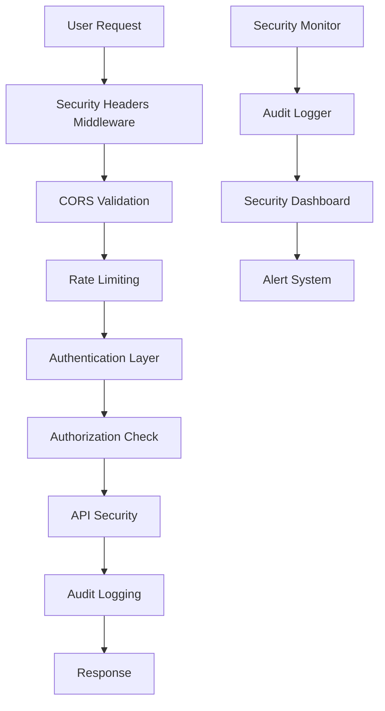

# Security Implementation Guide

## Overview

This guide provides comprehensive security implementation guidelines for the Contribux platform, consolidating all security measures implemented across authentication, API security, monitoring, and testing.

## Table of Contents

1. [Security Architecture](#security-architecture)
2. [Authentication & Authorization](#authentication--authorization)
3. [API Security](#api-security)
4. [Security Headers](#security-headers)
5. [Configuration Security](#configuration-security)
6. [Testing & Validation](#testing--validation)
7. [Monitoring & Audit Logging](#monitoring--audit-logging)
8. [Compliance & Standards](#compliance--standards)
9. [Implementation Checklist](#implementation-checklist)

## Security Architecture

### Core Security Principles

- **Defense in Depth**: Multiple layers of security controls
- **Least Privilege**: Minimal access rights for users and systems
- **Zero Trust**: Never trust, always verify
- **Security by Design**: Security built into every component
- **Continuous Monitoring**: Real-time security event tracking

### Security Components



## Authentication & Authorization

### OAuth 2.0 Implementation

#### GitHub OAuth Security
- **State Parameter**: CSRF protection with cryptographically secure random values
- **Token Validation**: Verification of access tokens with GitHub API
- **Session Management**: Secure session storage with expiration handling
- **Token Refresh**: Automatic token refresh with buffer time

```typescript
// Example: Secure OAuth state generation
const generateOAuthState = (): string => {
  return crypto.randomBytes(32).toString('hex')
}
```

#### Session Security
- **HttpOnly Cookies**: Prevent XSS access to session tokens
- **Secure Flag**: HTTPS-only transmission
- **SameSite**: CSRF protection
- **Session Rotation**: New session ID on privilege escalation

### Rate Limiting Strategy

#### Authentication Endpoints
- **Failed Login Threshold**: 5 attempts per 10 minutes
- **Account Lockout**: 30 minutes after threshold breach
- **IP-based Limiting**: Per-IP rate limits
- **Progressive Delays**: Exponential backoff for repeated failures

#### API Endpoints
- **Default Limits**: 60 requests per minute per user
- **Burst Allowance**: Short-term spike handling
- **Endpoint-specific Limits**: Tailored limits for different operations

### Brute Force Protection

```typescript
// Rate limiting configuration
const authRateLimit = {
  windowMs: 10 * 60 * 1000, // 10 minutes
  max: 5, // 5 attempts per window
  standardHeaders: true,
  legacyHeaders: false,
  handler: (req, res) => {
    auditLogger.log({
      type: AuditEventType.SECURITY_VIOLATION,
      severity: AuditSeverity.HIGH,
      action: 'Rate limit exceeded',
      ip: req.ip,
    })
  }
}
```

## API Security

### GitHub API Client Security

#### Timeout Configuration
- **Request Timeout**: 30 seconds to prevent hanging requests
- **Connection Timeout**: 10 seconds for initial connection
- **Read Timeout**: 25 seconds for response reading

```typescript
// GitHub client with timeout
const githubClient = new GitHubClient({
  accessToken: session.accessToken,
  timeout: 30000, // 30 seconds
})
```

#### Rate Limit Handling
- **Primary Rate Limits**: GitHub's 5000 requests/hour
- **Secondary Rate Limits**: Abuse detection prevention
- **Exponential Backoff**: Automatic retry with delays
- **Circuit Breaker**: Fail-fast when GitHub is unavailable

### Input Validation

#### Request Validation
- **Zod Schemas**: Runtime type validation
- **Sanitization**: XSS prevention through encoding
- **Length Limits**: Prevent DoS through large payloads
- **Content-Type Validation**: Strict MIME type checking

#### SQL Injection Prevention
- **Parameterized Queries**: Neon database with prepared statements
- **ORM Usage**: Prisma for type-safe database operations
- **Input Escaping**: Additional sanitization layer

## Security Headers

### Implementation Strategy

#### Production Headers
```typescript
const productionSecurityHeaders = {
  frameOptions: 'DENY',
  contentTypeOptions: 'nosniff',
  xssProtection: '1; mode=block',
  referrerPolicy: 'strict-origin-when-cross-origin',
  hsts: {
    maxAge: 31536000,
    includeSubDomains: true,
    preload: true
  },
  csp: {
    directives: {
      'default-src': ["'self'"],
      'script-src': ["'self'", "'nonce-{random}'"],
      'style-src': ["'self'", "'nonce-{random}'"],
      'img-src': ["'self'", 'data:', 'https:'],
      'font-src': ["'self'"],
      'connect-src': ["'self'", 'https://api.github.com'],
      'frame-ancestors': ["'none'"],
      'base-uri': ["'self'"],
      'form-action': ["'self'"]
    }
  }
}
```

#### CSP Implementation
- **Strict Policies**: No unsafe-inline or unsafe-eval in production
- **Nonce Support**: Dynamic nonce generation for inline scripts
- **Report URI**: CSP violation monitoring
- **Report-Only Mode**: Testing new policies safely

### CORS Configuration

#### Allowed Origins
- **Production**: Whitelist of trusted domains
- **Development**: Localhost with specific ports
- **Staging**: Staging domain only

```typescript
const corsConfig = {
  origin: (origin, callback) => {
    const allowedOrigins = isProduction() 
      ? ['https://contribux.com']
      : ['http://localhost:3000', 'http://localhost:3001']
    
    if (!origin || allowedOrigins.includes(origin)) {
      callback(null, true)
    } else {
      callback(new Error('Not allowed by CORS'))
    }
  },
  credentials: true,
  optionsSuccessStatus: 200
}
```

## Configuration Security

### Environment-Based Configuration

#### Security Settings by Environment

```typescript
// Production security configuration
const productionSecurityConfig = {
  auth: {
    jwt: {
      accessTokenExpiry: 15 * 60, // 15 minutes
      refreshTokenExpiry: 7 * 24 * 60 * 60 // 7 days
    },
    rateLimit: {
      max: 60, // Stricter rate limiting
      windowMs: 15 * 60 * 1000
    },
    security: {
      accountLockDuration: 60 * 60 * 1000 // 1 hour lock
    }
  }
}
```

#### Secrets Management
- **Environment Variables**: All secrets via ENV vars
- **No Hardcoded Secrets**: Zero secrets in code
- **Rotation Support**: Regular secret rotation capability
- **Least Privilege**: Minimal secret scope

### Configuration Validation

```typescript
// Runtime configuration validation
const configSchema = z.object({
  auth: z.object({
    jwt: z.object({
      accessTokenExpiry: z.number().min(60).max(86400),
      refreshTokenExpiry: z.number().min(3600).max(2592000)
    })
  })
})

export const config = configSchema.parse(createConfig())
```

## Testing & Validation

### Security Test Strategy

#### Unit Tests
- **Authentication Flow Tests**: OAuth, session management
- **Security Headers Tests**: Header validation and CSP
- **Rate Limiting Tests**: Threshold and recovery testing
- **Input Validation Tests**: XSS and injection prevention

#### Integration Tests
- **End-to-End Security**: Complete authentication flows
- **Cross-Component Security**: Service integration testing
- **API Security Tests**: GitHub client security validation
- **Monitoring Integration**: Audit logging verification

### Staging Environment Testing

#### Security Validation Checklist
- [ ] OAuth flow security compliance
- [ ] Session security management
- [ ] Rate limiting effectiveness
- [ ] Security headers implementation
- [ ] CORS configuration validation
- [ ] Input validation testing
- [ ] Audit logging completeness

#### Automated Security Testing
```bash
# Security test execution
pnpm test:security              # Unit security tests
pnpm test:integration:security  # Integration security tests
pnpm test:e2e:security         # End-to-end security tests
pnpm test:security:regression  # Security regression tests
```

### Performance Security Testing

#### Load Testing with Security
- **Rate Limit Stress Testing**: Validate limits under load
- **Authentication Load**: Session handling at scale
- **Security Header Performance**: Minimal performance impact
- **Audit Logging Performance**: High-throughput logging

## Monitoring & Audit Logging

### Audit Event Types

```typescript
enum AuditEventType {
  AUTHENTICATION_SUCCESS = 'authentication_success',
  AUTHENTICATION_FAILURE = 'authentication_failure',
  SESSION_CREATED = 'session_created',
  SESSION_EXPIRED = 'session_expired',
  SECURITY_VIOLATION = 'security_violation',
  API_ACCESS = 'api_access',
  API_KEY_ROTATED = 'api_key_rotated',
  RATE_LIMIT_EXCEEDED = 'rate_limit_exceeded'
}
```

### Security Event Monitoring

#### Real-time Alerting
- **Brute Force Detection**: 5+ failed logins from single IP
- **Unusual Access Patterns**: Off-hours or geographic anomalies
- **Security Header Violations**: CSP or CORS violations
- **API Abuse**: Excessive rate limit violations

#### Security Metrics Dashboard
```typescript
interface SecurityMetrics {
  authenticationEvents: EventCount[]
  securityViolations: ViolationReport[]
  rateLimitViolations: RateLimitReport[]
  sessionMetrics: SessionStats
  apiSecurityMetrics: ApiSecurityStats
}
```

### Incident Response

#### Automated Response
- **Account Lockout**: Automatic temporary account suspension
- **IP Blocking**: Temporary IP-based restrictions
- **Session Invalidation**: Force logout on security violations
- **Alert Generation**: Immediate security team notification

## Compliance & Standards

### OWASP Top 10 Compliance

#### A01 - Broken Access Control
- ✅ Role-based access control
- ✅ Session management
- ✅ API endpoint protection

#### A02 - Cryptographic Failures
- ✅ HTTPS enforcement
- ✅ Secure session storage
- ✅ Strong encryption algorithms

#### A03 - Injection
- ✅ Input validation with Zod
- ✅ Parameterized queries
- ✅ Output encoding

#### A05 - Security Misconfiguration
- ✅ Security headers implementation
- ✅ Environment-specific configuration
- ✅ Default deny policies

#### A07 - Identification and Authentication Failures
- ✅ Strong authentication requirements
- ✅ Session management
- ✅ Multi-factor authentication ready

#### A09 - Security Logging and Monitoring Failures
- ✅ Comprehensive audit logging
- ✅ Real-time monitoring
- ✅ Incident response procedures

### Data Protection Compliance

#### GDPR Considerations
- **Data Minimization**: Collect only necessary data
- **Purpose Limitation**: Use data only for stated purposes
- **Storage Limitation**: Automatic data retention policies
- **Right to Erasure**: User data deletion capability

## Implementation Checklist

### Authentication Security
- [x] OAuth 2.0 state parameter validation
- [x] Secure session management
- [x] Rate limiting on authentication endpoints
- [x] Brute force attack prevention
- [x] Session hijacking detection
- [x] Token refresh mechanism

### API Security
- [x] GitHub API client timeout configuration
- [x] Rate limit handling with exponential backoff
- [x] Input validation with Zod schemas
- [x] Request/response sanitization
- [x] API key rotation support

### Security Headers
- [x] Content Security Policy (CSP)
- [x] HTTP Strict Transport Security (HSTS)
- [x] X-Frame-Options protection
- [x] X-Content-Type-Options
- [x] Referrer Policy configuration
- [x] Permissions Policy

### Configuration & Monitoring
- [x] Environment-based security configuration
- [x] Comprehensive audit logging
- [x] Security metrics dashboard
- [x] Real-time security monitoring
- [x] Incident response automation

### Testing & Validation
- [x] Security unit tests
- [x] Integration security tests
- [x] End-to-end security validation
- [x] Staging environment security testing
- [x] Performance security testing

## Security Contact Information

### Security Team
- **Security Lead**: [Security Lead Email]
- **DevOps Security**: [DevOps Email]
- **Incident Response**: [Incident Response Email]

### Reporting Security Issues
- **Internal**: Create security incident ticket
- **External**: security@contribux.com
- **PGP Key**: [Public Key for encrypted communication]

---

**Document Version**: 1.0  
**Last Updated**: 2024-01-XX  
**Next Review**: Quarterly  
**Owner**: Security Team  
**Approved By**: [Security Lead], [Engineering Lead]