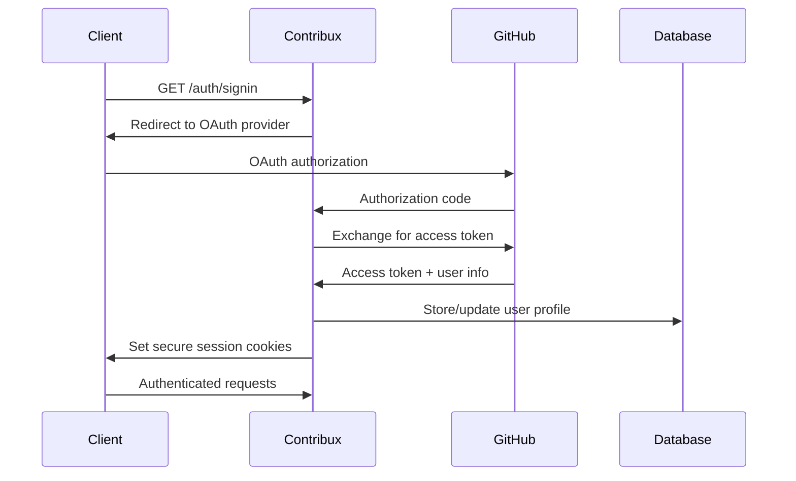

# Contribux API Documentation

**Version 2.0** | **Portfolio-Grade API Reference**

---

## 📋 Table of Contents

- [Authentication](#-authentication)
- [Core Endpoints](#-core-endpoints)
- [AI & Analytics](#-ai--analytics)
- [User Management](#-user-management)
- [Repository Discovery](#-repository-discovery)
- [Notifications](#-notifications)
- [Webhooks](#-webhooks)
- [Rate Limiting](#-rate-limiting)
- [Error Handling](#-error-handling)
- [SDKs & Libraries](#-sdks--libraries)

---

## 🔐 Authentication

Contribux uses **OAuth 2.0 with PKCE** for secure authentication, supporting multiple providers with intelligent session management.

### **Authentication Flow**



### **Endpoints**

#### **Initialize OAuth Flow**
```http
GET /api/auth/signin/github
```

**Response:**
```json
{
  "redirectUrl": "https://github.com/login/oauth/authorize?client_id=...",
  "state": "secure-state-token",
  "codeChallenge": "pkce-challenge"
}
```

#### **OAuth Callback**
```http
GET /api/auth/callback/github?code={code}&state={state}
```

**Response:**
```json
{
  "user": {
    "id": "user_123",
    "email": "developer@example.com",
    "githubUsername": "devuser",
    "avatarUrl": "https://github.com/avatar.jpg"
  },
  "accessToken": "jwt-access-token",
  "refreshToken": "jwt-refresh-token",
  "expiresAt": "2025-07-02T15:30:00Z"
}
```

#### **Refresh Token**
```http
POST /api/auth/refresh
Content-Type: application/json

{
  "refreshToken": "jwt-refresh-token"
}
```

#### **Logout**
```http
POST /api/auth/signout
```

### **Authentication Headers**

All authenticated requests must include:

```http
Authorization: Bearer {access-token}
```

---

## 🚀 Core Endpoints

### **Health Check**

#### **System Health**
```http
GET /api/health
```

**Response:**
```json
{
  "status": "healthy",
  "timestamp": "2025-07-02T12:00:00Z",
  "version": "2.0.0",
  "services": {
    "database": {
      "status": "healthy",
      "responseTime": 45,
      "connections": {
        "active": 12,
        "idle": 8,
        "total": 20
      }
    },
    "ai": {
      "status": "healthy",
      "responseTime": 120,
      "requestsPerMinute": 450
    },
    "github": {
      "status": "healthy",
      "rateLimit": {
        "remaining": 4850,
        "total": 5000,
        "resetAt": "2025-07-02T13:00:00Z"
      }
    }
  },
  "performance": {
    "memoryUsage": "4.22 MB",
    "cpuUsage": "15%",
    "uptime": "7d 12h 34m"
  }
}
```

#### **Detailed System Metrics**
```http
GET /api/health/detailed
Authorization: Bearer {access-token}
```

**Response:**
```json
{
  "database": {
    "queries": {
      "total": 125420,
      "averageTime": 85,
      "slowQueries": 3
    },
    "vectorSearch": {
      "indexSize": "2.4 GB",
      "searchLatency": 12,
      "accuracy": 0.94
    }
  },
  "ai": {
    "agents": {
      "scanner": { "status": "active", "jobsProcessed": 1240 },
      "analyzer": { "status": "active", "jobsProcessed": 890 },
      "strategist": { "status": "active", "jobsProcessed": 340 }
    },
    "costs": {
      "currentMonth": 124.50,
      "tokensUsed": 2400000,
      "averagePerRequest": 1200
    }
  }
}
```

---

## 🤖 AI & Analytics

### **Repository Analysis**

#### **Analyze Repository Health**
```http
POST /api/ai/analyze/repository
Authorization: Bearer {access-token}
Content-Type: application/json

{
  "repositoryUrl": "https://github.com/owner/repo",
  "analysisDepth": "comprehensive",
  "includeHistory": true
}
```

**Response:**
```json
{
  "repository": {
    "id": "repo_456",
    "fullName": "owner/repo",
    "healthScore": 8.7,
    "lastAnalyzed": "2025-07-02T12:00:00Z"
  },
  "healthMetrics": {
    "codeQuality": {
      "score": 9.2,
      "factors": {
        "testCoverage": 89.5,
        "documentationQuality": 8.8,
        "codeComplexity": 6.2,
        "maintainabilityIndex": 85.4
      }
    },
    "communityHealth": {
      "score": 8.1,
      "factors": {
        "contributorDiversity": 7.9,
        "responseTime": 2.3,
        "issueResolutionRate": 0.85,
        "communicationQuality": 8.5
      }
    },
    "projectVelocity": {
      "score": 8.9,
      "factors": {
        "commitFrequency": 4.2,
        "releaseRegularity": 9.1,
        "featureDelivery": 8.7,
        "bugResolution": 7.8
      }
    }
  },
  "riskFactors": [
    {
      "type": "maintainer_bus_factor",
      "severity": "medium",
      "description": "Project depends heavily on 2 main contributors"
    }
  ],
  "recommendations": [
    {
      "type": "contribution_opportunity",
      "priority": "high",
      "description": "Documentation improvements needed for API reference"
    }
  ]
}
```

#### **Find Contribution Opportunities**
```http
POST /api/ai/opportunities/discover
Authorization: Bearer {access-token}
Content-Type: application/json

{
  "userProfile": {
    "skills": ["TypeScript", "React", "Node.js"],
    "experience": "senior",
    "interests": ["AI/ML", "Developer Tools"],
    "timeCommitment": "moderate"
  },
  "preferences": {
    "complexityRange": [3, 8],
    "impactPriority": "high",
    "learningGoals": ["AI Integration", "Performance Optimization"]
  },
  "filters": {
    "languages": ["TypeScript", "Python"],
    "repositorySize": "medium-large",
    "lastActivity": "30d"
  }
}
```

**Response:**
```json
{
  "opportunities": [
    {
      "id": "opp_789",
      "repository": {
        "fullName": "microsoft/vscode",
        "healthScore": 9.4,
        "stars": 145000,
        "language": "TypeScript"
      },
      "issue": {
        "number": 12345,
        "title": "Improve IntelliSense performance for large TypeScript projects",
        "url": "https://github.com/microsoft/vscode/issues/12345",
        "labels": ["performance", "typescript", "good-first-issue"]
      },
      "analysis": {
        "complexityScore": 6.8,
        "impactScore": 9.2,
        "confidenceScore": 0.87,
        "estimatedHours": 12,
        "skillMatchScore": 0.94
      },
      "aiInsights": {
        "implementationApproach": "Focus on optimizing TypeScript language server caching mechanisms",
        "potentialChallenges": ["Large codebase navigation", "Performance testing requirements"],
        "learningOpportunities": ["Advanced TypeScript compiler APIs", "VS Code extension architecture"],
        "successProbability": 0.82
      },
      "careerImpact": {
        "visibilityScore": 9.1,
        "networkingPotential": 8.7,
        "skillDevelopment": ["Performance Optimization", "Developer Tools"]
      }
    }
  ],
  "totalResults": 45,
  "searchMetadata": {
    "processingTime": 2.4,
    "repositoriesAnalyzed": 1240,
    "aiTokensUsed": 8500
  }
}
```

#### **Predict Contribution Success**
```http
POST /api/ai/predict/success
Authorization: Bearer {access-token}
Content-Type: application/json

{
  "opportunityId": "opp_789",
  "userContext": {
    "pastContributions": 12,
    "successRate": 0.83,
    "expertiseAreas": ["TypeScript", "Performance"]
  }
}
```

**Response:**
```json
{
  "prediction": {
    "successProbability": 0.87,
    "confidenceInterval": [0.82, 0.92],
    "timeToMerge": {
      "estimated": "14 days",
      "range": [10, 21]
    },
    "difficultyFactors": [
      {
        "factor": "codebase_complexity",
        "impact": 0.3,
        "mitigation": "Start with thorough code exploration"
      }
    ]
  },
  "recommendations": {
    "preparation": [
      "Review TypeScript compiler documentation",
      "Set up VS Code development environment",
      "Study existing performance optimization PRs"
    ],
    "strategy": "Focus on incremental improvements with performance benchmarks",
    "timeline": "Plan 2-3 weeks for implementation and review cycles"
  }
}
```

---

## 👤 User Management

### **User Profile**

#### **Get Current User**
```http
GET /api/users/me
Authorization: Bearer {access-token}
```

**Response:**
```json
{
  "user": {
    "id": "user_123",
    "email": "developer@example.com",
    "githubUsername": "devuser",
    "avatarUrl": "https://github.com/avatar.jpg",
    "createdAt": "2024-12-01T10:00:00Z",
    "profile": {
      "fullName": "Jane Developer",
      "bio": "Senior Full-Stack Developer passionate about AI",
      "location": "San Francisco, CA",
      "website": "https://janedev.io",
      "company": "Tech Startup Inc."
    },
    "preferences": {
      "timezone": "America/Los_Angeles",
      "expertiseAreas": ["TypeScript", "React", "Node.js", "AI/ML"],
      "minImpactScore": 7.0,
      "maxDailyNotifications": 3,
      "notificationChannels": ["email", "push"]
    },
    "statistics": {
      "totalContributions": 28,
      "successRate": 0.89,
      "averageImpactScore": 8.2,
      "careerGrowthScore": 7.8
    }
  }
}
```

#### **Update User Preferences**
```http
PUT /api/users/me/preferences
Authorization: Bearer {access-token}
Content-Type: application/json

{
  "expertiseAreas": ["TypeScript", "React", "Python", "AI/ML"],
  "minImpactScore": 7.5,
  "maxDailyNotifications": 2,
  "notificationChannels": ["email"],
  "learningGoals": ["GraphQL", "Rust"],
  "availabilityHours": 10
}
```

#### **Get User Analytics**
```http
GET /api/users/me/analytics?period=6m
Authorization: Bearer {access-token}
```

**Response:**
```json
{
  "overview": {
    "period": "6 months",
    "totalContributions": 28,
    "successfulMerges": 25,
    "averageTimeToMerge": "12 days",
    "impactScore": 8.2
  },
  "trends": {
    "contributionVelocity": [
      { "month": "2025-01", "count": 3, "successRate": 1.0 },
      { "month": "2025-02", "count": 5, "successRate": 0.8 },
      { "month": "2025-03", "count": 8, "successRate": 0.87 }
    ],
    "skillDevelopment": [
      { "skill": "TypeScript", "growthRate": 0.15 },
      { "skill": "AI/ML", "growthRate": 0.23 }
    ]
  },
  "achievements": [
    {
      "type": "impact_milestone",
      "title": "High Impact Contributor",
      "description": "Achieved 25+ successful contributions",
      "unlockedAt": "2025-06-15T10:00:00Z"
    }
  ]
}
```

---

## 🔍 Repository Discovery

### **Search Repositories**

#### **Intelligent Repository Search**
```http
GET /api/repositories/search?q=machine%20learning&language=python&min_health=7&limit=20
Authorization: Bearer {access-token}
```

**Response:**
```json
{
  "repositories": [
    {
      "id": "repo_456",
      "fullName": "scikit-learn/scikit-learn",
      "description": "Machine learning library for Python",
      "healthScore": 9.3,
      "metrics": {
        "stars": 55000,
        "forks": 25000,
        "contributors": 2400,
        "lastCommit": "2025-07-01T14:30:00Z"
      },
      "opportunities": {
        "total": 15,
        "goodFirstIssues": 3,
        "averageComplexity": 6.2
      },
      "tags": ["machine-learning", "python", "algorithms", "statistics"],
      "maintainers": {
        "primary": ["maintainer1", "maintainer2"],
        "responseTime": "2.1 days"
      }
    }
  ],
  "pagination": {
    "page": 1,
    "limit": 20,
    "total": 156,
    "hasNext": true
  },
  "searchMetadata": {
    "query": "machine learning",
    "filters": { "language": "python", "min_health": 7 },
    "processingTime": 0.45,
    "resultsFromCache": false
  }
}
```

#### **Get Repository Recommendations**
```http
GET /api/repositories/recommendations?personalized=true&limit=10
Authorization: Bearer {access-token}
```

**Response:**
```json
{
  "recommendations": [
    {
      "repository": {
        "id": "repo_789",
        "fullName": "microsoft/TypeScript",
        "healthScore": 9.1,
        "matchScore": 0.94
      },
      "reasoning": {
        "skillAlignment": 0.96,
        "interestMatch": 0.92,
        "careerRelevance": 0.94,
        "opportunityQuality": 0.89
      },
      "opportunities": [
        {
          "type": "bug_fix",
          "complexity": 5.2,
          "impact": 8.1,
          "description": "Improve error messages for generic constraints"
        }
      ]
    }
  ],
  "algorithmVersion": "v2.1.0",
  "personalizationScore": 0.91
}
```

### **Repository Details**

#### **Get Repository Information**
```http
GET /api/repositories/repo_456
Authorization: Bearer {access-token}
```

**Response:**
```json
{
  "repository": {
    "id": "repo_456",
    "githubId": 3687681,
    "fullName": "scikit-learn/scikit-learn",
    "description": "Machine learning library for Python",
    "healthScore": 9.3,
    "lastScanned": "2025-07-02T10:00:00Z",
    "metrics": {
      "basic": {
        "stars": 55000,
        "forks": 25000,
        "watchers": 1800,
        "openIssues": 1250,
        "size": 125000
      },
      "activity": {
        "commitsLastMonth": 180,
        "pullRequestsLastMonth": 45,
        "issuesClosedLastMonth": 78,
        "averageResponseTime": "2.1 days"
      },
      "quality": {
        "testCoverage": 87.5,
        "documentationScore": 8.9,
        "codeComplexity": 6.8,
        "maintainabilityIndex": 82.4
      }
    },
    "opportunities": {
      "total": 15,
      "breakdown": {
        "good_first_issue": 3,
        "bug": 8,
        "enhancement": 4
      },
      "averageComplexity": 6.2,
      "averageImpact": 7.8
    },
    "technology": {
      "primaryLanguage": "Python",
      "languages": {
        "Python": 89.2,
        "C": 8.1,
        "Shell": 1.5,
        "Other": 1.2
      },
      "frameworks": ["NumPy", "SciPy", "Matplotlib"],
      "topicTags": ["machine-learning", "python", "algorithms", "statistics"]
    },
    "community": {
      "maintainers": {
        "count": 15,
        "primary": ["maintainer1", "maintainer2"],
        "averageResponseTime": "2.1 days"
      },
      "contributors": {
        "total": 2400,
        "activeLast90Days": 85,
        "newLast90Days": 12
      },
      "communication": {
        "discussionQuality": 8.7,
        "documentationQuality": 8.9,
        "onboardingScore": 7.8
      }
    }
  },
  "aiInsights": {
    "contributionRecommendations": [
      "Focus on documentation improvements for new machine learning algorithms",
      "Consider performance optimization opportunities in core algorithms",
      "Look for good first issues in examples and tutorials"
    ],
    "riskFactors": [
      "High contributor activity may lead to merge conflicts",
      "Strict coding standards require careful attention to style"
    ],
    "successFactors": [
      "Active and responsive maintainer community",
      "Well-documented contribution process",
      "Clear coding guidelines and testing requirements"
    ]
  }
}
```

---

## 🔔 Notifications

### **Notification Management**

#### **Get Notifications**
```http
GET /api/notifications?status=unread&limit=20
Authorization: Bearer {access-token}
```

**Response:**
```json
{
  "notifications": [
    {
      "id": "notif_123",
      "type": "opportunity_discovered",
      "status": "unread",
      "createdAt": "2025-07-02T11:30:00Z",
      "data": {
        "opportunity": {
          "repository": "microsoft/vscode",
          "issue": "Improve IntelliSense performance",
          "complexity": 6.8,
          "impact": 9.2
        },
        "reason": "Matches your TypeScript expertise and performance interest"
      },
      "actions": [
        { "type": "view_opportunity", "url": "/opportunities/opp_789" },
        { "type": "bookmark", "enabled": true },
        { "type": "dismiss", "enabled": true }
      ]
    }
  ],
  "pagination": {
    "page": 1,
    "limit": 20,
    "total": 8,
    "unreadCount": 3
  }
}
```

#### **Update Notification Status**
```http
PUT /api/notifications/notif_123
Authorization: Bearer {access-token}
Content-Type: application/json

{
  "status": "read",
  "action": "viewed"
}
```

#### **Configure Notification Settings**
```http
PUT /api/notifications/settings
Authorization: Bearer {access-token}
Content-Type: application/json

{
  "channels": {
    "email": {
      "enabled": true,
      "frequency": "daily",
      "types": ["opportunity_discovered", "contribution_accepted"]
    },
    "push": {
      "enabled": false
    },
    "sms": {
      "enabled": false
    }
  },
  "preferences": {
    "quietHours": {
      "enabled": true,
      "start": "22:00",
      "end": "08:00",
      "timezone": "America/Los_Angeles"
    },
    "groupSimilar": true,
    "maxPerDay": 3
  }
}
```

---

## 🔗 Webhooks

### **Webhook Configuration**

#### **Create Webhook**
```http
POST /api/webhooks
Authorization: Bearer {access-token}
Content-Type: application/json

{
  "url": "https://your-app.com/webhooks/contribux",
  "events": ["opportunity.discovered", "contribution.merged", "analysis.completed"],
  "secret": "your-webhook-secret",
  "active": true
}
```

**Response:**
```json
{
  "webhook": {
    "id": "webhook_456",
    "url": "https://your-app.com/webhooks/contribux",
    "events": ["opportunity.discovered", "contribution.merged", "analysis.completed"],
    "active": true,
    "createdAt": "2025-07-02T12:00:00Z",
    "lastDelivery": null,
    "deliveryCount": 0
  },
  "signingSecret": "whsec_a1b2c3d4e5f6..."
}
```

### **Webhook Events**

#### **Opportunity Discovered**
```json
{
  "event": "opportunity.discovered",
  "timestamp": "2025-07-02T12:00:00Z",
  "data": {
    "user": { "id": "user_123", "githubUsername": "devuser" },
    "opportunity": {
      "id": "opp_789",
      "repository": "microsoft/vscode",
      "issue": {
        "number": 12345,
        "title": "Improve IntelliSense performance",
        "url": "https://github.com/microsoft/vscode/issues/12345"
      },
      "analysis": {
        "complexityScore": 6.8,
        "impactScore": 9.2,
        "skillMatchScore": 0.94
      }
    }
  }
}
```

#### **Contribution Merged**
```json
{
  "event": "contribution.merged",
  "timestamp": "2025-07-02T14:30:00Z",
  "data": {
    "user": { "id": "user_123", "githubUsername": "devuser" },
    "contribution": {
      "repository": "microsoft/vscode",
      "pullRequest": {
        "number": 67890,
        "title": "Performance improvements for TypeScript IntelliSense",
        "url": "https://github.com/microsoft/vscode/pull/67890"
      },
      "impact": {
        "score": 8.9,
        "metrics": {
          "filesChanged": 8,
          "linesAdded": 150,
          "linesRemoved": 45
        }
      },
      "timeToMerge": "12 days"
    }
  }
}
```

---

## ⚡ Rate Limiting

### **Rate Limits**

| Endpoint Category | Requests per Hour | Burst Limit |
|------------------|-------------------|-------------|
| **Authentication** | 100 | 10 |
| **Repository Search** | 1000 | 50 |
| **AI Analysis** | 200 | 20 |
| **User Profile** | 500 | 25 |
| **Notifications** | 300 | 15 |
| **Webhooks** | 100 | 10 |

### **Rate Limit Headers**

All API responses include rate limiting information:

```http
X-RateLimit-Limit: 1000
X-RateLimit-Remaining: 847
X-RateLimit-Reset: 1672531200
X-RateLimit-Burst: 50
X-RateLimit-Burst-Remaining: 42
```

### **Rate Limit Exceeded Response**

```http
HTTP/1.1 429 Too Many Requests
Content-Type: application/json

{
  "error": {
    "type": "rate_limit_exceeded",
    "message": "API rate limit exceeded",
    "details": {
      "limit": 1000,
      "remaining": 0,
      "resetAt": "2025-07-02T13:00:00Z",
      "retryAfter": 3600
    }
  }
}
```

---

## ❌ Error Handling

### **Error Response Format**

All errors follow a consistent structure:

```json
{
  "error": {
    "type": "validation_error",
    "message": "Request validation failed",
    "details": {
      "field": "expertiseAreas",
      "reason": "Must be an array of strings",
      "received": 123
    },
    "requestId": "req_a1b2c3d4e5f6",
    "timestamp": "2025-07-02T12:00:00Z"
  }
}
```

### **Error Types**

| Status Code | Error Type | Description |
|------------|------------|-------------|
| 400 | `validation_error` | Request parameters are invalid |
| 401 | `authentication_required` | Valid authentication token required |
| 403 | `insufficient_permissions` | User lacks required permissions |
| 404 | `resource_not_found` | Requested resource does not exist |
| 409 | `conflict_error` | Request conflicts with current state |
| 422 | `business_logic_error` | Valid request but business rules violated |
| 429 | `rate_limit_exceeded` | API rate limit exceeded |
| 500 | `internal_server_error` | Unexpected server error |
| 502 | `service_unavailable` | External service temporarily unavailable |
| 503 | `maintenance_mode` | API temporarily under maintenance |

### **Error Examples**

#### **Validation Error**
```json
{
  "error": {
    "type": "validation_error",
    "message": "Invalid request parameters",
    "details": {
      "field": "complexityRange",
      "reason": "Must be an array of two numbers between 1 and 10",
      "received": [0, 15]
    }
  }
}
```

#### **Authentication Required**
```json
{
  "error": {
    "type": "authentication_required",
    "message": "Valid access token required",
    "details": {
      "reason": "Token expired",
      "expiredAt": "2025-07-02T11:00:00Z"
    }
  }
}
```

#### **Resource Not Found**
```json
{
  "error": {
    "type": "resource_not_found",
    "message": "Repository not found",
    "details": {
      "resourceType": "repository",
      "resourceId": "repo_invalid"
    }
  }
}
```

---

## 📚 SDKs & Libraries

### **Official JavaScript/TypeScript SDK**

#### **Installation**
```bash
npm install @contribux/sdk
# or
pnpm add @contribux/sdk
```

#### **Basic Usage**
```typescript
import { ContribuxClient } from '@contribux/sdk'

const client = new ContribuxClient({
  apiKey: 'your-api-key',
  baseUrl: 'https://api.contribux.dev' // Optional: defaults to production
})

// Discover opportunities
const opportunities = await client.opportunities.discover({
  userProfile: {
    skills: ['TypeScript', 'React'],
    experience: 'senior',
    interests: ['AI/ML', 'Developer Tools']
  },
  preferences: {
    complexityRange: [5, 8],
    impactPriority: 'high'
  }
})

// Analyze repository
const analysis = await client.repositories.analyze({
  repositoryUrl: 'https://github.com/microsoft/vscode',
  analysisDepth: 'comprehensive'
})

// Get recommendations
const recommendations = await client.repositories.getRecommendations({
  personalized: true,
  limit: 10
})
```

#### **Advanced Features**
```typescript
// Real-time updates
const subscription = client.notifications.subscribe({
  events: ['opportunity.discovered', 'contribution.merged'],
  onEvent: (event) => {
    console.log('New event:', event)
  },
  onError: (error) => {
    console.error('Subscription error:', error)
  }
})

// Batch operations
const batchAnalysis = await client.repositories.analyzeBatch([
  'https://github.com/facebook/react',
  'https://github.com/microsoft/vscode',
  'https://github.com/vercel/next.js'
])

// Custom AI prompts
const customAnalysis = await client.ai.analyze({
  repository: 'microsoft/vscode',
  prompt: 'Focus on accessibility improvements and screen reader compatibility',
  context: {
    userExpertise: ['accessibility', 'frontend'],
    previousContributions: ['aria-labels', 'keyboard-navigation']
  }
})
```

### **Python SDK**

#### **Installation**
```bash
pip install contribux-python
```

#### **Basic Usage**
```python
from contribux import ContribuxClient

client = ContribuxClient(api_key='your-api-key')

# Discover opportunities
opportunities = client.opportunities.discover(
    user_profile={
        'skills': ['Python', 'Machine Learning'],
        'experience': 'senior',
        'interests': ['AI/ML', 'Data Science']
    },
    preferences={
        'complexity_range': [5, 8],
        'impact_priority': 'high'
    }
)

# Analyze repository
analysis = client.repositories.analyze(
    repository_url='https://github.com/scikit-learn/scikit-learn',
    analysis_depth='comprehensive'
)
```

### **REST API Wrapper Libraries**

#### **Unofficial Community Libraries**

- **Go**: `github.com/contribux/go-sdk`
- **Rust**: `contribux-rs`
- **Ruby**: `contribux-ruby`
- **PHP**: `contribux/php-sdk`
- **Java**: `io.contribux:contribux-java-sdk`

---

## 🔧 Development & Testing

### **Sandbox Environment**

For testing and development, use the sandbox environment:

**Base URL**: `https://sandbox-api.contribux.dev`

The sandbox provides:
- Realistic test data
- No rate limiting
- Safe testing environment
- Full API feature parity

### **API Testing Tools**

#### **Postman Collection**
```bash
# Import the official Postman collection
curl -o contribux-api.postman_collection.json \
  https://api.contribux.dev/docs/postman/collection.json
```

#### **OpenAPI Specification**
```bash
# Download OpenAPI spec
curl https://api.contribux.dev/docs/openapi.json > contribux-openapi.json
```

### **Mock Responses**

For offline development, the SDK includes mock response capabilities:

```typescript
import { ContribuxClient } from '@contribux/sdk'

const client = new ContribuxClient({
  apiKey: 'mock-key',
  useMockData: true, // Enable mock responses
  mockDataPath: './mock-responses' // Optional: custom mock data
})
```

---

## 📊 API Analytics & Monitoring

### **Usage Analytics**

Track your API usage through the dashboard:

```http
GET /api/analytics/usage?period=30d
Authorization: Bearer {access-token}
```

**Response:**
```json
{
  "period": "30 days",
  "summary": {
    "totalRequests": 12450,
    "successRate": 99.7,
    "averageResponseTime": 245,
    "errorRate": 0.3
  },
  "breakdown": {
    "byEndpoint": [
      { "endpoint": "/repositories/search", "requests": 3200, "avgTime": 180 },
      { "endpoint": "/ai/opportunities/discover", "requests": 2100, "avgTime": 420 }
    ],
    "byDay": [
      { "date": "2025-07-01", "requests": 420, "errors": 2 },
      { "date": "2025-07-02", "requests": 380, "errors": 1 }
    ]
  },
  "costs": {
    "currentMonth": 45.20,
    "projectedMonth": 52.80,
    "breakdown": {
      "aiAnalysis": 32.10,
      "vectorSearch": 8.90,
      "notifications": 4.20
    }
  }
}
```

---

## 🌟 Best Practices

### **Authentication Security**
- Store tokens securely (never in localStorage for web apps)
- Implement automatic token refresh
- Use PKCE for public clients
- Implement proper logout flows

### **Rate Limiting**
- Implement exponential backoff for retries
- Cache responses when appropriate
- Use batch endpoints for multiple operations
- Monitor rate limit headers

### **Error Handling**
- Always check response status codes
- Implement proper error recovery
- Log errors with request IDs for debugging
- Provide meaningful user feedback

### **Performance Optimization**
- Use pagination for large result sets
- Implement request deduplication
- Cache frequently accessed data
- Use webhooks for real-time updates

---

## 📞 Support & Resources

### **Developer Resources**

- **API Documentation**: https://docs.contribux.dev
- **SDK Reference**: https://sdk.contribux.dev
- **Code Examples**: https://examples.contribux.dev
- **Postman Collection**: https://api.contribux.dev/docs/postman

### **Community & Support**

- **GitHub Issues**: https://github.com/BjornMelin/contribux/issues
- **Discord Community**: https://discord.gg/contribux
- **Developer Blog**: https://blog.contribux.dev
- **Status Page**: https://status.contribux.dev

### **Contact Information**

- **Technical Support**: api-support@contribux.dev
- **Security Issues**: security@contribux.dev
- **Partnership Inquiries**: partnerships@contribux.dev

---

**🚀 Ready to integrate? Start with our [Quick Start Guide](https://docs.contribux.dev/quick-start) and explore the [Interactive API Explorer](https://api.contribux.dev/explorer).**

---

*This API documentation showcases enterprise-grade API design with comprehensive developer experience, demonstrating advanced technical communication and system architecture skills.*