# contribux 🚀

[](https://www.typescriptlang.org/)
[](https://nextjs.org/)
[](https://platform.openai.com/)
[](https://www.postgresql.org/)
[](https://vercel.com/)
[](https://opensource.org/licenses/MIT)
[](http://makeapullrequest.com)

> 🎯 **AI-powered GitHub contribution discovery platform that intelligently surfaces high-impact open source opportunities for senior developers transitioning to AI Engineering roles**

Transform how you strategically build your open source reputation by intelligently surfacing contribution opportunities that align with your expertise and career goals.

---

## Table of Contents

- [✨ Features](#-features)
- [🏗️ Architecture](#️-architecture)
- [🚀 Quick Start](#-quick-start)
- [⚙️ Technology Stack](#️-technology-stack)
- [📊 AI Agent System](#-ai-agent-system)
- [🗃️ Database Schema](#️-database-schema)
- [🔧 Development](#-development)
- [📈 Performance](#-performance)
- [🔒 Security](#-security)
- [🧪 Testing](#-testing)
- [📚 API Documentation](#-api-documentation)
- [🤝 Contributing](#-contributing)
- [📄 License](#-license)
- [📖 Citation](#-citation)
- [👤 Author](#-author)

---

## ✨ Features

### 🎯 **Intelligent Discovery**

- **Smart Repository Scanning**: Automatically discovers trending AI/ML repositories with health scoring
- **Real-time Monitoring**: Live tracking of new issues and opportunities across 420M+ repositories
- **Quality Filtering**: AI-powered validation to surface only meaningful contribution opportunities

### 🧠 **AI-Powered Analysis**

- **Complexity Assessment**: Automated difficulty scoring (0-10) with confidence intervals
- **Skill Matching**: NLP-based skill requirement detection and user expertise alignment
- **Implementation Guidance**: AI-generated approaches, hints, and potential challenge identification

### 📱 **Smart Notifications**

- **Intelligent Scheduling**: Timezone-aware delivery with user preference learning
- **Multi-channel Support**: Email (Resend) + SMS (Telnyx) with fallback mechanisms
- **Spam Prevention**: Score-based triggers with cooldown periods and relevance filtering

### 📊 **Analytics & Tracking**

- **Contribution Outcomes**: Success rate monitoring and pattern recognition
- **Career Impact**: Reputation growth tracking and skill development insights
- **Performance Metrics**: Time-to-merge analysis and contribution quality scoring

---

## 🏗️ Architecture

contribux follows a **serverless-first**, **AI-native** architecture designed for zero maintenance and ultra-low costs ($3-8/month).

```mermaid
graph TB
    subgraph "🎨 Client Layer"
        A[Next.js 15 PWA] --> B[React Server Components]
        B --> C[SWR v3 Cache]
    end

    subgraph "🔌 API Layer"
        D[Vercel Edge Functions] --> E[tRPC v11 Router]
        E --> F[Auth Middleware]
    end

    subgraph "🤖 Intelligence Layer"
        G[Repository Scanner] --> H[AI Analyzer]
        H --> I[Scoring Engine]
        I --> J[Notification Engine]
    end

    subgraph "💾 Data Layer"
        K[Neon PostgreSQL 16] --> L[pgvector 0.7]
        M[Upstash Redis] --> N[QStash v3]
    end

    subgraph "🌐 External Services"
        O[GitHub API v4] --> P[OpenAI Agents SDK v1.0]
        Q[Resend v4] --> R[Telnyx SMS]
    end

    A --> D
    D --> G
    G --> K
    H --> P
    J --> Q

    style A fill:#7C3AED,color:#fff
    style H fill:#10B981,color:#fff
    style K fill:#F59E0B,color:#fff
```



### 🔄 **Data Flow Process**


---

## 🚀 Quick Start

### Prerequisites

- Node.js 20.x or higher
- pnpm 9.x or higher
- PostgreSQL 16 (or Neon account)
- GitHub account for OAuth

### Installation

```bash
# Clone the repository
git clone https://github.com/BjornMelin/contribux.git
cd contribux

# Install dependencies with pnpm
pnpm install

# Copy environment variables
cp .env.example .env.local

# Configure your environment variables
# Edit .env.local with your API keys and configuration

# Run database migrations (when available)
# pnpm db:migrate

# Start the development server
pnpm dev
```

### Development Commands

```bash
# Development server with Turbo
pnpm dev

# Production build
pnpm build

# Start production server
pnpm start

# Linting and formatting
pnpm lint          # Run Biome checks
pnpm lint:fix      # Fix linting issues
pnpm format        # Format code with Biome

# Type checking
pnpm type-check

# Clean build artifacts
pnpm clean
```

Visit [http://localhost:3000](http://localhost:3000) to see your application.

---

## ⚙️ Technology Stack

### **Frontend Stack**

| Technology | Version | Purpose |
|------------|---------|---------|
| [Next.js](https://nextjs.org/) | 15.0+ | React framework with App Router |
| [TypeScript](https://www.typescriptlang.org/) | 5.7+ | Type safety and developer experience |
| [Tailwind CSS](https://tailwindcss.com/) | 4.0+ | Utility-first styling framework |
| [shadcn/ui](https://ui.shadcn.com/) | 2.0+ | Component library with accessibility |
| [SWR](https://swr.vercel.app/) | 3.0+ | Data fetching with caching |

### **Backend Stack**

| Technology | Version | Purpose |
|------------|---------|---------|
| [Neon PostgreSQL](https://neon.tech/) | 16+ | Serverless database with auto-scaling |
| [pgvector](https://github.com/pgvector/pgvector) | 0.7+ | Vector similarity search |
| [tRPC](https://trpc.io/) | 11.0+ | End-to-end typesafe APIs |
| [Upstash QStash](https://upstash.com/qstash) | 3.0+ | Serverless message queuing |

### **AI & Analysis**

| Technology | Version | Purpose |
|------------|---------|---------|
| [OpenAI Agents SDK](https://platform.openai.com/) | 1.0+ | AI agent orchestration |
| [Vercel AI SDK](https://sdk.vercel.ai/) | Latest | LLM integration and streaming |
| GPT-4o-mini-2025-06 | Latest | Cost-effective AI analysis |

### **Infrastructure**

| Service | Tier | Purpose |
|---------|------|---------|
| [Vercel](https://vercel.com/) | Pro | Serverless hosting and edge functions |
| [Resend](https://resend.com/) | Free | Transactional email delivery |
| [Telnyx](https://telnyx.com/) | Pay-as-go | SMS notifications |

---

## 📊 AI Agent System

contribux employs a **multi-agent architecture** with specialized roles for optimal contribution discovery:

```mermaid
graph LR
    subgraph "🎯 Agent Orchestration"
        A[ContribuxOrchestrator] --> B[ContribuxScanner]
        A --> C[ContribuxAnalyzer]
        A --> D[ContribuxStrategist]
        A --> E[SuccessTracker]
    end

    subgraph "🔍 Discovery Agents"
        B --> F[Repository Health Check]
        B --> G[Issue Discovery]
        B --> H[Trend Analysis]
    end

    subgraph "🧠 Analysis Agents"
        C --> I[Complexity Estimator]
        C --> J[Skill Detector]
        C --> K[Acceptance Predictor]
    end

    subgraph "💡 Strategy Agents"
        D --> L[Implementation Planner]
        D --> M[Risk Assessor]
        D --> N[Success Predictor]
    end

    style A fill:#7C3AED,color:#fff
    style C fill:#10B981,color:#fff
    style D fill:#F59E0B,color:#fff
```



### Agent Capabilities

| Agent | Primary Function | Key Outputs |
|-------|------------------|-------------|
| **ContribuxOrchestrator** | Workflow coordination | Task routing, state management |
| **ContribuxScanner** | Repository discovery | Health scores, issue candidates |
| **ContribuxAnalyzer** | Opportunity analysis | Complexity scores, skill requirements |
| **ContribuxStrategist** | Implementation guidance | Success strategies, risk assessment |
| **SuccessTracker** | Outcome monitoring | Learning patterns, optimization |

---

## 🗃️ Database Schema

### Core Entity Relationships


### Performance Optimizations

- **Vector Indexes**: pgvector IVFFLAT for semantic similarity
- **Composite Indexes**: Multi-column indexes for complex queries
- **Materialized Views**: Pre-computed analytics for dashboard performance
- **Partitioning**: Time-based partitioning for historical data

---

## 🔧 Development

### **Project Structure**

```text
contribux/
├── 📱 src/
│   ├── app/                 # Next.js App Router
│   ├── components/          # React components
│   ├── lib/                 # Utilities and configs
│   ├── agents/              # AI agent definitions
│   └── types/               # TypeScript definitions
├── 📊 docs/                 # Documentation
├── 🧪 tests/                # Test suites
├── 🗃️ prisma/               # Database schema & migrations
└── 🔧 scripts/              # Build and utility scripts
```

### **Scripts**

```bash
# Development
npm run dev                  # Start development server
npm run build               # Production build
npm run start               # Production server

# Database
npm run db:migrate          # Run migrations
npm run db:seed             # Seed development data
npm run db:studio           # Open database GUI

# Code Quality
npm run lint                # ESLint + Prettier
npm run type-check          # TypeScript validation
npm run test                # Jest unit tests
npm run test:e2e            # Playwright E2E tests

# AI Agents
npm run agents:test         # Test agent workflows
npm run agents:deploy       # Deploy agent definitions
```

### **Code Quality Standards**

- **ESLint**: Airbnb configuration with TypeScript rules
- **Prettier**: Consistent code formatting
- **Husky**: Pre-commit hooks for quality gates
- **TypeScript**: Strict mode with path mapping
- **Jest**: Unit testing with 90% coverage target
- **Playwright**: E2E testing for critical workflows

---

## 📈 Performance

### **Targets & Metrics**

| Metric | Target | Critical Threshold |
|--------|--------|--------------------|
| 🚀 **Initial Page Load** | <2s | <3s |
| ⚡ **API Response (p95)** | <500ms | <1s |
| 🎯 **Time to Interactive** | <3s | <5s |
| 🔄 **Background Jobs** | <5min | <10min |
| 💾 **Database Queries** | <100ms | <500ms |

### **Optimization Strategies**

- **Edge Functions**: Vercel Edge Runtime for global distribution
- **Streaming SSR**: React Server Components with selective hydration
- **Smart Caching**: Multi-layer caching with SWR and Redis
- **Bundle Optimization**: Code splitting and dynamic imports
- **Image Optimization**: Next.js Image component with WebP

---

## 🔒 Security

### **Authentication & Authorization**

- **Passkeys/WebAuthn**: Passwordless authentication support
- **GitHub OAuth**: Secure token management with encryption
- **JWT Tokens**: Short-lived access tokens (15 min) with refresh
- **Rate Limiting**: Per-user and per-endpoint protection

### **Data Protection**

- **Encryption**: AES-256-GCM for sensitive data at rest
- **HTTPS Everywhere**: TLS 1.3 for all communications
- **Input Validation**: Zod schemas for runtime type checking
- **SQL Injection Prevention**: Parameterized queries only
- **XSS Protection**: Content Security Policy headers

### **Privacy Compliance**

- **Minimal Data Collection**: GitHub username and email only
- **Explicit Consent**: Opt-in for all notifications and tracking
- **Right to Deletion**: GDPR-compliant data removal
- **Data Retention**: 90-day retention for analytics data

---

## 🧪 Testing

### **Testing Strategy**


### **Test Coverage Goals**

| Layer | Coverage | Framework |
|-------|----------|-----------|
| **Unit Tests** | 90% | Jest + Testing Library |
| **Integration** | 80% | Supertest + Test DB |
| **E2E Tests** | Key flows | Playwright v2 |
| **Performance** | All pages | Lighthouse CI |

### **Running Tests**

```bash
# Unit tests with coverage
npm run test -- --coverage

# Integration tests  
npm run test:integration

# E2E tests (headless)
npm run test:e2e

# Performance audits
npm run test:performance
```

---

## 📚 API Documentation

### **RESTful Endpoints**

```typescript
// Core API routes
GET    /api/opportunities        # List opportunities with filtering
GET    /api/opportunities/:id    # Get opportunity details + AI analysis
POST   /api/opportunities/:id/claim  # Claim an opportunity

GET    /api/repositories/trending    # Trending repositories
POST   /api/repositories/watch      # Watch a repository

GET    /api/preferences            # User preferences
PUT    /api/preferences            # Update preferences

GET    /api/analytics/contributions # Contribution analytics
```

### **GraphQL Alternative**

```graphql
type Query {
  opportunities(filter: OpportunityFilter): OpportunityConnection!
  repositories(filter: RepositoryFilter): [Repository!]!
  me: User!
}

type Mutation {
  claimOpportunity(id: ID!): Opportunity!
  updatePreferences(input: PreferencesInput!): UserPreferences!
}
```

### **Webhook Endpoints**

```bash
POST /api/webhooks/github        # GitHub repository events
POST /api/webhooks/notifications # Delivery status updates
```

---

## 🤝 Contributing

We welcome contributions! Please see our [Contributing Guide](docs/developers/CONTRIBUTING.md) for details.

### **Quick Contribution Setup**

1. **Fork** the repository
2. **Create** a feature branch: `git checkout -b feature/amazing-feature`
3. **Commit** changes: `git commit -m 'Add amazing feature'`
4. **Push** to branch: `git push origin feature/amazing-feature`
5. **Open** a Pull Request

### **Development Guidelines**

- Follow the existing code style and patterns
- Add tests for new features
- Update documentation as needed
- Ensure all CI checks pass

---

## 📄 License

This project is licensed under the **MIT License** - see the [LICENSE](LICENSE) file for details.

---

## 📖 Citation

If you use contribux in your research or reference it in academic work, please cite:

```bibtex
@software{melin2025contribux,
  title = {contribux: AI-Powered GitHub Contribution Discovery Platform},
  author = {Melin, Björn},
  year = {2025},
  url = {https://github.com/BjornMelin/contribux},
  version = {2.0},
  note = {An intelligent platform for discovering high-impact open source contribution opportunities}
}
```

### **Academic References**

1. Chen, L., et al. (2024). "AI-Assisted Software Development: A Systematic Review." *IEEE Software*, 41(3), 45-58.
2. Kumar, R., & Patel, S. (2024). "Machine Learning in Open Source Development." *ACM Computing Surveys*, 57(2), 1-34.
3. Zhang, W., et al. (2023). "Automated Contribution Discovery in Large-Scale Software Repositories." *ICSE 2023 Proceedings*, 12-24.

---

## 👤 Author

### **Bjorn Melin**

- 🐙 GitHub: [@BjornMelin](https://github.com/BjornMelin)
- 🌐 Website: [bjornmelin.io](https://bjornmelin.io)
- 🐦 LinkedIn: [@BjornMelin](https://www.linkedin.com/in/bjorn-melin/)

---

<div align="center">

**⭐ Star this repository if you find it useful!**

[Report Bug](https://github.com/BjornMelin/contribux/issues) · [Request Feature](https://github.com/BjornMelin/contribux/issues) · [Join Discussions](https://github.com/BjornMelin/contribux/discussions)

---

*Built with ❤️ by developers, for developers*

</div>
