# contribux 🚀

[](https://www.typescriptlang.org/)
[](https://nextjs.org/)
[](https://platform.openai.com/)
[](https://www.postgresql.org/)
[](https://vercel.com/)
[](https://opensource.org/licenses/MIT)
[](http://makeapullrequest.com)

> 🎯 **AI-powered GitHub contribution discovery platform that intelligently surfaces high-impact open source
> opportunities for senior developers transitioning to AI Engineering roles**

Transform how you strategically build your open source reputation by intelligently surfacing
contribution opportunities that align with your expertise and career goals.

---

## Table of Contents

- [✨ Features](#-features)
- [🏗️ Architecture](#️-architecture)
- [🚀 Quick Start](#-quick-start)
- [⚙️ Technology Stack](#️-technology-stack)
- [📊 AI Agent System](#-ai-agent-system)
- [🗃️ Database Schema](#️-database-schema)
- [🔧 Development](#-development)
- [📈 Performance](#-performance)
- [🔒 Security](#-security)
- [🧪 Testing](#-testing)
- [📚 API Documentation](#-api-documentation)
- [🤝 Contributing](#-contributing)
- [📄 License](#-license)
- [📖 Citation](#-citation)
- [👤 Author](#-author)

---

## ✨ Features

### 🎯 **Intelligent Discovery**

- **Smart Repository Scanning**: Automatically discovers trending AI/ML repositories with health scoring
- **Real-time Monitoring**: Live tracking of new issues and opportunities across 420M+ repositories
- **Quality Filtering**: AI-powered validation to surface only meaningful contribution opportunities

### 🧠 **AI-Powered Analysis**

- **Complexity Assessment**: Automated difficulty scoring (0-10) with confidence intervals
- **Skill Matching**: NLP-based skill requirement detection and user expertise alignment
- **Implementation Guidance**: AI-generated approaches, hints, and potential challenge identification

### 📱 **Smart Notifications**

- **Intelligent Scheduling**: Timezone-aware delivery with user preference learning
- **Multi-channel Support**: Email (Resend) + SMS (Telnyx) with fallback mechanisms
- **Spam Prevention**: Score-based triggers with cooldown periods and relevance filtering

### 📊 **Analytics & Tracking**

- **Contribution Outcomes**: Success rate monitoring and pattern recognition
- **Career Impact**: Reputation growth tracking and skill development insights
- **Performance Metrics**: Time-to-merge analysis and contribution quality scoring

---

## 🏗️ Architecture

contribux follows a **serverless-first**, **AI-native** architecture designed for zero maintenance and ultra-low costs ($3-8/month).

```mermaid
graph TB
    subgraph "🎨 Client Layer"
        A[Next.js 15 PWA] --> B[React Server Components]
        B --> C[SWR v3 Cache]
    end

    subgraph "🔌 API Layer"
        D[Vercel Edge Functions] --> E[tRPC v11 Router]
        E --> F[Auth Middleware]
    end

    subgraph "🤖 Intelligence Layer"
        G[Repository Scanner] --> H[AI Analyzer]
        H --> I[Scoring Engine]
        I --> J[Notification Engine]
    end

    subgraph "💾 Data Layer"
        K[Neon PostgreSQL 16] --> L[pgvector 0.7]
        M[Upstash Redis] --> N[QStash v3]
    end

    subgraph "🌐 External Services"
        O[GitHub API v4] --> P[OpenAI Agents SDK v1.0]
        Q[Resend v4] --> R[Telnyx SMS]
    end

    A --> D
    D --> G
    G --> K
    H --> P
    J --> Q

    style A fill:#7C3AED,color:#fff
    style H fill:#10B981,color:#fff
    style K fill:#F59E0B,color:#fff
```



### 🔄 **Data Flow Process**


---

## 🚀 Quick Start

### Prerequisites

- Node.js 20.x or higher
- pnpm 9.x or higher
- PostgreSQL 16 (or Neon account)
- GitHub account for OAuth

### Installation

```bash
# Clone the repository
git clone https://github.com/BjornMelin/contribux.git
cd contribux

# Install dependencies with pnpm
pnpm install

# Copy environment variables
cp .env.example .env.local

# Configure your environment variables (see Configuration section below)
# Edit .env.local with your API keys and configuration

# Run database setup
pnpm db:test-connection    # Test database connection
pnpm db:health            # Check database health

# Start the development server
pnpm dev
```

### Configuration

Create a `.env.local` file with the following essential variables:

```bash
# Database (Neon PostgreSQL)
DATABASE_URL=postgresql://[user]:[password]@[host]/[database]?sslmode=require
DATABASE_URL_DEV=postgresql://[user]:[password]@[host]/[database_dev]?sslmode=require
DATABASE_URL_TEST=postgresql://[user]:[password]@[host]/[database_test]?sslmode=require

# Authentication
NEXTAUTH_URL=http://localhost:3000
NEXTAUTH_SECRET=your-secure-secret-key
GITHUB_CLIENT_ID=your-github-oauth-app-id
GITHUB_CLIENT_SECRET=your-github-oauth-app-secret

# AI Services
OPENAI_API_KEY=sk-...
OPENAI_ORGANIZATION_ID=org-...

# External Services
RESEND_API_KEY=re_...
TELNYX_API_KEY=KEY...
UPSTASH_QSTASH_TOKEN=...
UPSTASH_QSTASH_URL=...

# Environment Settings
NODE_ENV=development
VERCEL_ENV=development
```

### Development Commands

```bash
# Development server with Turbo
pnpm dev

# Production build
pnpm build

# Start production server
pnpm start

# Linting and formatting
pnpm lint          # Run Biome checks
pnpm lint:fix      # Fix linting issues
pnpm format        # Format code with Biome

# Type checking
pnpm type-check

# Clean build artifacts
pnpm clean
```

Visit [http://localhost:3000](http://localhost:3000) to see your application.

---

## ⚙️ Technology Stack

### **Frontend Stack**

| Technology                                    | Version | Purpose                              |
| --------------------------------------------- | ------- | ------------------------------------ |
| [Next.js](https://nextjs.org/)                | 15.0+   | React framework with App Router      |
| [TypeScript](https://www.typescriptlang.org/) | 5.7+    | Type safety and developer experience |
| [Tailwind CSS](https://tailwindcss.com/)      | 4.0+    | Utility-first styling framework      |
| [shadcn/ui](https://ui.shadcn.com/)           | 2.0+    | Component library with accessibility |
| [SWR](https://swr.vercel.app/)                | 3.0+    | Data fetching with caching           |

### **Backend Stack**

| Technology                                       | Version | Purpose                               |
| ------------------------------------------------ | ------- | ------------------------------------- |
| [Neon PostgreSQL](https://neon.tech/)            | 16+     | Serverless database with auto-scaling |
| [pgvector](https://github.com/pgvector/pgvector) | 0.7+    | Vector similarity search              |
| [tRPC](https://trpc.io/)                         | 11.0+   | End-to-end typesafe APIs              |
| [Upstash QStash](https://upstash.com/qstash)     | 3.0+    | Serverless message queuing            |

### **AI & Analysis**

| Technology                                        | Version | Purpose                       |
| ------------------------------------------------- | ------- | ----------------------------- |
| [OpenAI Agents SDK](https://platform.openai.com/) | 1.0+    | AI agent orchestration        |
| [Vercel AI SDK](https://sdk.vercel.ai/)           | Latest  | LLM integration and streaming |
| GPT-4o-mini-2025-06                               | Latest  | Cost-effective AI analysis    |

### **Infrastructure**

| Service                       | Tier      | Purpose                               |
| ----------------------------- | --------- | ------------------------------------- |
| [Vercel](https://vercel.com/) | Pro       | Serverless hosting and edge functions |
| [Resend](https://resend.com/) | Free      | Transactional email delivery          |
| [Telnyx](https://telnyx.com/) | Pay-as-go | SMS notifications                     |

---

## 📊 AI Agent System

contribux employs a **multi-agent architecture** with specialized roles for optimal contribution discovery:

```mermaid
graph LR
    subgraph "🎯 Agent Orchestration"
        A[ContribuxOrchestrator] --> B[ContribuxScanner]
        A --> C[ContribuxAnalyzer]
        A --> D[ContribuxStrategist]
        A --> E[SuccessTracker]
    end

    subgraph "🔍 Discovery Agents"
        B --> F[Repository Health Check]
        B --> G[Issue Discovery]
        B --> H[Trend Analysis]
    end

    subgraph "🧠 Analysis Agents"
        C --> I[Complexity Estimator]
        C --> J[Skill Detector]
        C --> K[Acceptance Predictor]
    end

    subgraph "💡 Strategy Agents"
        D --> L[Implementation Planner]
        D --> M[Risk Assessor]
        D --> N[Success Predictor]
    end

    style A fill:#7C3AED,color:#fff
    style C fill:#10B981,color:#fff
    style D fill:#F59E0B,color:#fff
```



### Agent Capabilities

| Agent                     | Primary Function        | Key Outputs                           |
| ------------------------- | ----------------------- | ------------------------------------- |
| **ContribuxOrchestrator** | Workflow coordination   | Task routing, state management        |
| **ContribuxScanner**      | Repository discovery    | Health scores, issue candidates       |
| **ContribuxAnalyzer**     | Opportunity analysis    | Complexity scores, skill requirements |
| **ContribuxStrategist**   | Implementation guidance | Success strategies, risk assessment   |
| **SuccessTracker**        | Outcome monitoring      | Learning patterns, optimization       |

---

## 🗃️ Database Schema

### Core Entity Relationships


### Performance Optimizations

- **Vector Indexes**: pgvector IVFFLAT for semantic similarity
- **Composite Indexes**: Multi-column indexes for complex queries
- **Materialized Views**: Pre-computed analytics for dashboard performance
- **Partitioning**: Time-based partitioning for historical data

---

## 🔧 Development

### **Project Structure**

```text
contribux/
├── 📱 src/
│   ├── app/                 # Next.js App Router pages
│   │   ├── features/       # Feature-specific components
│   │   └── ui/            # Reusable UI components
│   ├── lib/                # Utilities and configurations
│   │   ├── db/            # Database configuration
│   │   └── monitoring/    # Database monitoring utilities
│   ├── context/            # React context providers
│   ├── hooks/              # Custom React hooks
│   └── types/              # TypeScript type definitions
├── 🧪 tests/               # Comprehensive test suites
│   ├── database/          # Database-related tests
│   ├── api/               # API endpoint tests
│   └── integration/       # Integration tests
├── 🔧 scripts/             # Build and utility scripts
└── 📄 .taskmaster/         # Task management system

```

### **Development Scripts**

```bash
# Testing
pnpm test                   # Run all tests
pnpm test:watch            # Watch mode for development
pnpm test:coverage         # Coverage reporting
pnpm test:db               # Database-specific tests
pnpm test:ui               # Test UI interface
pnpm test:ci               # CI mode with verbose output

# Database Management
pnpm db:test-connection    # Test database connections
pnpm db:health            # Check database health
pnpm db:performance-report # Generate performance report
pnpm db:slow-queries      # Analyze slow queries
pnpm db:vector-metrics    # Vector search metrics
pnpm db:indexes           # Analyze indexes
pnpm db:analyze           # Full database analysis

# Code Quality
pnpm lint                  # Biome linting
pnpm lint:fix             # Auto-fix linting issues
pnpm format               # Format code with Biome
pnpm type-check           # TypeScript validation
```

### **Code Quality Standards**

- **Biome**: Strict TypeScript linting and formatting
- **TypeScript**: Strict mode with comprehensive type checking
- **Testing**: Vitest with 90% coverage target through meaningful tests
- **Pre-commit**: Automatic linting and type checking

---

## 📈 Performance

### **Targets & Metrics**

| Metric                     | Target | Critical Threshold |
| -------------------------- | ------ | ------------------ |
| 🚀 **Initial Page Load**   | <2s    | <3s                |
| ⚡ **API Response (p95)**  | <500ms | <1s                |
| 🎯 **Time to Interactive** | <3s    | <5s                |
| 🔄 **Background Jobs**     | <5min  | <10min             |
| 💾 **Database Queries**    | <100ms | <500ms             |

### **Optimization Strategies**

- **Edge Functions**: Vercel Edge Runtime for global distribution
- **Streaming SSR**: React Server Components with selective hydration
- **Smart Caching**: Multi-layer caching with SWR and Redis
- **Bundle Optimization**: Code splitting and dynamic imports
- **Image Optimization**: Next.js Image component with WebP

---

## 🔒 Security

### **Authentication & Authorization**

- **Passkeys/WebAuthn**: Passwordless authentication support
- **GitHub OAuth**: Secure token management with encryption
- **JWT Tokens**: Short-lived access tokens (15 min) with refresh
- **Rate Limiting**: Per-user and per-endpoint protection

### **Data Protection**

- **Encryption**: AES-256-GCM for sensitive data at rest
- **HTTPS Everywhere**: TLS 1.3 for all communications
- **Input Validation**: Zod schemas for runtime type checking
- **SQL Injection Prevention**: Parameterized queries only
- **XSS Protection**: Content Security Policy headers

### **Privacy Compliance**

- **Minimal Data Collection**: GitHub username and email only
- **Explicit Consent**: Opt-in for all notifications and tracking
- **Right to Deletion**: GDPR-compliant data removal
- **Data Retention**: 90-day retention for analytics data

---

## 🧪 Testing

### **Testing Infrastructure**

This project uses **Neon's database branching** for test isolation - no Docker required! Each test
suite runs in its own isolated database branch, providing:

- ✅ **Zero Setup**: No local database or Docker installation needed
- ⚡ **Fast Isolation**: Branches create in 1-3 seconds (vs 30-60s for Docker)
- 🔒 **Perfect Isolation**: Each test suite gets a clean database branch
- 🧹 **Automatic Cleanup**: Branches are deleted after tests complete
- 💰 **Cost Effective**: Free tier covers all development needs

### **Testing Strategy**


### **Test Coverage Goals**

| Layer              | Coverage    | Framework                |
| ------------------ | ----------- | ------------------------ |
| **Unit Tests**     | 90%         | Vitest + Testing Library |
| **Integration**    | 85%         | Vitest + Neon Branches   |
| **Database Tests** | 90%         | Vitest + Neon Isolation  |
| **Performance**    | Key queries | Custom monitoring        |

### **Running Tests**

```bash
# Setup (one-time)
cp .env.test.example .env.test
# Add your Neon credentials to .env.test

# Run tests
pnpm test          # Run all tests
pnpm test:watch    # Watch mode for TDD
pnpm test:coverage # Coverage report
pnpm test:db       # Database tests with Neon branching
pnpm test:ui       # UI test runner
pnpm test:ci       # CI mode

# Neon branch management
pnpm neon:list-branches         # List active test branches
pnpm neon:cleanup-test-branches # Clean up old test branches
```

See [docs/NEON_BRANCHING_TESTS.md](docs/NEON_BRANCHING_TESTS.md) for details on the test infrastructure.

---

## 📚 API Documentation

See [API.md](./API.md) for complete API reference including:

- Authentication methods (OAuth, API Keys)
- All available endpoints
- Request/response examples
- Error handling
- Rate limiting
- Webhook configuration
- SDK examples

### Quick API Overview

```typescript
// Authentication
POST   /auth/oauth/github        # GitHub OAuth flow
POST   /auth/refresh            # Refresh tokens

// Core Resources
GET    /users/me                # Get current user
GET    /repositories/recommendations  # Get personalized repos
POST   /opportunities/search    # Search opportunities
POST   /analytics/contributions # Track contributions

// Webhooks
POST   /webhooks/github         # GitHub events
POST   /webhooks/notifications  # Delivery updates
```

---

## 🚀 Deployment

### Vercel Deployment (Recommended)

1. **Fork and Import**

   ```bash
   # Fork the repository, then:
   vercel import contribux
   ```

2. **Configure Environment Variables**

   - Add all variables from `.env.local` to Vercel dashboard
   - Set appropriate values for production

3. **Deploy**

   ```bash
   vercel --prod
   ```

### Production Configuration

- **Database**: Use Neon's production branch with connection pooling
- **Authentication**: Update OAuth redirect URLs to production domain
- **API Keys**: Use production keys for all services
- **Monitoring**: Enable Vercel Analytics and Sentry

### Health Monitoring

```bash
# Check production health
curl https://your-domain.vercel.app/api/health

# Monitor database
pnpm db:health
pnpm db:performance-report
```

---

## 🤝 Contributing

We welcome contributions! Here's how to get started:

1. **Fork** the repository
2. **Create** a feature branch: `git checkout -b feat/your-feature`
3. **Write tests** using TDD approach with Vitest
4. **Implement** your feature
5. **Run checks**: `pnpm lint && pnpm type-check && pnpm test`
6. **Commit** using conventional commits: `feat: add new feature`
7. **Push** and open a Pull Request

### **Contribution Standards**

- **Code Style**: Biome formatting and linting (auto-fixed on commit)
- **Testing**: 90% coverage with meaningful tests (see [tests/README.md](./tests/README.md))
- **Types**: Full TypeScript with Zod validation
- **Commits**: Conventional commit format
- **Documentation**: Update relevant docs/comments

---

## 🔍 Troubleshooting

### Common Issues

#### Database Connection Failed

```bash
# Test connections
pnpm db:test-connection
pnpm db:test-dev

# Check DATABASE_URL format
postgresql://[user]:[password]@[host]/[database]?sslmode=require
```

#### Type Errors

```bash
# Regenerate types
pnpm type-check

# Clear cache and reinstall
pnpm clean
rm -rf node_modules
pnpm install
```

#### Test Failures

```bash
# Run specific test file
pnpm test path/to/test.spec.ts

# Debug mode
pnpm test:ui
```

#### Build Errors

```bash
# Clean build
pnpm clean
pnpm build

# Check for env vars
pnpm run check-env
```

---

## 📄 License

This project is licensed under the **MIT License** - see the [LICENSE](LICENSE) file for details.

---

## 📖 Citation

If you use contribux in your research or reference it in academic work, please cite:

```bibtex
@software{melin2025contribux,
  title = {contribux: AI-Powered GitHub Contribution Discovery Platform},
  author = {Melin, Björn},
  year = {2025},
  url = {https://github.com/BjornMelin/contribux},
  version = {2.0},
  note = {An intelligent platform for discovering high-impact open source contribution opportunities}
}
```

### **Academic References**

1. Chen, L., et al. (2024). "AI-Assisted Software Development: A Systematic Review." _IEEE Software_, 41(3), 45-58.
2. Kumar, R., & Patel, S. (2024). "Machine Learning in Open Source Development." _ACM Computing Surveys_, 57(2), 1-34.
3. Zhang, W., et al. (2023). "Automated Contribution Discovery in Large-Scale Software Repositories."
   _ICSE 2023 Proceedings_, 12-24.

---

## 👤 Author

### **Bjorn Melin**

- 🐙 GitHub: [@BjornMelin](https://github.com/BjornMelin)
- 🌐 Website: [bjornmelin.io](https://bjornmelin.io)
- 🐦 LinkedIn: [@BjornMelin](https://www.linkedin.com/in/bjorn-melin/)

---

<div align="center">

**⭐ Star this repository if you find it useful!**

[Report Bug](https://github.com/BjornMelin/contribux/issues) ·
[Request Feature](https://github.com/BjornMelin/contribux/issues) ·
[Join Discussions](https://github.com/BjornMelin/contribux/discussions)

---

> _Built with ❤️ by developers, for developers_

</div>
