# contribux Documentation

> AI-powered GitHub contribution discovery platform for senior developers transitioning to AI Engineering roles.

## Documentation Navigation

```mermaid
graph TD
    A[contribux Documentation] --> B[👥 Users]
    A --> C[⚡ Developers]
    A --> D[🔧 Operators]
    A --> E[📡 API Reference]
    A --> F[🏗️ Architecture]
    A --> G[📋 ADRs]

    B --> B1[Getting Started]
    B --> B2[User Guide]
    B --> B3[Feature Tutorials]

    C --> C1[Setup & Development]
    C --> C2[Contributing Guide]
    C --> C3[Testing & QA]

    D --> D1[Deployment]
    D --> D2[Monitoring]
    D --> D3[Troubleshooting]

    E --> E1[REST APIs]
    E --> E2[GraphQL Schema]
    E --> E3[Webhooks]

    F --> F1[System Design]
    F --> F2[Data Models]
    F --> F3[AI/ML Pipeline]

    G --> G1[Technical Decisions]
    G --> G2[Architecture Records]
    G --> G3[Change Log]
```

## Quick Start by Role

### 👥 For End Users

**Start here:** [users/README.md](./users/README.md)

- Getting started with contribux
- Finding contribution opportunities
- Setting up notifications and preferences

### ⚡ For Developers

**Start here:** [developers/README.md](./developers/README.md)

- Local development setup
- Contributing to the project
- Testing and code quality standards

### 🔧 For Site Operators

**Start here:** [operators/README.md](./operators/README.md)

- Deployment and infrastructure
- Monitoring and maintenance
- Performance optimization

## Key Documentation Sections

| Section                         | Purpose                           | Audience                    |
| ------------------------------- | --------------------------------- | --------------------------- |
| [Users](./users/)               | Platform usage and features       | End users, contributors     |
| [Developers](./developers/)     | Development and contribution      | Contributors, maintainers   |
| [Operators](./operators/)       | Operations and infrastructure     | DevOps, site administrators |
| [API](./api/)                   | API documentation and examples    | Integrators, developers     |
| [Architecture](./architecture/) | System design and technical specs | Technical stakeholders      |
| [ADRs](./adrs/)                 | Architectural decision records    | All technical stakeholders  |

## Project Context

**contribux** is a serverless-first, AI-native platform built with:

- **Frontend**: Next.js 15, React 19, TypeScript 5.8+
- **Database**: Neon PostgreSQL 16 with pgvector for semantic search
- **AI/ML**: OpenAI Agents SDK, halfvec embeddings
- **Architecture**: Vercel Edge Functions, zero-maintenance design

### Core Features

- AI-powered contribution opportunity discovery
- Semantic search with vector embeddings
- Personalized recommendation engine
- Multi-channel notification system
- Success tracking and analytics

---

> _Documentation maintained by the contribux development team. Last updated: 2025-06-24_

<!-- AI Context Tags: documentation-hub, navigation, getting-started, contribux-overview -->
