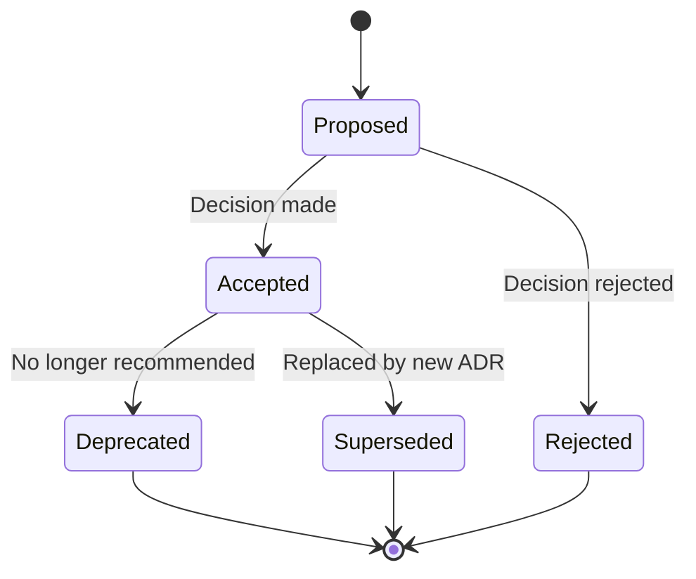

# Architecture Decision Records (ADRs)

## Overview

This directory contains Architecture Decision Records (ADRs) for the contribux project. ADRs are lightweight documents that capture important architectural decisions along with their context and consequences.

## What are ADRs?

Architecture Decision Records (ADRs) are short text documents that capture an architectural decision along with its context and consequences. They serve as a historical record of decisions made during the development of the system.

## Purpose

ADRs help us:

- **Document decisions**: Capture the reasoning behind architectural choices
- **Preserve context**: Maintain the "why" behind decisions as teams change
- **Enable informed changes**: Understand implications before modifying architecture
- **Facilitate onboarding**: Help new team members understand the system design
- **Support decision-making**: Learn from past decisions to make better future ones

## When to Write an ADR

Create an ADR when making decisions about:

### Architecture and Design

- Technology stack choices (databases, frameworks, libraries)
- System architecture patterns (microservices, monolith, serverless)
- Integration patterns and communication protocols
- Data modeling and storage strategies

### Development and Operations

- Development workflow and processes
- CI/CD pipeline design
- Deployment strategies
- Monitoring and observability approaches

### Security and Compliance

- Authentication and authorization approaches
- Data encryption strategies
- Privacy and compliance measures
- Security architecture decisions

### Performance and Scalability

- Caching strategies
- Performance optimization approaches
- Scalability patterns
- Resource allocation decisions

## ADR Lifecycle



### Status Definitions

- **Proposed**: The ADR is under consideration and discussion
- **Accepted**: The decision has been made and is being implemented
- **Deprecated**: The decision is no longer recommended but may still be in use
- **Superseded**: The decision has been replaced by a newer ADR
- **Rejected**: The proposal was considered but ultimately not chosen

## ADR Process

### 1. Identify the Need

When facing an architectural decision, determine if it warrants an ADR by asking:

- Will this decision significantly impact the system?
- Is this a decision that others might question later?
- Does this establish a pattern that should be followed?
- Will future developers need to understand the reasoning?

### 2. Research and Analysis

Before writing the ADR:

- Research available options thoroughly
- Consider trade-offs and implications
- Consult with relevant stakeholders
- Validate assumptions with prototypes if needed

### 3. Draft the ADR

1. Copy the [template.md](./template.md) file
2. Name it with the next available number: `adr-001-description.md`
3. Fill in all sections thoroughly
4. Focus on the "why" not just the "what"

### 4. Review Process

1. Create a pull request with the ADR
2. Tag relevant team members for review
3. Address feedback and iterate
4. Ensure all stakeholders understand the decision

### 5. Accept and Implement

1. Merge the ADR when consensus is reached
2. Update the status to "Accepted"
3. Begin implementation
4. Update related documentation

### 6. Maintain and Update

- Review ADRs periodically (annually or as needed)
- Update status when decisions change
- Create new ADRs when superseding old ones

## ADR Naming Convention

ADRs should be named using the following pattern:

```text
adr-{number}-{short-description}.md
```

Examples:

- `adr-001-database-technology-selection.md`
- `adr-002-ai-agent-architecture.md`
- `adr-003-authentication-strategy.md`

## ADR Index

| ADR                                               | Title                         | Status   | Date       | Tags                  |
| ------------------------------------------------- | ----------------------------- | -------- | ---------- | --------------------- |
| [001](./adr-001-database-technology-selection.md) | Database Technology Selection | Accepted | 2025-01-15 | database, performance |
| [002](./adr-002-ai-agent-architecture.md)         | AI Agent Architecture         | Accepted | 2025-01-16 | ai, architecture      |
| [003](./adr-003-authentication-strategy.md)       | Authentication Strategy       | Accepted | 2025-01-17 | security, auth        |

## Writing Guidelines

### Be Concise but Complete

- Use clear, simple language
- Avoid jargon when possible
- Include enough detail for future understanding
- Keep it focused on the decision at hand

### Document the Process

- Show the options that were considered
- Explain why alternatives were rejected
- Include relevant research or benchmarks
- Document assumptions and constraints

### Think About the Future

- Consider how the decision might evolve
- Document maintenance implications
- Include monitoring and success criteria
- Plan for eventual deprecation or changes

### Use Visuals When Helpful

- Include diagrams for complex architectures
- Use tables for option comparisons
- Add code examples when relevant
- Reference external resources appropriately

## ADR Tools and Resources

### Templates and Examples

- [MADR (Markdown ADR)](https://adr.github.io/madr/) - Our base template format
- [ADR Examples](https://github.com/adr/adr-examples) - Real-world examples
- [Architecture Decision Records](https://cognitect.com/blog/2011/11/15/documenting-architecture-decisions) - Original blog post

### Tools

- [adr-tools](https://github.com/npryce/adr-tools) - Command line tools for ADRs
- [adr-viewer](https://github.com/mrwilson/adr-viewer) - Web viewer for ADRs
- [log4brains](https://github.com/thomvaill/log4brains) - Architecture knowledge base

## Quality Checklist

Before submitting an ADR, ensure:

### Content Quality

- [ ] Problem statement is clear and specific
- [ ] All viable options are documented
- [ ] Decision rationale is well-explained
- [ ] Consequences (positive and negative) are identified
- [ ] Implementation plan is outlined

### Process Quality

- [ ] Relevant stakeholders have been consulted
- [ ] Technical feasibility has been validated
- [ ] Cost implications are understood
- [ ] Security and compliance impacts are considered

### Documentation Quality

- [ ] Language is clear and professional
- [ ] Structure follows the template
- [ ] Links and references are valid
- [ ] Diagrams are readable and relevant

## Maintenance

### Regular Reviews

- **Quarterly**: Review active ADRs for relevance
- **Annually**: Comprehensive review of all ADRs
- **Ad-hoc**: When major system changes occur

### Update Triggers

- Technology upgrades or migrations
- Performance issues or bottlenecks
- Security vulnerabilities discovered
- New requirements or constraints
- Team feedback or lessons learned

### Archive Process

1. Update status to "Deprecated" or "Superseded"
2. Link to replacement ADR (if applicable)
3. Document timeline for transition
4. Update related documentation

## Getting Help

- **Questions**: Create an issue in the project repository
- **Discussions**: Use GitHub Discussions for broader conversations
- **Templates**: Refer to existing ADRs as examples
- **Process**: Contact the technical lead for guidance

---

## Related Documentation

- [System Design](../architecture/system-design.md)
- [Technology Stack](../architecture/technology-stack.md)
- [Data Architecture](../architecture/data-architecture.md)
- [Contributing Guidelines](../../CONTRIBUTORS.md)

---

_For more information about ADRs, see [Documenting Architecture Decisions](https://cognitect.com/blog/2011/11/15/documenting-architecture-decisions) by Michael Nygard._
