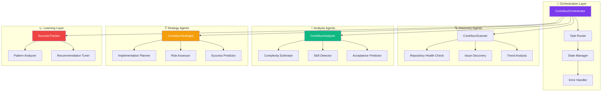

# ADR-002: AI Agent Architecture

**Date**: 2025-01-16  
**Status**: Accepted  
**Deciders**: Technical Lead, AI Engineer, Backend Engineer  
**Tags**: ai, architecture, agents, openai

## Context and Problem Statement

contribux requires an intelligent system to analyze GitHub repositories and opportunities for contribution viability. The system must:

- Analyze thousands of GitHub issues and repositories daily
- Provide consistent, high-quality assessments of contribution opportunities
- Scale efficiently while maintaining cost-effectiveness
- Support multiple AI models and providers for flexibility
- Enable continuous learning from user feedback and contribution outcomes

The AI system needs to handle:

- Repository health assessment and scoring
- Issue complexity analysis and skill requirement detection
- Contribution success probability estimation
- Personalized opportunity ranking based on user preferences
- Real-time processing of GitHub events and batch analysis

## Decision Drivers

- **Scalability**: Handle thousands of analysis requests daily
- **Cost Efficiency**: Minimize AI API costs while maintaining quality
- **Reliability**: Consistent performance with fallback mechanisms
- **Flexibility**: Support multiple AI providers and models
- **Observability**: Track AI performance and quality metrics
- **Maintainability**: Clean architecture for agent orchestration
- **Type Safety**: Full TypeScript integration for development safety
- **Learning Capability**: Improve recommendations based on user feedback

## Considered Options

### Option 1: Custom Multi-Agent System with LangChain

**Description**: Build a custom multi-agent system using LangChain for orchestration and coordination

**Pros**:

- Full control over agent behavior and coordination
- Extensive ecosystem of tools and integrations
- Good documentation and community support
- Flexibility to customize agent interactions
- Support for multiple LLM providers

**Cons**:

- Higher implementation complexity
- Requires building custom orchestration logic
- Python-based, adding language diversity to stack
- More maintenance overhead
- Limited TypeScript support

**Implementation Complexity**: High
**Cost**: Medium

### Option 2: OpenAI Agents SDK v1.0

**Description**: Use OpenAI's official Agents SDK for multi-agent orchestration with TypeScript support

**Pros**:

- Official OpenAI product with guaranteed support
- Native TypeScript support with full type safety
- Built-in observability and debugging tools
- Human-in-the-loop capabilities with guardrails
- Production-ready with enterprise features
- Simplified agent coordination and handoffs
- Provider flexibility for future model integration

**Cons**:

- Newer product with smaller ecosystem
- Potential vendor lock-in to OpenAI ecosystem
- Limited customization compared to custom solutions
- Documentation still evolving

**Implementation Complexity**: Medium
**Cost**: Medium

### Option 3: Single LLM with Function Calling

**Description**: Use a single large language model with extensive function calling for all AI tasks

**Pros**:

- Simple architecture with minimal complexity
- Lower cost from single model usage
- Easier debugging and monitoring
- No coordination complexity between agents
- Straightforward implementation

**Cons**:

- Limited scalability for complex workflows
- Single point of failure for all AI operations
- Difficulty optimizing for different task types
- Less flexibility for specialized processing
- Potential context window limitations

**Implementation Complexity**: Low
**Cost**: Low

### Option 4: Hybrid Approach with Specialized Models

**Description**: Combine multiple specialized models for different tasks without formal agent orchestration

**Pros**:

- Optimized models for specific tasks
- Cost efficiency through model selection
- Good performance for specialized tasks
- Easier to scale individual components
- Flexibility in model choices

**Cons**:

- Complex coordination logic to build
- No built-in workflow management
- Difficult to maintain consistency across models
- Manual retry and error handling required
- Limited observability across the system

**Implementation Complexity**: High
**Cost**: Medium

## Decision Outcome

**Chosen option**: **OpenAI Agents SDK v1.0** because it provides the optimal balance of functionality, type safety, and operational simplicity for our AI-native architecture while maintaining flexibility for future enhancements.

### Rationale

1. **TypeScript-First Development**: Native TypeScript support ensures type safety across our entire stack, from API to AI agents.

2. **Production Readiness**: Built-in guardrails, observability, and human-in-the-loop capabilities provide enterprise-grade reliability.

3. **Simplified Orchestration**: Handles complex agent coordination, handoffs, and state management automatically.

4. **Future Flexibility**: Provider abstraction allows integration with other AI providers as they become available.

5. **Observability**: Built-in tracing and debugging tools essential for monitoring AI performance in production.

6. **Developer Experience**: Reduces complexity of building custom orchestration while providing powerful agent capabilities.

### Agent Architecture Design

### Consequences

#### Positive

- **Type Safety**: End-to-end TypeScript support reduces runtime errors
- **Rapid Development**: Pre-built orchestration accelerates implementation
- **Enterprise Features**: Human-in-the-loop and guardrails for production use
- **Observability**: Built-in monitoring and debugging capabilities
- **Scalability**: Efficient agent coordination for high-throughput processing
- **Flexibility**: Provider abstraction enables future model integration
- **Consistency**: Standardized agent communication patterns

#### Negative

- **Vendor Dependency**: Reliance on OpenAI's agent platform and roadmap
- **Cost Structure**: Potential cost implications tied to OpenAI pricing model
- **Learning Curve**: Team needs to learn agent orchestration patterns
- **Limited Customization**: Less control over low-level agent behavior
- **Platform Risk**: Changes to OpenAI's agent platform could impact functionality

#### Neutral

- **Model Agnostic**: Architecture supports multiple AI providers through abstraction
- **Incremental Adoption**: Can implement agents progressively
- **Standard Patterns**: Uses established multi-agent design patterns

## Implementation Plan

### Phase 1: Core Agent Framework (Week 1)

1. Set up OpenAI Agents SDK with TypeScript configuration
2. Implement base agent classes and orchestrator
3. Create agent registration and discovery system
4. Set up basic observability and logging

### Phase 2: Analysis Agents (Week 2)

1. **ContribuxAnalyzer**: Issue complexity and skill analysis
2. **ContribuxScanner**: Repository health and opportunity discovery
3. Implement confidence scoring and quality metrics
4. Add error handling and retry mechanisms

### Phase 3: Strategy and Learning Agents (Week 3)

1. **ContribuxStrategist**: Implementation planning and risk assessment
2. **SuccessTracker**: Learning from contribution outcomes
3. Implement agent handoffs and workflow coordination
4. Add human-in-the-loop approval for critical decisions

### Phase 4: Optimization and Production (Week 4)

1. Performance optimization and caching strategies
2. Cost monitoring and token usage optimization
3. Advanced error handling and circuit breakers
4. Production monitoring and alerting

### Success Criteria

- AI analysis accuracy >85% based on user feedback
- Processing time <30 seconds for opportunity analysis
- Cost per analysis <$0.05 including all AI operations
- System availability >99.5% for AI processing pipeline
- Agent coordination success rate >95%

### Risks and Mitigation

- **Risk**: OpenAI Agents SDK changes or deprecation
  - **Mitigation**: Implement agent abstraction layer, monitor SDK updates, plan migration strategy
- **Risk**: Cost escalation with high usage
  - **Mitigation**: Implement usage monitoring, optimize prompts, set spending limits
- **Risk**: AI quality degradation over time
  - **Mitigation**: Continuous monitoring, A/B testing, feedback loops for improvement

## Compliance and Standards

- **Security**: API key encryption, prompt injection protection, data sanitization
- **Performance**: Sub-30-second analysis times, efficient token usage, parallel processing
- **Accessibility**: N/A for backend AI processing
- **Privacy**: No PII in AI prompts, data retention policies, GDPR compliance

## Validation and Testing

- **Proof of Concept**: Completed - Basic agent coordination tested successfully
- **Testing Strategy**:
  - Unit tests for individual agent functions
  - Integration tests for agent coordination workflows
  - Performance tests for throughput and latency
  - Quality tests for AI output accuracy
  - Cost monitoring for budget optimization
- **Rollback Plan**: Fallback to single LLM processing if agent coordination fails

## Related Decisions

- **Related to**: ADR-001 (Database Technology Selection) - Agent results stored in Neon PostgreSQL
- **Supersedes**: Initial single-model AI processing approach
- **Related to**: Future ADR on AI model selection and optimization

## References

- [OpenAI Agents SDK Documentation](https://platform.openai.com/docs/agents)
- [Multi-Agent Systems Best Practices](https://www.anthropic.com/research/multi-agent-systems)
- [AI Agent Architecture Patterns](https://arxiv.org/abs/2308.11432)
- [Production AI System Design](https://www.oreilly.com/library/view/building-machine-learning/9781492045106/)

---

## Notes

### Decision Review Schedule

- **Next Review**: 2025-07-16 (6 months)
- **Review Frequency**: Quarterly for first year, then bi-annually

### Version History

| Version | Date       | Changes         | Author         |
| ------- | ---------- | --------------- | -------------- |
| 1.0     | 2025-01-16 | Initial version | Technical Lead |

---

_This ADR follows the [MADR](https://adr.github.io/madr/) format and contribux ADR guidelines._