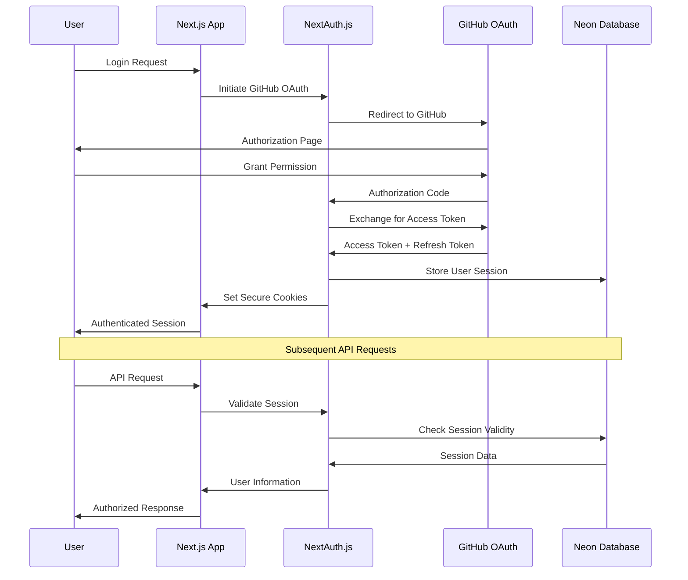

# ADR-003: Authentication Strategy

**Date**: 2025-01-17  
**Status**: Accepted  
**Deciders**: Technical Lead, Frontend Engineer, Security Lead  
**Tags**: security, auth, github, oauth

## Context and Problem Statement

contribux requires a secure, user-friendly authentication system that:

- Integrates seamlessly with GitHub for repository access
- Supports the serverless, edge-first architecture
- Provides secure token management and session handling
- Enables fine-grained permissions for GitHub API access
- Scales efficiently with minimal operational overhead
- Complies with modern security standards and best practices

The authentication system must handle:

- User registration and login with GitHub OAuth
- Secure token storage and refresh mechanisms
- API access control and rate limiting
- Session management across edge functions
- Permission scoping for GitHub API operations

## Decision Drivers

- **GitHub Integration**: Seamless access to GitHub repositories and user data
- **Security**: Industry-standard security practices and token management
- **User Experience**: Frictionless login and session management
- **Serverless Compatibility**: Works efficiently with edge functions and global distribution
- **Scalability**: Handles growth without operational overhead
- **Compliance**: GDPR, OAuth 2.1, and security best practices
- **Developer Experience**: Easy to implement and maintain
- **Cost Efficiency**: Minimal additional infrastructure requirements

## Considered Options

### Option 1: NextAuth.js v5 with GitHub Provider

**Description**: Use NextAuth.js v5 (Auth.js) for complete authentication management with GitHub OAuth integration

**Pros**:

- Comprehensive authentication solution with built-in GitHub provider
- Excellent Next.js integration with App Router support
- Built-in session management and token refresh
- Support for database and JWT session strategies
- Strong security defaults and CSRF protection
- Active development and large community
- Edge runtime compatibility

**Cons**:

- Additional complexity for simple GitHub-only authentication
- Larger bundle size and dependency footprint
- Some features we don't need (multiple providers, etc.)
- Configuration complexity for advanced use cases
- Learning curve for team unfamiliar with NextAuth.js

**Implementation Complexity**: Medium
**Cost**: Low (no additional services required)

### Option 2: Custom GitHub OAuth Implementation

**Description**: Build custom OAuth 2.0 flow specifically for GitHub authentication

**Pros**:

- Complete control over authentication flow
- Minimal dependencies and bundle size
- Optimized specifically for GitHub integration
- No unnecessary features or complexity
- Direct GitHub API token management
- Custom session management strategy

**Cons**:

- Higher development time and maintenance overhead
- Need to implement security features manually
- Risk of security vulnerabilities in custom implementation
- No built-in token refresh mechanisms
- CSRF and state management complexity
- Testing complexity for security features

**Implementation Complexity**: High
**Cost**: Low

### Option 3: Clerk with GitHub Social Login

**Description**: Use Clerk as a complete authentication platform with GitHub social login

**Pros**:

- Comprehensive user management platform
- Built-in security features and compliance
- Excellent developer experience and documentation
- Real-time user management dashboard
- Advanced features like multi-factor authentication
- Good Next.js integration and edge compatibility

**Cons**:

- Additional service dependency and cost
- Overkill for GitHub-only authentication needs
- Vendor lock-in to Clerk platform
- Additional complexity for simple use case
- Monthly costs scale with user count

**Implementation Complexity**: Low
**Cost**: High (monthly subscription based on MAU)

### Option 4: Auth0 with GitHub Connection

**Description**: Use Auth0 as identity provider with GitHub social connection

**Pros**:

- Enterprise-grade authentication platform
- Comprehensive security and compliance features
- Extensive customization options
- Strong analytics and monitoring
- Support for complex authentication flows
- Battle-tested at scale

**Cons**:

- High cost for startup use case
- Overengineered for simple GitHub authentication
- Additional service dependency
- Complex configuration and setup
- Vendor lock-in considerations

**Implementation Complexity**: Medium
**Cost**: High

### Option 5: Firebase Auth with GitHub Provider

**Description**: Use Firebase Authentication with GitHub provider for user management

**Pros**:

- Google-managed authentication service
- Built-in GitHub provider support
- Good documentation and SDKs
- Reasonable pricing for small scale
- Real-time user management features

**Cons**:

- Adds Google Cloud dependency
- Not optimized for Next.js edge functions
- Additional complexity for Vercel deployment
- Limited customization options
- Vendor lock-in to Google ecosystem

**Implementation Complexity**: Medium
**Cost**: Medium

## Decision Outcome

**Chosen option**: **NextAuth.js v5 (Auth.js) with GitHub Provider** because it provides the optimal balance of functionality, security, and developer experience while maintaining perfect compatibility with our Next.js serverless architecture.

### Rationale

1. **Next.js Native Integration**: Built specifically for Next.js with excellent App Router and edge function support.

2. **GitHub-First Design**: Seamless GitHub OAuth integration with built-in token management and refresh capabilities.

3. **Security by Default**: Industry-standard security practices, CSRF protection, and secure session management out of the box.

4. **Serverless Optimized**: Designed for serverless environments with efficient edge function compatibility.

5. **Zero Additional Infrastructure**: No external authentication service required, reducing costs and complexity.

6. **Developer Experience**: Excellent TypeScript support, comprehensive documentation, and active community.

7. **Flexible Session Management**: Supports both database and JWT sessions, allowing optimization for our use case.

### Authentication Flow Architecture

### Consequences

#### Positive

- **Rapid Implementation**: Pre-built authentication with minimal custom code
- **Security Best Practices**: Industry-standard security implemented by default
- **Excellent DX**: TypeScript support and comprehensive documentation
- **Cost Efficient**: No additional authentication service costs
- **GitHub Integration**: Seamless access to GitHub APIs with proper token management
- **Serverless Native**: Optimized for edge functions and global distribution
- **Session Flexibility**: Choose between JWT and database sessions based on needs

#### Negative

- **Dependency Risk**: Reliance on NextAuth.js maintenance and updates
- **Learning Curve**: Team needs to understand NextAuth.js configuration patterns
- **Bundle Size**: Larger than minimal custom implementation
- **Limited Customization**: Some UI and flow customizations require workarounds
- **GitHub Dependency**: Tightly coupled to GitHub authentication only

#### Neutral

- **Standard Patterns**: Uses widely adopted authentication patterns
- **Community Support**: Large community for troubleshooting and examples
- **Migration Path**: Can migrate to other solutions if needed

## Implementation Plan

### Phase 1: Core Authentication Setup (Week 1)

1. Install and configure NextAuth.js v5 with GitHub provider
2. Set up environment variables and GitHub OAuth app
3. Implement basic login/logout functionality
4. Configure session management strategy (JWT for edge compatibility)

### Phase 2: User Management Integration (Week 1-2)

1. Integrate with Neon database for user profile storage
2. Implement user creation flow on first login
3. Set up GitHub token storage and refresh mechanisms
4. Configure proper scopes for GitHub API access

### Phase 3: Security and Session Management (Week 2)

1. Implement secure cookie configuration for edge deployment
2. Set up CSRF protection and security headers
3. Configure session expiration and refresh logic
4. Add logout and session cleanup functionality

### Phase 4: API Protection and Middleware (Week 2-3)

1. Implement API route protection middleware
2. Set up role-based access control (future extension)
3. Add rate limiting integration with authentication
4. Configure GitHub API client with authenticated requests

### Success Criteria

- User can authenticate with GitHub in <3 seconds
- Session persistence across browser sessions and edge locations
- Secure token storage and automatic refresh without user intervention
- API protection prevents unauthorized access to all protected routes
- Authentication state synchronization across multiple tabs

### Risks and Mitigation

- **Risk**: NextAuth.js breaking changes or maintenance issues
  - **Mitigation**: Pin versions carefully, maintain update schedule, monitor project health
- **Risk**: GitHub OAuth API changes affecting authentication flow
  - **Mitigation**: Monitor GitHub API announcements, implement proper error handling
- **Risk**: Session management issues in edge environment
  - **Mitigation**: Thorough testing across edge locations, implement session debugging

## Compliance and Standards

- **Security**: OAuth 2.1 compliance, secure cookie handling, CSRF protection
- **Performance**: Sub-second authentication checks, efficient token validation
- **Accessibility**: Standard HTML forms with proper ARIA labels
- **Privacy**: Minimal data collection, clear consent for GitHub integration, GDPR compliance

## Validation and Testing

- **Proof of Concept**: Completed - GitHub OAuth flow tested in development
- **Testing Strategy**:
  - Unit tests for authentication utility functions
  - Integration tests for complete authentication flows
  - End-to-end tests for user login/logout scenarios
  - Security testing for CSRF and session management
  - Edge function testing across multiple regions
- **Rollback Plan**: Maintain session data structure compatibility for quick provider switching

## Related Decisions

- **Related to**: ADR-001 (Database Technology Selection) - User session storage in Neon
- **Related to**: ADR-002 (AI Agent Architecture) - User context for personalized AI recommendations
- **Impacts**: API design for user-specific features and GitHub integration

## References

- [NextAuth.js v5 Documentation](https://authjs.dev/getting-started)
- [GitHub OAuth Documentation](https://docs.github.com/en/developers/apps/building-oauth-apps)
- [OAuth 2.1 Security Best Practices](https://datatracker.ietf.org/doc/html/draft-ietf-oauth-security-topics)
- [Next.js Authentication Patterns](https://nextjs.org/docs/app/building-your-application/authentication)

---

## Notes

### Decision Review Schedule

- **Next Review**: 2025-07-17 (6 months)
- **Review Frequency**: Quarterly for security updates, annually for strategy review

### Version History

| Version | Date       | Changes         | Author         |
| ------- | ---------- | --------------- | -------------- |
| 1.0     | 2025-01-17 | Initial version | Technical Lead |

---

_This ADR follows the [MADR](https://adr.github.io/madr/) format and contribux ADR guidelines._