# API Documentation

> Complete reference for contribux REST APIs, GraphQL endpoints, and integration patterns.

## Documentation Map

```mermaid
graph LR
    A[📡 API Documentation] --> B[🔗 REST APIs]
    A --> C[📊 GraphQL]
    A --> D[🔔 Webhooks]
    A --> E[🔐 Authentication]
    
    B --> B1[User Management]
    B --> B2[Repository Discovery]
    B --> B3[Opportunities]
    B --> B4[Notifications]
    
    C --> C1[Schema Reference]
    C --> C2[Query Examples]
    C --> C3[Mutations]
    
    D --> D1[GitHub Integration]
    D --> D2[Notification Events]
    D --> D3[External Services]
    
    E --> E1[OAuth Flow]
    E --> E2[API Keys]
    E --> E3[Rate Limiting]
```



## Quick Navigation

### 🔗 REST API Reference
*Complete REST API documentation*

- **[User Management API](./rest/user-management.md)** - User profiles, preferences, and settings
- **[Repository Discovery API](./rest/repository-discovery.md)** - Search and filter repositories
- **[Opportunities API](./rest/opportunities.md)** - Contribution opportunities and matching
- **[Notifications API](./rest/notifications.md)** - Multi-channel notification management

### 📊 GraphQL API
*Flexible query interface*

- **[GraphQL Schema](./graphql/schema.md)** - Complete schema reference
- **[Query Examples](./graphql/queries.md)** - Common query patterns
- **[Mutations](./graphql/mutations.md)** - Data modification operations

### 🔔 Webhooks & Events
*Real-time integration*

- **[GitHub Integration](./webhooks/github-integration.md)** - Repository and event webhooks
- **[Notification Events](./webhooks/notification-events.md)** - User notification webhooks
- **[External Services](./webhooks/external-services.md)** - Third-party integrations

### 🔐 Authentication & Security
*API access and security*

- **[OAuth Authentication](./auth/oauth-flow.md)** - GitHub OAuth integration
- **[API Key Management](./auth/api-keys.md)** - Service-to-service authentication
- **[Rate Limiting](./auth/rate-limiting.md)** - Usage limits and best practices

## API Overview

### Base URLs
```
Production:  https://contribux.ai/api
Staging:     https://staging.contribux.ai/api
Development: http://localhost:3000/api
```

### Authentication
```http
# OAuth Token (User API)
Authorization: Bearer {oauth_token}

# API Key (Service API)
X-API-Key: {api_key}
```

### Content Types
```http
Content-Type: application/json
Accept: application/json
```

## Core API Endpoints

### User Management
```mermaid
graph TD
    A[User APIs] --> B[/api/users]
    A --> C[/api/users/:id]
    A --> D[/api/users/:id/preferences]
    A --> E[/api/users/:id/notifications]
    
    B --> B1[GET - List users]
    B --> B2[POST - Create user]
    
    C --> C1[GET - Get user]
    C --> C2[PUT - Update user]
    C --> C3[DELETE - Delete user]
    
    D --> D1[GET - Get preferences]
    D --> D2[PUT - Update preferences]
    
    E --> E1[GET - List notifications]
    E --> E2[POST - Create notification]
```

### Repository Discovery
```mermaid
graph TD
    A[Repository APIs] --> B[/api/repositories]
    A --> C[/api/repositories/:id]
    A --> D[/api/repositories/search]
    A --> E[/api/repositories/:id/health]
    
    B --> B1[GET - List repositories]
    B --> B2[POST - Add repository]
    
    C --> C1[GET - Get repository]
    C --> C2[PUT - Update repository]
    
    D --> D1[POST - Semantic search]
    D --> D2[GET - Filter by criteria]
    
    E --> E1[GET - Health metrics]
    E --> E2[PUT - Update health]
```

### Opportunities
```mermaid
graph TD
    A[Opportunity APIs] --> B[/api/opportunities]
    A --> C[/api/opportunities/:id]
    A --> D[/api/opportunities/match]
    A --> E[/api/opportunities/:id/track]
    
    B --> B1[GET - List opportunities]
    B --> B2[POST - Create opportunity]
    
    C --> C1[GET - Get opportunity]
    C --> C2[PUT - Update opportunity]
    
    D --> D1[POST - Find matches]
    D --> D2[GET - Recommended opportunities]
    
    E --> E1[POST - Track engagement]
    E --> E2[GET - Tracking history]
```

## Integration Patterns

### Semantic Search Integration
```typescript
// Vector search with hybrid ranking
const searchRequest = {
  query: "machine learning python",
  filters: {
    language: ["Python", "TypeScript"],
    activity: "high",
    difficulty: "intermediate"
  },
  vector_search: true,
  limit: 20
};

const response = await fetch('/api/repositories/search', {
  method: 'POST',
  headers: {
    'Content-Type': 'application/json',
    'Authorization': `Bearer ${token}`
  },
  body: JSON.stringify(searchRequest)
});
```

### Real-time Notifications
```typescript
// WebSocket connection for real-time updates
const ws = new WebSocket('wss://contribux.ai/ws');

ws.on('opportunity_match', (data) => {
  console.log('New opportunity:', data.opportunity);
});

ws.on('repository_update', (data) => {
  console.log('Repository updated:', data.repository);
});
```

### Webhook Integration
```typescript
// GitHub webhook handler
app.post('/webhooks/github', (req, res) => {
  const { action, repository, sender } = req.body;
  
  if (action === 'opened' && repository) {
    // Process new issue or PR
    await processContributionOpportunity(repository, sender);
  }
  
  res.status(200).send('OK');
});
```

## Error Handling

### Standard Error Format
```json
{
  "error": {
    "code": "VALIDATION_ERROR",
    "message": "Invalid request parameters",
    "details": [
      {
        "field": "email",
        "message": "Invalid email format"
      }
    ],
    "request_id": "req_123456789"
  }
}
```

### HTTP Status Codes
- `200` - Success
- `201` - Created
- `400` - Bad Request
- `401` - Unauthorized
- `403` - Forbidden
- `404` - Not Found
- `429` - Rate Limited
- `500` - Internal Server Error

## Rate Limits

### Default Limits
- **Authenticated users**: 1000 requests/hour
- **API keys**: 5000 requests/hour
- **Search operations**: 100 requests/hour
- **Vector operations**: 50 requests/hour

### Rate Limit Headers
```http
X-RateLimit-Limit: 1000
X-RateLimit-Remaining: 999
X-RateLimit-Reset: 1672531200
```

---

## SDK and Libraries

### Official SDKs
- **JavaScript/TypeScript**: `@contribux/sdk-js` - Full-featured SDK with TypeScript support
- **Python**: `contribux-python` - Pythonic SDK with async support
- **Go**: `contribux-go` - High-performance Go SDK

### Community Libraries
- **Ruby**: `contribux-ruby` (community-maintained)
- **PHP**: `contribux-php` (community-maintained)
- **Rust**: `contribux-rs` (community-maintained)

### Quick Start with SDKs

#### JavaScript/TypeScript
```bash
npm install @contribux/sdk-js
```

```typescript
import { ContribuxClient } from '@contribux/sdk-js'

const client = new ContribuxClient({
  apiKey: process.env.CONTRIBUX_API_KEY,
  environment: 'production' // or 'staging'
})

// Get user profile
const user = await client.users.me()

// Search repositories
const repos = await client.repositories.search({
  query: 'machine learning python',
  languages: ['Python'],
  difficulty: 'intermediate'
})
```

#### Python
```bash
pip install contribux-python
```

```python
from contribux import ContribuxClient

client = ContribuxClient(
    api_key=os.environ['CONTRIBUX_API_KEY'],
    environment='production'
)

# Get user profile
user = client.users.me()

# Search repositories with vector search
repos = client.repositories.search(
    query='machine learning python',
    languages=['Python'],
    vector_search=True
)
```

---

## Getting Help

- 🏗️ Review [architecture documentation](../architecture/README.md)
- ⚡ Check [developer documentation](../developers/README.md) for implementation details
- 🔧 See [operator documentation](../operators/README.md) for infrastructure
- 💬 Join our developer community for API support

---

*API documentation maintained by the contribux development team. OpenAPI specs available in `/api/openapi.json`.*

<!-- AI Context Tags: api-documentation, rest-api, graphql, webhooks, authentication, integration-patterns -->