# Architecture Documentation

Welcome to the contribux architecture documentation. This section provides comprehensive technical documentation covering the system design, technology decisions, and architectural patterns used in the platform.

## Documentation Overview

```mermaid
graph TB
    subgraph "📚 Architecture Documentation"
        A[System Overview] --> B[Technology Stack]
        A --> C[Data Architecture]
        A --> D[Decision Records]
    end

    subgraph "🏗️ Core Documents"
        E[System Design] --> F[High-Level Architecture]
        E --> G[Component Architecture]
        E --> H[Performance Design]
    end

    subgraph "🔧 Technical Specs"
        I[Technology Stack] --> J[Frontend Technologies]
        I --> K[Backend Technologies]
        I --> L[AI/ML Integration]
    end

    subgraph "💾 Data Design"
        M[Data Architecture] --> N[Database Schema]
        M --> O[Vector Search]
        M --> P[Performance Optimization]
    end

    A --> E
    B --> I
    C --> M
    D --> Q[ADR Templates & Process]

    style A fill:#7C3AED,color:#fff
    style E fill:#10B981,color:#fff
    style I fill:#F59E0B,color:#fff
    style M fill:#EF4444,color:#fff
```

## Quick Navigation

### 🎯 Start Here

- **[Architecture Overview](./overview.md)** - Executive summary and visual architecture
- **[System Design](./system-design.md)** - Comprehensive system architecture and design patterns

### 🛠️ Technology Deep Dives

- **[Technology Stack](./technology-stack.md)** - Complete technology selection and rationale
- **[Data Architecture](./data-architecture.md)** - Database design, vector search, and performance

### 📋 Decision Records

- **[ADR Process](../adrs/README.md)** - How we make and document architectural decisions
- **[ADR Template](../adrs/template.md)** - Template for new architecture decision records
- **[Existing ADRs](../adrs/)** - Historical architectural decisions and their context

## Architecture Principles

### Core Design Philosophy

contribux is built on these fundamental architectural principles:

1. **Serverless-First**: Zero infrastructure management with automatic scaling
2. **AI-Native**: LLM-first architecture with intelligent processing at every layer
3. **Performance-Optimized**: Sub-second response times with edge distribution
4. **Cost-Conscious**: Ultra-low operating costs through efficient resource usage
5. **Developer-Friendly**: Excellent developer experience with modern tooling

### Design Patterns

#### Event-Driven Architecture

#### Microservices-in-Functions

- **Focused Functions**: Each API endpoint is a focused, single-purpose function
- **Shared Libraries**: Common functionality extracted to reusable libraries
- **Type Safety**: End-to-end type safety with tRPC and Zod validation

#### AI Agent Pattern

- **Orchestrator**: Central coordinator for AI workflows
- **Specialized Agents**: Domain-specific agents for different tasks
- **Learning Loop**: Continuous improvement through feedback

## System Architecture Layers

### 1. Presentation Layer

- **Next.js 15**: React framework with App Router and Server Components
- **Tailwind CSS 4.0**: Utility-first styling with modern CSS features
- **shadcn/ui 2.0**: Accessible component library with Radix primitives

### 2. API Layer

- **Vercel Edge Functions**: Global distribution with sub-50ms latency
- **tRPC v11**: End-to-end type safety and automatic API generation
- **Zod Validation**: Runtime type checking and data validation

### 3. Business Logic Layer

- **AI Agents**: OpenAI Agents SDK for intelligent processing
- **Repository Scanner**: Automated discovery and health scoring
- **Opportunity Analyzer**: ML-powered contribution analysis
- **Personalization Engine**: User preference matching and recommendations

### 4. Data Layer

- **Neon PostgreSQL 16**: Serverless database with automatic scaling
- **pgvector 0.7**: Vector similarity search for semantic matching
- **Upstash Redis**: Caching and session management
- **QStash**: Message queuing for background processing

### 5. Integration Layer

- **GitHub API v4**: Repository data and real-time updates
- **OpenAI API**: Language models and embedding generation
- **Resend**: Transactional email delivery
- **Vercel Analytics**: Performance monitoring and user analytics

## Key Architectural Decisions

### Database Technology: Neon PostgreSQL

**Why**: Serverless architecture, pgvector support, zero maintenance
**Trade-offs**: Vendor lock-in vs operational simplicity
**See**: [ADR-001: Database Technology Selection](../adrs/adr-001-database-technology-selection.md)

### AI Processing: OpenAI Agents SDK

**Why**: Multi-agent orchestration, TypeScript support, production ready
**Trade-offs**: Cost vs functionality, vendor dependency vs development speed

### Frontend Framework: Next.js 15

**Why**: React Server Components, edge runtime, excellent DX
**Trade-offs**: Framework lock-in vs development velocity

## Performance Architecture

### Performance Targets

| Metric              | Target | Critical | Current |
| ------------------- | ------ | -------- | ------- |
| Initial Page Load   | <2s    | <3s      | ~1.5s   |
| API Response (p95)  | <500ms | <1s      | ~300ms  |
| Time to Interactive | <3s    | <5s      | ~2.1s   |
| Vector Search       | <100ms | <500ms   | ~85ms   |
| Background Jobs     | <5min  | <10min   | ~3min   |

### Optimization Strategies

- **Edge Computing**: Global distribution with Vercel Edge Network
- **Smart Caching**: Multi-layer caching with intelligent invalidation
- **Bundle Optimization**: Code splitting and lazy loading
- **Database Optimization**: Vector indexes and query optimization

## Security Architecture

### Security Layers

1. **Transport**: TLS 1.3 encryption for all communications
2. **Authentication**: GitHub OAuth with JWT token management
3. **Authorization**: Role-based access control and rate limiting
4. **Data**: AES-256 encryption for sensitive data at rest
5. **Application**: Input validation and SQL injection prevention

### Privacy Compliance

- **Data Minimization**: Collect only essential information
- **User Consent**: Explicit opt-in for all data processing
- **Right to Deletion**: GDPR-compliant data removal
- **Transparency**: Clear privacy policy and data usage

## Scalability Considerations

### Horizontal Scaling

- **Serverless Functions**: Automatic scaling based on demand
- **Database**: Neon's automatic read replicas and connection pooling
- **CDN**: Global edge distribution for static assets
- **Queue Processing**: Parallel job execution with message queues

### Cost Scaling Model

## Development Workflow

### Architecture Evolution Process

1. **Identify Need**: Recognize architectural challenges or opportunities
2. **Research Options**: Investigate available solutions and trade-offs
3. **Create ADR**: Document decision process and rationale
4. **Implement Change**: Execute architectural changes incrementally
5. **Monitor Impact**: Track performance and quality metrics
6. **Learn and Iterate**: Apply lessons to future decisions

### Quality Gates

- **Type Safety**: All code must pass TypeScript strict mode
- **Test Coverage**: 90%+ coverage through meaningful tests
- **Performance**: Meet response time and throughput targets
- **Security**: Pass security audit and penetration testing
- **Documentation**: Update architecture docs for significant changes

## Monitoring and Observability

### Observability Stack

- **Application Monitoring**: Sentry for error tracking and performance
- **Infrastructure Monitoring**: Vercel Analytics and metrics
- **Business Intelligence**: Custom dashboards for KPIs
- **AI Performance**: Model accuracy and response time tracking

### Key Metrics

- **System Health**: Uptime, response times, error rates
- **Business Metrics**: User engagement, contribution success rates
- **AI Performance**: Analysis accuracy, recommendation relevance
- **Cost Efficiency**: Resource utilization, cost per user

## Future Architecture

### Planned Enhancements

- **Enhanced AI**: Fine-tuned models and reinforcement learning
- **Real-time Features**: WebSocket connections for live updates
- **Mobile Experience**: React Native app for mobile users
- **Enterprise Features**: Team collaboration and organization analytics

### Technology Roadmap

- **Q2 2025**: Advanced AI agents with custom models
- **Q3 2025**: Real-time collaboration platform
- **Q4 2025**: Enterprise deployment options
- **Q1 2026**: Mobile applications and browser extensions

## Getting Help

### Architecture Questions

- **System Design**: Contact technical lead for architecture discussions
- **Performance**: Use performance monitoring tools and metrics
- **Security**: Review security guidelines and contact security team
- **Scaling**: Consult scalability documentation and monitoring

### Contributing to Architecture

- **Propose Changes**: Create ADRs for significant architectural decisions
- **Documentation**: Update architecture docs for any changes
- **Review Process**: Include architecture review in PR process
- **Knowledge Sharing**: Participate in architecture discussions and reviews

## Related Documentation

### Developer Resources

- **[Developer Guide](../developers/README.md)** - Development setup and standards
- **[API Documentation](../api/README.md)** - API reference and integration
- **[Database Guide](../developers/standards/database.md)** - Database development standards

### Operational Resources

- **[Operators Guide](../operators/README.md)** - Deployment and operations
- **[Monitoring Guide](../operators/monitoring.md)** - System monitoring and alerting
- **[Security Guide](../operators/security.md)** - Security operations and compliance

---

**Architecture Team**: Technical Lead, Senior Engineers, DevOps Lead  
**Last Updated**: 2025-01-15  
**Next Review**: 2025-04-15 (Quarterly)

---

_This architecture documentation is maintained by the contribux development team and follows our architectural decision record (ADR) process for significant changes._
