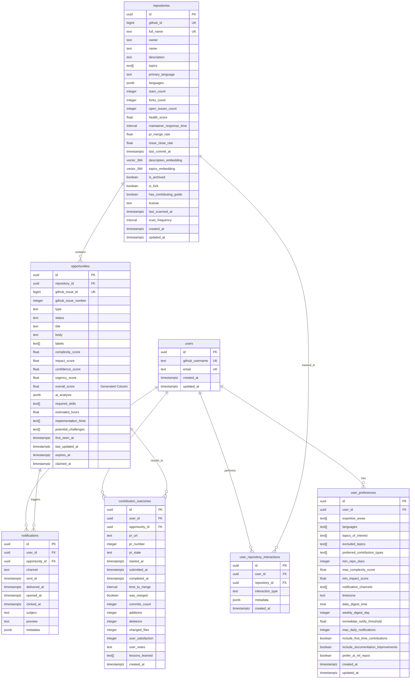

# Data Architecture and Vector Search

## Overview

contribux employs a sophisticated data architecture centered around PostgreSQL 16 with pgvector for vector similarity search. The system combines traditional relational data with AI-powered vector embeddings to enable intelligent opportunity discovery and personalized recommendations.

## Database Architecture

### Core Schema Design



### Vector Embeddings Strategy

#### Embedding Models and Dimensions

- **Primary Model**: OpenAI text-embedding-ada-002 (1536 dimensions)
- **Fallback Model**: OpenAI text-embedding-3-small (1536 dimensions)
- **Stored Format**: pgvector's `vector` type with 384 dimensions (compressed)

#### Vector Storage Implementation

```sql
-- Enable pgvector extension
CREATE EXTENSION IF NOT EXISTS vector;

-- Repository embeddings for semantic search
ALTER TABLE repositories
ADD COLUMN description_embedding vector(384),
ADD COLUMN topics_embedding vector(384);

-- Opportunity embeddings for matching
ALTER TABLE opportunities
ADD COLUMN content_embedding vector(384);

-- User preference embeddings for personalization
ALTER TABLE user_preferences
ADD COLUMN interests_embedding vector(384);
```

#### Vector Index Configuration

```sql
-- HNSW indexes for fast approximate nearest neighbor search
CREATE INDEX idx_repositories_desc_embedding ON repositories
USING hnsw (description_embedding vector_cosine_ops)
WITH (m = 16, ef_construction = 64);

CREATE INDEX idx_repositories_topics_embedding ON repositories
USING hnsw (topics_embedding vector_cosine_ops)
WITH (m = 16, ef_construction = 64);

CREATE INDEX idx_opportunities_content_embedding ON opportunities
USING hnsw (content_embedding vector_cosine_ops)
WITH (m = 16, ef_construction = 64);

-- IVFFlat indexes for exact search (when needed)
CREATE INDEX idx_repositories_desc_embedding_ivf ON repositories
USING ivfflat (description_embedding vector_cosine_ops)
WITH (lists = 100);
```

## Vector Search Implementation

### Hybrid Search Functions

#### Repository Discovery

```sql
-- Hybrid search combining vector similarity and traditional filters
CREATE OR REPLACE FUNCTION search_repositories(
    query_text TEXT,
    query_embedding vector(384),
    min_stars INTEGER DEFAULT 0,
    languages TEXT[] DEFAULT NULL,
    limit_count INTEGER DEFAULT 20,
    similarity_threshold FLOAT DEFAULT 0.7
)
RETURNS TABLE (
    id UUID,
    full_name TEXT,
    description TEXT,
    stars_count INTEGER,
    health_score FLOAT,
    similarity_score FLOAT,
    relevance_score FLOAT
)
LANGUAGE plpgsql
AS $$
BEGIN
    RETURN QUERY
    SELECT
        r.id,
        r.full_name,
        r.description,
        r.stars_count,
        r.health_score,
        (1 - (r.description_embedding <=> query_embedding)) as similarity_score,
        -- Combined relevance score
        (
            (1 - (r.description_embedding <=> query_embedding)) * 0.4 +
            (r.health_score / 100.0) * 0.3 +
            (LEAST(r.stars_count / 1000.0, 1.0)) * 0.2 +
            (CASE WHEN r.has_contributing_guide THEN 0.1 ELSE 0.0 END)
        ) as relevance_score
    FROM repositories r
    WHERE
        NOT r.is_archived
        AND r.stars_count >= min_stars
        AND (languages IS NULL OR r.primary_language = ANY(languages))
        AND (1 - (r.description_embedding <=> query_embedding)) >= similarity_threshold
    ORDER BY relevance_score DESC
    LIMIT limit_count;
END;
$$;
```

#### Opportunity Matching

```sql
-- Find opportunities matching user preferences and skills
CREATE OR REPLACE FUNCTION find_matching_opportunities(
    user_id_param UUID,
    limit_count INTEGER DEFAULT 10
)
RETURNS TABLE (
    opportunity_id UUID,
    repository_name TEXT,
    title TEXT,
    overall_score FLOAT,
    skill_match_score FLOAT,
    preference_match_score FLOAT
)
LANGUAGE plpgsql
AS $$
DECLARE
    user_prefs RECORD;
    user_skills_embedding vector(384);
BEGIN
    -- Get user preferences
    SELECT * INTO user_prefs
    FROM user_preferences up
    WHERE up.user_id = user_id_param;

    -- Generate embedding for user skills (simplified)
    -- In practice, this would be pre-computed
    user_skills_embedding := (
        SELECT AVG(content_embedding)
        FROM opportunities o
        JOIN contribution_outcomes co ON o.id = co.opportunity_id
        WHERE co.user_id = user_id_param
        AND co.was_merged = true
    );

    RETURN QUERY
    SELECT
        o.id as opportunity_id,
        r.full_name as repository_name,
        o.title,
        o.overall_score,
        -- Skill match based on vector similarity
        COALESCE(
            1 - (o.content_embedding <=> user_skills_embedding),
            0.5
        ) as skill_match_score,
        -- Preference match based on metadata
        (
            CASE
                WHEN o.type = ANY(user_prefs.preferred_contribution_types) THEN 0.3
                ELSE 0.0
            END +
            CASE
                WHEN r.stars_count >= user_prefs.min_repo_stars THEN 0.2
                ELSE 0.0
            END +
            CASE
                WHEN o.complexity_score <= user_prefs.max_complexity_score THEN 0.3
                ELSE 0.0
            END +
            CASE
                WHEN o.impact_score >= user_prefs.min_impact_score THEN 0.2
                ELSE 0.0
            END
        ) as preference_match_score
    FROM opportunities o
    JOIN repositories r ON o.repository_id = r.id
    WHERE
        o.status = 'active'
        AND o.overall_score >= 5.0
        AND (user_prefs.excluded_topics IS NULL OR NOT (r.topics && user_prefs.excluded_topics))
    ORDER BY
        (o.overall_score * 0.4 +
         COALESCE(1 - (o.content_embedding <=> user_skills_embedding), 0.5) * 0.3 +
         preference_match_score * 0.3) DESC
    LIMIT limit_count;
END;
$$;
```

### Performance Optimization

#### Index Strategy

```sql
-- Composite indexes for common query patterns
CREATE INDEX idx_opportunities_scoring ON opportunities
(overall_score DESC, status)
WHERE status = 'active';

CREATE INDEX idx_repositories_health_language ON repositories
(health_score DESC, primary_language)
WHERE NOT is_archived;

CREATE INDEX idx_repositories_stars_topics ON repositories
(stars_count DESC)
WHERE NOT is_archived;

-- Partial indexes for filtered queries
CREATE INDEX idx_active_opportunities_by_type ON opportunities
(type, overall_score DESC)
WHERE status = 'active';

-- GIN indexes for array operations
CREATE INDEX idx_repositories_topics_gin ON repositories
USING GIN (topics);

CREATE INDEX idx_opportunities_labels_gin ON opportunities
USING GIN (labels);

CREATE INDEX idx_opportunities_skills_gin ON opportunities
USING GIN (required_skills);
```

#### Query Optimization

```sql
-- Materialized view for trending repositories
CREATE MATERIALIZED VIEW trending_repositories AS
SELECT
    r.id,
    r.full_name,
    r.description,
    r.stars_count,
    r.health_score,
    r.primary_language,
    r.topics,
    COUNT(o.id) as active_opportunities,
    AVG(o.overall_score) as avg_opportunity_score
FROM repositories r
LEFT JOIN opportunities o ON r.id = o.repository_id
    AND o.status = 'active'
WHERE
    NOT r.is_archived
    AND r.health_score > 70
    AND r.stars_count > 100
GROUP BY r.id, r.full_name, r.description, r.stars_count,
         r.health_score, r.primary_language, r.topics
HAVING COUNT(o.id) > 0
ORDER BY r.health_score DESC, r.stars_count DESC;

-- Refresh strategy
CREATE INDEX idx_trending_repositories_refresh ON trending_repositories (avg_opportunity_score DESC);

-- Auto-refresh trigger
CREATE OR REPLACE FUNCTION refresh_trending_repositories()
RETURNS TRIGGER AS $$
BEGIN
    REFRESH MATERIALIZED VIEW CONCURRENTLY trending_repositories;
    RETURN NULL;
END;
$$ LANGUAGE plpgsql;

CREATE TRIGGER trigger_refresh_trending
    AFTER INSERT OR UPDATE OR DELETE ON opportunities
    FOR EACH STATEMENT
    EXECUTE FUNCTION refresh_trending_repositories();
```

## Data Processing Pipeline

### Real-time Processing


### Batch Processing


### Embedding Generation Pipeline

#### Text Preprocessing

````typescript
// src/lib/embeddings/preprocessor.ts
export class TextPreprocessor {
  static cleanRepositoryDescription(description: string): string {
    return description
      .replace(/[^\w\s\-\.]/g, " ") // Remove special chars except basic punctuation
      .replace(/\s+/g, " ") // Normalize whitespace
      .trim()
      .toLowerCase()
      .substring(0, 1000); // Limit length for embedding
  }

  static extractTopicsText(topics: string[]): string {
    return topics
      .filter((topic) => topic.length > 2) // Filter out very short topics
      .map((topic) => topic.replace(/-/g, " ")) // Convert kebab-case to words
      .join(" ");
  }

  static prepareOpportunityContent(
    title: string,
    body: string,
    labels: string[]
  ): string {
    const cleanTitle = title.replace(/[^\w\s]/g, " ").trim();
    const cleanBody = body
      .replace(/```[\s\S]*?```/g, "") // Remove code blocks
      .replace(/`[^`]*`/g, "") // Remove inline code
      .replace(/\[([^\]]*)\]\([^)]*\)/g, "$1") // Extract text from links
      .replace(/[^\w\s\-\.]/g, " ")
      .trim()
      .substring(0, 2000); // Limit body length

    const labelText = labels.join(" ");

    return `${cleanTitle} ${cleanBody} ${labelText}`.trim();
  }
}
````

#### Embedding Service

```typescript
// src/lib/embeddings/service.ts
import OpenAI from "openai";
import { TextPreprocessor } from "./preprocessor";

export class EmbeddingService {
  private openai: OpenAI;

  constructor() {
    this.openai = new OpenAI({
      apiKey: process.env.OPENAI_API_KEY,
    });
  }

  async generateRepositoryEmbeddings(repository: {
    description: string;
    topics: string[];
  }): Promise<{
    descriptionEmbedding: number[];
    topicsEmbedding: number[];
  }> {
    const cleanDescription = TextPreprocessor.cleanRepositoryDescription(
      repository.description
    );
    const topicsText = TextPreprocessor.extractTopicsText(repository.topics);

    const [descResponse, topicsResponse] = await Promise.all([
      this.openai.embeddings.create({
        model: "text-embedding-ada-002",
        input: cleanDescription,
        encoding_format: "float",
      }),
      this.openai.embeddings.create({
        model: "text-embedding-ada-002",
        input: topicsText,
        encoding_format: "float",
      }),
    ]);

    return {
      descriptionEmbedding: this.compressEmbedding(
        descResponse.data[0].embedding
      ),
      topicsEmbedding: this.compressEmbedding(topicsResponse.data[0].embedding),
    };
  }

  async generateOpportunityEmbedding(opportunity: {
    title: string;
    body: string;
    labels: string[];
  }): Promise<number[]> {
    const content = TextPreprocessor.prepareOpportunityContent(
      opportunity.title,
      opportunity.body,
      opportunity.labels
    );

    const response = await this.openai.embeddings.create({
      model: "text-embedding-ada-002",
      input: content,
      encoding_format: "float",
    });

    return this.compressEmbedding(response.data[0].embedding);
  }

  private compressEmbedding(embedding: number[]): number[] {
    // Compress 1536 dimensions to 384 using PCA or truncation
    // For now, we'll use simple truncation - in production, use proper dimensionality reduction
    return embedding.slice(0, 384);
  }
}
```

## Data Quality and Monitoring

### Health Metrics

#### Repository Health Scoring

```sql
-- Function to calculate repository health score
CREATE OR REPLACE FUNCTION calculate_repository_health(
    repo_id UUID
)
RETURNS FLOAT
LANGUAGE plpgsql
AS $$
DECLARE
    health_score FLOAT := 0;
    repo_data RECORD;
    recent_activity INTERVAL;
    response_time INTERVAL;
BEGIN
    SELECT * INTO repo_data
    FROM repositories
    WHERE id = repo_id;

    -- Recent activity (30% weight)
    recent_activity := NOW() - repo_data.last_commit_at;
    IF recent_activity < INTERVAL '1 week' THEN
        health_score := health_score + 30;
    ELSIF recent_activity < INTERVAL '1 month' THEN
        health_score := health_score + 20;
    ELSIF recent_activity < INTERVAL '3 months' THEN
        health_score := health_score + 10;
    END IF;

    -- Maintainer responsiveness (25% weight)
    IF repo_data.maintainer_response_time IS NOT NULL THEN
        IF repo_data.maintainer_response_time < INTERVAL '1 day' THEN
            health_score := health_score + 25;
        ELSIF repo_data.maintainer_response_time < INTERVAL '1 week' THEN
            health_score := health_score + 15;
        ELSIF repo_data.maintainer_response_time < INTERVAL '1 month' THEN
            health_score := health_score + 10;
        END IF;
    END IF;

    -- PR merge rate (20% weight)
    IF repo_data.pr_merge_rate IS NOT NULL THEN
        health_score := health_score + (repo_data.pr_merge_rate * 20);
    END IF;

    -- Issue close rate (15% weight)
    IF repo_data.issue_close_rate IS NOT NULL THEN
        health_score := health_score + (repo_data.issue_close_rate * 15);
    END IF;

    -- Contributing guide presence (10% weight)
    IF repo_data.has_contributing_guide THEN
        health_score := health_score + 10;
    END IF;

    RETURN GREATEST(0, LEAST(100, health_score));
END;
$$;
```

#### Data Quality Monitoring

```sql
-- View for data quality metrics
CREATE VIEW data_quality_metrics AS
SELECT
    'repositories' as table_name,
    COUNT(*) as total_records,
    COUNT(*) FILTER (WHERE description_embedding IS NOT NULL) as embeddings_generated,
    COUNT(*) FILTER (WHERE health_score IS NOT NULL) as health_scores_calculated,
    COUNT(*) FILTER (WHERE last_scanned_at > NOW() - INTERVAL '24 hours') as recently_scanned,
    COUNT(*) FILTER (WHERE is_archived = false) as active_repos
FROM repositories

UNION ALL

SELECT
    'opportunities' as table_name,
    COUNT(*) as total_records,
    COUNT(*) FILTER (WHERE content_embedding IS NOT NULL) as embeddings_generated,
    COUNT(*) FILTER (WHERE ai_analysis IS NOT NULL) as ai_analyzed,
    COUNT(*) FILTER (WHERE status = 'active') as active_opportunities,
    COUNT(*) FILTER (WHERE expires_at > NOW()) as valid_opportunities
FROM opportunities;
```

### Performance Monitoring

#### Query Performance Tracking

```sql
-- Enable pg_stat_statements for query monitoring
CREATE EXTENSION IF NOT EXISTS pg_stat_statements;

-- View for slow queries
CREATE VIEW slow_queries AS
SELECT
    query,
    calls,
    total_exec_time,
    mean_exec_time,
    max_exec_time,
    rows,
    100.0 * shared_blks_hit / nullif(shared_blks_hit + shared_blks_read, 0) AS hit_percent
FROM pg_stat_statements
WHERE mean_exec_time > 100 -- queries taking more than 100ms on average
ORDER BY mean_exec_time DESC;
```

#### Vector Search Performance

```sql
-- Monitor vector search performance
CREATE TABLE vector_search_metrics (
    id UUID PRIMARY KEY DEFAULT gen_random_uuid(),
    search_type TEXT NOT NULL,
    query_time_ms FLOAT NOT NULL,
    results_count INTEGER NOT NULL,
    similarity_threshold FLOAT,
    created_at TIMESTAMPTZ DEFAULT NOW()
);

-- Function to log vector search performance
CREATE OR REPLACE FUNCTION log_vector_search(
    search_type_param TEXT,
    start_time TIMESTAMPTZ,
    results_count_param INTEGER,
    similarity_threshold_param FLOAT DEFAULT NULL
)
RETURNS VOID
LANGUAGE plpgsql
AS $$
BEGIN
    INSERT INTO vector_search_metrics (
        search_type,
        query_time_ms,
        results_count,
        similarity_threshold
    ) VALUES (
        search_type_param,
        EXTRACT(EPOCH FROM (NOW() - start_time)) * 1000,
        results_count_param,
        similarity_threshold_param
    );
END;
$$;
```

## Backup and Recovery

### Backup Strategy

```sql
-- Point-in-time recovery configuration
ALTER SYSTEM SET wal_level = 'replica';
ALTER SYSTEM SET archive_mode = 'on';
ALTER SYSTEM SET archive_command = 'aws s3 cp %p s3://contribux-backups/wal/%f';

-- Automated backup schedule
SELECT cron.schedule('backup-database', '0 2 * * *',
    'SELECT pg_start_backup(''daily-backup'', true);'
);
```

### Recovery Procedures

```bash
# Point-in-time recovery example
pg_basebackup -h neon-host -D /backup/base -U backup_user -P -W

# Restore to specific point in time
postgres --single -D /backup/base -c recovery_target_time='2025-01-15 12:00:00'
```

This data architecture provides a robust foundation for contribux's AI-powered contribution discovery while maintaining excellent performance and scalability characteristics.
