# Deployment Strategies and Migration Guide

## Overview

This document outlines deployment strategies, migration procedures, and operational guidelines for the contribux platform. It covers everything from development workflows to production deployment and disaster recovery.

## Deployment Architecture

### Environment Strategy

```mermaid
graph TB
    subgraph "👨‍💻 Development"
        A[Local Environment] --> B[Feature Branches]
        B --> C[Local Testing]
        C --> D[Git Push]
    end

    subgraph "🔍 Preview Environment"
        E[PR Creation] --> F[Vercel Preview Deploy]
        F --> G[Neon Branch Database]
        G --> H[Integration Testing]
    end

    subgraph "🎭 Staging Environment"
        I[Develop Branch] --> J[Staging Deploy]
        J --> K[Production Mirror]
        K --> L[E2E Testing]
    end

    subgraph "🚀 Production Environment"
        M[Main Branch] --> N[Production Deploy]
        N --> O[Blue-Green Deployment]
        O --> P[Health Monitoring]
    end

    D --> E
    H --> I
    L --> M
    P --> Q[Monitoring & Alerts]

    style A fill:#10B981,color:#fff
    style F fill:#F59E0B,color:#fff
    style J fill:#EF4444,color:#fff
    style N fill:#7C3AED,color:#fff
```



### Environment Configuration

| Environment | Purpose             | Database          | AI Services | Monitoring |
| ----------- | ------------------- | ----------------- | ----------- | ---------- |
| Development | Local development   | Local PostgreSQL  | OpenAI Dev  | Basic      |
| Preview     | PR testing          | Neon Branch       | OpenAI Dev  | Basic      |
| Staging     | Pre-prod validation | Neon Staging      | OpenAI Prod | Full       |
| Production  | Live system         | Neon Production   | OpenAI Prod | Full       |

## CI/CD Pipeline

### GitHub Actions Workflow

```yaml
# .github/workflows/deploy.yml
name: Deploy

on:
  push:
    branches: [main, develop]
  pull_request:
    branches: [main]

env:
  VERCEL_ORG_ID: ${{ secrets.VERCEL_ORG_ID }}
  VERCEL_PROJECT_ID: ${{ secrets.VERCEL_PROJECT_ID }}

jobs:
  quality-checks:
    runs-on: ubuntu-latest
    steps:
      - uses: actions/checkout@v4
      - uses: pnpm/action-setup@v2
        with:
          version: 10.11.1
      - uses: actions/setup-node@v4
        with:
          node-version: '20'
          cache: 'pnpm'
      
      - name: Install dependencies
        run: pnpm install --frozen-lockfile
      
      - name: Type check
        run: pnpm type-check
      
      - name: Lint and format
        run: |
          pnpm lint
          pnpm format:check
      
      - name: Run tests
        run: pnpm test:ci
        env:
          DATABASE_URL_TEST: ${{ secrets.DATABASE_URL_TEST }}
      
      - name: Build application
        run: pnpm build
      
      - name: Run E2E tests
        run: pnpm test:e2e
        env:
          PLAYWRIGHT_TEST_BASE_URL: http://localhost:3000

  security-scan:
    runs-on: ubuntu-latest
    steps:
      - uses: actions/checkout@v4
      - name: Run security audit
        run: pnpm audit --audit-level moderate
      
      - name: Scan for secrets
        uses: trufflesecurity/trufflehog@main
        with:
          path: ./
          base: main
          head: HEAD

  deploy-preview:
    runs-on: ubuntu-latest
    if: github.event_name == 'pull_request'
    needs: [quality-checks, security-scan]
    steps:
      - uses: actions/checkout@v4
      - uses: amondnet/vercel-action@v25
        with:
          vercel-token: ${{ secrets.VERCEL_TOKEN }}
          vercel-args: '--prebuilt'
          vercel-org-id: ${{ secrets.VERCEL_ORG_ID }}
          vercel-project-id: ${{ secrets.VERCEL_PROJECT_ID }}
          scope: ${{ secrets.VERCEL_ORG_ID }}

  deploy-staging:
    runs-on: ubuntu-latest
    if: github.ref == 'refs/heads/develop'
    needs: [quality-checks, security-scan]
    environment: staging
    steps:
      - uses: actions/checkout@v4
      - uses: amondnet/vercel-action@v25
        with:
          vercel-token: ${{ secrets.VERCEL_TOKEN }}
          vercel-args: '--prebuilt --prod'
          vercel-org-id: ${{ secrets.VERCEL_ORG_ID }}
          vercel-project-id: ${{ secrets.VERCEL_PROJECT_ID }}
          alias: staging.contribux.dev

  deploy-production:
    runs-on: ubuntu-latest
    if: github.ref == 'refs/heads/main'
    needs: [quality-checks, security-scan]
    environment: production
    steps:
      - uses: actions/checkout@v4
      - uses: amondnet/vercel-action@v25
        with:
          vercel-token: ${{ secrets.VERCEL_TOKEN }}
          vercel-args: '--prebuilt --prod'
          vercel-org-id: ${{ secrets.VERCEL_ORG_ID }}
          vercel-project-id: ${{ secrets.VERCEL_PROJECT_ID }}
          alias: contribux.dev

  lighthouse-audit:
    runs-on: ubuntu-latest
    if: github.ref == 'refs/heads/main'
    needs: deploy-production
    steps:
      - uses: actions/checkout@v4
      - name: Lighthouse CI
        run: |
          npm install -g @lhci/cli@0.12.x
          lhci autorun
        env:
          LHCI_GITHUB_APP_TOKEN: ${{ secrets.LHCI_GITHUB_APP_TOKEN }}
```

### Deployment Process


## Database Migration Strategy

### Migration Workflow

```mermaid
graph TB
    subgraph "🏗️ Development Migration"
        A[Schema Changes] --> B[Migration Script]
        B --> C[Local Testing]
        C --> D[Commit to Git]
    end

    subgraph "🔍 Preview Testing"
        E[PR Creation] --> F[Neon Branch Creation]
        F --> G[Apply Migrations]
        G --> H[Seed Test Data]
    end

    subgraph "🎭 Staging Validation"
        I[Develop Branch] --> J[Staging Migration]
        J --> K[Data Validation]
        K --> L[Performance Testing]
    end

    subgraph "🚀 Production Deployment"
        M[Main Branch] --> N[Production Migration]
        N --> O[Zero-Downtime Deploy]
        O --> P[Rollback Plan]
    end

    D --> E
    H --> I
    L --> M
    P --> Q[Post-Deploy Validation]

    style G fill:#10B981,color:#fff
    style J fill:#F59E0B,color:#fff
    style N fill:#7C3AED,color:#fff
```



### Migration Best Practices

```sql
-- Migration example: Adding vector embedding column
-- migrations/2025-01-20-add-opportunity-embeddings.sql

BEGIN;

-- Add new column
ALTER TABLE opportunities 
ADD COLUMN content_embedding vector(384);

-- Create index (can be built concurrently in production)
CREATE INDEX CONCURRENTLY idx_opportunities_content_embedding 
ON opportunities USING hnsw (content_embedding vector_cosine_ops)
WITH (m = 16, ef_construction = 64);

-- Update migration tracking
INSERT INTO schema_migrations (version, applied_at) 
VALUES ('2025-01-20-add-opportunity-embeddings', NOW());

COMMIT;
```

### Zero-Downtime Migration Strategy

1. **Additive Changes Only**: New columns, indexes, tables
2. **Backward Compatibility**: Old application version continues working
3. **Gradual Rollout**: Deploy application changes after schema changes
4. **Monitoring**: Track migration progress and performance impact
5. **Rollback Plan**: Clear rollback procedure for each migration

## Disaster Recovery

### Backup Strategy


### Recovery Procedures

#### Database Recovery

```bash
# Point-in-time recovery example
# Recovery to specific timestamp
neon-cli db restore \
  --project-id ${PROJECT_ID} \
  --branch-id ${BRANCH_ID} \
  --timestamp "2025-01-20T10:30:00Z" \
  --target-branch "recovery-$(date +%s)"

# Validate recovered data
psql $RECOVERY_DATABASE_URL \
  -c "SELECT COUNT(*) FROM users;" \
  -c "SELECT COUNT(*) FROM opportunities;" \
  -c "SELECT MAX(created_at) FROM repositories;"
```

#### Application Recovery

```bash
# Rollback to previous deployment
vercel rollback \
  --token ${VERCEL_TOKEN} \
  --scope ${VERCEL_SCOPE} \
  ${DEPLOYMENT_URL}

# Verify rollback success
curl -s -o /dev/null -w "%{http_code}" \
  https://contribux.dev/api/health
```

### Recovery Time Objectives (RTO)

| Scenario             | RTO Target | RPO Target | Procedure               |
| -------------------- | ---------- | ---------- | ----------------------- |
| Application Failure  | < 5 min    | 0          | Automatic rollback      |
| Database Corruption  | < 30 min   | < 1 hour   | Point-in-time restore   |
| Regional Outage      | < 2 hours  | < 1 hour   | Multi-region failover   |
| Complete Data Loss   | < 4 hours  | < 24 hours | Full backup restoration |

## Performance Optimization

### Caching Strategy

```typescript
// Cache configuration for different layers
export const cacheConfig = {
  // CDN/Edge caching
  static: {
    maxAge: 31536000, // 1 year for static assets
    staleWhileRevalidate: 86400, // 1 day
  },
  
  // API response caching
  api: {
    opportunities: {
      maxAge: 300, // 5 minutes
      staleWhileRevalidate: 600, // 10 minutes
      tags: ['opportunities', 'repositories'],
    },
    userProfile: {
      maxAge: 1800, // 30 minutes
      staleWhileRevalidate: 3600, // 1 hour
      tags: ['user', 'preferences'],
    },
  },
  
  // Database query caching
  database: {
    repositories: {
      ttl: 1800, // 30 minutes
      refreshAhead: 300, // 5 minutes
    },
    vectorSearch: {
      ttl: 600, // 10 minutes
      refreshAhead: 60, // 1 minute
    },
  },
};
```

### Performance Monitoring

```typescript
// Performance tracking middleware
export function performanceMiddleware(req: Request, res: Response, next: NextFunction) {
  const startTime = Date.now();
  
  res.on('finish', () => {
    const duration = Date.now() - startTime;
    
    // Track API performance
    analytics.track('api_request', {
      path: req.path,
      method: req.method,
      duration,
      statusCode: res.statusCode,
      userAgent: req.headers['user-agent'],
    });
    
    // Alert on slow requests
    if (duration > 1000) {
      logger.warn('Slow API request', {
        path: req.path,
        duration,
        ip: req.ip,
      });
    }
  });
  
  next();
}
```

## Security Deployment

### Environment Security

```bash
# Production environment variables (stored in Vercel)
NODE_ENV=production
NEXTAUTH_SECRET=<cryptographically-secure-secret>
NEXTAUTH_URL=https://contribux.dev

# Database connections
DATABASE_URL=<neon-production-url>
DATABASE_URL_DEV=<neon-development-url>
DATABASE_URL_TEST=<neon-test-url>

# API keys (encrypted at rest)
OPENAI_API_KEY=<openai-production-key>
GITHUB_CLIENT_ID=<github-oauth-client-id>
GITHUB_CLIENT_SECRET=<github-oauth-secret>

# Communication services
RESEND_API_KEY=<resend-production-key>
TELNYX_API_KEY=<telnyx-production-key>

# Monitoring
SENTRY_DSN=<sentry-production-dsn>
VERCEL_ANALYTICS_ID=<vercel-analytics-id>
```

### Security Headers Configuration

```typescript
// next.config.js security headers
export default {
  async headers() {
    return [
      {
        source: '/(.*)',
        headers: [
          {
            key: 'X-Content-Type-Options',
            value: 'nosniff',
          },
          {
            key: 'X-Frame-Options',
            value: 'DENY',
          },
          {
            key: 'X-XSS-Protection',
            value: '1; mode=block',
          },
          {
            key: 'Strict-Transport-Security',
            value: 'max-age=31536000; includeSubDomains',
          },
          {
            key: 'Content-Security-Policy',
            value: [
              "default-src 'self'",
              "script-src 'self' 'unsafe-eval' 'unsafe-inline' va.vercel-scripts.com",
              "style-src 'self' 'unsafe-inline'",
              "img-src 'self' data: https:",
              "connect-src 'self' *.vercel.com *.sentry.io",
              "font-src 'self' data:",
            ].join('; '),
          },
        ],
      },
    ];
  },
};
```

## Monitoring and Alerting

### Health Checks

```typescript
// API health check endpoint
export async function GET() {
  const checks = {
    database: false,
    redis: false,
    openai: false,
    github: false,
  };
  
  try {
    // Database health
    await sql`SELECT 1`;
    checks.database = true;
  } catch (error) {
    logger.error('Database health check failed', error);
  }
  
  try {
    // Redis health
    await redis.ping();
    checks.redis = true;
  } catch (error) {
    logger.error('Redis health check failed', error);
  }
  
  try {
    // OpenAI API health
    await openai.models.list();
    checks.openai = true;
  } catch (error) {
    logger.error('OpenAI health check failed', error);
  }
  
  try {
    // GitHub API health
    await octokit.rest.meta.get();
    checks.github = true;
  } catch (error) {
    logger.error('GitHub health check failed', error);
  }
  
  const allHealthy = Object.values(checks).every(Boolean);
  
  return Response.json(
    {
      status: allHealthy ? 'healthy' : 'degraded',
      timestamp: new Date().toISOString(),
      checks,
      version: process.env.VERCEL_GIT_COMMIT_SHA,
    },
    { status: allHealthy ? 200 : 503 }
  );
}
```

### Alert Configuration

```yaml
# alerts.yml - Monitoring alert configuration
alerts:
  # Application alerts
  - name: High error rate
    condition: error_rate > 1%
    severity: high
    channels: [slack, email]
    
  - name: Slow response time
    condition: p95_response_time > 1000ms
    severity: medium
    channels: [slack]
    
  - name: Low availability
    condition: uptime < 99.5%
    severity: critical
    channels: [slack, email, sms]
  
  # Business alerts
  - name: Low user engagement
    condition: daily_active_users < 50% of 7_day_average
    severity: medium
    channels: [email]
    
  - name: AI analysis failure rate
    condition: ai_analysis_failure_rate > 5%
    severity: high
    channels: [slack, email]
  
  # Cost alerts
  - name: High OpenAI usage
    condition: daily_openai_cost > $100
    severity: medium
    channels: [email]
    
  - name: Database usage spike
    condition: database_cost > 150% of monthly_budget
    severity: high
    channels: [slack, email]
```

## Scaling Procedures

### Horizontal Scaling


### Cost Optimization

```typescript
// Cost monitoring and optimization
export class CostOptimizer {
  async analyzeUsage() {
    const usage = {
      vercel: await this.getVercelUsage(),
      openai: await this.getOpenAIUsage(),
      neon: await this.getNeonUsage(),
      upstash: await this.getUpstashUsage(),
    };
    
    const recommendations = [];
    
    // OpenAI optimization
    if (usage.openai.costPerRequest > 0.05) {
      recommendations.push({
        service: 'OpenAI',
        action: 'Optimize prompts or use smaller model',
        potential_savings: usage.openai.costPerRequest * 0.3,
      });
    }
    
    // Database optimization
    if (usage.neon.slowQueries > 10) {
      recommendations.push({
        service: 'Neon',
        action: 'Add database indexes or optimize queries',
        potential_savings: usage.neon.monthlyCost * 0.2,
      });
    }
    
    return {
      current_usage: usage,
      recommendations,
      projected_monthly_cost: this.calculateProjectedCost(usage),
    };
  }
}
```

This deployment strategy ensures reliable, secure, and scalable operations for the contribux platform while maintaining cost efficiency and operational simplicity.