# Architecture Overview

## Executive Summary

contribux is an AI-powered GitHub contribution discovery platform built with a **serverless-first**, **AI-native** architecture. The system is designed for zero maintenance overhead while providing intelligent, personalized contribution recommendations to senior developers transitioning to AI Engineering roles.

## High-Level Architecture

## Core Architectural Principles

### 1. Serverless-First Design

- **Zero Infrastructure Management**: No servers to maintain or scale
- **Automatic Scaling**: Handles traffic spikes without manual intervention
- **Pay-per-Use**: Cost scales with actual usage, not reserved capacity
- **Global Distribution**: Edge functions deployed worldwide for low latency

### 2. AI-Native Architecture

- **LLM-First Design**: Built around large language model capabilities
- **Agent-Based Processing**: Specialized AI agents for different tasks
- **Vector-Powered Search**: Semantic similarity using embeddings
- **Continuous Learning**: System improves through user feedback

### 3. Event-Driven Processing

### 4. Performance Optimization

- **Edge Computing**: Sub-50ms latency worldwide
- **Intelligent Caching**: Multi-layer caching strategy
- **Bundle Optimization**: Code splitting and lazy loading
- **Database Optimization**: Vector indexes and query optimization

## Technology Stack Layers

### Frontend Technologies

### Backend Technologies

## Data Flow Architecture

### Real-Time Processing Pipeline

### Batch Processing Workflow

## AI Agent Architecture

### Agent Orchestration

### Agent Communication Flow

## Security Architecture

### Authentication & Authorization

### Security Controls

- **Transport Security**: TLS 1.3 for all communications
- **Authentication**: GitHub OAuth 2.0 with PKCE
- **Authorization**: JWT tokens with 15-minute expiry
- **Input Validation**: Zod schemas for runtime type checking
- **Rate Limiting**: Per-user and per-endpoint protection
- **Data Encryption**: AES-256-GCM for sensitive data at rest

## Performance Architecture

### Caching Strategy

### Performance Targets

| Metric              | Target | Critical |
| ------------------- | ------ | -------- |
| Initial Page Load   | <2s    | <3s      |
| API Response (p95)  | <500ms | <1s      |
| Time to Interactive | <3s    | <5s      |
| Vector Search       | <100ms | <500ms   |
| Background Jobs     | <5min  | <10min   |

## Monitoring and Observability

### Observability Stack

### Key Performance Indicators

- **Technical KPIs**: Uptime (99.9%), Response time (<500ms), Error rate (<0.1%)
- **Business KPIs**: User activation (80%), Contribution success (40%), Retention (70%)
- **AI KPIs**: Analysis accuracy (85%), Recommendation relevance (80%), Processing time (<30s)
- **Cost KPIs**: Cost per user (<$0.50), API efficiency, Resource utilization

## Deployment Architecture

### Multi-Environment Strategy

```mermaid
graph TB
    subgraph "🏠 Development"
        A[Local Environment] --> B[Hot Reload]
        B --> C[Local PostgreSQL]
        C --> D[Mock Services]
    end

    subgraph "🔍 Preview"
        E[PR Deployments] --> F[Neon Branches]
        F --> G[Full Feature Set]
        G --> H[Integration Testing]
    end

    subgraph "🎭 Staging"
        I[Staging Environment] --> J[Production Mirror]
        J --> K[Performance Testing]
        K --> L[UAT]
    end

    subgraph "🚀 Production"
        M[Vercel Production] --> N[Edge Distribution]
        N --> O[Auto Scaling]
        O --> P[Monitoring]
    end

    A --> E
    E --> I
    I --> M

    style A fill:#10B981,color:#fff
    style E fill:#F59E0B,color:#fff
    style I fill:#EF4444,color:#fff
    style M fill:#7C3AED,color:#fff
```

### Deployment Pipeline

## Scalability Considerations

### Horizontal Scaling

- **Serverless Functions**: Automatic scaling based on demand
- **Database**: Neon's automatic read replicas and connection pooling
- **CDN**: Global edge distribution for static assets
- **Queue Processing**: Parallel job execution with QStash

### Vertical Optimization

- **Bundle Optimization**: Code splitting and tree shaking
- **Query Optimization**: Database indexes and query planning
- **Caching**: Multi-layer caching strategy
- **Asset Optimization**: Image compression and format optimization

### Cost Scaling Model

## Future Architecture Evolution

### Planned Enhancements

1. **Microservices Evolution**: Extract agent services for better scaling
2. **Advanced AI Features**: Fine-tuned models and reinforcement learning
3. **Enterprise Features**: Team collaboration and organization analytics
4. **Global Distribution**: Multi-region deployment for reduced latency

### Technology Roadmap

- **Q2 2025**: Enhanced AI agents with custom models
- **Q3 2025**: Real-time collaboration features
- **Q4 2025**: Enterprise deployment options
- **Q1 2026**: Mobile native applications

This architecture provides a solid foundation for contribux while maintaining flexibility for future growth and technological evolution.
