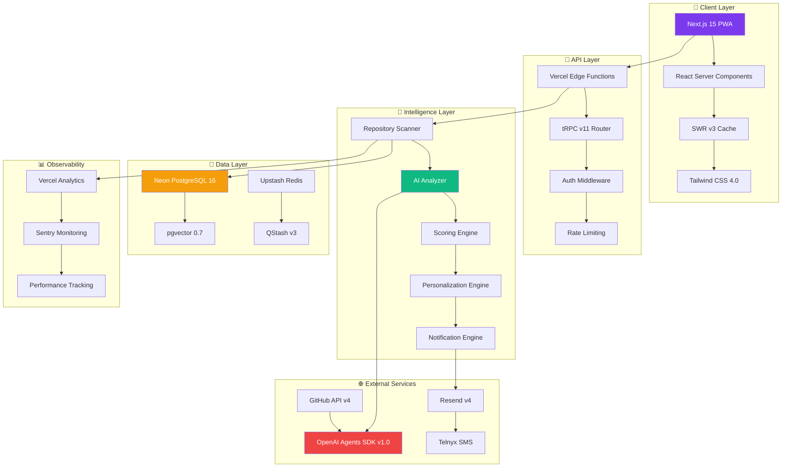
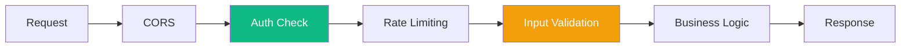
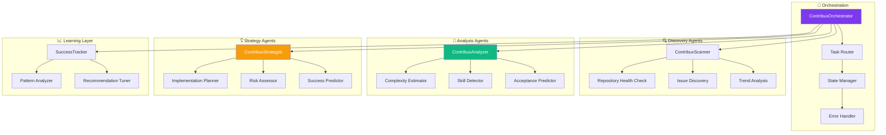
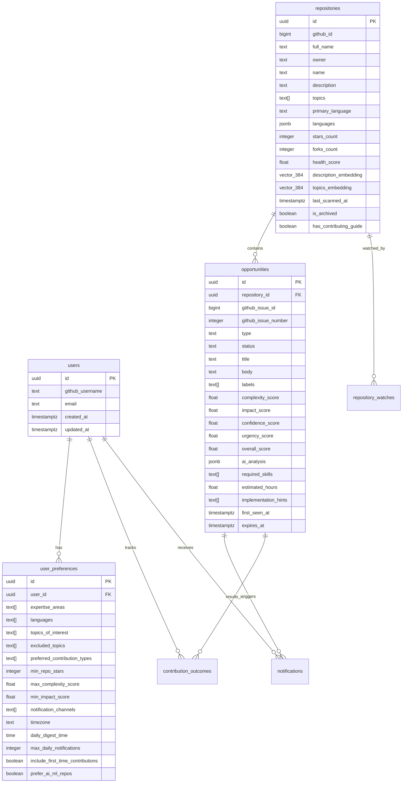
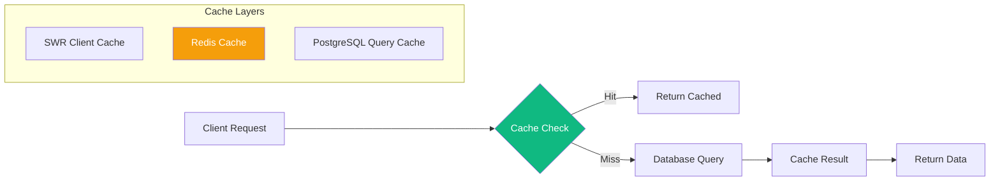
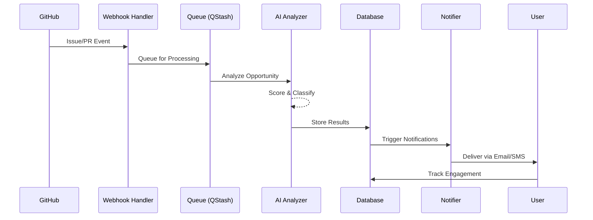
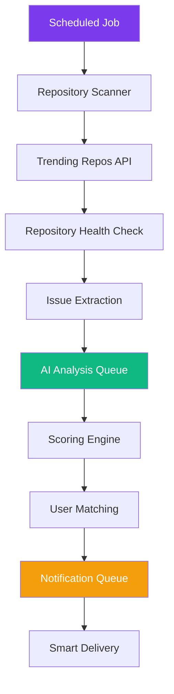
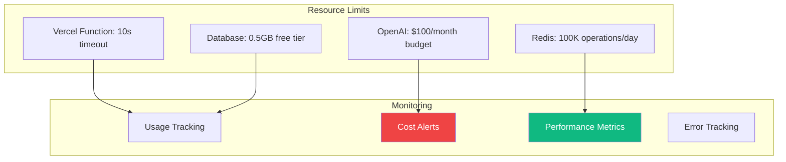
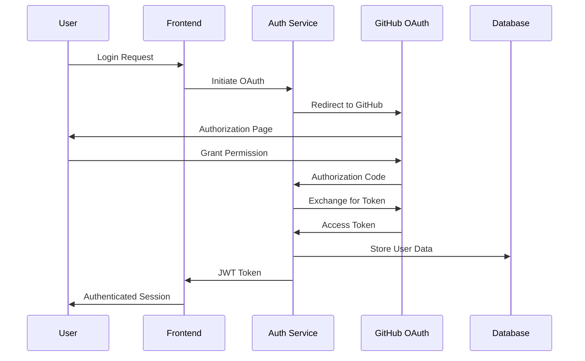
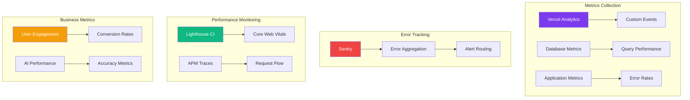

# System Design and Architecture

## Overview

contribux is an AI-powered GitHub contribution discovery platform built on a **serverless-first**, **AI-native** architecture designed for zero maintenance and ultra-low operating costs ($3-8/month). The system intelligently surfaces high-impact open source opportunities for senior developers transitioning to AI Engineering roles.

## Architecture Principles

### Core Design Principles

- **KISS (Keep It Simple, Stupid)**: Prefer straightforward solutions over clever abstractions
- **YAGNI (You Aren't Gonna Need It)**: Implement only what is explicitly needed
- **DRY (Don't Repeat Yourself)**: No duplicated logic; factor into clear helpers
- **Serverless-First**: Zero maintenance overhead with automatic scaling
- **AI-Native**: LLM-first architecture with fallback mechanisms
- **Edge-First Computing**: Leveraging Vercel Edge Functions for low latency
- **Event-Driven**: Using webhooks and real-time updates

### 2025 Modern Architecture Patterns

- **React Server Components**: For optimal performance and reduced client bundle size
- **Streaming Responses**: Real-time AI responses with incremental loading
- **Edge Rendering**: Using Vercel's edge runtime for global distribution
- **Incremental Static Regeneration**: For dashboard pages with dynamic content
- **Parallel Routes**: For complex UI states and improved UX

## High-Level Architecture



## Detailed Component Architecture

### 1. Client Layer

#### Next.js 15 Application

- **App Router**: File-based routing with enhanced layouts
- **React Server Components**: Server-side rendering with selective hydration
- **Progressive Web App**: Offline capability and mobile optimization
- **TypeScript 5.7+**: Strict type safety with path mapping

#### State Management

- **SWR v3**: Data fetching with intelligent caching and revalidation
- **React Context**: Global state for user preferences and authentication
- **URL State**: Search parameters and filters persisted in URL

#### Styling System

- **Tailwind CSS 4.0**: Utility-first styling with CSS-first configuration
- **shadcn/ui v2**: Component library with accessibility built-in
- **Responsive Design**: Mobile-first approach with progressive enhancement

### 2. API Layer

#### Edge Functions

- **Vercel Edge Runtime**: Global distribution with sub-50ms latency
- **tRPC v11**: End-to-end type safety with automatic API generation
- **Authentication**: JWT-based auth with refresh token rotation
- **Rate Limiting**: Per-user and per-endpoint protection

#### Middleware Stack



### 3. Intelligence Layer

#### AI Agent System



#### AI Processing Pipeline

1. **Data Ingestion**: GitHub API events and repository scanning
2. **Preprocessing**: Text cleaning, normalization, and enrichment
3. **Analysis**: Multi-agent processing with confidence scoring
4. **Scoring**: Weighted scoring across multiple dimensions
5. **Personalization**: User preference matching and ranking
6. **Delivery**: Smart notification with optimal timing

### 4. Data Layer

#### PostgreSQL Schema Design



#### Vector Search Implementation

- **Embedding Model**: OpenAI text-embedding-ada-002 (1536 dimensions)
- **Vector Index**: pgvector IVFFLAT with cosine similarity
- **Hybrid Search**: Combines vector similarity with traditional text search
- **Performance**: Sub-100ms query times with proper indexing

#### Caching Strategy



### 5. External Service Integration

#### GitHub API Integration

- **REST API v3**: Repository metadata and issue tracking
- **GraphQL API v4**: Efficient data fetching with custom queries
- **Webhooks**: Real-time updates for repository events
- **Rate Limiting**: Intelligent backoff with token pool management

#### OpenAI Integration

- **Agents SDK v1.0**: Multi-agent orchestration with TypeScript support
- **GPT-4o-mini**: Cost-effective model for analysis tasks
- **Embeddings API**: Semantic similarity for opportunity matching
- **Token Management**: Usage tracking and cost optimization

#### Communication Services

- **Resend**: Transactional email with template management
- **Telnyx**: SMS delivery for urgent notifications
- **Push Notifications**: Browser notifications for real-time updates

## Data Flow and Processing

### Real-time Processing Pipeline



### Batch Processing Workflow



## Performance and Scalability

### Performance Targets

| Metric              | Target | Critical Threshold | Measurement      |
| ------------------- | ------ | ------------------ | ---------------- |
| Initial Page Load   | <2s    | <3s                | Lighthouse CI    |
| API Response (p95)  | <500ms | <1s                | Vercel Analytics |
| Time to Interactive | <3s    | <5s                | Core Web Vitals  |
| Background Jobs     | <5min  | <10min             | Queue Metrics    |
| Database Queries    | <100ms | <500ms             | PostgreSQL Logs  |

### Scaling Strategy

#### Horizontal Scaling

- **Serverless Functions**: Auto-scaling based on demand
- **Database**: Neon's automatic read replicas and connection pooling
- **CDN**: Global edge distribution for static assets
- **Queue Processing**: Parallel job execution with QStash

#### Vertical Optimization

- **Bundle Splitting**: Lazy loading for non-critical components
- **Image Optimization**: WebP format with responsive sizing
- **Database Indexing**: Optimized queries with proper indexes
- **Caching**: Multi-layer caching strategy

### Resource Management



## Security Architecture

### Authentication Flow



### Security Layers

1. **Transport Security**

   - TLS 1.3 for all communications
   - HSTS headers for HTTPS enforcement
   - Certificate pinning for API calls

2. **Authentication & Authorization**

   - GitHub OAuth 2.0 with PKCE
   - JWT tokens with 15-minute expiry
   - Refresh token rotation
   - Role-based access control (future)

3. **Data Protection**

   - AES-256-GCM encryption for sensitive data
   - Token encryption at rest
   - PII minimization and anonymization
   - GDPR compliance with data deletion

4. **Input Validation**
   - Zod schemas for runtime type checking
   - SQL injection prevention with parameterized queries
   - XSS protection with CSP headers
   - Rate limiting and DDoS protection

## Monitoring and Observability

### Observability Stack



### Key Metrics Dashboard

#### Technical Metrics

- **Availability**: 99.9% uptime SLA
- **Response Time**: p95 < 500ms
- **Error Rate**: < 0.1%
- **Cache Hit Rate**: > 85%

#### Business Metrics

- **User Activation**: 80% within 7 days
- **Contribution Success**: 40% PR acceptance rate
- **Notification Relevance**: 80% useful rating
- **Cost per User**: < $0.50/month

#### AI Performance Metrics

- **Analysis Accuracy**: > 85%
- **Confidence Calibration**: Well-calibrated predictions
- **Processing Time**: < 30 seconds per opportunity
- **Token Efficiency**: Optimized prompt engineering

## Deployment and Infrastructure

### Deployment Pipeline


### Environment Strategy

| Environment     | Purpose           | Branch        | Database         | Features                |
| --------------- | ----------------- | ------------- | ---------------- | ----------------------- |
| **Development** | Local development | feature/\*    | Local PostgreSQL | Hot reload, debug tools |
| **Preview**     | PR previews       | pull requests | Neon branch      | Full feature testing    |
| **Staging**     | Pre-production    | develop       | Neon staging     | Production simulation   |
| **Production**  | Live system       | main          | Neon production  | Full monitoring         |

### Infrastructure as Code

```typescript
// Vercel deployment configuration
export default {
  name: "contribux",
  framework: "nextjs",
  buildCommand: "pnpm build",
  outputDirectory: ".next",
  installCommand: "pnpm install",
  devCommand: "pnpm dev",
  regions: ["iad1", "sfo1", "fra1"], // Multi-region deployment
  env: {
    NODE_ENV: "production",
    DATABASE_URL: "@database-url",
    OPENAI_API_KEY: "@openai-key",
    GITHUB_TOKEN: "@github-token",
  },
  functions: {
    "src/app/api/**/*.ts": {
      maxDuration: 30, // 30-second timeout for AI processing
    },
  },
};
```

## Future Architecture Considerations

### Planned Enhancements

1. **Microservices Evolution**

   - Agent service extraction for better scaling
   - Dedicated notification service
   - Analytics service separation

2. **Advanced AI Features**

   - Fine-tuned models for domain-specific analysis
   - Reinforcement learning from user feedback
   - Multi-modal analysis (code + documentation)

3. **Enterprise Features**

   - Team collaboration tools
   - Organization-level analytics
   - Custom deployment options

4. **Performance Optimizations**
   - GraphQL federation for complex queries
   - Event sourcing for audit trails
   - CQRS pattern for read/write separation

### Technology Evolution

- **React Server Components**: Continued adoption for better performance
- **Edge Computing**: Expanded use of edge functions and databases
- **AI Integration**: Deeper integration with emerging AI capabilities
- **WebAssembly**: Performance-critical computations in the browser

This architecture provides a solid foundation for the contribux platform while maintaining flexibility for future growth and evolution.
