# Developer Documentation

> Complete technical guide for contributing to contribux development and understanding the codebase.

## Documentation Map

```mermaid
graph LR
    A[⚡ Developer Documentation] --> B[🛠️ Setup & Development]
    A --> C[🤝 Contributing]
    A --> D[🧪 Testing & QA]
    A --> E[🏗️ Technical Guides]

    B --> B1[Local Environment]
    B --> B2[Database Setup]
    B --> B3[AI/ML Pipeline]

    C --> C1[Contribution Guide]
    C --> C2[Code Standards]
    C --> C3[PR Process]

    D --> D1[Testing Strategy]
    D --> D2[Test Writing]
    D --> D3[CI/CD Pipeline]

    E --> E1[Architecture Deep Dive]
    E --> E2[API Development]
    E --> E3[Database Design]
    E --> E4[Vector Search]
```



## Quick Navigation

### 🛠️ Setup & Development

> _Get your development environment running_

- **[Local Environment Setup](./setup/local-environment.md)** - Complete development setup
- **[Database Configuration](./setup/database-setup.md)** - Neon PostgreSQL with pgvector
- **[AI/ML Pipeline Setup](./setup/ai-ml-pipeline.md)** - OpenAI integration and embeddings

### 🤝 Contributing to contribux

> _How to contribute effectively_

- **[Contribution Guide](./contributing/contribution-guide.md)** - Getting started with contributions
- **[Code Standards](./contributing/code-standards.md)** - TypeScript, Biome, and quality standards
- **[Pull Request Process](./contributing/pr-process.md)** - From feature branch to merge

### 🧪 Testing & Quality Assurance

> _Comprehensive testing strategy_

- **[Testing Strategy](./testing/testing-strategy.md)** - TDD approach with Vitest
- **[Writing Tests](./testing/writing-tests.md)** - Best practices and patterns
- **[Security Scanning](./security-scanning.md)** - GitGuardian configuration and automated security scanning
- **[CI/CD Pipeline](./testing/ci-cd-pipeline.md)** - Automated testing and deployment

### 🏗️ Technical Deep Dives

> _Advanced technical topics_

- **[Architecture Overview](./technical/architecture-overview.md)** - System design and components
- **[API Development](./technical/api-development.md)** - Building and maintaining APIs
- **[Database Design](./technical/database-design.md)** - Schema, indexes, and performance
- **[Vector Search Implementation](./technical/vector-search.md)** - Semantic search with embeddings

## Technology Stack

### Core Technologies


### Development Tools

- **Package Manager**: pnpm 10.11.1 (strictly enforced)
- **Linting/Formatting**: Biome with strict TypeScript rules
- **Testing**: Vitest 3.2+ with V8 coverage provider
- **Type Safety**: Zod validation throughout
- **Database ORM**: Direct SQL with typed queries

## Development Workflow

### Essential Commands

```bash
# Development server
pnpm dev

# Code quality (run before commits)
pnpm lint && pnpm format && pnpm type-check

# Testing
pnpm test                    # Run all tests
pnpm test:watch             # Watch mode
pnpm test:coverage          # Coverage report

# Database operations
pnpm db:health              # Database health check
pnpm db:performance-report  # Performance monitoring
pnpm db:vector-metrics      # Vector search metrics
```

### Git Workflow

- **Main branch**: `main` (production)
- **Feature branches**: `feat/description`
- **Current branch**: `feat/task-3-github-api-client`
- **Commits**: Conventional commit format required

## Code Quality Standards

### TypeScript Configuration

- Strict mode enabled with comprehensive type checking
- Path mapping: Use `@/*` for src/ imports
- Additional strictness: noUncheckedIndexedAccess, exactOptionalPropertyTypes

### Testing Standards

- **TDD Approach**: Test-first development with Vitest
- **Coverage Target**: 90%+ through meaningful tests
- **Test Organization**: Feature-based, realistic scenarios
- **Modern Patterns**: MSW 2.x for HTTP mocking

### Database Standards

- **Vector Operations**: halfvec(1536) embeddings for semantic similarity
- **Performance**: HNSW indexes for efficient vector search
- **Monitoring**: Comprehensive performance tracking
- **Branch Strategy**: Environment-specific DATABASE_URL

---

## Getting Help

- 📋 Check [project issues](../../issues) for known problems
- 🏗️ Review [architecture documentation](../architecture/README.md)
- 📡 Reference [API documentation](../api/README.md)
- 🔧 See [operator documentation](../operators/README.md) for deployment

---

_Developer documentation maintained by the contribux development team. Always use latest development practices._

<!-- AI Context Tags: developer-documentation, technical-setup, contributing, testing-strategy, typescript, nextjs, postgresql -->
