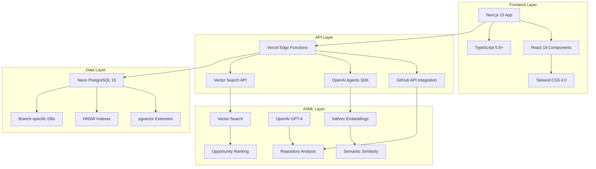
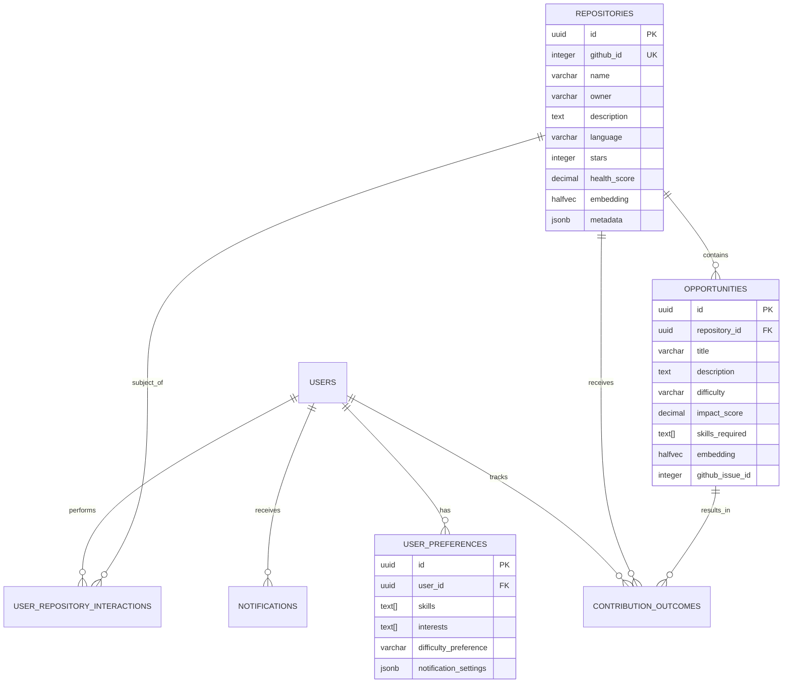

# Architecture Reference

Comprehensive technical architecture and design decisions for the contribux platform.

## System Overview

contribux is a serverless-first, AI-native platform designed for zero maintenance and ultra-low costs while providing intelligent GitHub contribution discovery for senior developers.



## Technology Stack

### Frontend Technologies

#### **Next.js 15 with App Router**

- Server and client components
- Streaming and progressive enhancement
- Automatic code splitting
- Built-in performance optimizations

#### **React 19**

- Latest features and performance improvements
- Concurrent rendering capabilities
- Enhanced developer experience

#### **TypeScript 5.8+**

- Strict mode enabled with comprehensive type checking
- Advanced type features and performance improvements
- Full IDE integration and autocomplete

#### **Tailwind CSS 4.0+**

- Utility-first CSS framework
- JIT compilation for optimal bundle sizes
- Consistent design system

### Backend Architecture

#### **Serverless Edge Functions (Vercel)**

```typescript
// Example Edge Function structure
export const runtime = "edge";

export default async function handler(req: NextRequest) {
  // Ultra-fast edge execution
  // Global distribution
  // Zero cold starts for most requests
}
```

#### **Database Architecture (Neon PostgreSQL 16)**

- Serverless PostgreSQL with automatic scaling
- Branch-based development (dev/test/prod databases)
- Built-in connection pooling and optimization

#### **Vector Search (pgvector)**

```sql
-- halfvec(1536) for memory efficiency
CREATE TABLE repositories (
  id UUID PRIMARY KEY,
  embedding halfvec(1536),
  -- Other fields
);

-- HNSW indexes for fast similarity search
CREATE INDEX idx_repositories_embedding
ON repositories USING hnsw (embedding vector_cosine_ops);
```

### AI/ML Integration

#### **OpenAI Agents SDK**

```typescript
import { Agent } from "@openai/agents-sdk";

const repositoryAnalyzer = new Agent({
  model: "gpt-4-turbo",
  tools: ["github-api", "vector-search"],
  systemPrompt: "Analyze repositories for contribution opportunities...",
});
```

#### **Vector Embeddings**

- **Model**: text-embedding-3-small
- **Dimensions**: 1536 (using halfvec for 50% memory reduction)
- **Use cases**: Repository similarity, opportunity matching, skill alignment

#### **Hybrid Search Strategy**

```sql
-- Combine text search with vector similarity
SELECT
  r.*,
  ts_rank(search_vector, query) as text_score,
  (1 - (embedding <=> query_embedding)) as similarity_score,
  (text_score * 0.3 + similarity_score * 0.7) as combined_score
FROM repositories r
WHERE search_vector @@ query
  OR (1 - (embedding <=> query_embedding)) > 0.7
ORDER BY combined_score DESC;
```

## Core Architecture Patterns

### Result Pattern for Error Handling

```typescript
// lib/utils/result.ts
export type Result<T, E = Error> =
  | { success: true; data: T }
  | { success: false; error: E };

// Usage throughout the application
export const fetchRepository = async (
  id: string
): Promise<Result<Repository>> => {
  try {
    const data = await githubClient.getRepository(id);
    const repository = RepositorySchema.parse(data);
    return { success: true, data: repository };
  } catch (error) {
    return { success: false, error: error as Error };
  }
};
```

### Schema-First Development with Zod

```typescript
// types/repository.ts
import { z } from "zod";

export const RepositorySchema = z.object({
  id: z.string().uuid(),
  github_id: z.number().int().positive(),
  name: z.string().min(1).max(255),
  owner: z.string().min(1).max(255),
  description: z.string().optional(),
  language: z.string().optional(),
  stars: z.number().int().min(0),
  health_score: z.number().min(0).max(1).optional(),
  embedding: z.array(z.number()).length(1536).optional(),
  created_at: z.date(),
  updated_at: z.date(),
});

export type Repository = z.infer<typeof RepositorySchema>;

// Runtime validation at API boundaries
export const validateRepository = (data: unknown): Repository => {
  return RepositorySchema.parse(data);
};
```

### Layered Architecture

```text
src/
├── app/                    # Next.js App Router (Presentation Layer)
│   ├── api/               # API routes
│   ├── (auth)/            # Route groups
│   └── dashboard/         # Page components
├── components/            # UI Components
│   ├── features/         # Feature-specific components
│   └── ui/               # Reusable UI primitives
├── lib/                  # Business Logic Layer
│   ├── services/         # Domain services
│   ├── db/               # Data access layer
│   ├── github/           # External API integration
│   └── ai/               # AI/ML services
├── hooks/                # Custom React hooks
├── context/              # React context providers
└── types/                # TypeScript type definitions
```

## Data Architecture

### Database Schema Design

#### **Core Entity Relationships**



#### **Vector Search Optimization**

```sql
-- Optimized indexes for different query patterns
CREATE INDEX idx_repositories_embedding
ON repositories USING hnsw (embedding vector_cosine_ops);

CREATE INDEX idx_opportunities_embedding
ON opportunities USING hnsw (embedding vector_cosine_ops);

-- Composite indexes for filtered searches
CREATE INDEX idx_repositories_filtered
ON repositories (language, stars)
INCLUDE (embedding, health_score);

-- Text search indexes
CREATE INDEX idx_repositories_search
ON repositories USING gin(to_tsvector('english', name || ' ' || description));
```

### Database Connection Strategy

#### **Environment-Specific Branches**

```typescript
// lib/db/client.ts
export const getDatabaseUrl = (
  env: "prod" | "dev" | "test" = "prod"
): string => {
  const urls = {
    prod: process.env.DATABASE_URL,
    dev: process.env.DATABASE_URL_DEV,
    test: process.env.DATABASE_URL_TEST,
  };

  return urls[env] || urls.prod;
};

export const createDatabasePool = (environment?: string) => {
  return new Pool({
    connectionString: getDatabaseUrl(environment as any),
    max: 20,
    idleTimeoutMillis: 30000,
    connectionTimeoutMillis: 5000,
  });
};
```

#### **Query Optimization Patterns**

```typescript
// lib/db/queries.ts
export class RepositoryQueries {
  constructor(private pool: Pool) {}

  async searchSimilar(
    embedding: number[],
    options: SearchOptions = {}
  ): Promise<Repository[]> {
    const { threshold = 0.7, limit = 10, language, minStars = 0 } = options;

    const query = `
      SELECT r.*, 
             (1 - (r.embedding <=> $1)) as similarity_score
      FROM repositories r
      WHERE (1 - (r.embedding <=> $1)) >= $2
        AND ($3::varchar IS NULL OR r.language = $3)
        AND r.stars >= $4
      ORDER BY r.embedding <=> $1
      LIMIT $5
    `;

    const result = await this.pool.query(query, [
      JSON.stringify(embedding),
      threshold,
      language,
      minStars,
      limit,
    ]);

    return result.rows.map((row) => RepositorySchema.parse(row));
  }
}
```

## API Architecture

### RESTful API Design

#### **Consistent Response Format**

```typescript
// lib/api/response.ts
export interface ApiResponse<T> {
  success: boolean;
  data?: T;
  error?: {
    code: string;
    message: string;
    details?: unknown;
  };
  meta?: {
    pagination?: PaginationMeta;
    timing?: number;
    version?: string;
  };
}

export const createApiResponse = <T>(
  result: Result<T>,
  meta?: ApiResponse<T>["meta"]
): ApiResponse<T> => {
  if (result.success) {
    return {
      success: true,
      data: result.data,
      meta,
    };
  }

  return {
    success: false,
    error: {
      code: result.error.code || "UNKNOWN_ERROR",
      message: result.error.message,
      details: result.error.details,
    },
    meta,
  };
};
```

#### **Rate Limiting and Caching**

```typescript
// lib/api/middleware.ts
export const withRateLimit = (handler: ApiHandler, limits: RateLimitConfig) => {
  return async (req: NextRequest) => {
    const identifier = getClientIdentifier(req);
    const key = `rate_limit:${identifier}`;

    const current = await redis.get(key);
    if (current && parseInt(current) >= limits.requests) {
      return new Response("Rate limit exceeded", { status: 429 });
    }

    await redis.incr(key);
    await redis.expire(key, limits.window);

    return handler(req);
  };
};

export const withCache = (handler: ApiHandler, ttl: number) => {
  return async (req: NextRequest) => {
    const cacheKey = getCacheKey(req);
    const cached = await redis.get(cacheKey);

    if (cached) {
      return new Response(cached, {
        headers: { "Content-Type": "application/json" },
      });
    }

    const response = await handler(req);
    const data = await response.text();

    await redis.setex(cacheKey, ttl, data);
    return new Response(data, response);
  };
};
```

### GitHub API Integration

#### **Client Architecture**

```typescript
// lib/github/client.ts
export class GitHubClient {
  constructor(
    private config: GitHubConfig,
    private rateLimiter: RateLimiter,
    private cache: CacheManager
  ) {}

  async searchRepositories(query: SearchQuery): Promise<Result<Repository[]>> {
    // Check rate limits
    if (!(await this.rateLimiter.canMakeRequest())) {
      return {
        success: false,
        error: new Error("Rate limit exceeded"),
      };
    }

    // Check cache
    const cacheKey = `search:${JSON.stringify(query)}`;
    const cached = await this.cache.get<Repository[]>(cacheKey);
    if (cached) {
      return { success: true, data: cached };
    }

    try {
      const response = await this.makeRequest("/search/repositories", {
        q: this.buildQuery(query),
        sort: query.sort || "stars",
        order: query.order || "desc",
        per_page: query.limit || 30,
      });

      const repositories = response.items.map((item) =>
        this.transformRepository(item)
      );

      // Cache results
      await this.cache.set(cacheKey, repositories, 300); // 5 minutes

      return { success: true, data: repositories };
    } catch (error) {
      return { success: false, error: error as Error };
    }
  }

  private async makeRequest(endpoint: string, params: Record<string, any>) {
    // Implementation with retry logic, exponential backoff
    // Error handling, response validation
  }
}
```

#### **Rate Limiting Strategy**

```typescript
// lib/github/rate-limiter.ts
export class GitHubRateLimiter {
  private requests: RequestWindow[] = [];
  private readonly maxRequests = 5000; // GitHub API limit
  private readonly windowMs = 60 * 60 * 1000; // 1 hour

  async canMakeRequest(): Promise<boolean> {
    await this.cleanup();
    return this.requests.length < this.maxRequests;
  }

  async recordRequest(): Promise<void> {
    this.requests.push({
      timestamp: Date.now(),
      endpoint: "api.github.com",
    });
  }

  private async cleanup(): Promise<void> {
    const cutoff = Date.now() - this.windowMs;
    this.requests = this.requests.filter((req) => req.timestamp > cutoff);
  }

  async waitForAvailability(): Promise<void> {
    if (await this.canMakeRequest()) return;

    const oldestRequest = this.requests[0];
    const waitTime = oldestRequest.timestamp + this.windowMs - Date.now();

    if (waitTime > 0) {
      await new Promise((resolve) => setTimeout(resolve, waitTime));
    }
  }
}
```

## AI/ML Architecture

### Vector Embedding Pipeline

#### **Embedding Generation**

```typescript
// lib/ai/embeddings.ts
export class EmbeddingService {
  constructor(private openai: OpenAI, private cache: CacheManager) {}

  async generateEmbedding(text: string): Promise<Result<number[]>> {
    // Check cache first
    const cacheKey = `embedding:${this.hashText(text)}`;
    const cached = await this.cache.get<number[]>(cacheKey);
    if (cached) {
      return { success: true, data: cached };
    }

    try {
      const response = await this.openai.embeddings.create({
        model: "text-embedding-3-small",
        input: this.preprocessText(text),
        dimensions: 1536,
      });

      const embedding = response.data[0].embedding;

      // Cache for 24 hours
      await this.cache.set(cacheKey, embedding, 86400);

      return { success: true, data: embedding };
    } catch (error) {
      return { success: false, error: error as Error };
    }
  }

  private preprocessText(text: string): string {
    // Text preprocessing for optimal embeddings
    return text
      .toLowerCase()
      .replace(/[^\w\s]/g, " ")
      .replace(/\s+/g, " ")
      .trim()
      .slice(0, 8000); // OpenAI token limit
  }

  async batchGenerateEmbeddings(texts: string[]): Promise<Result<number[][]>> {
    // Batch processing for efficiency
    const batchSize = 100;
    const results: number[][] = [];

    for (let i = 0; i < texts.length; i += batchSize) {
      const batch = texts.slice(i, i + batchSize);

      try {
        const response = await this.openai.embeddings.create({
          model: "text-embedding-3-small",
          input: batch.map((text) => this.preprocessText(text)),
          dimensions: 1536,
        });

        results.push(...response.data.map((item) => item.embedding));
      } catch (error) {
        return { success: false, error: error as Error };
      }
    }

    return { success: true, data: results };
  }
}
```

### Opportunity Ranking Algorithm

#### **Multi-factor Scoring**

```typescript
// lib/ai/ranking.ts
export class OpportunityRanker {
  async rankOpportunities(
    opportunities: Opportunity[],
    userProfile: UserProfile,
    context: RankingContext
  ): Promise<RankedOpportunity[]> {
    const rankedOpportunities = await Promise.all(
      opportunities.map(async (opportunity) => {
        const scores = await this.calculateScores(
          opportunity,
          userProfile,
          context
        );
        const finalScore = this.combineScores(scores);

        return {
          ...opportunity,
          scores,
          finalScore,
          rank: 0, // Will be set after sorting
        };
      })
    );

    // Sort by final score and assign ranks
    rankedOpportunities.sort((a, b) => b.finalScore - a.finalScore);
    rankedOpportunities.forEach((opp, index) => {
      opp.rank = index + 1;
    });

    return rankedOpportunities;
  }

  private async calculateScores(
    opportunity: Opportunity,
    userProfile: UserProfile,
    context: RankingContext
  ): Promise<OpportunityScores> {
    const [
      skillMatch,
      difficultyMatch,
      impactScore,
      popularityScore,
      freshnessScore,
      diversityScore,
    ] = await Promise.all([
      this.calculateSkillMatch(opportunity, userProfile),
      this.calculateDifficultyMatch(opportunity, userProfile),
      this.calculateImpactScore(opportunity),
      this.calculatePopularityScore(opportunity),
      this.calculateFreshnessScore(opportunity),
      this.calculateDiversityScore(opportunity, context.recentOpportunities),
    ]);

    return {
      skillMatch,
      difficultyMatch,
      impactScore,
      popularityScore,
      freshnessScore,
      diversityScore,
    };
  }

  private combineScores(scores: OpportunityScores): number {
    // Weighted combination of individual scores
    const weights = {
      skillMatch: 0.3, // 30% - Most important
      difficultyMatch: 0.2, // 20% - Skill level fit
      impactScore: 0.2, // 20% - Project impact
      popularityScore: 0.1, // 10% - Community interest
      freshnessScore: 0.1, // 10% - Recent activity
      diversityScore: 0.1, // 10% - Variety bonus
    };

    return Object.entries(weights).reduce((total, [key, weight]) => {
      return total + scores[key as keyof OpportunityScores] * weight;
    }, 0);
  }
}
```

## Performance Architecture

### Caching Strategy

#### **Multi-layer Caching**

```typescript
// lib/cache/manager.ts
export class CacheManager {
  constructor(
    private redis: Redis,
    private memory: MemoryCache,
    private cdn: CDNCache
  ) {}

  async get<T>(key: string): Promise<T | null> {
    // L1: Memory cache (fastest)
    const memoryResult = this.memory.get<T>(key);
    if (memoryResult) return memoryResult;

    // L2: Redis cache (fast)
    const redisResult = await this.redis.get(key);
    if (redisResult) {
      const parsed = JSON.parse(redisResult) as T;
      this.memory.set(key, parsed, 60); // Cache in memory for 1 minute
      return parsed;
    }

    return null;
  }

  async set<T>(key: string, value: T, ttl: number): Promise<void> {
    // Store in all layers
    this.memory.set(key, value, Math.min(ttl, 300)); // Max 5 minutes in memory
    await this.redis.setex(key, ttl, JSON.stringify(value));
  }

  async invalidate(pattern: string): Promise<void> {
    // Invalidate across all layers
    this.memory.invalidatePattern(pattern);
    const keys = await this.redis.keys(pattern);
    if (keys.length > 0) {
      await this.redis.del(...keys);
    }
  }
}
```

### Database Performance

#### **Query Optimization**

```sql
-- Optimized similarity search with pre-filtering
CREATE OR REPLACE FUNCTION fast_similarity_search(
  query_embedding halfvec(1536),
  filters jsonb DEFAULT '{}',
  similarity_threshold decimal DEFAULT 0.7,
  result_limit integer DEFAULT 20
)
RETURNS TABLE (
  id uuid,
  name varchar,
  similarity_score decimal,
  metadata jsonb
) AS $$
DECLARE
  language_filter varchar;
  min_stars integer;
BEGIN
  -- Extract filters
  language_filter := filters->>'language';
  min_stars := COALESCE((filters->>'min_stars')::integer, 0);

  RETURN QUERY
  SELECT
    r.id,
    r.name,
    (1 - (r.embedding <=> query_embedding)) as similarity_score,
    r.metadata
  FROM repositories r
  WHERE
    -- Pre-filter before expensive similarity calculation
    (language_filter IS NULL OR r.language = language_filter)
    AND r.stars >= min_stars
    AND r.embedding IS NOT NULL
    -- Then apply similarity threshold
    AND (1 - (r.embedding <=> query_embedding)) >= similarity_threshold
  ORDER BY r.embedding <=> query_embedding
  LIMIT result_limit;
END;
$$ LANGUAGE plpgsql;
```

#### **Connection Pooling**

```typescript
// lib/db/pool.ts
export class DatabasePool {
  private pools: Map<string, Pool> = new Map();

  getPool(environment: string = "prod"): Pool {
    if (!this.pools.has(environment)) {
      const pool = new Pool({
        connectionString: getDatabaseUrl(environment as any),
        max: 20,
        min: 5,
        idleTimeoutMillis: 30000,
        connectionTimeoutMillis: 5000,
        acquireTimeoutMillis: 60000,

        // Neon-specific optimizations
        keepAlive: true,
        keepAliveInitialDelayMillis: 10000,
      });

      // Monitor pool health
      pool.on("error", (err) => {
        console.error("Database pool error:", err);
      });

      this.pools.set(environment, pool);
    }

    return this.pools.get(environment)!;
  }

  async closeAll(): Promise<void> {
    for (const [env, pool] of this.pools) {
      await pool.end();
      console.log(`Closed database pool for ${env}`);
    }
    this.pools.clear();
  }
}
```

## Security Architecture

### Authentication and Authorization

#### **JWT-based Authentication**

```typescript
// lib/auth/jwt.ts
export class JWTManager {
  constructor(private config: JWTConfig) {}

  async createToken(payload: TokenPayload): Promise<string> {
    return jwt.sign(
      {
        ...payload,
        iat: Math.floor(Date.now() / 1000),
        exp: Math.floor(Date.now() / 1000) + this.config.expiresIn,
      },
      this.config.secret,
      { algorithm: "HS256" }
    );
  }

  async verifyToken(token: string): Promise<Result<TokenPayload>> {
    try {
      const decoded = jwt.verify(token, this.config.secret) as TokenPayload;
      return { success: true, data: decoded };
    } catch (error) {
      return { success: false, error: error as Error };
    }
  }

  async refreshToken(token: string): Promise<Result<string>> {
    const verification = await this.verifyToken(token);
    if (!verification.success) {
      return verification;
    }

    // Check if token is eligible for refresh (not expired more than grace period)
    const gracePeriod = 60 * 60; // 1 hour
    const now = Math.floor(Date.now() / 1000);

    if (verification.data.exp + gracePeriod < now) {
      return {
        success: false,
        error: new Error("Token too old to refresh"),
      };
    }

    const newToken = await this.createToken({
      userId: verification.data.userId,
      email: verification.data.email,
    });

    return { success: true, data: newToken };
  }
}
```

### Data Protection

#### **Row Level Security**

```sql
-- Enable RLS on sensitive tables
ALTER TABLE user_preferences ENABLE ROW LEVEL SECURITY;
ALTER TABLE notifications ENABLE ROW LEVEL SECURITY;
ALTER TABLE contribution_outcomes ENABLE ROW LEVEL SECURITY;

-- Create policies for user data access
CREATE POLICY user_preferences_policy ON user_preferences
  FOR ALL TO authenticated_user
  USING (user_id = current_setting('app.current_user_id')::uuid);

CREATE POLICY notifications_policy ON notifications
  FOR ALL TO authenticated_user
  USING (user_id = current_setting('app.current_user_id')::uuid);

-- Admin access policy
CREATE POLICY admin_access_policy ON user_preferences
  FOR ALL TO admin_user
  USING (true);
```

#### **Input Validation and Sanitization**

```typescript
// lib/validation/sanitizer.ts
export class InputSanitizer {
  static sanitizeHtml(input: string): string {
    return DOMPurify.sanitize(input, {
      ALLOWED_TAGS: ["b", "i", "em", "strong", "a", "p", "br"],
      ALLOWED_ATTR: ["href"],
    });
  }

  static sanitizeSearchQuery(query: string): string {
    return query
      .replace(/[<>]/g, "") // Remove potential XSS
      .replace(/[;'"`]/g, "") // Remove SQL injection attempts
      .trim()
      .slice(0, 500); // Limit length
  }

  static validateAndSanitizeRepository(data: unknown): Result<Repository> {
    try {
      // First validate with Zod
      const validated = RepositorySchema.parse(data);

      // Then sanitize string fields
      return {
        success: true,
        data: {
          ...validated,
          name: this.sanitizeText(validated.name),
          description: validated.description
            ? this.sanitizeHtml(validated.description)
            : undefined,
        },
      };
    } catch (error) {
      return { success: false, error: error as Error };
    }
  }

  private static sanitizeText(text: string): string {
    return text.replace(/[<>]/g, "").trim().slice(0, 1000);
  }
}
```

## Monitoring and Observability

### Performance Monitoring

#### **Database Performance Tracking**

```typescript
// lib/monitoring/database.ts
export class DatabaseMonitor {
  constructor(private pool: Pool) {}

  async collectMetrics(): Promise<DatabaseMetrics> {
    const [slowQueries, connectionStats, indexUsage, vectorMetrics] =
      await Promise.all([
        this.getSlowQueries(),
        this.getConnectionStats(),
        this.getIndexUsage(),
        this.getVectorSearchMetrics(),
      ]);

    return {
      slowQueries,
      connectionStats,
      indexUsage,
      vectorMetrics,
      timestamp: new Date(),
    };
  }

  private async getSlowQueries(): Promise<SlowQuery[]> {
    const result = await this.pool.query(`
      SELECT 
        query,
        calls,
        mean_time,
        total_time,
        (mean_time / calls) as avg_time
      FROM pg_stat_statements 
      WHERE mean_time > 100
      ORDER BY mean_time DESC 
      LIMIT 10
    `);

    return result.rows;
  }

  private async getVectorSearchMetrics(): Promise<VectorMetrics> {
    const result = await this.pool.query(`
      SELECT 
        COUNT(*) as total_vectors,
        COUNT(*) FILTER (WHERE embedding IS NOT NULL) as vectors_with_data,
        AVG(array_length(embedding, 1)) as avg_dimensions
      FROM repositories
    `);

    return result.rows[0];
  }
}
```

This architecture provides a solid foundation for building a scalable, maintainable, and high-performance AI-powered platform while following modern development best practices.
