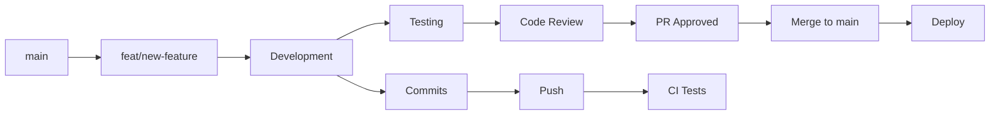
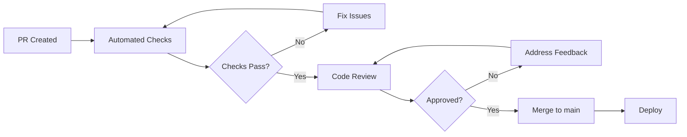
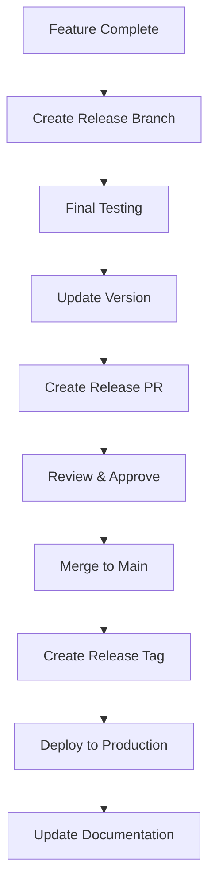

# Git Workflow Standards

This document outlines the Git workflow, branching strategy, and commit conventions for the contribux project.

## Branching Strategy

### Branch Types

- **`main`** - Production-ready code, protected branch
- **`feat/description`** - Feature development branches
- **`fix/description`** - Bug fix branches
- **`chore/description`** - Maintenance and tooling updates
- **`docs/description`** - Documentation updates

### Branch Naming Conventions

```bash
# Feature branches
feat/github-api-integration
feat/user-authentication
feat/vector-search-optimization

# Bug fixes
fix/database-connection-timeout
fix/memory-leak-in-search

# Maintenance
chore/update-dependencies
chore/improve-build-performance

# Documentation
docs/api-reference-update
docs/deployment-guide
```

### Branch Lifecycle



## Commit Message Conventions

### Format

Use [Conventional Commits](https://www.conventionalcommits.org/) format:

```text
<type>(<scope>): <description>

[optional body]

[optional footer(s)]
```

### Commit Types

- **feat**: New feature for the user
- **fix**: Bug fix for the user
- **docs**: Documentation changes
- **style**: Formatting, missing semicolons, etc.
- **refactor**: Code refactoring without feature changes
- **test**: Adding or modifying tests
- **chore**: Maintenance tasks, dependency updates
- **perf**: Performance improvements
- **ci**: CI/CD configuration changes

### Examples

```bash
# Feature commits
feat(auth): add JWT token authentication
feat(search): implement vector similarity search
feat(api): add GitHub repository analysis endpoint

# Bug fixes
fix(db): resolve connection pool exhaustion
fix(ui): fix responsive layout on mobile devices
fix(search): handle empty query results gracefully

# Documentation
docs(api): update authentication endpoints
docs(setup): add development environment guide

# Refactoring
refactor(db): extract query builders to separate module
refactor(types): consolidate user interface definitions

# Performance
perf(search): optimize vector indexing queries
perf(api): add response caching for repository data

# Tests
test(auth): add comprehensive JWT validation tests
test(search): add vector search integration tests
```

### Commit Message Best Practices

1. **Use imperative mood**: "add feature" not "added feature"
2. **Limit subject line**: 50 characters or less
3. **Separate subject and body**: Use blank line between them
4. **Explain what and why**: Not just what changed, but why
5. **Reference issues**: Use "Closes #123" for issue tracking

```bash
# Good commit message
feat(search): implement semantic similarity scoring

Add vector embedding similarity calculation for repository
matching. Uses cosine similarity with halfvec(1536) embeddings
to improve recommendation quality for senior developers.

- Add similarity calculation functions
- Integrate with existing search pipeline
- Add performance monitoring for vector operations

Closes #45
```

## Pull Request Workflow

### Creating Pull Requests

1. **Create feature branch** from `main`
2. **Implement changes** with comprehensive tests
3. **Run quality checks** before pushing
4. **Push branch** and create pull request
5. **Request review** from team members

```bash
# Quality checks before PR
pnpm lint && pnpm lint:fix
pnpm format
pnpm type-check
pnpm test
pnpm test:coverage
```

### Pull Request Template

```markdown
## Description

Brief description of changes and motivation.

## Changes Made

- [ ] Feature implementation
- [ ] Tests added/updated
- [ ] Documentation updated
- [ ] Database migrations (if applicable)

## Testing

- [ ] Unit tests pass
- [ ] Integration tests pass
- [ ] Manual testing completed
- [ ] Performance impact assessed

## Database Changes

- [ ] No database changes
- [ ] Schema migrations included
- [ ] Data migrations included
- [ ] Backward compatibility maintained

## Checklist

- [ ] Code follows project standards
- [ ] Tests achieve 90%+ coverage
- [ ] Documentation updated
- [ ] No breaking changes
- [ ] Performance impact minimal
```

### Review Process



### Review Criteria

Reviewers should check:

- **Code quality**: Follows standards and best practices
- **Test coverage**: Comprehensive test scenarios
- **Performance**: No significant performance regressions
- **Security**: No security vulnerabilities introduced
- **Documentation**: Adequate documentation for changes
- **Breaking changes**: Identified and properly handled

## Merge Strategies

### Squash and Merge (Preferred)

- **Use for**: Feature branches with multiple commits
- **Benefits**: Clean commit history, single commit per feature
- **Format**: Combine all commits into single, well-formatted commit

```bash
# Before squash merge
feat(auth): wip authentication
feat(auth): fix tests
feat(auth): address review comments
feat(auth): final cleanup

# After squash merge
feat(auth): implement JWT token authentication

Complete JWT-based authentication system with token validation,
refresh mechanism, and comprehensive test coverage.
```

### Merge Commit

- **Use for**: Release branches or complex integrations
- **Benefits**: Preserves commit history and branch structure
- **When**: Multiple related features or hotfixes

### Rebase and Merge

- **Use for**: Simple, clean commits that don't need squashing
- **Benefits**: Linear history without merge commits
- **When**: Single commit or already clean commit history

## Protected Branch Rules

### Main Branch Protection

- **Require pull request reviews**: Minimum 1 reviewer
- **Require status checks**: All CI tests must pass
- **Require up-to-date branches**: Must be current with main
- **Require signed commits**: For security (optional)
- **Restrict pushes**: Only through pull requests

### Status Checks Required

```yaml
# Required CI checks
- Build and Test
- TypeScript Compilation
- Linting (Biome)
- Test Coverage (90%+)
- Database Tests
- Security Scan
```

## Release Workflow

### Version Tagging

Use semantic versioning (SemVer):

```bash
# Major version (breaking changes)
git tag v2.0.0

# Minor version (new features)
git tag v1.1.0

# Patch version (bug fixes)
git tag v1.0.1
```

### Release Process



### Release Notes

```markdown
# Release v1.1.0

## New Features

- feat(search): semantic similarity search with vector embeddings
- feat(auth): JWT-based authentication system
- feat(api): GitHub repository analysis endpoints

## Bug Fixes

- fix(db): resolve connection pool exhaustion under load
- fix(ui): responsive layout issues on mobile devices

## Performance Improvements

- perf(search): optimize vector indexing queries (50% faster)
- perf(api): add response caching for repository data

## Breaking Changes

- BREAKING: Updated API response format for /api/opportunities
  - Migration guide: docs/migrations/v1.1.0.md

## Database Migrations

- Add vector search indexes
- Update user preferences schema
```

## Hotfix Workflow

### Emergency Fixes

```bash
# Create hotfix from main
git checkout main
git pull origin main
git checkout -b fix/critical-security-issue

# Make minimal fix
# Test thoroughly
# Create PR with expedited review

# Merge to main and tag
git tag v1.0.2-hotfix
```

### Hotfix Criteria

Apply hotfix process for:

- **Security vulnerabilities**
- **Critical production bugs**
- **Data corruption issues**
- **Service outages**

## Best Practices

### Commit Frequency

- **Commit often**: Small, logical chunks
- **Atomic commits**: Each commit should be self-contained
- **Test before commit**: Ensure tests pass for each commit

### Branch Management

```bash
# Keep branches up to date
git checkout feat/my-feature
git rebase main

# Clean up after merge
git branch -d feat/my-feature
git push origin --delete feat/my-feature
```

### Collaboration

- **Pull before push**: Always pull latest changes
- **Communicate changes**: Notify team of breaking changes
- **Review thoroughly**: Take time for thoughtful code review
- **Respect feedback**: Address review comments constructively

## Troubleshooting

### Common Issues

```bash
# Resolve merge conflicts
git checkout feat/my-feature
git rebase main
# Resolve conflicts manually
git add .
git rebase --continue

# Reset to clean state
git reset --hard HEAD~1  # Remove last commit
git clean -fd             # Remove untracked files

# Update branch with latest main
git checkout feat/my-feature
git fetch origin
git rebase origin/main
```

### Git Hooks

Set up pre-commit hooks for quality checks:

```bash
# .git/hooks/pre-commit
#!/bin/sh
pnpm lint
pnpm type-check
pnpm test
```

## Security Considerations

### Sensitive Data

- **Never commit secrets**: Use .env.local and .gitignore
- **Scan commits**: Use tools to detect secrets in history
- **Rotate exposed keys**: Immediately rotate any committed secrets

### Signed Commits

```bash
# Configure GPG signing
git config --global user.signingkey YOUR_GPG_KEY
git config --global commit.gpgsign true

# Verify signatures
git log --show-signature
```
