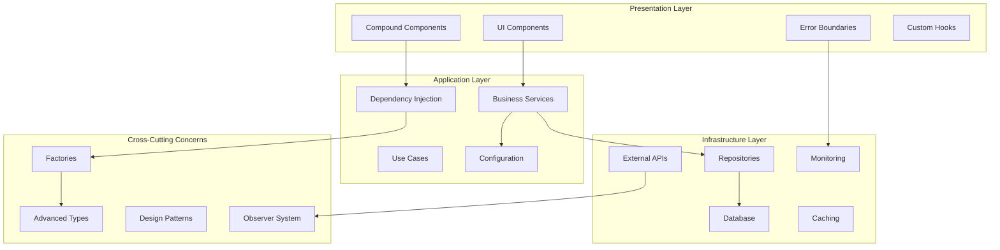

# Enhanced Architecture Guide

This document describes the advanced architectural patterns implemented in the Contribux project, following Clean Architecture principles and modern TypeScript best practices.

## Architecture Overview

The Contribux architecture has been enhanced with advanced design patterns to improve maintainability, testability, and scalability while keeping complexity low (KISS principle).



## 1. Advanced TypeScript Patterns

### Location: `src/lib/types/advanced.ts`

#### Branded Types
Enhanced type safety using branded types to prevent value mixing:

```typescript
export type UserId = Brand<string, 'UserId'>
export type GitHubToken = Brand<string, 'GitHubToken'>

// Usage
const userId = createBrand<string, 'UserId'>("user123")
```

#### Result Pattern
Functional error handling without exceptions:

```typescript
export type Result<T, E = Error> = 
  | { success: true; data: T }
  | { success: false; error: E }

// Usage
const result = await someOperation()
if (result.success) {
  console.log(result.data) // Type-safe access
} else {
  console.error(result.error)
}
```

#### Advanced Utility Types
- `DeepReadonly<T>` - Makes nested objects readonly
- `KeysOfType<T, U>` - Extract keys with specific value types
- `NonEmptyArray<T>` - Ensures arrays have at least one element
- `ApiResponse<T>` - Standardized API response format

## 2. Dependency Injection Container

### Location: `src/lib/di/container.ts`

A lightweight DI container for managing service dependencies:

```typescript
// Registration
container.registerSingleton(ServiceKeys.DATABASE, DatabaseFactory.create())
container.registerTransient(ServiceKeys.GITHUB_CLIENT, GitHubClientFactory.create())

// Resolution
const database = await container.resolve(ServiceKeys.DATABASE)
const githubClient = await container.resolve(ServiceKeys.GITHUB_CLIENT)
```

#### Features:
- **Type Safety**: Full TypeScript support with service keys
- **Lifecycle Management**: Singleton and transient service lifetimes
- **Dependency Resolution**: Automatic dependency injection
- **Circular Dependency Detection**: Prevents infinite loops
- **Child Containers**: Isolated scopes for testing

#### Service Keys:
```typescript
export const ServiceKeys = {
  DATABASE: Symbol('database'),
  GITHUB_CLIENT: Symbol('github_client'),
  REPOSITORY_SERVICE: Symbol('repository_service'),
  // ... more services
} as const
```

## 3. Repository Pattern

### Location: `src/lib/repositories/`

Clean abstraction over data access with proper interfaces:

#### Interface Design:
```typescript
export interface IUserRepository extends Repository<User, UserId> {
  findByEmail(email: string): Promise<Optional<User>>
  findByGitHubId(githubId: number): Promise<Optional<User>>
  getUserStats(id: UserId): Promise<UserStats>
}
```

#### Base Repository:
- **Common Operations**: CRUD operations with proper error handling
- **Query Building**: Dynamic where conditions and pagination
- **Caching**: Built-in caching support with TTL
- **Metrics**: Operation tracking and performance monitoring
- **Transactions**: Safe transaction handling

#### Vector Search Support:
```typescript
export interface VectorRepository<T> {
  findSimilar(embedding: number[], limit?: number): Promise<Array<T & { similarity: number }>>
  upsertWithEmbedding(entity: T, embedding: number[]): Promise<void>
}
```

## 4. Factory Pattern

### Location: `src/lib/factories/service-factory.ts`

Complex object creation with proper configuration:

#### Abstract Factory:
```typescript
export abstract class AbstractServiceFactory {
  abstract createRepository(type: string): ServiceFactory<any>
  abstract createService(type: string): ServiceFactory<any>
  abstract createMonitoring(type: string): ServiceFactory<any>
}
```

#### Environment-Specific Factories:
- **Production Factory**: Real implementations
- **Testing Factory**: Mock implementations
- **Factory Registry**: Dynamic factory selection

#### Service Builder Pattern:
```typescript
const service = await serviceBuilder<MyService>()
  .withConfig({ timeout: 5000 })
  .withDependency(database)
  .build(MyServiceFactory.create())
```

## 5. Compound Component Pattern

### Location: `src/components/compound/search-compound.tsx`

Flexible component composition using compound components:

```typescript
<Search onSearch={handleSearch}>
  <Search.Input placeholder="Search repositories..." />
  <Search.Button />
  <Search.Filter label="Language" filterKey="languages" type="multiselect" />
  <Search.Results>
    {(results) => <ResultsList results={results} />}
  </Search.Results>
  <Search.Pagination />
</Search>
```

#### Features:
- **Context Sharing**: Shared state between sub-components
- **Flexible Composition**: Mix and match components as needed
- **Type Safety**: Full TypeScript support with proper types
- **Performance**: Optimized re-rendering with memoization

#### Components Available:
- `Search.Input` - Search input field
- `Search.Button` - Search trigger button
- `Search.Filter` - Various filter types (select, multiselect, range, toggle)
- `Search.Results` - Results display with render props
- `Search.Pagination` - Pagination controls
- `Search.Stats` - Search statistics

## 6. Error Boundary System

### Location: `src/components/error-boundaries/error-boundary-system.tsx`

Systematic error handling throughout the application:

#### Specialized Boundaries:
- **AuthErrorBoundary**: Authentication-specific errors
- **ApiErrorBoundary**: Network and API errors
- **SearchErrorBoundary**: Search operation errors
- **AsyncErrorBoundary**: Unhandled promise rejections

#### Features:
- **Error Recovery**: Retry mechanisms with limits
- **Error Reporting**: Integration with monitoring systems
- **Fallback UI**: User-friendly error messages
- **Development Mode**: Detailed error information in development

#### Usage:
```typescript
export function AppErrorBoundaries({ children }: PropsWithChildren) {
  return (
    <AsyncErrorBoundary>
      <AuthErrorBoundary>
        <ApiErrorBoundary>
          {children}
        </ApiErrorBoundary>
      </AuthErrorBoundary>
    </AsyncErrorBoundary>
  )
}
```

## 7. Configuration Provider

### Location: `src/lib/config/provider.ts`

Centralized, type-safe configuration management:

#### Features:
- **Schema Validation**: Zod-based validation for all configuration
- **Environment-Specific**: Different configs for dev/prod/test
- **Type Safety**: Full TypeScript support with proper types
- **Hot Reloading**: Configuration reload in development
- **Security**: Sensitive data sanitization

#### Configuration Sections:
```typescript
interface ApplicationConfig {
  app: AppConfig
  database: DatabaseConfig
  auth: AuthConfig
  github: GitHubConfig
  cache: CacheConfig
  search: SearchConfig
  monitoring: MonitoringConfig
  security: SecurityConfig
  features: FeatureFlags
}
```

#### React Integration:
```typescript
function MyComponent() {
  const config = useConfig()
  const features = useFeatureFlags()
  const isAnalyticsEnabled = config.isFeatureEnabled('analytics')
  
  return <div>{/* component code */}</div>
}
```

## 8. Observer Pattern for Monitoring

### Location: `src/lib/monitoring/system-observer.ts`

Event-driven architecture for monitoring and analytics:

#### System Events:
- User activities (login, logout)
- Search operations
- Repository interactions
- Error occurrences
- Performance issues
- API calls
- Cache operations

#### Usage:
```typescript
// Track user activity
await systemObserver.trackUserLogin(userId, ip)
await systemObserver.trackSearch(query, resultsCount, userId)

// Track performance
systemObserver.startTiming('database_query')
// ... perform operation
const duration = systemObserver.endTiming('database_query')

// Track errors
await systemObserver.trackError(error, { context: 'user_registration' })
```

#### Specialized Observers:
- **PerformanceObserver**: Tracks slow operations
- **ErrorObserver**: Tracks error patterns
- **AnalyticsObserver**: Collects usage data

## 9. Integration Patterns

### Service Registration
```typescript
// Register all services with the container
export function registerCoreServices(container: DIContainer = getContainer()): void {
  container.registerSingleton(ServiceKeys.CONFIG, createConfigProvider)
  container.registerSingleton(ServiceKeys.DATABASE, DatabaseFactory.create())
  container.registerTransient(ServiceKeys.GITHUB_CLIENT, GitHubClientFactory.create())
  // ... more services
}
```

### Error Handling Decorators
```typescript
// Automatic error tracking
const trackingDecorator = observerUtils.withErrorTracking('user_service')
const timedDecorator = observerUtils.withTiming('user_service')

class UserService {
  @trackingDecorator
  @timedDecorator
  async createUser(userData: CreateUserData): Promise<User> {
    // Implementation
  }
}
```

### Configuration-Driven Features
```typescript
// Feature flags integration
function AdvancedSearch() {
  const features = useFeatureFlags()
  
  if (!features.advancedFiltering) {
    return <BasicSearch />
  }
  
  return <AdvancedSearchComponent />
}
```

## 10. Testing Strategy

### Unit Testing
Each architectural component is designed for easy unit testing:

```typescript
// Repository testing with DI
describe('UserRepository', () => {
  let container: DIContainer
  let userRepo: IUserRepository

  beforeEach(async () => {
    container = new DIContainer()
    container.registerValue(ServiceKeys.DATABASE, mockDatabase)
    userRepo = await container.resolve(ServiceKeys.USER_REPOSITORY)
  })
})
```

### Integration Testing
```typescript
// Service integration testing
describe('SearchService Integration', () => {
  let searchService: SearchService
  
  beforeEach(async () => {
    const factory = new TestingServiceFactory()
    searchService = await factory.createService('search')
  })
})
```

### Component Testing
```typescript
// Compound component testing
describe('Search Component', () => {
  it('should handle search flow', async () => {
    render(
      <Search onSearch={mockSearch}>
        <Search.Input />
        <Search.Button />
        <Search.Results>{mockRender}</Search.Results>
      </Search>
    )
    
    // Test interactions
  })
})
```

## 11. Performance Optimizations

### Caching Strategy
- **Repository Level**: Automatic caching with TTL
- **Component Level**: React.memo and useMemo optimizations
- **Service Level**: Request deduplication

### Bundle Optimization
- **Code Splitting**: Dynamic imports for non-critical paths
- **Tree Shaking**: ES modules for better tree shaking
- **Lazy Loading**: Compound components loaded on demand

### Database Optimization
- **Connection Pooling**: Neon serverless with connection pooling
- **Query Optimization**: Performance monitoring and slow query detection
- **Vector Search**: Optimized HNSW indexes for similarity search

## 12. Security Considerations

### Input Validation
- **Zod Schemas**: All boundaries validated with Zod
- **Branded Types**: Prevent value mixing and injection
- **Sanitization**: Automatic data sanitization

### Authentication
- **NextAuth v5**: Modern authentication with PKCE
- **JWT Security**: Secure token handling with rotation
- **Session Management**: Secure session handling

### Error Handling
- **Information Disclosure**: Safe error messages in production
- **Error Tracking**: Comprehensive error monitoring
- **Rate Limiting**: Built-in rate limiting for APIs

## 13. Deployment Architecture

### Vercel Serverless
- **Edge Functions**: Authentication and API routes
- **Static Generation**: Pre-rendered pages where possible
- **Dynamic Rendering**: Server-side rendering for personalized content

### Database
- **Neon PostgreSQL**: Serverless PostgreSQL with branching
- **Connection Pooling**: Automatic connection management
- **Vector Search**: pgvector extension for similarity search

### Monitoring
- **Real-time Monitoring**: System observer for live metrics
- **Error Tracking**: Comprehensive error reporting
- **Performance Monitoring**: Automatic performance tracking

## 14. Development Workflow

### Code Quality
```bash
# Run quality checks
pnpm quality         # Type check + lint + format check
pnpm quality:fix     # Type check + lint fix + format

# Testing
pnpm test           # Unit tests
pnpm test:db        # Integration tests
pnpm test:e2e       # End-to-end tests
```

### Architecture Validation
- **Type Safety**: Strict TypeScript configuration
- **Dependency Analysis**: Automatic dependency validation
- **Performance Monitoring**: Built-in performance tracking
- **Error Boundaries**: Comprehensive error handling

## 15. Future Enhancements

### Planned Improvements
1. **Microservices**: Split into domain-specific services
2. **Event Sourcing**: Event-driven architecture patterns
3. **CQRS**: Command Query Responsibility Segregation
4. **GraphQL**: Type-safe API layer
5. **WebSockets**: Real-time updates
6. **AI Integration**: Enhanced recommendation algorithms

### Migration Strategy
The current architecture is designed to support gradual migration to more advanced patterns without breaking changes, following the principle of evolutionary architecture.

---

This enhanced architecture provides a solid foundation for building scalable, maintainable applications while keeping complexity manageable through proven design patterns and modern TypeScript practices.