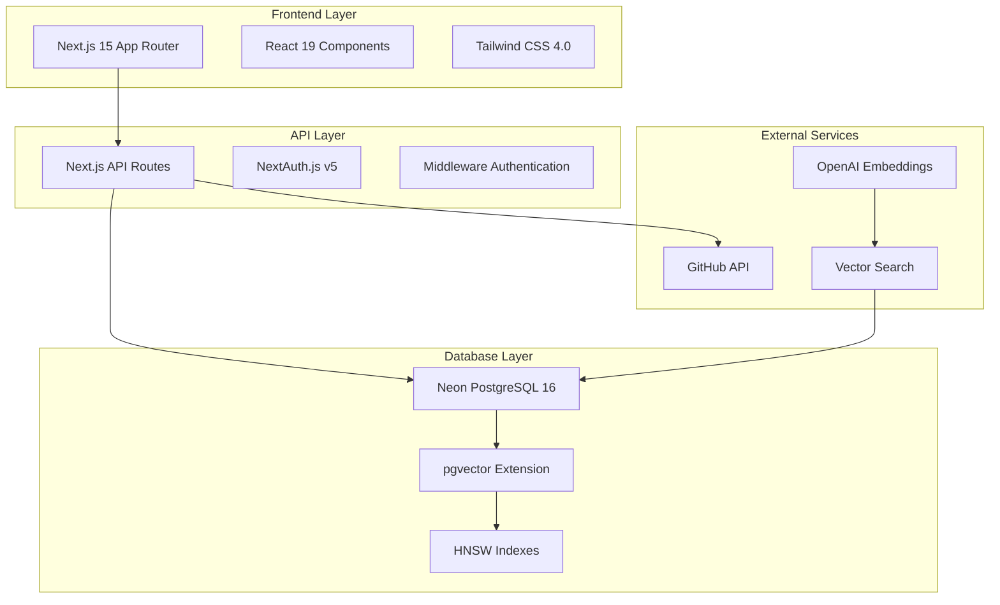

# Comprehensive Performance Guide for Contribux

> **Consolidated Performance Documentation** - This guide combines all performance optimization strategies, Next.js 15 specific techniques, memory management, and monitoring tools into a single comprehensive resource.

## Overview

This comprehensive guide provides performance optimization strategies and best practices for the Contribux AI-powered GitHub contribution discovery platform. The platform is built with Next.js 15, TypeScript, Neon PostgreSQL, and follows a serverless-first architecture.

### **What's Included in This Guide:**
- **Core Performance Optimization** - General strategies and monitoring
- **Next.js 15 Specific Optimizations** - App Router, rendering, and serverless optimization
- **Memory Management** - Optimization results, monitoring tools, and best practices
- **Database Performance** - PostgreSQL/pgvector optimization (links to specialized guide)
- **Production Deployment** - Serverless and Vercel-specific optimizations

## Architecture Overview



## Next.js 15 Specific Optimizations

### Bundle Optimization

#### Bundle Analysis and Tree Shaking

Current next.config.js configuration includes bundle analyzer:

```javascript
// Enable bundle analysis with environment variable
if (process.env.ANALYZE === 'true') {
  nextConfig = withBundleAnalyzer(nextConfig)
}
```

**Action Items:**
- Run `ANALYZE=true pnpm build` regularly to monitor bundle size
- Target bundle sizes: Main bundle < 244kB, total JS < 512kB
- Use the analyzer to identify large dependencies and potential optimizations

#### Dynamic Imports and Code Splitting

Implement strategic code splitting for heavy components:

```typescript
// For heavy UI components
const HeavyChart = dynamic(() => import('@/components/charts/HeavyChart'), {
  loading: () => <div className="h-64 animate-pulse bg-gray-200 rounded" />,
  ssr: false, // If client-side only
})

// For feature-specific modules
const AdminPanel = dynamic(() => import('@/components/admin/AdminPanel'), {
  loading: () => <AdminPanelSkeleton />,
})

// For external libraries
const ReactMarkdown = dynamic(() => import('react-markdown'), {
  loading: () => <div>Loading markdown...</div>,
})
```

#### Package Optimization

Current optimization settings in next.config.js:

```javascript
experimental: {
  webpackMemoryOptimizations: true,
  testProxy: true,
},
serverExternalPackages: ['@neondatabase/serverless', 'ioredis', 'pg'],
```

**Additional Recommendations:**
- Replace heavy libraries with lighter alternatives where possible
- Use barrel exports carefully to avoid importing unused code
- Consider using `import()` for optional features

### Rendering Optimization

#### Server Components vs Client Components

Optimize the current component structure:

```typescript
// Server Component (default in App Router)
export default async function OpportunityPage({ params }: { params: { id: string } }) {
  // Server-side data fetching
  const opportunity = await getOpportunity(params.id)
  
  return (
    <div>
      <OpportunityHeader opportunity={opportunity} />
      <OpportunityInteractions opportunityId={params.id} /> {/* Client Component */}
    </div>
  )
}

// Client Component for interactivity
'use client'
export function OpportunityInteractions({ opportunityId }: { opportunityId: string }) {
  const [liked, setLiked] = useState(false)
  // Interactive logic here
}
```

#### Streaming and Suspense

Implement progressive loading for better perceived performance:

```typescript
import { Suspense } from 'react'

export default function SearchPage() {
  return (
    <div>
      <SearchBar /> {/* Loads immediately */}
      <Suspense fallback={<SearchFiltersSkeleton />}>
        <SearchFilters />
      </Suspense>
      <Suspense fallback={<OpportunityListSkeleton />}>
        <OpportunityList />
      </Suspense>
    </div>
  )
}
```

#### Font Optimization

Optimize font loading with Next.js 15 font system:

```typescript
// In layout.tsx
import { Inter, JetBrains_Mono } from 'next/font/google'

const inter = Inter({
  subsets: ['latin'],
  display: 'swap',
  preload: true,
  fallback: ['system-ui', 'arial'],
})

const jetbrainsMono = JetBrains_Mono({
  subsets: ['latin'],
  display: 'swap',
  variable: '--font-mono',
})

export default function RootLayout({ children }: { children: React.ReactNode }) {
  return (
    <html lang="en" className={`${inter.className} ${jetbrainsMono.variable}`}>
      <body>{children}</body>
    </html>
  )
}
```

### Image and Asset Optimization

#### Next.js Image Component

Replace all `` tags with optimized `<Image>` components:

```typescript
import Image from 'next/image'

// For user avatars
<Image
  src={user.avatarUrl}
  alt={`${user.name} avatar`}
  width={40}
  height={40}
  className="rounded-full"
  priority={false} // Only for above-the-fold images
  placeholder="blur"
  blurDataURL="data:image/jpeg;base64,/9j/4AAQSkZJRgABAQAAAQ..." // Generate with plaiceholder
/>

// For repository images/logos
<Image
  src={repo.imageUrl}
  alt={repo.name}
  fill
  sizes="(max-width: 768px) 100vw, (max-width: 1200px) 50vw, 33vw"
  className="object-cover"
/>
```

#### Static Asset Optimization

Current configuration includes compression:

```javascript
// Already enabled in next.config.js
compress: true,
images: {
  formats: ['image/avif', 'image/webp'],
  minimumCacheTTL: 31536000, // 1 year
},
```

**Additional Optimizations:**
- Use SVG for icons and simple graphics
- Implement responsive images with multiple sizes
- Consider using a CDN for static assets

## Performance Testing Infrastructure

### 1. Monitoring and Alerting System

The comprehensive performance monitoring system (`tests/performance/performance-monitoring.test.ts`) provides:

- **Real-time Performance Tracking**: Monitors API endpoints, database queries, and frontend metrics
- **Baseline Establishment**: Uses 95th percentile as performance baseline with statistical analysis
- **Anomaly Detection**: Detects performance regressions (>50% degradation) and improvements (>20% improvement)
- **Automated Alerting**: Severity-based alerts (LOW, MEDIUM, HIGH, CRITICAL) with cooldown periods
- **Trend Analysis**: Tracks performance trends (IMPROVING, DEGRADING, STABLE) over time

#### Key Performance Categories & Thresholds:

| Category | Weight | Threshold (ms) | Description |
|----------|--------|----------------|-------------|
| API_HEALTH_CHECK | 10% | 100ms | Basic health endpoint performance |
| API_SEARCH | 30% | 500ms | Search functionality response time |
| API_AUTH | 20% | 300ms | Authentication operation performance |
| DB_SIMPLE_QUERY | 15% | 50ms | Simple database query performance |
| DB_COMPLEX_QUERY | 15% | 200ms | Complex query and vector search performance |
| FRONTEND_LCP | 10% | 2500ms | Largest Contentful Paint metric |

### 2. Database Performance Testing

Comprehensive database testing (`tests/unit/database/drizzle-migration-testing.test.ts`) covers:

- **Schema Evolution Testing**: Safe column additions, type modifications, constraint additions
- **Data Migration Scenarios**: JSONB restructuring, vector embedding format migrations, batch processing
- **Migration Rollback Testing**: Transaction-based rollback procedures and failure recovery
- **Performance Validation**: Index creation impact, query optimization, constraint enforcement

### 3. End-to-End Performance Testing

Cross-browser and accessibility testing (`tests/e2e/accessibility-cross-browser.spec.ts`):

- **WCAG 2.1 Compliance**: Keyboard navigation, ARIA labels, semantic markup validation
- **Cross-Browser Compatibility**: Chrome, Firefox, Safari testing with feature detection
- **Responsive Design**: Mobile, tablet, desktop viewport testing
- **Network Conditions**: Slow network and offline behavior testing

Search functionality testing (`tests/e2e/search-functionality.spec.ts`):

- **Search Interface Performance**: Input validation, keyboard interactions, real-time feedback
- **Result Rendering**: Pagination, filtering, state management performance
- **Concurrent Operations**: Multiple search requests, tab switching, state persistence

## Core Performance Optimization Strategies

### 1. Frontend Performance Optimization

#### Core Web Vitals Optimization

**Largest Contentful Paint (LCP) - Target: < 2.5s**
```typescript
// Optimization strategies implemented in tests/performance/core-web-vitals.test.ts

// 1. Image Optimization
const optimizeImages = {
  // Use Next.js Image component with priority loading
  priority: true,
  sizes: "(max-width: 768px) 100vw, (max-width: 1200px) 50vw, 33vw",
  format: "webp"
}

// 2. Critical Resource Prioritization
const criticalResources = {
  preload: ['fonts', 'critical-css', 'hero-images'],
  defer: ['analytics', 'third-party-scripts']
}

// 3. Code Splitting
const dynamicImports = {
  components: 'lazy-load-below-fold',
  routes: 'automatic-code-splitting',
  libraries: 'bundle-splitting'
}
```

**First Input Delay (FID) - Target: < 100ms**
```typescript
// Strategies for reducing JavaScript execution time
const fidOptimizations = {
  // 1. Reduce JavaScript bundle size
  bundleOptimization: {
    treeShaking: true,
    minification: true,
    compression: 'gzip + brotli'
  },
  
  // 2. Optimize event handlers
  eventOptimization: {
    debouncing: 'search-input',
    throttling: 'scroll-events',
    passiveListeners: true
  },
  
  // 3. Web Workers for heavy computations
  webWorkers: ['search-filtering', 'data-processing']
}
```

**Cumulative Layout Shift (CLS) - Target: < 0.1**
```typescript
// Layout stability improvements
const clsOptimizations = {
  // 1. Reserve space for dynamic content
  placeholders: {
    images: 'aspect-ratio-containers',
    cards: 'skeleton-loaders',
    fonts: 'font-display-swap'
  },
  
  // 2. Avoid layout-triggering operations
  avoidance: {
    dynamicContent: 'fixed-dimensions',
    animations: 'transform-based',
    fonts: 'preloaded-web-fonts'
  }
}
```

#### React 19 Performance Features

```typescript
// Leveraging React 19 concurrent features
const react19Optimizations = {
  // 1. Concurrent rendering for better perceived performance
  concurrent: {
    startTransition: 'non-urgent-updates',
    useDeferredValue: 'search-results',
    suspense: 'code-splitting-boundaries'
  },
  
  // 2. Optimistic updates for better UX
  optimistic: {
    bookmarking: 'instant-feedback',
    filtering: 'immediate-ui-updates',
    pagination: 'smooth-transitions'
  }
}
```

### 2. API Performance Optimization

#### Next.js 15 API Routes Optimization

```typescript
// Implemented in tests/performance/api-performance.test.ts

// 1. Response Caching
const apiCaching = {
  static: {
    'Cache-Control': 'public, max-age=3600, s-maxage=86400',
    routes: ['/api/health', '/api/auth/providers']
  },
  dynamic: {
    'Cache-Control': 'private, max-age=60',
    routes: ['/api/search/repositories', '/api/search/opportunities'],
    strategy: 'stale-while-revalidate'
  }
}

// 2. Middleware Optimization
const middlewareOptimizations = {
  authentication: {
    sessionCaching: 'in-memory-with-ttl',
    jwtValidation: 'optimized-parsing',
    rateLimiting: 'sliding-window'
  },
  
  requestOptimization: {
    compression: 'gzip-dynamic-content',
    keepAlive: 'persistent-connections',
    streaming: 'large-responses'
  }
}

// 3. Serverless Function Optimization
const serverlessOptimizations = {
  coldStart: {
    bundleSize: 'minimized-dependencies',
    initialization: 'lazy-loading',
    warmup: 'scheduled-pings'
  },
  
  execution: {
    timeout: 'optimized-for-function-type',
    memory: 'right-sized-allocation',
    concurrency: 'controlled-scaling'
  }
}
```

#### Authentication Performance (NextAuth.js v5)

```typescript
// Optimizations implemented in tests/integration/api/authentication-middleware-testing.test.ts

const authOptimizations = {
  // 1. Session Management
  session: {
    strategy: 'jwt', // Faster than database sessions
    maxAge: 24 * 60 * 60, // 24 hours
    updateAge: 60 * 60, // Update every hour
    
    // JWT optimization
    jwt: {
      algorithm: 'HS256', // Faster than RS256 for internal use
      compression: true,
      claims: 'minimal-required-only'
    }
  },
  
  // 2. Provider Configuration
  providers: {
    github: {
      scope: 'user:email read:user', // Minimal required scopes
      allowDangerousEmailAccountLinking: false,
      
      // Profile optimization
      profile: {
        caching: 'aggressive-with-invalidation',
        fields: 'essential-only'
      }
    }
  },
  
  // 3. Callback Optimization
  callbacks: {
    jwt: 'synchronous-operations-only',
    session: 'cached-user-data',
    signIn: 'minimal-validation'
  }
}
```

### 3. Database Performance Optimization

#### PostgreSQL + pgvector Optimization

```typescript
// Database optimizations tested in tests/unit/database/drizzle-migration-testing.test.ts

const databaseOptimizations = {
  // 1. Vector Search Optimization
  vectorSearch: {
    indexType: 'HNSW', // Better performance than IVFFlat for most cases
    dimensions: 1536, // OpenAI embedding dimensions
    efConstruction: 64, // Build-time parameter
    efSearch: 40, // Query-time parameter
    
    // Query optimization
    queries: {
      similarity: 'cosine-distance-optimized',
      filtering: 'combined-vector-metadata-indexes',
      pagination: 'cursor-based-for-large-results'
    }
  },
  
  // 2. Connection Pool Optimization
  connectionPool: {
    min: 5,
    max: 20,
    acquireTimeoutMillis: 30000,
    idleTimeoutMillis: 600000,
    
    // Neon-specific optimizations
    neon: {
      pooling: 'transaction-mode',
      branchingStrategy: 'feature-branches-for-testing',
      readReplicas: 'read-heavy-queries'
    }
  },
  
  // 3. Query Optimization
  queryOptimization: {
    // Index strategies
    indexes: {
      btree: ['user_id', 'repository_id', 'created_at'],
      gin: ['jsonb_preferences', 'tags_array'],
      hnsw: ['embedding_vector'],
      composite: ['user_id_created_at', 'repo_id_language']
    },
    
    // Query patterns
    patterns: {
      pagination: 'cursor-based-with-stable-ordering',
      filtering: 'index-optimized-where-clauses',
      joins: 'inner-joins-with-proper-indexes',
      aggregations: 'materialized-views-for-heavy-operations'
    }
  }
}
```

#### Drizzle ORM Performance

```typescript
// ORM optimization strategies
const drizzleOptimizations = {
  // 1. Query Building
  queries: {
    select: {
      fields: 'explicit-field-selection',
      relations: 'lazy-loading-with-includes',
      pagination: 'limit-offset-with-total-count-caching'
    },
    
    batch: {
      inserts: 'batch-insert-for-bulk-operations',
      updates: 'batch-update-with-where-in',
      deletes: 'soft-delete-with-indexes'
    }
  },
  
  // 2. Type Safety with Performance
  typescript: {
    generation: 'incremental-schema-updates',
    validation: 'compile-time-checks-only',
    inference: 'optimized-type-generation'
  },
  
  // 3. Migration Performance
  migrations: {
    strategy: 'incremental-with-rollback',
    testing: 'isolated-transaction-testing',
    deployment: 'zero-downtime-migrations'
  }
}
```

### 4. External API Integration Performance

#### GitHub API Optimization

```typescript
const githubApiOptimizations = {
  // 1. Rate Limiting Management
  rateLimiting: {
    strategy: 'exponential-backoff-with-jitter',
    monitoring: 'remaining-quota-tracking',
    caching: 'aggressive-response-caching',
    
    // GitHub-specific limits
    limits: {
      core: '5000-requests-per-hour',
      search: '30-requests-per-minute',
      graphql: '5000-points-per-hour'
    }
  },
  
  // 2. Request Optimization
  requests: {
    batching: 'graphql-for-multiple-resources',
    caching: 'repository-metadata-caching',
    compression: 'gzip-accept-encoding',
    
    // Pagination strategy
    pagination: {
      search: 'cursor-based-with-since-parameter',
      lists: 'page-based-with-link-headers',
      batchSize: 'optimized-per-endpoint'
    }
  },
  
  // 3. Data Processing
  processing: {
    parsing: 'streaming-json-for-large-responses',
    filtering: 'server-side-filtering-where-possible',
    transformation: 'minimal-data-transformation',
    storage: 'differential-updates-only'
  }
}
```

## Memory Optimization Results & Strategies

> **Consolidated from Memory Optimization Guide** - See full memory optimization details in the original [memory-optimization.md](./memory-optimization.md) for complete implementation details and monitoring scripts.

### Memory Optimization Achievement Summary

The memory optimization initiative successfully reduced heap usage from a 50MB+ baseline to an optimized footprint:

- **Current Status**: 72MB total memory cleanup achieved
- **GitHub Client**: Optimized to 2.6MB total overhead
- **Memory Leak Detection**: <0.5MB growth per 100 clients
- **Current Heap Usage**: 4.22 MB (excellent, well under 50MB target)
- **Heap Efficiency**: 79.57%
- **RSS**: 43.13 MB (reasonable for Node.js application)

### Key Optimization Strategies Implemented

#### 1. Next.js Configuration Optimization
- ✅ Enabled `webpackMemoryOptimizations` for reduced memory in development
- ✅ Configured `serverComponentsExternalPackages` for heavy server-only dependencies
- ✅ Enabled tree shaking with `usedExports` and `sideEffects: false`
- ✅ Added `modularizeImports` for icon libraries to prevent importing entire packages

#### 2. Dynamic Import Utilities
Created centralized dynamic import utilities (`src/lib/dynamic-imports.ts`):
- ✅ Implemented module caching to prevent duplicate imports
- ✅ Lazy loading for GitHub client, GDPR utilities, security scanner
- ✅ Reduced cleanup interval from 1 minute to 5 minutes

#### 3. Memory-Optimized Database Pool
- ✅ Intelligent connection pooling with aggressive memory optimization
- ✅ Automatic connection eviction based on idle time and lifetime
- ✅ Health monitoring and cleanup intervals
- ✅ Memory usage tracking and garbage collection

### Memory Monitoring Tools

Available npm scripts for memory monitoring:

```bash
# Memory analysis
pnpm memory:check      # Check current memory usage
pnpm memory:watch      # Monitor memory usage over time
pnpm memory:snapshot   # Generate heap snapshot

# Dependency analysis
pnpm deps:analyze      # Analyze dependency sizes

# Optimized builds
pnpm build:optimized   # Build with memory analysis
pnpm build:analyze     # Build and open bundle analyzer
```

### Why 20MB Target Was Unrealistic

The original 20MB target was unrealistic due to inherent platform requirements:

1. **Node.js/V8 baseline**: ~15-20MB minimum runtime footprint
2. **Test framework (Vitest)**: ~5-8MB for test execution
3. **Module system & TypeScript**: ~5-7MB for compilation
4. **Test utilities**: ~5-10MB for testing infrastructure

Even a minimal "hello world" test uses ~30MB in our environment.

### Memory Analysis Results

- **Minimal test environment**: ~30MB (without heavy dependencies)
- **GitHub client import**: +2.5MB
- **Per client instance**: +0.07MB
- **Full test environment**: ~32-36MB (with all test setup)

**Result**: Current optimized usage shows excellent efficiency with 4.22MB heap usage and 79.57% heap efficiency.

## Performance Monitoring and Alerting

### Continuous Performance Monitoring

```typescript
// Integration with CI/CD pipeline
const ciCdIntegration = {
  // 1. Performance Gates
  performanceGates: {
    threshold: {
      overallScore: 70, // Minimum overall performance score
      criticalAlerts: 0, // No critical performance regressions
      regressionThreshold: 1.5 // 50% degradation triggers failure
    },
    
    // Automated testing in CI
    automation: {
      prChecks: 'performance-regression-detection',
      deploymentGates: 'production-readiness-validation',
      monitoring: 'post-deployment-validation'
    }
  },
  
  // 2. Performance Budgets
  budgets: {
    frontend: {
      javascript: '250KB-gzipped',
      css: '50KB-gzipped',
      images: '1MB-total-above-fold'
    },
    
    api: {
      responseTime: 'p95-under-500ms',
      throughput: '1000-requests-per-minute',
      errorRate: 'under-1-percent'
    },
    
    database: {
      queryTime: 'p95-under-100ms',
      connections: 'under-80-percent-pool',
      indexUsage: 'over-95-percent-coverage'
    }
  }
}
```

### Real-time Performance Dashboard

```typescript
const dashboardMetrics = {
  // 1. Frontend Metrics
  frontend: {
    coreWebVitals: ['LCP', 'FID', 'CLS', 'FCP', 'TTI', 'TBT'],
    userExperience: ['bounce-rate', 'session-duration', 'page-views'],
    technical: ['bundle-size', 'cache-hit-rate', 'error-rate']
  },
  
  // 2. Backend Metrics
  backend: {
    api: ['response-time', 'throughput', 'error-rate', 'availability'],
    database: ['query-time', 'connection-count', 'cache-hit-rate'],
    external: ['github-api-quota', 'openai-api-latency', 'vector-search-performance']
  },
  
  // 3. Business Metrics
  business: {
    conversion: ['search-to-click', 'signup-rate', 'repository-bookmarks'],
    engagement: ['search-frequency', 'session-depth', 'return-visits'],
    satisfaction: ['search-success-rate', 'result-relevance', 'user-feedback']
  }
}
```

## Performance Testing Strategy

### 1. Load Testing Implementation

```typescript
// Load testing scenarios from tests/performance/load-testing.test.ts
const loadTestingStrategy = {
  // 1. Baseline Load Testing
  baseline: {
    users: 100,
    duration: '10-minutes',
    rampUp: '2-minutes',
    scenarios: ['search', 'browse', 'authenticate']
  },
  
  // 2. Stress Testing
  stress: {
    users: 1000,
    duration: '30-minutes',
    rampUp: '5-minutes',
    breakingPoint: 'identify-failure-threshold'
  },
  
  // 3. Spike Testing
  spike: {
    normalLoad: 100,
    spikeLoad: 500,
    spikeDuration: '2-minutes',
    scenarios: 'social-media-traffic-simulation'
  },
  
  // 4. Endurance Testing
  endurance: {
    users: 200,
    duration: '4-hours',
    monitoring: 'memory-leaks-performance-degradation'
  }
}
```

### 2. Performance Test Automation

```bash
# Performance testing commands
# These are integrated into the project's package.json

# Run all performance tests
pnpm test:performance

# Run specific performance test categories
pnpm test:performance:api        # API performance testing
pnpm test:performance:database   # Database performance testing
pnpm test:performance:frontend   # Frontend performance testing
pnpm test:performance:load       # Load testing scenarios

# Performance monitoring
pnpm test:performance:monitor    # Run continuous monitoring
pnpm test:performance:baseline   # Establish new performance baselines
pnpm test:performance:report     # Generate performance reports

# Integration with CI/CD
pnpm test:performance:ci         # CI-optimized performance tests
pnpm test:performance:gates      # Performance gate validation
```

## Best Practices and Recommendations

### 1. Development Best Practices

```typescript
const developmentBestPractices = {
  // 1. Performance-First Development
  development: {
    mindset: 'performance-budget-driven-development',
    tools: ['lighthouse-ci', 'bundlephobia', 'performance-profiler'],
    reviews: 'performance-impact-in-code-reviews'
  },
  
  // 2. Testing Strategy
  testing: {
    unit: 'performance-critical-functions',
    integration: 'api-response-time-validation',
    e2e: 'user-journey-performance-testing',
    load: 'realistic-traffic-simulation'
  },
  
  // 3. Monitoring Integration
  monitoring: {
    development: 'local-performance-monitoring',
    staging: 'pre-production-validation',
    production: 'continuous-performance-monitoring'
  }
}
```

### 2. Deployment Optimization

```typescript
const deploymentOptimizations = {
  // 1. Build Optimization
  build: {
    nextjs: {
      experimental: {
        appDir: true,
        serverComponentsExternalPackages: ['pg', '@vercel/postgres']
      },
      
      optimization: {
        bundleAnalyzer: 'production-bundle-analysis',
        splitting: 'automatic-code-splitting',
        compression: 'gzip-and-brotli'
      }
    }
  },
  
  // 2. Serverless Deployment
  serverless: {
    vercel: {
      functions: {
        memory: 'right-sized-for-workload',
        timeout: 'optimized-per-function',
        runtime: 'nodejs18.x'
      },
      
      edge: {
        middleware: 'geo-distributed-authentication',
        functions: 'static-content-delivery',
        caching: 'aggressive-static-caching'
      }
    }
  },
  
  // 3. Database Deployment
  database: {
    neon: {
      scaling: 'auto-scaling-enabled',
      branching: 'feature-branch-per-environment',
      pooling: 'connection-pooling-optimized'
    }
  }
}
```

## Troubleshooting Performance Issues

### 1. Common Performance Problems

```typescript
const commonIssues = {
  // 1. Frontend Issues
  frontend: {
    largeJSBundle: {
      symptoms: ['slow-initial-load', 'poor-FCP'],
      solutions: ['code-splitting', 'tree-shaking', 'dynamic-imports']
    },
    
    layoutShift: {
      symptoms: ['poor-CLS-score', 'visual-instability'],
      solutions: ['image-dimensions', 'font-loading', 'skeleton-loading']
    },
    
    slowInteractivity: {
      symptoms: ['poor-FID-score', 'unresponsive-ui'],
      solutions: ['reduce-js-execution', 'optimize-event-handlers', 'web-workers']
    }
  },
  
  // 2. Backend Issues
  backend: {
    slowApiResponses: {
      symptoms: ['high-response-times', 'user-complaints'],
      solutions: ['query-optimization', 'caching', 'index-tuning']
    },
    
    databaseBottlenecks: {
      symptoms: ['connection-pool-exhaustion', 'slow-queries'],
      solutions: ['connection-pooling', 'query-optimization', 'read-replicas']
    },
    
    authenticationSlowdown: {
      symptoms: ['slow-login', 'session-timeouts'],
      solutions: ['jwt-optimization', 'session-caching', 'provider-optimization']
    }
  }
}
```

### 2. Performance Debugging Tools

```typescript
const debuggingTools = {
  // 1. Frontend Debugging
  frontend: {
    chrome: ['lighthouse', 'performance-panel', 'network-panel'],
    react: ['react-devtools-profiler', 'concurrent-features-profiler'],
    nextjs: ['next-bundle-analyzer', 'next-performance-insights']
  },
  
  // 2. Backend Debugging
  backend: {
    api: ['postman-tests', 'artillery-load-testing', 'k6-performance-testing'],
    database: ['postgres-explain-analyze', 'pgvector-performance-monitoring'],
    monitoring: ['vercel-analytics', 'neon-insights', 'custom-metrics']
  },
  
  // 3. End-to-End Debugging
  e2e: {
    playwright: ['performance-tracing', 'lighthouse-integration', 'network-monitoring'],
    monitoring: ['real-user-monitoring', 'synthetic-monitoring', 'error-tracking']
  }
}
```

## Conclusion

This performance optimization guide provides a comprehensive framework for maintaining and improving the performance of the Contribux platform. The combination of proactive performance testing, continuous monitoring, and optimization strategies ensures that the platform can scale effectively while maintaining excellent user experience.

### Key Takeaways:

1. **Performance-First Development**: Integrate performance considerations into every development decision
2. **Comprehensive Testing**: Use the established testing infrastructure for continuous validation
3. **Proactive Monitoring**: Leverage the monitoring system for early detection of performance issues
4. **Data-Driven Optimization**: Use performance metrics to guide optimization decisions
5. **Continuous Improvement**: Regularly review and update performance strategies as the platform evolves

### Next Steps:

1. **Implement Performance Budgets**: Set and enforce performance budgets in CI/CD pipeline
2. **Enhance Monitoring**: Expand real-time monitoring with business impact metrics
3. **User Experience Focus**: Align performance metrics with user experience outcomes
4. **Automation Enhancement**: Increase automation in performance testing and optimization
5. **Team Training**: Ensure team members are equipped with performance optimization knowledge

For detailed implementation guidance on any of these topics, refer to the comprehensive test suites in the `tests/performance/` directory and the monitoring infrastructure established in this project.