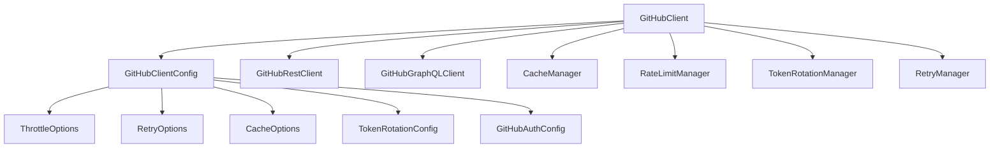

# Interface Segregation Design Document

## Current State Analysis

### Identified Interface Issues

The current GitHub API client interfaces exhibit several interface bloat anti-patterns:

1. **GitHubClientConfig** - Large monolithic interface with 10+ properties mixing authentication, caching, rate limiting, and retry concerns
2. **GitHubClient class** - "God object" anti-pattern with 80+ methods covering REST, GraphQL, caching, rate limiting, token rotation, and lifecycle management
3. **Mixed concerns** - Single interfaces handling both configuration and operational concerns
4. **Tight coupling** - Interfaces depend on too many implementation details

### Current Interface Responsibilities Audit

#### Large Interfaces Identified:
- **GitHubClientConfig**: Authentication + Caching + Rate Limiting + Retry + Token Rotation + Logging
- **GitHubClient methods**: REST operations + GraphQL operations + Cache management + Rate limiting + Token rotation + Lifecycle management + Analytics + Performance monitoring

#### Dependency Graph:


## New Interface Architecture Design

### Core Design Principles

1. **Interface Segregation Principle (ISP)**: No client should be forced to depend on methods it does not use
2. **Single Responsibility Principle**: Each interface should have one reason to change
3. **Role-based segregation**: Separate read and write concerns (CQRS pattern)
4. **Domain-specific interfaces**: Group related operations by GitHub API domain
5. **Composition over inheritance**: Use interface composition for complex operations

### Role-Based Interface Segregation (CQRS Pattern)

#### Reader Interfaces (Query Side)
```typescript
// Core read operations for repositories
interface RepositoryReader {
  get(owner: string, repo: string): Promise<Result<Repository, GitHubError>>;
  list(options?: ListOptions): Promise<Result<Repository[], GitHubError>>;
  search(query: string, options?: SearchOptions): Promise<Result<SearchResult<Repository>, GitHubError>>;
  getContents(owner: string, repo: string, path: string): Promise<Result<Content, GitHubError>>;
  getMetrics(owner: string, repo: string): Promise<Result<RepositoryMetrics, GitHubError>>;
}

// Core read operations for issues
interface IssueReader {
  get(owner: string, repo: string, issueNumber: number): Promise<Result<Issue, GitHubError>>;
  list(owner: string, repo: string, options?: IssueListOptions): Promise<Result<Issue[], GitHubError>>;
  search(query: string, options?: SearchOptions): Promise<Result<SearchResult<Issue>, GitHubError>>;
  getComments(owner: string, repo: string, issueNumber: number): Promise<Result<Comment[], GitHubError>>;
  getEvents(owner: string, repo: string, issueNumber: number): Promise<Result<Event[], GitHubError>>;
}

// Core read operations for pull requests
interface PullRequestReader {
  get(owner: string, repo: string, pullNumber: number): Promise<Result<PullRequest, GitHubError>>;
  list(owner: string, repo: string, options?: PullRequestListOptions): Promise<Result<PullRequest[], GitHubError>>;
  getFiles(owner: string, repo: string, pullNumber: number): Promise<Result<File[], GitHubError>>;
  getComments(owner: string, repo: string, pullNumber: number): Promise<Result<Comment[], GitHubError>>;
  getReviews(owner: string, repo: string, pullNumber: number): Promise<Result<Review[], GitHubError>>;
}

// User and organization read operations
interface UserReader {
  get(username: string): Promise<Result<User, GitHubError>>;
  getOrganizations(username: string): Promise<Result<Organization[], GitHubError>>;
  getRepositories(username: string, options?: RepoListOptions): Promise<Result<Repository[], GitHubError>>;
  getFollowers(username: string): Promise<Result<User[], GitHubError>>;
  getFollowing(username: string): Promise<Result<User[], GitHubError>>;
}
```

#### Writer Interfaces (Command Side)
```typescript
// Repository write operations
interface RepositoryWriter {
  create(data: CreateRepositoryData): Promise<Result<Repository, GitHubError>>;
  update(owner: string, repo: string, data: UpdateRepositoryData): Promise<Result<Repository, GitHubError>>;
  delete(owner: string, repo: string): Promise<Result<void, GitHubError>>;
  fork(owner: string, repo: string, organization?: string): Promise<Result<Repository, GitHubError>>;
  createFile(owner: string, repo: string, path: string, data: CreateFileData): Promise<Result<FileCommit, GitHubError>>;
  updateFile(owner: string, repo: string, path: string, data: UpdateFileData): Promise<Result<FileCommit, GitHubError>>;
  deleteFile(owner: string, repo: string, path: string, data: DeleteFileData): Promise<Result<FileCommit, GitHubError>>;
}

// Issue write operations
interface IssueWriter {
  create(owner: string, repo: string, data: CreateIssueData): Promise<Result<Issue, GitHubError>>;
  update(owner: string, repo: string, issueNumber: number, data: UpdateIssueData): Promise<Result<Issue, GitHubError>>;
  close(owner: string, repo: string, issueNumber: number): Promise<Result<Issue, GitHubError>>;
  lock(owner: string, repo: string, issueNumber: number, reason?: string): Promise<Result<void, GitHubError>>;
  unlock(owner: string, repo: string, issueNumber: number): Promise<Result<void, GitHubError>>;
  addComment(owner: string, repo: string, issueNumber: number, body: string): Promise<Result<Comment, GitHubError>>;
  updateComment(owner: string, repo: string, commentId: number, body: string): Promise<Result<Comment, GitHubError>>;
  deleteComment(owner: string, repo: string, commentId: number): Promise<Result<void, GitHubError>>;
  addLabels(owner: string, repo: string, issueNumber: number, labels: string[]): Promise<Result<Label[], GitHubError>>;
  removeLabels(owner: string, repo: string, issueNumber: number, labels: string[]): Promise<Result<void, GitHubError>>;
  setAssignees(owner: string, repo: string, issueNumber: number, assignees: string[]): Promise<Result<Issue, GitHubError>>;
}

// Pull request write operations
interface PullRequestWriter {
  create(owner: string, repo: string, data: CreatePullRequestData): Promise<Result<PullRequest, GitHubError>>;
  update(owner: string, repo: string, pullNumber: number, data: UpdatePullRequestData): Promise<Result<PullRequest, GitHubError>>;
  merge(owner: string, repo: string, pullNumber: number, options?: MergeOptions): Promise<Result<MergeResult, GitHubError>>;
  close(owner: string, repo: string, pullNumber: number): Promise<Result<PullRequest, GitHubError>>;
  requestReview(owner: string, repo: string, pullNumber: number, reviewers: string[]): Promise<Result<PullRequest, GitHubError>>;
  createReview(owner: string, repo: string, pullNumber: number, data: CreateReviewData): Promise<Result<Review, GitHubError>>;
  updateReview(owner: string, repo: string, pullNumber: number, reviewId: number, data: UpdateReviewData): Promise<Result<Review, GitHubError>>;
  submitReview(owner: string, repo: string, pullNumber: number, reviewId: number, event: ReviewEvent): Promise<Result<Review, GitHubError>>;
}
```

### Domain-Specific Interface Composition

#### Composed Manager Interfaces
```typescript
// Repository management combining read and write
interface RepositoryManager extends RepositoryReader, RepositoryWriter {
  // Additional composite operations that require both read and write
  cloneAndUpdate(source: RepositoryIdentifier, updates: RepositoryUpdates): Promise<Result<Repository, GitHubError>>;
  syncFork(owner: string, repo: string): Promise<Result<SyncResult, GitHubError>>;
}

// Issue management combining read and write
interface IssueManager extends IssueReader, IssueWriter {
  // Additional composite operations
  duplicateIssue(source: IssueIdentifier, target: RepositoryIdentifier): Promise<Result<Issue, GitHubError>>;
  transferIssue(source: IssueIdentifier, target: RepositoryIdentifier): Promise<Result<Issue, GitHubError>>;
}

// Pull request management combining read and write
interface PullRequestManager extends PullRequestReader, PullRequestWriter {
  // Additional composite operations
  createFromIssue(issueIdentifier: IssueIdentifier, branchName: string): Promise<Result<PullRequest, GitHubError>>;
  mergeWithChecks(identifier: PullRequestIdentifier, requirements: MergeRequirements): Promise<Result<MergeResult, GitHubError>>;
}
```

### Configuration Interface Segregation

#### Authentication Configuration
```typescript
// Separated authentication concerns
interface AuthenticationConfig {
  type: 'token' | 'app' | 'oauth';
}

interface TokenAuthConfig extends AuthenticationConfig {
  type: 'token';
  token: string;
}

interface AppAuthConfig extends AuthenticationConfig {
  type: 'app';
  appId: number;
  privateKey: string;
  installationId?: number;
  webhookSecret?: string;
}

interface OAuthAuthConfig extends AuthenticationConfig {
  type: 'oauth';
  clientId: string;
  clientSecret: string;
}

type GitHubAuthConfig = TokenAuthConfig | AppAuthConfig | OAuthAuthConfig;
```

#### Service Configuration Interfaces
```typescript
// Core client configuration - only essential settings
interface GitHubClientCoreConfig {
  auth?: GitHubAuthConfig;
  baseUrl?: string;
  userAgent?: string;
  log?: LogLevel;
}

// Rate limiting configuration
interface RateLimitingConfig {
  enabled?: boolean;
  includeRateLimit?: boolean;
  onRateLimit?: RateLimitCallback;
  onSecondaryRateLimit?: RateLimitCallback;
  onRateLimitWarning?: RateLimitWarningCallback;
}

// Caching configuration  
interface CachingConfig {
  enabled?: boolean;
  storage?: CacheStorageType;
  ttl?: number;
  backgroundRefresh?: boolean;
  dataloaderEnabled?: boolean;
}

// Retry configuration
interface RetryConfig {
  enabled?: boolean;
  retries?: number;
  circuitBreaker?: CircuitBreakerOptions;
}

// Token rotation configuration
interface TokenRotationConfig {
  enabled?: boolean;
  tokens?: TokenInfo[];
  strategy?: RotationStrategy;
  refreshBeforeExpiry?: number;
}
```

### Client Interface Segregation

#### Core Client Interfaces
```typescript
// Basic client interface for common operations
interface GitHubClientCore {
  authenticate(): Promise<void>;
  destroy(): Promise<void>;
  getCurrentUser(): Promise<Result<User, GitHubError>>;
  getRateLimitStatus(): Promise<Result<RateLimitStatus, GitHubError>>;
}

// REST API access interface
interface GitHubRestClient {
  repositories: RepositoryManager;
  issues: IssueManager;
  pullRequests: PullRequestManager;
  users: UserReader;
  organizations: OrganizationManager;
  // Raw REST access for advanced use cases
  request<T>(endpoint: string, options?: RequestOptions): Promise<Result<T, GitHubError>>;
}

// GraphQL API access interface  
interface GitHubGraphQLClient {
  query<T>(query: string, variables?: Record<string, unknown>): Promise<Result<T, GitHubError>>;
  batchQuery<T>(queries: BatchQuery[]): Promise<Result<T[], GitHubError>>;
  calculatePoints(query: string): number;
  validateQuery(query: string): ValidationResult;
}

// Cache management interface
interface GitHubCacheManager {
  get<T>(key: string): Promise<T | null>;
  set<T>(key: string, value: T, ttl?: number): Promise<void>;
  delete(key: string): Promise<void>;
  clear(): Promise<void>;
  getMetrics(): CacheMetrics;
  warmCache(operations: CacheWarmupOperation[]): Promise<void>;
}

// Performance and monitoring interface
interface GitHubClientMonitoring {
  getPerformanceMetrics(): PerformanceMetrics;
  getHealthStatus(): HealthStatus;
  enableVerboseLogging(): void;
  disableVerboseLogging(): void;
}
```

### Composed Client Interface

```typescript
// Main client interface that composes all capabilities
interface GitHubClient extends GitHubClientCore {
  rest: GitHubRestClient;
  graphql: GitHubGraphQLClient;
  cache?: GitHubCacheManager;
  monitoring: GitHubClientMonitoring;
}
```

## Implementation Strategy

### Phase 1: Create New Segregated Interfaces
1. Create new interface files in `src/lib/github/interfaces/segregated/`
2. Implement reader/writer interface patterns
3. Create domain-specific managers
4. Implement configuration segregation

### Phase 2: Implement Adapter Pattern for Backward Compatibility
1. Create adapter classes that implement old interfaces using new segregated interfaces
2. Maintain full API compatibility
3. Add deprecation warnings to guide migration

### Phase 3: Gradual Migration
1. Update internal implementations to use new interfaces
2. Provide migration guides and examples
3. Add automated refactoring tools

### Phase 4: Legacy Interface Removal
1. Remove deprecated interfaces after sufficient migration period
2. Clean up adapter code
3. Update documentation

## Backward Compatibility Strategy

### Adapter Pattern Implementation
```typescript
// Legacy interface adapter
class LegacyGitHubClientAdapter implements OldGitHubClient {
  constructor(private newClient: GitHubClient) {}

  // Adapt old methods to new interface methods
  async getRepository(owner: string, repo: string): Promise<Repository> {
    const result = await this.newClient.rest.repositories.get(owner, repo);
    if (result.isError) {
      throw new Error(result.error.message);
    }
    return result.value;
  }

  // Other legacy method adaptations...
}
```

### Migration Path
1. **Immediate**: New segregated interfaces available alongside existing interfaces
2. **Transitional**: Adapter provides compatibility while encouraging migration
3. **Deprecation**: Clear timeline and migration guides provided
4. **Removal**: Legacy interfaces removed after migration period

## Benefits of New Architecture

1. **Reduced Interface Pollution**: Clients only depend on methods they actually use
2. **Improved Testability**: Easier to mock smaller, focused interfaces
3. **Better Type Safety**: More specific interfaces provide better type checking
4. **Enhanced Maintainability**: Changes to one domain don't affect others
5. **Clearer Intent**: Role-based interfaces make code intent more obvious
6. **Flexible Composition**: Mix and match capabilities as needed
7. **Better Performance**: Tree-shaking can eliminate unused interface code

## Testing Strategy

### Interface Testing
1. **Contract Tests**: Ensure implementations satisfy interface contracts
2. **Composition Tests**: Verify that composed interfaces work correctly
3. **Adapter Tests**: Validate backward compatibility adapters
4. **Migration Tests**: Test migration from old to new interfaces

### Example Test Structure
```typescript
describe('Repository Reader Interface', () => {
  it('should get repository successfully', async () => {
    const reader: RepositoryReader = new GitHubRepositoryService(config);
    const result = await reader.get('owner', 'repo');
    expect(result.isSuccess).toBe(true);
  });
});

describe('Legacy Adapter', () => {
  it('should maintain compatibility with old interface', async () => {
    const adapter = new LegacyGitHubClientAdapter(newClient);
    const repo = await adapter.getRepository('owner', 'repo');
    expect(repo.name).toBe('repo');
  });
});
```

This interface segregation design provides a clean, maintainable, and extensible architecture while ensuring smooth migration from the existing monolithic interfaces.