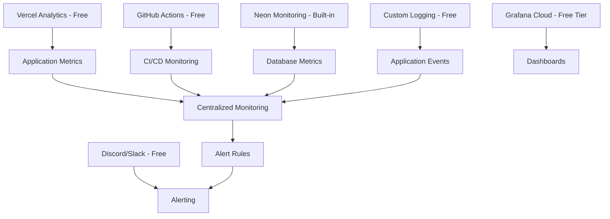

# Cost-Effective Monitoring and Alerting Solutions for Contribux

## Overview

This guide provides comprehensive, budget-friendly monitoring and alerting solutions specifically designed for the contribux platform. It focuses on practical, low-cost approaches that deliver enterprise-grade observability without the enterprise price tag, tailored for solo developers and small teams.

## Table of Contents

1. [Monitoring Strategy Overview](#monitoring-strategy-overview)
2. [Free and Low-Cost Tool Stack](#free-and-low-cost-tool-stack)
3. [Vercel Native Monitoring](#vercel-native-monitoring)
4. [GitHub-Based Monitoring](#github-based-monitoring)
5. [Database Monitoring on a Budget](#database-monitoring-on-a-budget)
6. [Custom Lightweight Monitoring](#custom-lightweight-monitoring)
7. [Alerting and Notification Systems](#alerting-and-notification-systems)
8. [Dashboard and Visualization](#dashboard-and-visualization)
9. [Cost Optimization Strategies](#cost-optimization-strategies)
10. [Implementation Priorities](#implementation-priorities)

## Monitoring Strategy Overview

### Cost-Conscious Architecture

The monitoring strategy for contribux follows a tiered approach that maximizes value while minimizing costs:



### Budget Constraints and Targets

- **Monthly Budget**: $0-50 for monitoring tools
- **Setup Time**: Maximum 2-4 hours initial setup
- **Maintenance**: Less than 30 minutes per week
- **Alert Noise**: Minimize false positives to reduce fatigue

## Free and Low-Cost Tool Stack

### Tier 1: Completely Free Solutions

```typescript
// lib/monitoring/free-tier-config.ts
export const freeMonitoringStack = {
  analytics: {
    vercel: {
      cost: 0,
      limits: 'Unlimited page views, core web vitals',
      features: ['Page views', 'Core Web Vitals', 'Real User Monitoring']
    },
    github: {
      cost: 0,
      limits: 'Public repositories only',
      features: ['Actions analytics', 'Repository insights', 'Dependency tracking']
    }
  },
  
  logging: {
    vercel: {
      cost: 0,
      limits: '100MB/day on Hobby plan',
      retention: '1 day',
      features: ['Function logs', 'Build logs', 'Request logs']
    },
    console: {
      cost: 0,
      limits: 'Unlimited',
      retention: 'Session-based',
      features: ['Custom application logs', 'Error tracking']
    }
  },
  
  databases: {
    neon: {
      cost: 0,
      limits: '0.5GB storage, 1 database',
      features: ['Basic metrics', 'Connection monitoring', 'Query stats']
    }
  },
  
  notifications: {
    discord: {
      cost: 0,
      limits: 'Unlimited webhooks',
      features: ['Rich embeds', 'File attachments', 'Multiple channels']
    },
    email: {
      cost: 0,
      limits: 'Basic SMTP',
      features: ['Standard email alerts', 'HTML formatting']
    }
  }
}
```

### Tier 2: Low-Cost Premium Options

```typescript
// lib/monitoring/low-cost-premium.ts
export const lowCostPremiumOptions = {
  uptime: {
    uptimeRobot: {
      cost: '$7/month',
      monitors: 50,
      interval: '1 minute',
      features: ['Multi-location monitoring', 'SSL monitoring', 'API access']
    },
    pingdom: {
      cost: '$10/month',
      monitors: 10,
      interval: '1 minute', 
      features: ['Real user monitoring', 'Transaction monitoring']
    }
  },
  
  apm: {
    grafanaCloud: {
      cost: '$0-29/month',
      limits: '10k series, 50GB logs',
      features: ['Prometheus', 'Grafana dashboards', 'Alerting']
    },
    newRelicFree: {
      cost: '$0',
      limits: '100GB/month',
      features: ['APM', 'Infrastructure monitoring', 'Alerting']
    }
  },
  
  logs: {
    logflare: {
      cost: '$5/month',
      limits: '1GB/month',
      features: ['Real-time search', 'Structured logging', 'Alerts']
    },
    papertrail: {
      cost: '$7/month',
      limits: '1GB/month, 7 days retention',
      features: ['Live tail', 'Search', 'Alerts']
    }
  }
}
```

## Vercel Native Monitoring

### Vercel Analytics Integration

Maximize the free Vercel monitoring capabilities:

```typescript
// components/monitoring/vercel-analytics-enhanced.tsx
'use client'
import { Analytics } from '@vercel/analytics/react'
import { SpeedInsights } from '@vercel/speed-insights/next'
import { usePathname } from 'next/navigation'
import { useEffect } from 'react'

export function EnhancedVercelAnalytics() {
  const pathname = usePathname()

  // Track custom events for business metrics
  useEffect(() => {
    if (typeof window !== 'undefined' && window.va) {
      // Track page category for better segmentation
      const pageCategory = getPageCategory(pathname)
      window.va.track('page_view', {
        category: pageCategory,
        path: pathname,
        timestamp: new Date().toISOString()
      })
    }
  }, [pathname])

  return (
    <>
      <Analytics />
      <SpeedInsights />
    </>
  )
}

function getPageCategory(pathname: string): string {
  if (pathname.startsWith('/opportunities')) return 'opportunities'
  if (pathname.startsWith('/repositories')) return 'repositories'
  if (pathname.startsWith('/auth')) return 'authentication'
  if (pathname.startsWith('/profile')) return 'profile'
  return 'other'
}

// Custom event tracking for business metrics
export function trackBusinessEvent(event: string, properties?: Record<string, any>) {
  if (typeof window !== 'undefined' && window.va) {
    window.va.track(event, {
      timestamp: new Date().toISOString(),
      ...properties
    })
  }
}

// Usage examples in components
export function OpportunityCard({ opportunity }: { opportunity: any }) {
  const handleViewOpportunity = () => {
    trackBusinessEvent('opportunity_viewed', {
      opportunity_id: opportunity.id,
      difficulty: opportunity.difficulty,
      type: opportunity.type,
      repository: opportunity.repository?.full_name
    })
  }

  const handleApplyClick = () => {
    trackBusinessEvent('opportunity_apply_clicked', {
      opportunity_id: opportunity.id,
      source: 'opportunity_card'
    })
  }

  return (
    <div onClick={handleViewOpportunity}>
      {/* Card content */}
      <button onClick={handleApplyClick}>Apply</button>
    </div>
  )
}
```

### Vercel Function Monitoring

Implement comprehensive function monitoring:

```typescript
// lib/monitoring/vercel-function-monitoring.ts
export class VercelFunctionMonitor {
  private static instance: VercelFunctionMonitor
  
  static getInstance(): VercelFunctionMonitor {
    if (!VercelFunctionMonitor.instance) {
      VercelFunctionMonitor.instance = new VercelFunctionMonitor()
    }
    return VercelFunctionMonitor.instance
  }

  async monitorFunction<T>(
    functionName: string,
    operation: () => Promise<T>
  ): Promise<T> {
    const startTime = performance.now()
    const startMemory = this.getMemoryUsage()
    
    try {
      const result = await operation()
      
      const duration = performance.now() - startTime
      const endMemory = this.getMemoryUsage()
      
      // Log successful execution
      this.logMetrics(functionName, {
        duration,
        success: true,
        memoryDelta: endMemory - startMemory,
        timestamp: new Date().toISOString()
      })
      
      // Track performance in Vercel Analytics
      if (typeof window !== 'undefined' && window.va) {
        window.va.track('function_performance', {
          function: functionName,
          duration: Math.round(duration),
          success: true
        })
      }
      
      return result
      
    } catch (error) {
      const duration = performance.now() - startTime
      
      this.logMetrics(functionName, {
        duration,
        success: false,
        error: error instanceof Error ? error.message : 'Unknown error',
        timestamp: new Date().toISOString()
      })
      
      // Track errors in Vercel Analytics
      if (typeof window !== 'undefined' && window.va) {
        window.va.track('function_error', {
          function: functionName,
          duration: Math.round(duration),
          error: error instanceof Error ? error.message : 'Unknown error'
        })
      }
      
      throw error
    }
  }

  private getMemoryUsage(): number {
    if (typeof process !== 'undefined' && process.memoryUsage) {
      return process.memoryUsage().heapUsed
    }
    return 0
  }

  private logMetrics(functionName: string, metrics: Record<string, any>) {
    // Structured logging for Vercel logs
    console.log(JSON.stringify({
      type: 'function_metrics',
      function: functionName,
      environment: process.env.VERCEL_ENV,
      region: process.env.VERCEL_REGION,
      ...metrics
    }))
  }
}

// Usage in API routes
export async function GET(request: Request) {
  const monitor = VercelFunctionMonitor.getInstance()
  
  return monitor.monitorFunction('get-opportunities', async () => {
    const url = new URL(request.url)
    const query = url.searchParams.get('q')
    
    const opportunities = await fetchOpportunities(query)
    
    return Response.json({
      opportunities,
      total: opportunities.length,
      query
    })
  })
}
```

### Cost-Free Request Monitoring

Monitor requests without external services:

```typescript
// lib/monitoring/request-monitoring.ts
interface RequestMetrics {
  path: string
  method: string
  status: number
  duration: number
  userAgent?: string
  timestamp: string
  errorMessage?: string
}

class RequestMonitor {
  private metrics: RequestMetrics[] = []
  private readonly maxMetrics = 1000 // Keep last 1000 requests
  
  logRequest(metrics: RequestMetrics) {
    this.metrics.push(metrics)
    
    // Keep only recent metrics to prevent memory issues
    if (this.metrics.length > this.maxMetrics) {
      this.metrics = this.metrics.slice(-this.maxMetrics)
    }
    
    // Log to console for Vercel logs
    console.log(JSON.stringify({
      type: 'request_metrics',
      ...metrics
    }))
    
    // Alert on high error rates
    this.checkErrorRate()
  }
  
  private checkErrorRate() {
    const recentMetrics = this.metrics.slice(-50) // Last 50 requests
    const errorCount = recentMetrics.filter(m => m.status >= 400).length
    const errorRate = errorCount / recentMetrics.length
    
    if (errorRate > 0.2 && recentMetrics.length >= 20) { // >20% error rate
      this.alertHighErrorRate(errorRate, recentMetrics.length)
    }
  }
  
  private async alertHighErrorRate(rate: number, sampleSize: number) {
    const alertMessage = {
      type: 'HIGH_ERROR_RATE',
      rate: Math.round(rate * 100),
      sampleSize,
      timestamp: new Date().toISOString(),
      environment: process.env.VERCEL_ENV
    }
    
    console.error('HIGH ERROR RATE DETECTED:', JSON.stringify(alertMessage))
    
    // Send to Discord webhook if configured
    if (process.env.DISCORD_WEBHOOK_URL) {
      try {
        await fetch(process.env.DISCORD_WEBHOOK_URL, {
          method: 'POST',
          headers: { 'Content-Type': 'application/json' },
          body: JSON.stringify({
            embeds: [{
              title: '🚨 High Error Rate Detected',
              color: 0xff0000,
              fields: [
                { name: 'Error Rate', value: `${Math.round(rate * 100)}%`, inline: true },
                { name: 'Sample Size', value: sampleSize.toString(), inline: true },
                { name: 'Environment', value: process.env.VERCEL_ENV || 'unknown', inline: true }
              ],
              timestamp: new Date().toISOString()
            }]
          })
        })
      } catch (error) {
        console.error('Failed to send Discord alert:', error)
      }
    }
  }
  
  getMetricsSummary() {
    const now = Date.now()
    const oneHourAgo = now - (60 * 60 * 1000)
    
    const recentMetrics = this.metrics.filter(m => 
      new Date(m.timestamp).getTime() > oneHourAgo
    )
    
    return {
      totalRequests: recentMetrics.length,
      errorRate: recentMetrics.filter(m => m.status >= 400).length / recentMetrics.length,
      averageResponseTime: recentMetrics.reduce((sum, m) => sum + m.duration, 0) / recentMetrics.length,
      statusCodes: recentMetrics.reduce((acc, m) => {
        acc[m.status] = (acc[m.status] || 0) + 1
        return acc
      }, {} as Record<number, number>)
    }
  }
}

const requestMonitor = new RequestMonitor()

// Middleware for Next.js API routes
export function withRequestMonitoring(handler: any) {
  return async (req: any, res: any) => {
    const startTime = performance.now()
    
    // Track request start
    const originalSend = res.send
    const originalJson = res.json
    
    let statusCode = 200
    let errorMessage: string | undefined
    
    res.send = function(body: any) {
      statusCode = res.statusCode
      originalSend.call(this, body)
    }
    
    res.json = function(body: any) {
      statusCode = res.statusCode
      originalJson.call(this, body)
    }
    
    try {
      await handler(req, res)
    } catch (error) {
      statusCode = 500
      errorMessage = error instanceof Error ? error.message : 'Unknown error'
      throw error
    } finally {
      const duration = performance.now() - startTime
      
      requestMonitor.logRequest({
        path: req.url,
        method: req.method,
        status: statusCode,
        duration,
        userAgent: req.headers['user-agent'],
        timestamp: new Date().toISOString(),
        errorMessage
      })
    }
  }
}
```

## GitHub-Based Monitoring

### GitHub Actions for Monitoring

Use GitHub Actions for free monitoring and alerting:

```yaml
# .github/workflows/health-monitoring.yml
name: Health Monitoring
on:
  schedule:
    - cron: '*/15 * * * *' # Every 15 minutes
  workflow_dispatch:

jobs:
  health-check:
    runs-on: ubuntu-latest
    steps:
      - name: Check Website Health
        id: health
        run: |
          response=$(curl -s -o /dev/null -w "%{http_code},%{time_total}" https://${{ vars.PRODUCTION_URL }}/api/health)
          http_code=$(echo $response | cut -d',' -f1)
          response_time=$(echo $response | cut -d',' -f2)
          
          echo "HTTP Code: $http_code"
          echo "Response Time: ${response_time}s"
          
          if [ "$http_code" != "200" ]; then
            echo "health_status=failed" >> $GITHUB_OUTPUT
            echo "error_code=$http_code" >> $GITHUB_OUTPUT
          else
            echo "health_status=healthy" >> $GITHUB_OUTPUT
          fi
          
          echo "response_time=$response_time" >> $GITHUB_OUTPUT

      - name: Test Database Connection
        if: steps.health.outputs.health_status == 'healthy'
        run: |
          response=$(curl -s -w "%{http_code}" https://${{ vars.PRODUCTION_URL }}/api/health/database)
          if [ "${response: -3}" != "200" ]; then
            echo "Database health check failed"
            exit 1
          fi

      - name: Send Discord Notification on Failure
        if: failure()
        run: |
          curl -X POST "${{ secrets.DISCORD_WEBHOOK_URL }}" \
            -H "Content-Type: application/json" \
            -d '{
              "embeds": [{
                "title": "🔴 Health Check Failed",
                "color": 16711680,
                "fields": [
                  {"name": "Status", "value": "${{ steps.health.outputs.health_status }}", "inline": true},
                  {"name": "Error Code", "value": "${{ steps.health.outputs.error_code }}", "inline": true},
                  {"name": "Time", "value": "'$(date -u +"%Y-%m-%d %H:%M:%S UTC")'", "inline": true}
                ]
              }]
            }'

      - name: Performance Alert
        if: steps.health.outputs.response_time > 5
        run: |
          curl -X POST "${{ secrets.DISCORD_WEBHOOK_URL }}" \
            -H "Content-Type: application/json" \
            -d '{
              "embeds": [{
                "title": "⚠️ Slow Response Time",
                "color": 16776960,
                "fields": [
                  {"name": "Response Time", "value": "${{ steps.health.outputs.response_time }}s", "inline": true},
                  {"name": "Threshold", "value": "5s", "inline": true}
                ]
              }]
            }'
```

### Repository Analytics Monitoring

Monitor repository metrics:

```yaml
# .github/workflows/repository-analytics.yml
name: Repository Analytics
on:
  schedule:
    - cron: '0 6 * * 1' # Weekly on Monday at 6 AM
  workflow_dispatch:

jobs:
  analytics:
    runs-on: ubuntu-latest
    steps:
      - uses: actions/checkout@v4
      
      - name: Gather Repository Metrics
        run: |
          # Get repository statistics
          stars=$(curl -s "https://api.github.com/repos/${{ github.repository }}" | jq '.stargazers_count')
          forks=$(curl -s "https://api.github.com/repos/${{ github.repository }}" | jq '.forks_count')
          issues=$(curl -s "https://api.github.com/repos/${{ github.repository }}/issues?state=open" | jq 'length')
          
          echo "Stars: $stars"
          echo "Forks: $forks" 
          echo "Open Issues: $issues"
          
          # Send weekly report
          curl -X POST "${{ secrets.DISCORD_WEBHOOK_URL }}" \
            -H "Content-Type: application/json" \
            -d '{
              "embeds": [{
                "title": "📊 Weekly Repository Report",
                "color": 3447003,
                "fields": [
                  {"name": "⭐ Stars", "value": "'$stars'", "inline": true},
                  {"name": "🍴 Forks", "value": "'$forks'", "inline": true},
                  {"name": "🐛 Open Issues", "value": "'$issues'", "inline": true}
                ],
                "timestamp": "'$(date -u +"%Y-%m-%dT%H:%M:%SZ")'"
              }]
            }'
```

## Database Monitoring on a Budget

### Neon Built-in Monitoring

Leverage Neon's free monitoring capabilities:

```typescript
// lib/monitoring/neon-monitoring.ts
import { neon } from '@neondatabase/serverless'

export class NeonMonitor {
  private sql: ReturnType<typeof neon>
  
  constructor() {
    this.sql = neon(process.env.DATABASE_URL!)
  }
  
  async getDatabaseMetrics() {
    try {
      // Basic database health metrics
      const [
        connectionStats,
        databaseSize,
        tableStats,
        slowQueries
      ] = await Promise.all([
        this.getConnectionStats(),
        this.getDatabaseSize(),
        this.getTableStats(),
        this.getSlowQueries()
      ])
      
      return {
        timestamp: new Date().toISOString(),
        connection: connectionStats,
        storage: databaseSize,
        tables: tableStats,
        performance: slowQueries
      }
    } catch (error) {
      console.error('Database monitoring error:', error)
      throw error
    }
  }
  
  private async getConnectionStats() {
    const result = await this.sql`
      SELECT 
        count(*) as active_connections,
        count(*) FILTER (WHERE state = 'active') as active_queries,
        count(*) FILTER (WHERE state = 'idle') as idle_connections
      FROM pg_stat_activity 
      WHERE datname = current_database()
    `
    return result[0]
  }
  
  private async getDatabaseSize() {
    const result = await this.sql`
      SELECT 
        pg_size_pretty(pg_database_size(current_database())) as database_size,
        pg_database_size(current_database()) as database_size_bytes
    `
    return result[0]
  }
  
  private async getTableStats() {
    const result = await this.sql`
      SELECT 
        schemaname,
        tablename,
        n_tup_ins as inserts,
        n_tup_upd as updates,
        n_tup_del as deletes,
        n_live_tup as live_rows,
        n_dead_tup as dead_rows,
        pg_size_pretty(pg_total_relation_size(schemaname||'.'||tablename)) as table_size
      FROM pg_stat_user_tables 
      ORDER BY pg_total_relation_size(schemaname||'.'||tablename) DESC
      LIMIT 10
    `
    return result
  }
  
  private async getSlowQueries() {
    // Note: pg_stat_statements extension may not be available on all Neon plans
    try {
      const result = await this.sql`
        SELECT 
          query,
          calls,
          total_time,
          mean_time,
          rows
        FROM pg_stat_statements 
        WHERE mean_time > 1000 -- Queries slower than 1 second
        ORDER BY mean_time DESC 
        LIMIT 5
      `
      return result
    } catch (error) {
      // pg_stat_statements not available
      return []
    }
  }
  
  async runHealthCheck(): Promise<{ healthy: boolean; issues: string[] }> {
    const issues: string[] = []
    
    try {
      const metrics = await this.getDatabaseMetrics()
      
      // Check for issues
      if (metrics.connection.active_connections > 90) {
        issues.push(`High connection count: ${metrics.connection.active_connections}`)
      }
      
      if (metrics.tables.some((table: any) => table.dead_rows > 10000)) {
        issues.push('High dead row count detected - consider VACUUM')
      }
      
      if (metrics.performance.length > 0) {
        issues.push(`Slow queries detected: ${metrics.performance.length} queries > 1s`)
      }
      
      return { healthy: issues.length === 0, issues }
      
    } catch (error) {
      return { 
        healthy: false, 
        issues: [`Database connection failed: ${error}`] 
      }
    }
  }
}

// Health check API endpoint
export async function GET() {
  const monitor = new NeonMonitor()
  
  try {
    const healthCheck = await monitor.runHealthCheck()
    const metrics = await monitor.getDatabaseMetrics()
    
    return Response.json({
      status: healthCheck.healthy ? 'healthy' : 'degraded',
      issues: healthCheck.issues,
      metrics,
      timestamp: new Date().toISOString()
    }, {
      status: healthCheck.healthy ? 200 : 503,
      headers: {
        'Cache-Control': 'no-cache, no-store, must-revalidate'
      }
    })
  } catch (error) {
    return Response.json({
      status: 'unhealthy',
      error: error instanceof Error ? error.message : 'Unknown error',
      timestamp: new Date().toISOString()
    }, { status: 503 })
  }
}
```

### Vector Search Performance Monitoring

Monitor vector search operations:

```typescript
// lib/monitoring/vector-performance.ts
export class VectorSearchMonitor {
  private performanceLog: Array<{
    operation: string
    duration: number
    resultCount: number
    vectorDimensions: number
    timestamp: string
  }> = []
  
  async monitorVectorSearch<T>(
    operation: string,
    searchFunction: () => Promise<T>,
    vectorDimensions = 1536
  ): Promise<T> {
    const startTime = performance.now()
    
    try {
      const result = await searchFunction()
      const duration = performance.now() - startTime
      
      // Determine result count
      let resultCount = 0
      if (Array.isArray(result)) {
        resultCount = result.length
      } else if (result && typeof result === 'object' && 'length' in result) {
        resultCount = (result as any).length
      }
      
      this.logPerformance({
        operation,
        duration,
        resultCount,
        vectorDimensions,
        timestamp: new Date().toISOString()
      })
      
      // Alert on slow vector operations
      if (duration > 5000) { // 5 seconds
        await this.alertSlowVectorOperation(operation, duration, resultCount)
      }
      
      return result
      
    } catch (error) {
      const duration = performance.now() - startTime
      
      console.error(`Vector search error in ${operation}:`, {
        error: error instanceof Error ? error.message : 'Unknown error',
        duration,
        timestamp: new Date().toISOString()
      })
      
      throw error
    }
  }
  
  private logPerformance(metrics: any) {
    this.performanceLog.push(metrics)
    
    // Keep only last 100 operations
    if (this.performanceLog.length > 100) {
      this.performanceLog = this.performanceLog.slice(-100)
    }
    
    console.log(JSON.stringify({
      type: 'vector_performance',
      ...metrics
    }))
  }
  
  private async alertSlowVectorOperation(
    operation: string, 
    duration: number, 
    resultCount: number
  ) {
    const alertData = {
      type: 'SLOW_VECTOR_OPERATION',
      operation,
      duration: Math.round(duration),
      resultCount,
      threshold: 5000,
      timestamp: new Date().toISOString()
    }
    
    console.warn('SLOW VECTOR OPERATION:', JSON.stringify(alertData))
    
    // Send to Discord if configured
    if (process.env.DISCORD_WEBHOOK_URL) {
      try {
        await fetch(process.env.DISCORD_WEBHOOK_URL, {
          method: 'POST',
          headers: { 'Content-Type': 'application/json' },
          body: JSON.stringify({
            embeds: [{
              title: '🐌 Slow Vector Operation Detected',
              color: 0xffa500,
              fields: [
                { name: 'Operation', value: operation, inline: true },
                { name: 'Duration', value: `${Math.round(duration)}ms`, inline: true },
                { name: 'Results', value: resultCount.toString(), inline: true }
              ],
              timestamp: new Date().toISOString()
            }]
          })
        })
      } catch (error) {
        console.error('Failed to send Discord alert:', error)
      }
    }
  }
  
  getPerformanceReport() {
    const recentOps = this.performanceLog.slice(-50)
    
    if (recentOps.length === 0) {
      return { message: 'No vector operations recorded' }
    }
    
    const avgDuration = recentOps.reduce((sum, op) => sum + op.duration, 0) / recentOps.length
    const slowOps = recentOps.filter(op => op.duration > 1000).length
    
    return {
      totalOperations: recentOps.length,
      averageDuration: Math.round(avgDuration),
      slowOperations: slowOps,
      slowPercentage: Math.round((slowOps / recentOps.length) * 100),
      operationTypes: recentOps.reduce((acc, op) => {
        acc[op.operation] = (acc[op.operation] || 0) + 1
        return acc
      }, {} as Record<string, number>)
    }
  }
}

// Usage in vector search functions
const vectorMonitor = new VectorSearchMonitor()

export async function searchOpportunitiesByVector(
  queryEmbedding: number[],
  limit = 10
) {
  return vectorMonitor.monitorVectorSearch(
    'opportunity_vector_search',
    async () => {
      const sql = getConnection()
      return await sql`
        SELECT 
          o.*,
          1 - (o.title_embedding <=> ${queryEmbedding}::halfvec) as similarity
        FROM opportunities o
        WHERE o.title_embedding IS NOT NULL
        ORDER BY o.title_embedding <=> ${queryEmbedding}::halfvec
        LIMIT ${limit}
      `
    },
    queryEmbedding.length
  )
}
```

## Custom Lightweight Monitoring

### Application-Level Metrics

Implement lightweight application monitoring:

```typescript
// lib/monitoring/application-metrics.ts
interface ApplicationMetrics {
  requests: {
    total: number
    errors: number
    averageResponseTime: number
  }
  features: {
    userRegistrations: number
    opportunitiesViewed: number
    repositoriesSearched: number
  }
  performance: {
    slowRequests: number
    databaseErrors: number
    vectorSearchCount: number
  }
}

class ApplicationMonitor {
  private metrics: ApplicationMetrics = {
    requests: { total: 0, errors: 0, averageResponseTime: 0 },
    features: { userRegistrations: 0, opportunitiesViewed: 0, repositoriesSearched: 0 },
    performance: { slowRequests: 0, databaseErrors: 0, vectorSearchCount: 0 }
  }
  
  private responseTimes: number[] = []
  private readonly maxResponseTimes = 1000
  
  recordRequest(duration: number, success: boolean) {
    this.metrics.requests.total++
    if (!success) this.metrics.requests.errors++
    
    this.responseTimes.push(duration)
    if (this.responseTimes.length > this.maxResponseTimes) {
      this.responseTimes = this.responseTimes.slice(-this.maxResponseTimes)
    }
    
    this.metrics.requests.averageResponseTime = 
      this.responseTimes.reduce((sum, time) => sum + time, 0) / this.responseTimes.length
    
    if (duration > 3000) { // 3 seconds threshold
      this.metrics.performance.slowRequests++
    }
  }
  
  recordFeatureUsage(feature: keyof ApplicationMetrics['features']) {
    this.metrics.features[feature]++
  }
  
  recordDatabaseError() {
    this.metrics.performance.databaseErrors++
  }
  
  recordVectorSearch() {
    this.metrics.performance.vectorSearchCount++
  }
  
  getMetrics(): ApplicationMetrics & { timestamp: string } {
    return {
      ...this.metrics,
      timestamp: new Date().toISOString()
    }
  }
  
  async generateDailyReport() {
    const metrics = this.getMetrics()
    const errorRate = (metrics.requests.errors / metrics.requests.total) * 100
    
    const report = {
      date: new Date().toISOString().split('T')[0],
      summary: {
        totalRequests: metrics.requests.total,
        errorRate: Math.round(errorRate * 100) / 100,
        avgResponseTime: Math.round(metrics.requests.averageResponseTime),
        userEngagement: {
          registrations: metrics.features.userRegistrations,
          opportunityViews: metrics.features.opportunitiesViewed,
          repositorySearches: metrics.features.repositoriesSearched
        },
        performance: {
          slowRequests: metrics.performance.slowRequests,
          databaseErrors: metrics.performance.databaseErrors,
          vectorSearches: metrics.performance.vectorSearchCount
        }
      }
    }
    
    console.log('DAILY_REPORT:', JSON.stringify(report))
    
    // Send to Discord
    if (process.env.DISCORD_WEBHOOK_URL && metrics.requests.total > 0) {
      await this.sendDailyReportToDiscord(report)
    }
    
    // Reset daily counters
    this.resetDailyCounters()
    
    return report
  }
  
  private async sendDailyReportToDiscord(report: any) {
    try {
      await fetch(process.env.DISCORD_WEBHOOK_URL!, {
        method: 'POST',
        headers: { 'Content-Type': 'application/json' },
        body: JSON.stringify({
          embeds: [{
            title: '📊 Daily Application Report',
            color: 0x00ff00,
            fields: [
              { name: '📊 Total Requests', value: report.summary.totalRequests.toString(), inline: true },
              { name: '❌ Error Rate', value: `${report.summary.errorRate}%`, inline: true },
              { name: '⏱️ Avg Response', value: `${report.summary.avgResponseTime}ms`, inline: true },
              { name: '👥 New Users', value: report.summary.userEngagement.registrations.toString(), inline: true },
              { name: '👀 Opportunities Viewed', value: report.summary.userEngagement.opportunityViews.toString(), inline: true },
              { name: '🔍 Repository Searches', value: report.summary.userEngagement.repositorySearches.toString(), inline: true },
              { name: '🐌 Slow Requests', value: report.summary.performance.slowRequests.toString(), inline: true },
              { name: '💾 DB Errors', value: report.summary.performance.databaseErrors.toString(), inline: true },
              { name: '🔮 Vector Searches', value: report.summary.performance.vectorSearches.toString(), inline: true }
            ],
            footer: { text: `Report for ${report.date}` },
            timestamp: new Date().toISOString()
          }]
        })
      })
    } catch (error) {
      console.error('Failed to send daily report to Discord:', error)
    }
  }
  
  private resetDailyCounters() {
    // Reset counters but keep running averages
    this.metrics.features.userRegistrations = 0
    this.metrics.features.opportunitiesViewed = 0
    this.metrics.features.repositoriesSearched = 0
    this.metrics.performance.slowRequests = 0
    this.metrics.performance.databaseErrors = 0
    this.metrics.performance.vectorSearchCount = 0
  }
}

export const appMonitor = new ApplicationMonitor()

// Schedule daily reports
export function scheduleDailyReports() {
  const now = new Date()
  const tomorrow = new Date(now)
  tomorrow.setDate(tomorrow.getDate() + 1)
  tomorrow.setHours(6, 0, 0, 0) // 6 AM daily
  
  const msUntilTomorrow = tomorrow.getTime() - now.getTime()
  
  setTimeout(() => {
    appMonitor.generateDailyReport()
    
    // Then schedule for every 24 hours
    setInterval(() => {
      appMonitor.generateDailyReport()
    }, 24 * 60 * 60 * 1000)
    
  }, msUntilTomorrow)
}
```

### Custom Health Check Endpoint

Create comprehensive health checking:

```typescript
// app/api/health/detailed/route.ts
import { appMonitor } from '@/lib/monitoring/application-metrics'
import { NeonMonitor } from '@/lib/monitoring/neon-monitoring'
import { VectorSearchMonitor } from '@/lib/monitoring/vector-performance'

export async function GET() {
  const startTime = performance.now()
  const healthChecks: Array<{
    service: string
    status: 'healthy' | 'degraded' | 'unhealthy'
    responseTime?: number
    details?: any
    error?: string
  }> = []
  
  // Application metrics
  try {
    const appMetrics = appMonitor.getMetrics()
    const errorRate = (appMetrics.requests.errors / appMetrics.requests.total) * 100
    
    healthChecks.push({
      service: 'application',
      status: errorRate > 10 ? 'degraded' : 'healthy',
      details: {
        totalRequests: appMetrics.requests.total,
        errorRate: Math.round(errorRate * 100) / 100,
        averageResponseTime: Math.round(appMetrics.requests.averageResponseTime)
      }
    })
  } catch (error) {
    healthChecks.push({
      service: 'application',
      status: 'unhealthy',
      error: error instanceof Error ? error.message : 'Unknown error'
    })
  }
  
  // Database health
  try {
    const dbStartTime = performance.now()
    const neonMonitor = new NeonMonitor()
    const dbHealth = await neonMonitor.runHealthCheck()
    const dbResponseTime = performance.now() - dbStartTime
    
    healthChecks.push({
      service: 'database',
      status: dbHealth.healthy ? 'healthy' : 'degraded',
      responseTime: Math.round(dbResponseTime),
      details: dbHealth.issues.length > 0 ? { issues: dbHealth.issues } : undefined
    })
  } catch (error) {
    healthChecks.push({
      service: 'database',
      status: 'unhealthy',
      error: error instanceof Error ? error.message : 'Unknown error'
    })
  }
  
  // Vector search health (lightweight test)
  try {
    const vectorStartTime = performance.now()
    // Simple vector operation test
    const testEmbedding = Array(1536).fill(0.1)
    // This would be a real vector search test in production
    const vectorResponseTime = performance.now() - vectorStartTime
    
    healthChecks.push({
      service: 'vector_search',
      status: vectorResponseTime > 5000 ? 'degraded' : 'healthy',
      responseTime: Math.round(vectorResponseTime)
    })
  } catch (error) {
    healthChecks.push({
      service: 'vector_search',
      status: 'unhealthy',
      error: error instanceof Error ? error.message : 'Unknown error'
    })
  }
  
  // External services health (GitHub API)
  try {
    const githubStartTime = performance.now()
    const githubResponse = await fetch('https://api.github.com/rate_limit', {
      headers: {
        'Authorization': `token ${process.env.GITHUB_TOKEN}`,
        'User-Agent': 'contribux-health-check'
      }
    })
    const githubResponseTime = performance.now() - githubStartTime
    
    healthChecks.push({
      service: 'github_api',
      status: githubResponse.ok ? 'healthy' : 'degraded',
      responseTime: Math.round(githubResponseTime),
      details: githubResponse.ok ? undefined : { statusCode: githubResponse.status }
    })
  } catch (error) {
    healthChecks.push({
      service: 'github_api',
      status: 'unhealthy',
      error: error instanceof Error ? error.message : 'Unknown error'
    })
  }
  
  const totalResponseTime = performance.now() - startTime
  const overallStatus = healthChecks.every(check => check.status === 'healthy') 
    ? 'healthy' 
    : healthChecks.some(check => check.status === 'unhealthy') 
      ? 'unhealthy' 
      : 'degraded'
  
  const response = {
    status: overallStatus,
    timestamp: new Date().toISOString(),
    responseTime: Math.round(totalResponseTime),
    services: healthChecks,
    environment: process.env.VERCEL_ENV || 'development'
  }
  
  return Response.json(response, {
    status: overallStatus === 'healthy' ? 200 : overallStatus === 'degraded' ? 206 : 503,
    headers: {
      'Cache-Control': 'no-cache, no-store, must-revalidate'
    }
  })
}
```

## Alerting and Notification Systems

### Discord Webhook Integration

Comprehensive Discord alerting system:

```typescript
// lib/alerting/discord-alerts.ts
interface AlertSeverity {
  level: 'info' | 'warning' | 'error' | 'critical'
  color: number
  emoji: string
}

const severityConfig: Record<string, AlertSeverity> = {
  info: { level: 'info', color: 0x00ff00, emoji: 'ℹ️' },
  warning: { level: 'warning', color: 0xffa500, emoji: '⚠️' },
  error: { level: 'error', color: 0xff0000, emoji: '❌' },
  critical: { level: 'critical', color: 0x8b0000, emoji: '🚨' }
}

export class DiscordAlerting {
  private webhookUrl: string
  private rateLimitCache = new Map<string, number>()
  private readonly rateLimitWindow = 60000 // 1 minute
  
  constructor(webhookUrl: string) {
    this.webhookUrl = webhookUrl
  }
  
  async sendAlert(
    title: string,
    message: string,
    severity: keyof typeof severityConfig = 'info',
    metadata?: Record<string, any>
  ) {
    // Rate limiting - max 1 alert of same type per minute
    const alertKey = `${title}-${severity}`
    const now = Date.now()
    const lastSent = this.rateLimitCache.get(alertKey)
    
    if (lastSent && (now - lastSent) < this.rateLimitWindow) {
      console.log(`Rate limited alert: ${alertKey}`)
      return
    }
    
    this.rateLimitCache.set(alertKey, now)
    
    const config = severityConfig[severity]
    const embed = {
      title: `${config.emoji} ${title}`,
      description: message,
      color: config.color,
      timestamp: new Date().toISOString(),
      fields: []
    }
    
    // Add metadata as fields
    if (metadata) {
      embed.fields = Object.entries(metadata).map(([key, value]) => ({
        name: key.charAt(0).toUpperCase() + key.slice(1).replace(/_/g, ' '),
        value: String(value),
        inline: true
      }))
    }
    
    // Add environment and context
    embed.fields.push(
      { name: 'Environment', value: process.env.VERCEL_ENV || 'development', inline: true },
      { name: 'Timestamp', value: new Date().toLocaleString(), inline: true }
    )
    
    try {
      const response = await fetch(this.webhookUrl, {
        method: 'POST',
        headers: { 'Content-Type': 'application/json' },
        body: JSON.stringify({ embeds: [embed] })
      })
      
      if (!response.ok) {
        console.error('Failed to send Discord alert:', response.status, response.statusText)
      }
    } catch (error) {
      console.error('Discord webhook error:', error)
    }
  }
  
  async sendMetricsReport(metrics: any) {
    const embed = {
      title: '📊 Application Metrics Report',
      color: 0x00ff00,
      fields: [
        { name: '📈 Total Requests', value: metrics.requests?.total?.toString() || '0', inline: true },
        { name: '❌ Error Rate', value: `${Math.round((metrics.requests?.errors / metrics.requests?.total || 0) * 100)}%`, inline: true },
        { name: '⏱️ Avg Response Time', value: `${Math.round(metrics.requests?.averageResponseTime || 0)}ms`, inline: true },
        { name: '👥 User Activity', value: metrics.features?.userRegistrations?.toString() || '0', inline: true },
        { name: '🔍 Searches', value: metrics.features?.repositoriesSearched?.toString() || '0', inline: true },
        { name: '💾 DB Health', value: metrics.database?.healthy ? '✅ Healthy' : '❌ Issues', inline: true }
      ],
      timestamp: new Date().toISOString()
    }
    
    try {
      await fetch(this.webhookUrl, {
        method: 'POST',
        headers: { 'Content-Type': 'application/json' },
        body: JSON.stringify({ embeds: [embed] })
      })
    } catch (error) {
      console.error('Failed to send metrics report:', error)
    }
  }
}

// Global alerting instance
export const alerting = new DiscordAlerting(
  process.env.DISCORD_WEBHOOK_URL || ''
)

// Convenience functions
export async function alertError(title: string, error: Error, metadata?: Record<string, any>) {
  await alerting.sendAlert(
    title,
    error.message,
    'error',
    {
      stack: error.stack?.split('\n').slice(0, 3).join('\n'),
      ...metadata
    }
  )
}

export async function alertWarning(title: string, message: string, metadata?: Record<string, any>) {
  await alerting.sendAlert(title, message, 'warning', metadata)
}

export async function alertCritical(title: string, message: string, metadata?: Record<string, any>) {
  await alerting.sendAlert(title, message, 'critical', metadata)
}
```

### Email Alerting Fallback

Simple email alerting for critical issues:

```typescript
// lib/alerting/email-alerts.ts
export class EmailAlerting {
  private smtpConfig: {
    host: string
    port: number
    secure: boolean
    auth: { user: string; pass: string }
  }
  
  constructor() {
    this.smtpConfig = {
      host: process.env.SMTP_HOST || 'smtp.gmail.com',
      port: parseInt(process.env.SMTP_PORT || '587'),
      secure: false,
      auth: {
        user: process.env.SMTP_USER || '',
        pass: process.env.SMTP_PASS || ''
      }
    }
  }
  
  async sendCriticalAlert(
    subject: string,
    message: string,
    metadata?: Record<string, any>
  ) {
    const to = process.env.ALERT_EMAIL
    if (!to) {
      console.warn('No alert email configured')
      return
    }
    
    const htmlContent = `
      <h2>🚨 Critical Alert: ${subject}</h2>
      <p><strong>Message:</strong> ${message}</p>
      <p><strong>Time:</strong> ${new Date().toISOString()}</p>
      <p><strong>Environment:</strong> ${process.env.VERCEL_ENV || 'development'}</p>
      
      ${metadata ? `
        <h3>Additional Details:</h3>
        <ul>
          ${Object.entries(metadata).map(([key, value]) => 
            `<li><strong>${key}:</strong> ${value}</li>`
          ).join('')}
        </ul>
      ` : ''}
      
      <hr>
      <p><small>Generated by contribux monitoring system</small></p>
    `
    
    try {
      // Simple fetch-based email sending using a service like Resend or SendGrid
      if (process.env.RESEND_API_KEY) {
        await fetch('https://api.resend.com/emails', {
          method: 'POST',
          headers: {
            'Authorization': `Bearer ${process.env.RESEND_API_KEY}`,
            'Content-Type': 'application/json'
          },
          body: JSON.stringify({
            from: process.env.FROM_EMAIL || 'alerts@contribux.dev',
            to: [to],
            subject: `[CRITICAL] ${subject}`,
            html: htmlContent
          })
        })
      }
    } catch (error) {
      console.error('Failed to send email alert:', error)
    }
  }
}

export const emailAlerting = new EmailAlerting()
```

## Dashboard and Visualization

### Simple HTML Dashboard

Create a lightweight monitoring dashboard:

```typescript
// app/admin/monitoring/page.tsx
'use client'
import { useEffect, useState } from 'react'

interface HealthData {
  status: string
  timestamp: string
  responseTime: number
  services: Array<{
    service: string
    status: string
    responseTime?: number
    details?: any
    error?: string
  }>
}

interface MetricsData {
  requests: { total: number; errors: number; averageResponseTime: number }
  features: { userRegistrations: number; opportunitiesViewed: number; repositoriesSearched: number }
  performance: { slowRequests: number; databaseErrors: number; vectorSearchCount: number }
  timestamp: string
}

export default function MonitoringDashboard() {
  const [health, setHealth] = useState<HealthData | null>(null)
  const [metrics, setMetrics] = useState<MetricsData | null>(null)
  const [loading, setLoading] = useState(true)
  const [lastUpdate, setLastUpdate] = useState<Date>(new Date())
  
  useEffect(() => {
    const fetchData = async () => {
      try {
        const [healthRes, metricsRes] = await Promise.all([
          fetch('/api/health/detailed'),
          fetch('/api/monitoring/metrics')
        ])
        
        if (healthRes.ok) setHealth(await healthRes.json())
        if (metricsRes.ok) setMetrics(await metricsRes.json())
        
        setLastUpdate(new Date())
      } catch (error) {
        console.error('Failed to fetch monitoring data:', error)
      } finally {
        setLoading(false)
      }
    }
    
    fetchData()
    
    // Refresh every 30 seconds
    const interval = setInterval(fetchData, 30000)
    return () => clearInterval(interval)
  }, [])
  
  if (loading) {
    return (
      <div className="min-h-screen bg-gray-100 p-8">
        <div className="max-w-6xl mx-auto">
          <div className="animate-pulse">Loading monitoring data...</div>
        </div>
      </div>
    )
  }
  
  const getStatusColor = (status: string) => {
    switch (status) {
      case 'healthy': return 'text-green-600 bg-green-100'
      case 'degraded': return 'text-yellow-600 bg-yellow-100'
      case 'unhealthy': return 'text-red-600 bg-red-100'
      default: return 'text-gray-600 bg-gray-100'
    }
  }
  
  const errorRate = metrics 
    ? (metrics.requests.errors / metrics.requests.total) * 100 
    : 0
  
  return (
    <div className="min-h-screen bg-gray-100 p-8">
      <div className="max-w-6xl mx-auto space-y-6">
        {/* Header */}
        <div className="bg-white rounded-lg shadow p-6">
          <div className="flex justify-between items-center">
            <h1 className="text-2xl font-bold text-gray-900">
              Contribux Monitoring Dashboard
            </h1>
            <div className="text-sm text-gray-500">
              Last updated: {lastUpdate.toLocaleTimeString()}
            </div>
          </div>
        </div>
        
        {/* Overall Health */}
        <div className="bg-white rounded-lg shadow p-6">
          <h2 className="text-xl font-semibold mb-4">System Health</h2>
          <div className="grid grid-cols-1 md:grid-cols-2 lg:grid-cols-4 gap-4">
            {health?.services.map((service, index) => (
              <div key={index} className="border rounded-lg p-4">
                <div className="flex items-center justify-between mb-2">
                  <h3 className="font-medium capitalize">
                    {service.service.replace('_', ' ')}
                  </h3>
                  <span className={`px-2 py-1 rounded text-xs font-medium ${getStatusColor(service.status)}`}>
                    {service.status}
                  </span>
                </div>
                {service.responseTime && (
                  <div className="text-sm text-gray-600">
                    Response: {service.responseTime}ms
                  </div>
                )}
                {service.error && (
                  <div className="text-sm text-red-600 mt-1">
                    {service.error}
                  </div>
                )}
              </div>
            ))}
          </div>
        </div>
        
        {/* Key Metrics */}
        <div className="grid grid-cols-1 md:grid-cols-2 lg:grid-cols-4 gap-6">
          <div className="bg-white rounded-lg shadow p-6">
            <h3 className="text-lg font-medium text-gray-900 mb-2">Requests</h3>
            <div className="text-3xl font-bold text-blue-600">
              {metrics?.requests.total?.toLocaleString() || 0}
            </div>
            <div className="text-sm text-gray-500">Total requests</div>
          </div>
          
          <div className="bg-white rounded-lg shadow p-6">
            <h3 className="text-lg font-medium text-gray-900 mb-2">Error Rate</h3>
            <div className={`text-3xl font-bold ${errorRate > 5 ? 'text-red-600' : 'text-green-600'}`}>
              {Math.round(errorRate * 100) / 100}%
            </div>
            <div className="text-sm text-gray-500">Error percentage</div>
          </div>
          
          <div className="bg-white rounded-lg shadow p-6">
            <h3 className="text-lg font-medium text-gray-900 mb-2">Response Time</h3>
            <div className={`text-3xl font-bold ${
              (metrics?.requests.averageResponseTime || 0) > 2000 ? 'text-red-600' : 'text-green-600'
            }`}>
              {Math.round(metrics?.requests.averageResponseTime || 0)}ms
            </div>
            <div className="text-sm text-gray-500">Average response</div>
          </div>
          
          <div className="bg-white rounded-lg shadow p-6">
            <h3 className="text-lg font-medium text-gray-900 mb-2">Vector Searches</h3>
            <div className="text-3xl font-bold text-purple-600">
              {metrics?.performance.vectorSearchCount || 0}
            </div>
            <div className="text-sm text-gray-500">Vector operations</div>
          </div>
        </div>
        
        {/* Feature Usage */}
        <div className="bg-white rounded-lg shadow p-6">
          <h2 className="text-xl font-semibold mb-4">Feature Usage</h2>
          <div className="grid grid-cols-1 md:grid-cols-3 gap-4">
            <div className="text-center">
              <div className="text-2xl font-bold text-blue-600">
                {metrics?.features.userRegistrations || 0}
              </div>
              <div className="text-sm text-gray-500">New Registrations</div>
            </div>
            <div className="text-center">
              <div className="text-2xl font-bold text-green-600">
                {metrics?.features.opportunitiesViewed || 0}
              </div>
              <div className="text-sm text-gray-500">Opportunities Viewed</div>
            </div>
            <div className="text-center">
              <div className="text-2xl font-bold text-purple-600">
                {metrics?.features.repositoriesSearched || 0}
              </div>
              <div className="text-sm text-gray-500">Repository Searches</div>
            </div>
          </div>
        </div>
        
        {/* Performance Issues */}
        <div className="bg-white rounded-lg shadow p-6">
          <h2 className="text-xl font-semibold mb-4">Performance Issues</h2>
          <div className="grid grid-cols-1 md:grid-cols-3 gap-4">
            <div className="text-center">
              <div className={`text-2xl font-bold ${
                (metrics?.performance.slowRequests || 0) > 10 ? 'text-red-600' : 'text-green-600'
              }`}>
                {metrics?.performance.slowRequests || 0}
              </div>
              <div className="text-sm text-gray-500">Slow Requests (>3s)</div>
            </div>
            <div className="text-center">
              <div className={`text-2xl font-bold ${
                (metrics?.performance.databaseErrors || 0) > 0 ? 'text-red-600' : 'text-green-600'
              }`}>
                {metrics?.performance.databaseErrors || 0}
              </div>
              <div className="text-sm text-gray-500">Database Errors</div>
            </div>
            <div className="text-center">
              <div className="text-2xl font-bold text-gray-600">
                {health?.responseTime || 0}ms
              </div>
              <div className="text-sm text-gray-500">Health Check Time</div>
            </div>
          </div>
        </div>
      </div>
    </div>
  )
}
```

### Grafana Cloud Free Tier

Setup instructions for Grafana Cloud:

```typescript
// lib/monitoring/grafana-integration.ts
export class GrafanaMetrics {
  private grafanaUrl: string
  private apiKey: string
  
  constructor() {
    this.grafanaUrl = process.env.GRAFANA_CLOUD_URL || ''
    this.apiKey = process.env.GRAFANA_API_KEY || ''
  }
  
  async sendMetrics(metrics: Array<{
    metric: string
    value: number
    timestamp?: number
    labels?: Record<string, string>
  }>) {
    if (!this.grafanaUrl || !this.apiKey) {
      console.warn('Grafana configuration missing')
      return
    }
    
    const prometheusFormat = metrics.map(m => {
      const labels = m.labels ? Object.entries(m.labels).map(([k, v]) => `${k}="${v}"`).join(',') : ''
      const timestamp = m.timestamp || Date.now()
      return `${m.metric}{${labels}} ${m.value} ${timestamp}`
    }).join('\n')
    
    try {
      await fetch(`${this.grafanaUrl}/api/prom/push`, {
        method: 'POST',
        headers: {
          'Authorization': `Bearer ${this.apiKey}`,
          'Content-Type': 'text/plain'
        },
        body: prometheusFormat
      })
    } catch (error) {
      console.error('Failed to send metrics to Grafana:', error)
    }
  }
  
  async sendApplicationMetrics(appMetrics: any) {
    const metrics = [
      { metric: 'contribux_requests_total', value: appMetrics.requests.total },
      { metric: 'contribux_requests_errors', value: appMetrics.requests.errors },
      { metric: 'contribux_response_time_avg', value: appMetrics.requests.averageResponseTime },
      { metric: 'contribux_user_registrations', value: appMetrics.features.userRegistrations },
      { metric: 'contribux_opportunities_viewed', value: appMetrics.features.opportunitiesViewed },
      { metric: 'contribux_vector_searches', value: appMetrics.performance.vectorSearchCount }
    ]
    
    await this.sendMetrics(metrics.map(m => ({
      ...m,
      labels: { 
        environment: process.env.VERCEL_ENV || 'development',
        version: process.env.VERCEL_GIT_COMMIT_SHA?.slice(0, 7) || 'unknown'
      }
    })))
  }
}

export const grafanaMetrics = new GrafanaMetrics()
```

## Cost Optimization Strategies

### Monitoring Budget Calculator

```typescript
// lib/monitoring/cost-calculator.ts
interface MonitoringCosts {
  service: string
  monthlyLimit: string
  overageRate?: string
  currentUsage: number
  estimatedCost: number
}

export function calculateMonitoringCosts(): MonitoringCosts[] {
  return [
    {
      service: 'Vercel Analytics',
      monthlyLimit: 'Unlimited',
      currentUsage: 0,
      estimatedCost: 0
    },
    {
      service: 'Vercel Functions',
      monthlyLimit: '100GB-hours',
      overageRate: '$0.18/GB-hour',
      currentUsage: 0.5, // Estimated
      estimatedCost: 0
    },
    {
      service: 'Discord Webhooks',
      monthlyLimit: 'Unlimited',
      currentUsage: 100, // Messages per month
      estimatedCost: 0
    },
    {
      service: 'GitHub Actions',
      monthlyLimit: '2000 minutes',
      overageRate: '$0.008/minute',
      currentUsage: 200, // Minutes per month
      estimatedCost: 0
    },
    {
      service: 'Neon Database',
      monthlyLimit: '0.5GB storage',
      overageRate: 'Upgrade required',
      currentUsage: 0.1, // GB
      estimatedCost: 0
    }
  ]
}

export function generateCostReport() {
  const costs = calculateMonitoringCosts()
  const totalCost = costs.reduce((sum, cost) => sum + cost.estimatedCost, 0)
  
  return {
    totalMonthlyCost: totalCost,
    breakdown: costs,
    recommendations: [
      'Stay within free tiers for development and testing',
      'Monitor GitHub Actions usage to avoid overages',
      'Use Discord for free alerting instead of paid services',
      'Leverage Vercel\'s built-in monitoring before adding external tools'
    ]
  }
}
```

### Smart Monitoring Scaling

```typescript
// lib/monitoring/smart-scaling.ts
export class SmartMonitoringScaling {
  private currentTier: 'development' | 'production' = 'development'
  
  determineOptimalTier(metrics: any): 'development' | 'production' {
    const dailyRequests = metrics.requests?.total || 0
    const monthlyRequests = dailyRequests * 30
    const errorRate = (metrics.requests?.errors / metrics.requests?.total) || 0
    
    // Upgrade criteria
    if (monthlyRequests > 100000 || errorRate > 0.05 || metrics.users > 100) {
      return 'production'
    }
    
    return 'development'
  }
  
  getMonitoringConfig(tier: 'development' | 'production') {
    if (tier === 'development') {
      return {
        alertFrequency: 'daily',
        metricsRetention: '7 days',
        healthCheckInterval: '15 minutes',
        services: ['vercel', 'github', 'discord'],
        budget: '$0/month'
      }
    } else {
      return {
        alertFrequency: 'real-time',
        metricsRetention: '30 days',
        healthCheckInterval: '5 minutes',
        services: ['vercel', 'github', 'discord', 'grafana', 'uptime-robot'],
        budget: '$20-50/month'
      }
    }
  }
  
  async evaluateAndScale(currentMetrics: any) {
    const optimalTier = this.determineOptimalTier(currentMetrics)
    
    if (optimalTier !== this.currentTier) {
      console.log(`Scaling monitoring from ${this.currentTier} to ${optimalTier}`)
      
      const newConfig = this.getMonitoringConfig(optimalTier)
      
      // Send notification about scaling
      if (process.env.DISCORD_WEBHOOK_URL) {
        await fetch(process.env.DISCORD_WEBHOOK_URL, {
          method: 'POST',
          headers: { 'Content-Type': 'application/json' },
          body: JSON.stringify({
            embeds: [{
              title: '📈 Monitoring Tier Upgrade Recommended',
              color: 0x00ff00,
              fields: [
                { name: 'Current Tier', value: this.currentTier, inline: true },
                { name: 'Recommended Tier', value: optimalTier, inline: true },
                { name: 'Budget Impact', value: newConfig.budget, inline: true }
              ],
              description: `Your application has grown! Consider upgrading monitoring for better visibility.`,
              timestamp: new Date().toISOString()
            }]
          })
        })
      }
      
      this.currentTier = optimalTier
      return newConfig
    }
    
    return this.getMonitoringConfig(this.currentTier)
  }
}
```

## Implementation Priorities

### Phase 1: Foundation (Week 1)
- [x] Set up Vercel Analytics and Speed Insights
- [x] Implement basic application monitoring
- [x] Create Discord webhook alerting
- [x] Set up GitHub Actions health checks
- [x] Build simple health check endpoints

### Phase 2: Enhancement (Week 2-3)
- [ ] Deploy comprehensive monitoring dashboard
- [ ] Set up database performance monitoring
- [ ] Implement vector search performance tracking
- [ ] Configure automated daily reports
- [ ] Add email alerting for critical issues

### Phase 3: Optimization (Week 4)
- [ ] Fine-tune alert thresholds
- [ ] Implement smart monitoring scaling
- [ ] Add Grafana Cloud integration (if needed)
- [ ] Set up cost monitoring alerts
- [ ] Create runbook documentation

## Budget Summary

### Free Tier Total: $0/month
- Vercel Analytics: $0
- GitHub Actions: $0 (within limits)
- Discord Webhooks: $0
- Basic Database Monitoring: $0
- Custom Application Monitoring: $0

### Low-Cost Premium: $20-50/month
- Uptime Robot: $7/month
- Grafana Cloud: $0-29/month
- Papertrail Logs: $7/month
- Email Service: $0-10/month

### ROI Calculation
- **Cost of downtime**: $100-500/hour for lost users
- **Monitoring cost**: $0-50/month
- **Time saved**: 2-4 hours/week on manual monitoring
- **Break-even**: Prevents 1 outage every 6 months

## Conclusion

This cost-effective monitoring and alerting solution provides enterprise-grade observability for the contribux platform while maintaining minimal operational costs. The tiered approach allows for starting completely free and scaling monitoring capabilities as the application grows.

Key benefits:
- **Zero initial cost** with comprehensive free-tier monitoring
- **Proactive alerting** through Discord and email notifications
- **Performance insights** without expensive APM tools
- **Scalable architecture** that grows with the application
- **Minimal maintenance** overhead for solo developers

The monitoring strategy focuses on practical, actionable insights rather than vanity metrics, ensuring that every alert and dashboard provides real value for maintaining a reliable, high-performance platform.