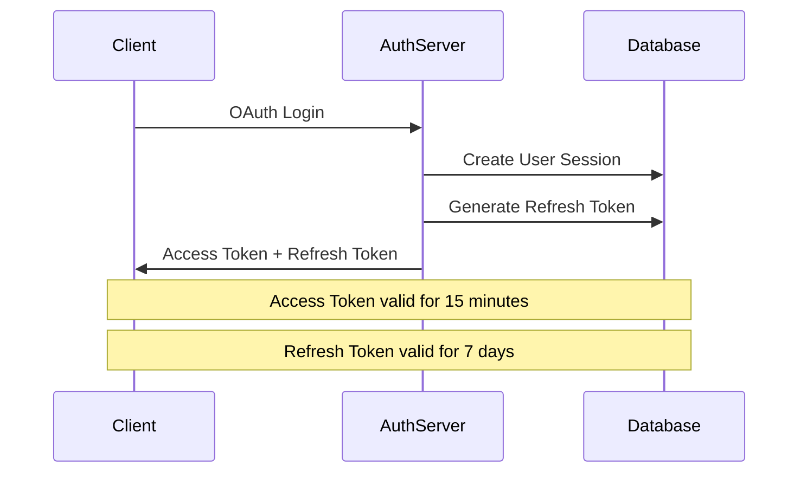
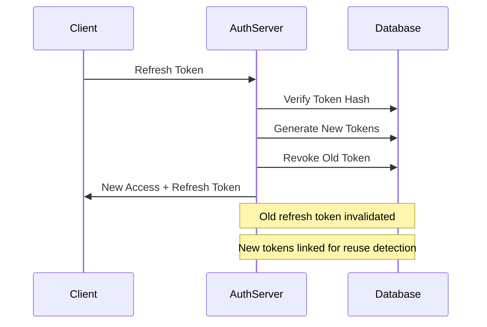
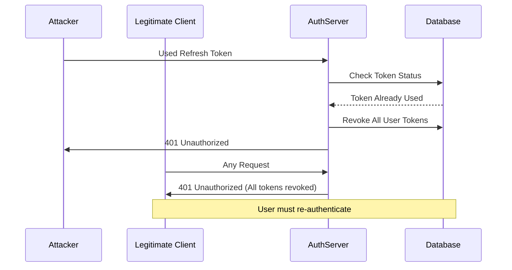

# JWT Token Rotation Security Guide

## Overview

This guide provides comprehensive documentation for the JWT token rotation system implemented in the contribux project. The system implements secure token management with refresh token rotation and reuse detection to protect against token theft and replay attacks.

## Table of Contents

1. [Architecture Overview](#architecture-overview)
2. [Security Features](#security-features)
3. [Token Lifecycle](#token-lifecycle)
4. [Implementation Details](#implementation-details)
5. [Usage Examples](#usage-examples)
6. [Error Handling](#error-handling)
7. [Security Best Practices](#security-best-practices)
8. [Troubleshooting](#troubleshooting)
9. [Monitoring and Auditing](#monitoring-and-auditing)

## Architecture Overview

The JWT token rotation system consists of two types of tokens:

### Access Tokens
- **Purpose**: Authenticate API requests
- **Lifetime**: 15 minutes
- **Format**: JWT with HS256 signature
- **Storage**: Client-side (memory/localStorage)
- **Stateless**: Self-contained and verifiable

### Refresh Tokens
- **Purpose**: Obtain new access tokens
- **Lifetime**: 7 days
- **Format**: Random token + JWT payload
- **Storage**: Database (hashed) + Client-side
- **Stateful**: Tracked server-side for security

### Token Architecture Diagram

```mermaid
graph TB
    Client[Client Application]
    AuthServer[Auth Server]
    Database[(Database)]
    
    Client -->|1. Login Request| AuthServer
    AuthServer -->|2. Generate Token Pair| Database
    AuthServer -->|3. Access + Refresh Token| Client
    
    Client -->|4. Access Token (15min)| AuthServer
    AuthServer -->|5. Validate & Respond| Client
    
    Client -->|6. Refresh Token (expired access)| AuthServer
    AuthServer -->|7. Validate & Rotate| Database
    AuthServer -->|8. New Token Pair| Client
```

## Security Features

### 1. Refresh Token Rotation

Every time a refresh token is used to obtain new access tokens, the system:
- Generates a new refresh token
- Invalidates the old refresh token
- Updates the database with the new token hash
- Links the old and new tokens for reuse detection

**Benefits:**
- Limits the window of opportunity for token theft
- Prevents indefinite token reuse
- Enables automatic compromise detection

### 2. Token Reuse Detection

The system detects and prevents refresh token reuse through:
- **Database tracking**: Each token's usage state is recorded
- **Revocation chaining**: When reuse is detected, all user tokens are revoked
- **Automatic response**: Compromised sessions are terminated immediately

**Detection triggers:**
- Using an already-used refresh token
- Using a revoked refresh token
- Attempting to use tokens from different sessions

### 3. Security Headers and Validation

```typescript
// JWT Header (HS256 algorithm)
{
  "alg": "HS256",
  "typ": "JWT"
}

// Access Token Payload
{
  "sub": "user-uuid",
  "email": "user@example.com",
  "githubUsername": "username",
  "authMethod": "oauth",
  "sessionId": "session-uuid",
  "iat": 1703980800,
  "exp": 1703981700,
  "iss": "contribux",
  "aud": ["contribux-api"],
  "jti": "token-uuid"
}
```

### 4. Token Expiration Management

| Token Type | Expiration | Cleanup |
|------------|------------|---------|
| Access Token | 15 minutes | Self-expiring (JWT) |
| Refresh Token | 7 days | Database cleanup job |
| User Session | 7 days | Session invalidation |

## Token Lifecycle

### 1. Initial Authentication



### 2. Token Refresh Flow



### 3. Token Reuse Detection



## Implementation Details

### Core Functions

#### `generateAccessToken(user, session, authMethod)`
Creates a JWT access token with user information and session details.

```typescript
const payload: AccessTokenPayload = {
  sub: user.id,
  email: user.email,
  githubUsername: user.githubUsername,
  authMethod: finalAuthMethod,
  sessionId: session.id,
  iat: now,
  exp: now + ACCESS_TOKEN_EXPIRY,
  iss: TOKEN_ISSUER,
  aud: TOKEN_AUDIENCE,
  jti: generateUUID(), // Unique JWT ID for replay protection
}
```

#### `generateRefreshToken(userId, sessionId)`
Creates a refresh token combining random data with JWT payload.

```typescript
// Generate cryptographically secure random token
const token = generateRandomToken(32)

// Store hashed version in database
const tokenHash = await createSecureHash(token)

// Create JWT payload for metadata
const payload: RefreshTokenPayload = {
  jti: result[0]?.id,
  sub: userId,
  sessionId: sessionId,
  iat: now,
  exp: now + REFRESH_TOKEN_EXPIRY,
  iss: TOKEN_ISSUER,
}
```

#### `rotateRefreshToken(oldToken)`
Implements secure token rotation with reuse detection.

```typescript
// 1. Verify old token and detect reuse
const payload = await verifyRefreshToken(oldToken)

// 2. Generate new token pair
const [newAccessToken, newRefreshToken] = await Promise.all([
  generateAccessToken(user, session),
  generateRefreshToken(user.id, session.id),
])

// 3. Revoke old token and link to new one
await revokeOldToken(oldToken, newTokenId)
```

### Database Schema

```sql
-- Refresh tokens table
CREATE TABLE refresh_tokens (
  id UUID PRIMARY KEY DEFAULT gen_random_uuid(),
  token_hash TEXT NOT NULL UNIQUE,
  user_id UUID NOT NULL REFERENCES users(id),
  session_id UUID NOT NULL REFERENCES user_sessions(id),
  expires_at TIMESTAMP NOT NULL,
  created_at TIMESTAMP DEFAULT CURRENT_TIMESTAMP,
  revoked_at TIMESTAMP,
  replaced_by UUID REFERENCES refresh_tokens(id)
);

-- Index for performance
CREATE INDEX idx_refresh_tokens_hash ON refresh_tokens(token_hash);
CREATE INDEX idx_refresh_tokens_user_id ON refresh_tokens(user_id);
CREATE INDEX idx_refresh_tokens_expires_at ON refresh_tokens(expires_at);
```

## Usage Examples

### Authentication Flow

```typescript
// 1. Create session after OAuth login
const { session, accessToken, refreshToken } = await createSession(
  user,
  'oauth',
  { ip_address: clientIp, user_agent: userAgent }
)

// 2. Store tokens securely on client
// For web apps: HTTP-only cookies (recommended)
// For mobile apps: Secure storage
```

### API Request with Access Token

```typescript
// Client-side API request
const response = await fetch('/api/protected', {
  headers: {
    'Authorization': `Bearer ${accessToken}`,
    'Content-Type': 'application/json'
  }
})

// Server-side token verification
const payload = await verifyAccessToken(token)
// Use payload.sub for user ID, payload.sessionId for session
```

### Automatic Token Refresh

```typescript
class AuthClient {
  async makeRequest(url: string, options: RequestInit = {}) {
    let response = await fetch(url, {
      ...options,
      headers: {
        'Authorization': `Bearer ${this.accessToken}`,
        ...options.headers
      }
    })

    // Handle token expiration
    if (response.status === 401) {
      await this.refreshTokens()
      
      // Retry with new token
      response = await fetch(url, {
        ...options,
        headers: {
          'Authorization': `Bearer ${this.accessToken}`,
          ...options.headers
        }
      })
    }

    return response
  }

  async refreshTokens() {
    try {
      const response = await fetch('/api/auth/refresh', {
        method: 'POST',
        headers: { 'Content-Type': 'application/json' },
        body: JSON.stringify({ refreshToken: this.refreshToken })
      })

      if (!response.ok) {
        throw new Error('Token refresh failed')
      }

      const { accessToken, refreshToken } = await response.json()
      this.accessToken = accessToken
      this.refreshToken = refreshToken
    } catch (error) {
      // Redirect to login on refresh failure
      window.location.href = '/login'
    }
  }
}
```

### Session Management

```typescript
// Refresh session activity
await refreshSession(sessionId)

// Revoke specific token
await revokeRefreshToken(refreshToken)

// Revoke all user tokens (logout from all devices)
await revokeAllUserTokens(userId, { terminateSessions: true })
```

## Error Handling

### Common Error Scenarios

| Error | Cause | Response | Action |
|-------|-------|----------|---------|
| `Token expired` | Access token past expiration | 401 | Refresh tokens |
| `Invalid token` | Malformed/tampered token | 401 | Re-authenticate |
| `Token reuse detected` | Refresh token used twice | 401 | Revoke all tokens |
| `Session expired` | Session past expiration | 401 | Re-authenticate |
| `User not found` | User deleted/disabled | 401 | Re-authenticate |

### Error Response Format

```json
{
  "error": "authentication_failed",
  "message": "Token expired",
  "code": 401,
  "timestamp": "2024-01-01T12:00:00Z"
}
```

### Client-Side Error Handling

```typescript
const handleAuthError = (error: AuthError) => {
  switch (error.code) {
    case 'TOKEN_EXPIRED':
      return refreshTokens()
    
    case 'TOKEN_REUSE_DETECTED':
      // Security incident - force re-authentication
      clearTokens()
      redirectToLogin()
      break
    
    case 'INVALID_TOKEN':
      clearTokens()
      redirectToLogin()
      break
    
    default:
      // Log unexpected errors
      console.error('Unexpected auth error:', error)
      redirectToLogin()
  }
}
```

## Security Best Practices

### 1. Token Storage

**Web Applications:**
```typescript
// ✅ Secure: HTTP-only cookies
document.cookie = `accessToken=${token}; HttpOnly; Secure; SameSite=Strict`

// ❌ Insecure: localStorage (vulnerable to XSS)
localStorage.setItem('accessToken', token)
```

**Mobile Applications:**
```typescript
// ✅ Secure: Platform-specific secure storage
// iOS: Keychain Services
// Android: Android Keystore
```

### 2. Token Transmission

```typescript
// ✅ Always use HTTPS
const response = await fetch('https://api.example.com/data', {
  headers: {
    'Authorization': `Bearer ${token}`
  }
})

// ❌ Never use HTTP for tokens
```

### 3. Token Validation

```typescript
// ✅ Validate all token claims
const payload = await verifyAccessToken(token)

// Check expiration
if (payload.exp * 1000 < Date.now()) {
  throw new Error('Token expired')
}

// Check audience
if (!payload.aud.includes('contribux-api')) {
  throw new Error('Invalid audience')
}

// Check issuer
if (payload.iss !== 'contribux') {
  throw new Error('Invalid issuer')
}
```

### 4. Rate Limiting

```typescript
// Implement rate limiting for token endpoints
const rateLimitConfig = {
  '/api/auth/refresh': { windowMs: 60000, max: 5 },
  '/api/auth/login': { windowMs: 900000, max: 5 }
}
```

### 5. Session Security

```typescript
// Implement session fingerprinting
const sessionFingerprint = {
  userAgent: req.headers['user-agent'],
  ipAddress: req.ip,
  acceptLanguage: req.headers['accept-language']
}

// Validate session context
if (!validateSessionContext(session, sessionFingerprint)) {
  throw new Error('Session context mismatch')
}
```

## Troubleshooting

### Common Issues

#### "Token reuse detected" for legitimate users

**Cause**: Network issues or concurrent requests
**Solution**: Implement exponential backoff and request deduplication

```typescript
class TokenRefreshService {
  private refreshPromise: Promise<TokenPair> | null = null

  async refreshTokens(): Promise<TokenPair> {
    // Prevent concurrent refresh requests
    if (this.refreshPromise) {
      return this.refreshPromise
    }

    this.refreshPromise = this.performRefresh()
    
    try {
      const tokens = await this.refreshPromise
      return tokens
    } finally {
      this.refreshPromise = null
    }
  }

  private async performRefresh(): Promise<TokenPair> {
    // Implement with exponential backoff
    const maxRetries = 3
    let delay = 1000

    for (let i = 0; i < maxRetries; i++) {
      try {
        return await this.makeRefreshRequest()
      } catch (error) {
        if (i === maxRetries - 1) throw error
        await new Promise(resolve => setTimeout(resolve, delay))
        delay *= 2
      }
    }
  }
}
```

#### High token rotation frequency

**Cause**: Short access token lifetime or frequent API calls
**Solution**: Implement token caching and batch requests

```typescript
class TokenManager {
  private tokenCache: Map<string, CachedToken> = new Map()
  
  async getValidToken(userId: string): Promise<string> {
    const cached = this.tokenCache.get(userId)
    
    if (cached && cached.expiresAt > Date.now() + 30000) {
      return cached.token
    }
    
    // Refresh token if expired or expiring soon (30s buffer)
    const newToken = await this.refreshToken(userId)
    this.tokenCache.set(userId, {
      token: newToken.accessToken,
      expiresAt: newToken.expiresAt
    })
    
    return newToken.accessToken
  }
}
```

#### Database connection issues during token operations

**Cause**: Database connectivity problems
**Solution**: Implement connection pooling and retry logic

```typescript
const dbConfig = {
  connectionLimit: 10,
  acquireTimeoutMillis: 30000,
  idleTimeoutMillis: 600000,
  // Retry configuration
  retry: {
    max: 3,
    timeout: 5000,
    delay: 1000
  }
}
```

### Debugging Tools

#### Token Introspection

```typescript
// Development helper for token debugging
const debugToken = (token: string) => {
  if (process.env.NODE_ENV !== 'development') return

  try {
    const [header, payload] = token.split('.')
    const decodedHeader = JSON.parse(atob(header))
    const decodedPayload = JSON.parse(atob(payload))
    
    console.log('Token Debug:', {
      header: decodedHeader,
      payload: decodedPayload,
      expiresAt: new Date(decodedPayload.exp * 1000),
      isExpired: decodedPayload.exp * 1000 < Date.now()
    })
  } catch (error) {
    console.error('Token decode error:', error)
  }
}
```

#### Audit Logging

```typescript
// Log security events for monitoring
const logSecurityEvent = async (event: SecurityEvent) => {
  await sql`
    INSERT INTO security_audit_log (
      event_type,
      user_id,
      session_id,
      ip_address,
      user_agent,
      event_data,
      timestamp
    ) VALUES (
      ${event.type},
      ${event.userId},
      ${event.sessionId},
      ${event.ipAddress},
      ${event.userAgent},
      ${JSON.stringify(event.data)},
      CURRENT_TIMESTAMP
    )
  `
}
```

## Monitoring and Auditing

### Key Metrics

1. **Token Refresh Rate**: Monitor frequency of token refresh requests
2. **Token Reuse Detection**: Track security incidents
3. **Authentication Failures**: Monitor failed authentication attempts
4. **Session Duration**: Track average session lengths
5. **Token Expiration**: Monitor token lifecycle patterns

### Audit Events

```typescript
// Security events to log
const SecurityEvents = {
  TOKEN_GENERATED: 'token_generated',
  TOKEN_REFRESHED: 'token_refreshed',
  TOKEN_REVOKED: 'token_revoked',
  TOKEN_REUSE_DETECTED: 'token_reuse_detected',
  SESSION_CREATED: 'session_created',
  SESSION_EXPIRED: 'session_expired',
  AUTHENTICATION_FAILED: 'authentication_failed'
}
```

### Monitoring Dashboard

```typescript
// Example metrics collection
const collectTokenMetrics = async () => {
  const metrics = await sql`
    SELECT 
      COUNT(*) FILTER (WHERE created_at > NOW() - INTERVAL '1 hour') as tokens_created_last_hour,
      COUNT(*) FILTER (WHERE revoked_at IS NOT NULL) as revoked_tokens,
      COUNT(*) FILTER (WHERE replaced_by IS NOT NULL) as rotated_tokens,
      AVG(EXTRACT(EPOCH FROM (COALESCE(revoked_at, expires_at) - created_at))) as avg_token_lifetime
    FROM refresh_tokens
    WHERE created_at > NOW() - INTERVAL '24 hours'
  `
  
  return metrics[0]
}
```

### Security Alerts

```typescript
// Set up alerts for security incidents
const securityAlerts = {
  async checkTokenReuseSpike() {
    const reuseCount = await sql`
      SELECT COUNT(*) as count
      FROM security_audit_log
      WHERE event_type = 'token_reuse_detected'
      AND timestamp > NOW() - INTERVAL '1 hour'
    `
    
    if (reuseCount[0].count > 10) {
      await sendSecurityAlert('High token reuse detection rate')
    }
  },
  
  async checkFailedRefreshRate() {
    const failureRate = await sql`
      SELECT 
        COUNT(*) FILTER (WHERE success = false) * 100.0 / COUNT(*) as failure_rate
      FROM security_audit_log
      WHERE event_type = 'token_refreshed'
      AND timestamp > NOW() - INTERVAL '1 hour'
    `
    
    if (failureRate[0].failure_rate > 20) {
      await sendSecurityAlert('High token refresh failure rate')
    }
  }
}
```

## Conclusion

The JWT token rotation system provides robust security for the contribux application through:

- **Short-lived access tokens** (15 minutes) to limit exposure
- **Automatic refresh token rotation** to prevent reuse
- **Reuse detection** to identify and respond to security incidents
- **Comprehensive auditing** for security monitoring
- **Proper error handling** for various failure scenarios

This implementation follows industry best practices and provides a secure foundation for authentication and session management.

## Further Reading

- [OAuth 2.0 Security Best Practices](https://tools.ietf.org/html/draft-ietf-oauth-security-topics)
- [JWT Security Best Practices](https://tools.ietf.org/html/rfc8725)
- [OWASP Authentication Cheat Sheet](https://cheatsheetseries.owasp.org/cheatsheets/Authentication_Cheat_Sheet.html)
- [Refresh Token Rotation](https://auth0.com/docs/secure/tokens/refresh-tokens/refresh-token-rotation)