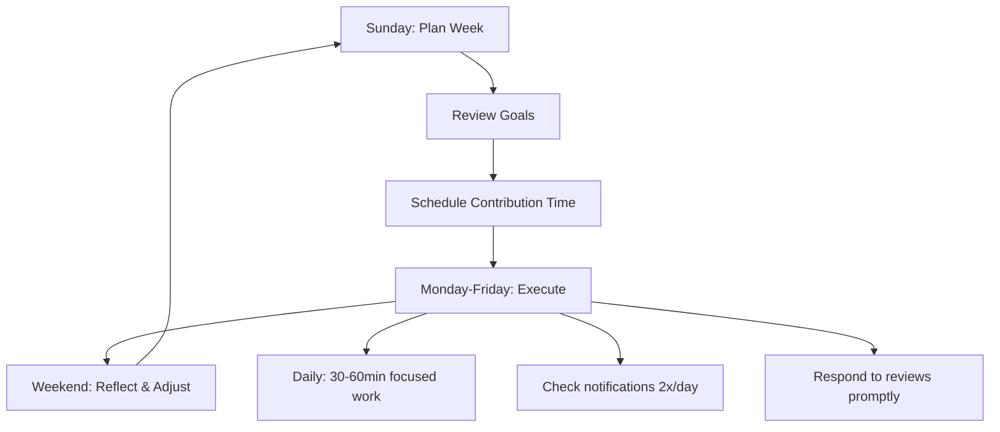
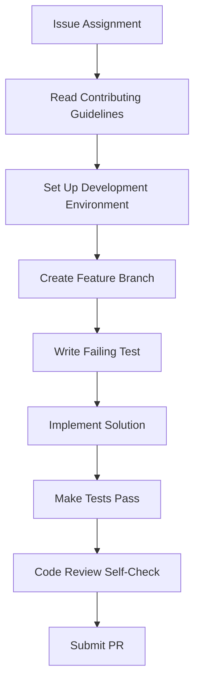
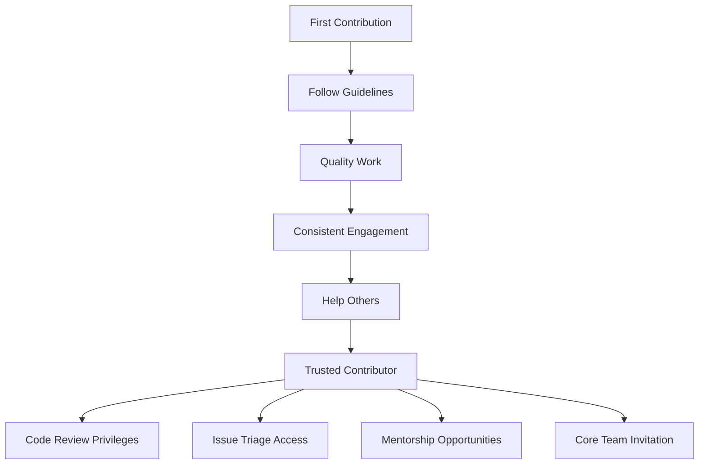

# Best Practices for Open Source Success

This guide shares proven strategies, workflows, and techniques to maximize your open source impact through Contribux. Learn from experienced contributors and avoid common pitfalls.

## 🎯 Strategic Approach

### Setting Clear Goals

#### **SMART Goals Framework**

Use SMART criteria for your open source objectives:

```text
Specific: "Learn React hooks by contributing to 3 React projects"
Measurable: "Get 5 PRs merged in the next month"
Achievable: "Start with good first issues, progress to intermediate"
Relevant: "Focus on technologies used in my job/career goals"
Time-bound: "Complete one contribution per week for 8 weeks"
```

#### **Goal Categories**

**Skill Development Goals:**
```text
Technical Skills:
└─ "Master TypeScript through real-world contributions"
└─ "Learn testing by adding test coverage to projects"
└─ "Understand CI/CD by fixing build issues"

Soft Skills:
└─ "Improve technical communication through code reviews"
└─ "Build community connections in the React ecosystem"
└─ "Develop mentorship skills by helping newcomers"
```

**Career Advancement Goals:**
```text
Portfolio Building:
└─ "Contribute to 10 repositories this year"
└─ "Get recognized as a core contributor to 2 projects"
└─ "Build a GitHub profile that demonstrates expertise"

Network Building:
└─ "Connect with 5 maintainers in my technology stack"
└─ "Speak at 1 conference about my open source experience"
└─ "Mentor 3 new contributors through their first PR"
```

### Time Management Strategy

#### **Weekly Planning**



**Sample Weekly Schedule:**
```text
Sunday (30 min):
├─ Review last week's progress
├─ Plan upcoming contributions  
├─ Update Contribux preferences
└─ Set weekly contribution goal

Monday-Wednesday (30-45 min/day):
├─ Work on active contributions
├─ Review and respond to feedback
├─ Check for new opportunities
└─ Quick community interactions

Thursday-Friday (30-60 min/day):
├─ Complete pending work
├─ Start new contributions
├─ Help other contributors
└─ Plan weekend projects

Saturday (1-2 hours):
├─ Tackle larger contributions
├─ Learn new technologies
├─ Work on documentation
└─ Mentor newcomers
```

#### **Time Blocking Technique**

```text
Contribution Time Blocks:

🌅 Morning (7-9 AM):
Purpose: Deep focus work
Best for: Complex bug fixes, new features
Energy: High, minimal distractions

🌇 Evening (6-8 PM):  
Purpose: Learning and exploration
Best for: Documentation, code review
Energy: Moderate, relaxed

🌙 Weekend (2-4 hour blocks):
Purpose: Substantial contributions
Best for: Major features, research
Energy: Variable, flexible schedule
```

## 🔍 Opportunity Selection

### Quality Over Quantity

#### **Evaluating Opportunities**

Use the **RIPE Framework**:

**Repository Health (R):**
```text
✅ Green Flags:
├─ Recent commits (within 30 days)
├─ Active maintainer responses
├─ Clear contributing guidelines
├─ Good issue templates
├─ Friendly community interactions

🚩 Red Flags:
├─ No activity for 6+ months
├─ Unanswered issues/PRs
├─ Hostile or dismissive responses
├─ No documentation
├─ Constantly breaking builds
```

**Issue Quality (I):**
```text
✅ High-Quality Issues:
├─ Clear problem description
├─ Reproduction steps provided
├─ Acceptance criteria defined
├─ Technical constraints noted
├─ Labels and priority set

🚩 Poor-Quality Issues:
├─ Vague or confusing description
├─ No steps to reproduce
├─ Missing context or requirements
├─ Conflicting information
├─ Outdated or duplicate issues
```

**Personal Fit (P):**
```text
✅ Good Fit Indicators:
├─ Matches your skill level (80-120% of comfort zone)
├─ Aligns with learning goals
├─ Reasonable time commitment
├─ Technologies you want to explore
├─ Problem you find interesting

🚩 Poor Fit Indicators:
├─ Far above or below skill level
├─ Technologies you dislike
├─ Unrealistic time requirements
├─ Conflicts with your values
├─ Repetitive or boring work
```

**Expected Impact (E):**
```text
✅ High-Impact Contributions:
├─ Fixes user-affecting bugs
├─ Improves performance significantly
├─ Adds valuable features
├─ Enhances accessibility
├─ Strengthens security

🚩 Low-Impact Contributions:
├─ Cosmetic changes only
├─ Duplicate of existing work
├─ Purely stylistic updates
├─ Very niche use cases
├─ Temporary workarounds
```

#### **The 70-20-10 Rule**

Allocate your contribution effort strategically:

```text
70% - Comfort Zone Plus:
├─ Technologies you know well
├─ Slight challenge increase
├─ High success probability
├─ Build confidence and momentum
└─ Establish contributor relationships

20% - Learning Stretch:
├─ New technologies or patterns
├─ Moderate challenge level  
├─ Significant learning potential
├─ Expand your skill set
└─ Discover new interests

10% - Moonshots:
├─ Ambitious or experimental projects
├─ High difficulty or uncertainty
├─ Major learning opportunities
├─ Potential for high impact
└─ Risk of failure is acceptable
```

### Repository Research

#### **Due Diligence Checklist**

Before committing to a contribution:

```text
✅ Maintainer Assessment:
├─ Check maintainer's other projects
├─ Review response times to issues/PRs
├─ Assess communication style
├─ Look for contribution guidelines
└─ Verify active maintenance

✅ Community Evaluation:
├─ Read recent issue discussions
├─ Check PR review quality
├─ Assess newcomer treatment
├─ Look for code of conduct
└─ Evaluate diversity and inclusion

✅ Technical Assessment:
├─ Review code quality and patterns
├─ Check test coverage and CI setup
├─ Assess documentation completeness
├─ Evaluate architectural soundness
└─ Verify compatibility requirements

✅ Project Sustainability:
├─ Check funding and sponsorship
├─ Assess bus factor (key person dependency)
├─ Review project roadmap
├─ Evaluate long-term viability
└─ Consider license compatibility
```

## 💻 Technical Excellence

### Code Quality Standards

#### **Before You Code**



**Environment Setup:**
```bash
# Standard setup for most projects
git clone <repository-url>
cd <repository-name>

# Read README and CONTRIBUTING.md first!
cat README.md
cat CONTRIBUTING.md

# Install dependencies
npm install # or yarn, pnpm, pip, etc.

# Run tests to verify setup
npm test

# Create feature branch
git checkout -b feature/issue-123-fix-validation
```

#### **Writing Quality Code**

**Code Style Principles:**
```text
Readability First:
├─ Use descriptive variable names
├─ Write self-documenting code
├─ Add comments for complex logic
├─ Follow project conventions consistently
└─ Keep functions focused and small

Testing Strategy:
├─ Write tests before implementation (TDD)
├─ Cover edge cases and error conditions
├─ Use descriptive test names
├─ Mock external dependencies appropriately
└─ Ensure tests are reliable and fast

Performance Awareness:
├─ Avoid premature optimization
├─ Profile before optimizing
├─ Consider algorithmic complexity
├─ Test with realistic data sizes
└─ Monitor impact on existing performance
```

#### **Self-Review Checklist**

Before submitting a PR:

```text
✅ Functionality:
├─ Does the code solve the stated problem?
├─ Are all requirements addressed?
├─ Do edge cases work correctly?
├─ Is error handling appropriate?
└─ Are there any side effects?

✅ Code Quality:
├─ Is the code readable and well-structured?
├─ Are names descriptive and consistent?
├─ Is the code DRY (Don't Repeat Yourself)?
├─ Are functions and classes appropriately sized?
└─ Does it follow project conventions?

✅ Testing:
├─ Do all tests pass?
├─ Is new functionality tested?
├─ Are edge cases covered?
├─ Are error conditions tested?
└─ Is test coverage adequate?

✅ Documentation:
├─ Are code comments helpful and accurate?
├─ Is README updated if needed?
├─ Are API docs updated?
├─ Are breaking changes documented?
└─ Are examples provided where helpful?
```

### Pull Request Excellence

#### **PR Title and Description**

**Good PR Title Examples:**
```text
✅ "Fix validation error in user registration form"
✅ "Add TypeScript support for API client"
✅ "Improve performance of data filtering by 40%"
✅ "Update documentation for new authentication flow"

❌ "Fix bug"
❌ "Update code"
❌ "Changes"
❌ "WIP stuff"
```

**PR Description Template:**
```markdown
## Summary
Brief description of what this PR does and why.

## Changes
- Specific change 1
- Specific change 2  
- Specific change 3

## Testing
- [ ] Unit tests pass
- [ ] Integration tests pass
- [ ] Manual testing completed
- [ ] Edge cases verified

## Breaking Changes
None / List any breaking changes

## Screenshots
Include before/after screenshots for UI changes

## Notes for Reviewers
Any specific areas you'd like reviewers to focus on

Fixes #123
```

#### **PR Best Practices**

**Size and Scope:**
```text
Ideal PR Characteristics:
├─ Single, focused change
├─ <400 lines of code changes
├─ Clear, atomic commits
├─ Complete feature/fix (not partial)
└─ Easy to review and understand

When to Split PRs:
├─ Multiple unrelated changes
├─ Large feature with logical boundaries
├─ Refactoring + new functionality
├─ Dependencies can be separated
└─ Review complexity is too high
```

**Commit Strategy:**
```bash
# Good commit message format
git commit -m "feat: add user authentication middleware

- Implement JWT token validation
- Add role-based access control
- Include comprehensive error handling
- Add unit tests for all scenarios

Fixes #234"

# Atomic commits for complex changes
git commit -m "refactor: extract validation logic into utilities"
git commit -m "feat: add email validation support"
git commit -m "test: add comprehensive validation tests"
git commit -m "docs: update API documentation"
```

## 🤝 Community Engagement

### Communication Excellence

#### **Effective Issue Communication**

**Claiming an Issue:**
```text
❌ "I'll take this"
❌ "Can I work on this?"

✅ "I'd like to work on this issue. I have experience with [relevant technology] and understand the problem. My approach would be to [brief description]. Should I proceed?"

✅ "I'm interested in tackling this. I've looked at the codebase and think I could implement this by [approach]. Would this direction work? Any specific requirements or concerns I should consider?"
```

**Asking for Help:**
```text
❌ "This doesn't work, please help"
❌ "I'm stuck"

✅ "I'm working on issue #123 and encountering an unexpected behavior. When I [specific action], I expect [expected result] but I'm getting [actual result]. I've tried [approaches attempted]. Could you point me in the right direction?"

✅ "I'm implementing the solution for #123 and have a question about the preferred approach. Would you prefer [option A] or [option B]? Here's my reasoning for each: [explanation]"
```

#### **Code Review Participation**

**Receiving Feedback:**
```text
✅ Positive Responses:
├─ "Thank you for the feedback! I'll address these points."
├─ "Great catch on the edge case. I'll add a test for that."
├─ "I see what you mean about the naming. How about [alternative]?"
├─ "I hadn't considered that approach. Let me refactor."
└─ "That's a good point about performance. I'll optimize that section."

❌ Defensive Responses:
├─ "That's not how I would do it"
├─ "The code works fine"
├─ "That's not important"
├─ "You don't understand the requirements"
└─ "This is good enough"
```

**Providing Feedback:**
```text
✅ Constructive Feedback:
├─ "Consider using a Map here for O(1) lookup instead of Array.find()"
├─ "This function is getting large. Could we extract the validation logic?"
├─ "Great solution! One suggestion: could we add error handling for the API call?"
├─ "The logic looks correct. For consistency with the rest of the codebase, could you use the existing utility function?"

❌ Unhelpful Feedback:
├─ "This is wrong"
├─ "Bad code"
├─ "You should know this"
├─ "This won't work"
└─ "Change everything"
```

### Building Relationships

#### **Maintainer Relationships**

**Building Trust:**
```text
Early Interactions:
├─ Follow project guidelines meticulously
├─ Ask clarifying questions upfront
├─ Deliver on promises and timelines
├─ Accept feedback gracefully
└─ Help other contributors

Ongoing Relationships:
├─ Provide thoughtful code reviews
├─ Help triage new issues
├─ Improve documentation
├─ Mentor newcomers
└─ Advocate for the project
```

**Becoming a Trusted Contributor:**


#### **Community Contribution**

**Beyond Code:**
```text
Documentation:
├─ Improve README clarity
├─ Add code examples
├─ Create tutorials
├─ Update outdated docs
└─ Translate documentation

Community Support:
├─ Answer questions in issues
├─ Help newcomers in Discord/Slack
├─ Create video tutorials
├─ Write blog posts
└─ Speak at conferences

Project Health:
├─ Triage and label issues
├─ Test and confirm bugs
├─ Improve CI/CD processes
├─ Enhance security
└─ Optimize performance
```

## 📈 Growth and Learning

### Skill Development Strategy

#### **Progressive Skill Building**

```text
Beginner → Intermediate:
├─ Focus on one language/framework
├─ Master fundamental patterns
├─ Learn debugging techniques
├─ Understand testing basics
└─ Practice code review

Intermediate → Advanced:
├─ Contribute to multiple projects
├─ Learn architecture patterns
├─ Master advanced debugging
├─ Write comprehensive tests
└─ Mentor other contributors

Advanced → Expert:
├─ Design new features
├─ Lead technical discussions
├─ Maintain open source projects
├─ Speak at conferences
└─ Influence technology direction
```

#### **Learning Through Contribution**

**Deliberate Learning:**
```text
Choose Contributions for Learning:
├─ New technology patterns
├─ Advanced language features
├─ Different architectural approaches
├─ Testing methodologies
└─ Performance optimization techniques

Document Your Learning:
├─ Keep a contribution journal
├─ Write about challenges and solutions
├─ Share learnings with the community
├─ Create tutorials for others
└─ Reflect on skill improvements
```

### Career Integration

#### **Portfolio Building**

**Strategic Contributions:**
```text
Showcase Projects:
├─ Contribute to well-known projects
├─ Lead meaningful improvements
├─ Demonstrate diverse skills
├─ Show consistent involvement
└─ Document impact clearly

Portfolio Presentation:
├─ Curate your best contributions
├─ Write clear contribution summaries
├─ Highlight learning and growth
├─ Show community involvement
└─ Demonstrate leadership
```

#### **Professional Development**

**Networking Opportunities:**
```text
Conference Participation:
├─ Apply for speaking opportunities
├─ Attend open source tracks
├─ Join contributor meetups
├─ Participate in hackathons
└─ Volunteer at events

Online Presence:
├─ Write technical blog posts
├─ Share insights on social media
├─ Participate in podcasts
├─ Create educational content
└─ Contribute to discussions
```

## 🚫 Common Pitfalls to Avoid

### Technical Pitfalls

#### **Code Quality Issues**

```text
❌ Common Mistakes:
├─ Not reading contributing guidelines
├─ Ignoring existing code patterns
├─ Submitting untested code
├─ Making unrelated changes in the same PR
├─ Breaking existing functionality
├─ Poor commit messages
└─ Inadequate documentation

✅ Prevention Strategies:
├─ Always read project documentation first
├─ Study existing code before writing new code
├─ Run all tests before submitting
├─ Keep PRs focused and atomic
├─ Test thoroughly, including edge cases
├─ Write clear, descriptive commits
└─ Update documentation with changes
```

#### **Process Violations**

```text
❌ Process Mistakes:
├─ Working on assigned issues
├─ Not communicating progress
├─ Abandoning work without notice
├─ Arguing with maintainers
├─ Ignoring feedback
├─ Submitting duplicate work
└─ Bypassing review processes

✅ Best Practices:
├─ Always ask before claiming issues
├─ Provide regular progress updates
├─ Communicate if you need to step away
├─ Engage constructively with feedback
├─ Implement requested changes promptly
├─ Check for existing work first
└─ Respect established processes
```

### Social Pitfalls

#### **Communication Problems**

```text
❌ Poor Communication:
├─ Being defensive about feedback
├─ Not asking questions when confused
├─ Making assumptions about requirements
├─ Being impatient with response times
├─ Dismissing suggestions rudely
├─ Taking credit for others' work
└─ Creating drama or conflict

✅ Effective Communication:
├─ Accept feedback gracefully
├─ Ask clarifying questions early
├─ Confirm understanding of requirements
├─ Be patient with volunteer maintainers
├─ Consider suggestions thoughtfully
├─ Give credit where due
└─ Maintain professionalism always
```

### Time Management Pitfalls

#### **Overcommitment**

```text
❌ Unsustainable Patterns:
├─ Taking on too many issues simultaneously
├─ Promising unrealistic timelines
├─ Not accounting for learning time
├─ Ignoring other life responsibilities
├─ Burning out from overwork
├─ Creating stress and pressure
└─ Delivering poor quality due to rush

✅ Sustainable Approach:
├─ Limit active contributions (1-3 at most)
├─ Set realistic timelines with buffer
├─ Account for learning curve
├─ Maintain work-life balance
├─ Take breaks when needed
├─ Focus on quality over quantity
└─ Communicate limitations honestly
```

## 🎯 Success Metrics

### Personal Success Indicators

#### **Quantitative Metrics**

```text
Contribution Metrics:
├─ PRs merged per month
├─ Success rate (merged/submitted)
├─ Average time to merge
├─ Lines of code contributed
├─ Issues resolved
├─ Projects contributed to
└─ Community interactions

Skill Development:
├─ New technologies learned
├─ Confidence levels improved
├─ Complexity of contributions increased
├─ Code review skills developed
├─ Mentoring relationships formed
└─ Leadership roles assumed
```

#### **Qualitative Indicators**

```text
Relationship Quality:
├─ Positive feedback from maintainers
├─ Invitations to contribute more
├─ Requests for code reviews
├─ Mentorship opportunities offered
├─ Conference speaking invitations
├─ Job opportunities from network
└─ Recognition in the community

Personal Growth:
├─ Increased confidence in coding
├─ Better problem-solving skills
├─ Improved communication abilities
├─ Stronger technical writing
├─ Enhanced debugging skills
├─ Greater empathy for users
└─ Deeper understanding of software engineering
```

### Setting Benchmarks

#### **Progressive Goals**

```text
Month 1-3 (Foundation):
├─ Complete 5 successful contributions
├─ Learn 1 new technology through contributions
├─ Establish relationships with 2 maintainers
├─ Achieve 80%+ merge rate
└─ Help 1 other newcomer

Month 4-6 (Growth):
├─ Complete 15 total contributions
├─ Contribute to 5 different projects
├─ Learn 2 additional technologies
├─ Provide 10 code reviews
└─ Mentor 2 newcomers

Month 7-12 (Expertise):
├─ Complete 30+ total contributions
├─ Become a regular contributor to 2 projects
├─ Lead a feature implementation
├─ Speak about your experience
└─ Mentor 5+ newcomers
```

## 🔄 Continuous Improvement

### Regular Reflection

#### **Weekly Reviews**

```text
Weekly Reflection Questions:
├─ What did I learn this week?
├─ What challenges did I face?
├─ How could I improve my approach?
├─ What relationships did I build?
├─ How did I help the community?
├─ What should I focus on next week?
└─ Am I maintaining a healthy balance?
```

#### **Monthly Assessments**

```text
Monthly Deep Dive:
├─ Review contribution statistics
├─ Assess skill development progress
├─ Evaluate relationship quality
├─ Identify areas for improvement
├─ Update learning goals
├─ Plan focus for next month
└─ Celebrate achievements
```

### Adaptation Strategies

#### **Responding to Feedback**

```text
Feedback Integration Process:
├─ Collect feedback from multiple sources
├─ Identify patterns and themes
├─ Prioritize areas for improvement
├─ Create specific action plans
├─ Implement changes gradually
├─ Monitor results and adjust
└─ Share learnings with others
```

---

## 🎉 Your Journey to Success

Following these best practices will help you build a successful and sustainable open source contribution practice. Remember:

- **Start small** and build momentum
- **Focus on quality** over quantity
- **Build relationships** with the community
- **Learn continuously** from every experience
- **Give back** by helping others
- **Maintain balance** and avoid burnout

Your contributions to open source can transform both your career and the software that millions of people use every day. Embrace the journey, learn from every experience, and enjoy being part of the global developer community.

**Related Resources:**
- [Getting Started Guide](./getting-started.md)
- [Feature Walkthroughs](./features/README.md)
- [Troubleshooting Guide](./troubleshooting.md)
- [Community Guidelines](./community-guidelines.md)