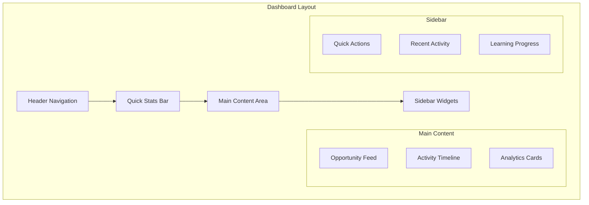

# Dashboard Overview

Your Contribux dashboard is the central hub for discovering opportunities, tracking your progress, and managing your open source journey. This guide will help you understand and make the most of every dashboard feature.

## Dashboard Layout



## Header Navigation

### Primary Navigation
- **🏠 Dashboard** - Your main feed (current page)
- **🔍 Discover** - Browse and search opportunities
- **📊 Analytics** - Detailed contribution statistics
- **⚙️ Settings** - Profile and preferences
- **🎯 Goals** - Learning objectives and milestones

### Quick Actions
- **🔔 Notifications** (badge shows unread count)
- **👤 Profile Menu** - Account options and sign out
- **❓ Help** - Documentation and support

### Search Bar
```text
🔍 Search opportunities, repositories, or skills...
```

**Search Examples:**
- `React hooks` - Find React-related opportunities
- `good first issue` - Beginner-friendly tasks
- `documentation` - Writing and editing opportunities
- `bug fix Python` - Python bug fixing tasks

## Quick Stats Bar

Get an instant overview of your contribution activity:

```text
┌─────────────────────────────────────────────────────────┐
│ 📈 This Week: 3 PRs • 🎯 Success Rate: 87% • ⭐ Impact: 142 pts │
└─────────────────────────────────────────────────────────┘
```

### Key Metrics
- **PRs This Week** - Recent contribution activity
- **Success Rate** - Percentage of merged contributions
- **Impact Points** - Weighted score based on contribution significance
- **Active Streaks** - Consecutive days/weeks with contributions

## Main Content Area

### Opportunity Feed

Your personalized feed shows AI-matched opportunities:

```text
┌─────────────────────────────────────────────────────┐
│ 🟢 Perfect Match (98% compatibility)                │
│                                                     │
│ Add TypeScript support to API client                │
│ awesome-lib/typescript-client                       │
│                                                     │
│ 💡 Impact: 8/10  ⚡ Complexity: 4/10  🎯 Fit: 9/10 │
│ ⏰ Est. Time: 4-6 hours  📚 Skills: TypeScript, APIs│
│                                                     │
│ This issue involves converting JavaScript utility   │
│ functions to TypeScript with proper type def...     │
│                                                     │
│ 🚀 Why it's perfect for you:                       │
│ • Matches your TypeScript learning goal             │
│ • API experience from your profile                  │
│ • Right complexity level for your skill            │
│                                                     │
│ [View Details] [I'm Interested] [Skip] [Save]       │
└─────────────────────────────────────────────────────┘
```

#### Feed Customization

**Filter Options:**
```text
📊 Difficulty: [All] [Beginner] [Intermediate] [Advanced]
💻 Languages: [All] [JavaScript] [Python] [Go] [Rust]
🏷️ Types: [All] [Bug Fix] [Feature] [Docs] [Testing]
⏱️ Time: [All] [Quick] [Short] [Medium] [Long]
```

**Sort Options:**
- **Smart Ranking** (default) - AI-optimized recommendations
- **Best Match** - Highest compatibility scores
- **Impact** - Highest potential impact
- **Recent** - Newest opportunities
- **Trending** - Popular in community

### Activity Timeline

Track your recent contributions and milestones:

```text
🕐 Today
├─ 🎉 PR #1234 merged in awesome-project/frontend
├─ 💬 Commented on issue in react-utils/hooks
└─ 👀 Viewed 3 new opportunities

🕐 Yesterday  
├─ 🚀 Opened PR #5678 in typescript-lib/core
├─ ⭐ Starred 2 interesting repositories
└─ 📊 Completed weekly learning goal

🕐 This Week
├─ 🏆 Earned "TypeScript Contributor" badge
├─ 🎯 Reached 50% of monthly contribution goal
└─ 📈 Impact score increased by 23 points
```

### Analytics Cards

Quick insights into your contribution patterns:

#### **Contribution Velocity**
```text
┌─────────────────────┐
│ Weekly Contributions │
│                     │
│ ▁▃▇▅▆▄▂ (7 days)   │
│                     │
│ This week: 4 PRs    │
│ Avg: 3.2 PRs        │
│ Trend: ↗ +25%       │
└─────────────────────┘
```

#### **Skill Development**
```text
┌─────────────────────┐
│ Skills This Month   │
│                     │
│ TypeScript: ████▒   │
│ React: ███▒▒        │
│ Testing: ██▒▒▒      │
│                     │
│ 3 skills improved   │
└─────────────────────┘
```

#### **Success Metrics**
```text
┌─────────────────────┐
│ Contribution Health │
│                     │
│ Merge Rate: 87%     │
│ Avg Review: 2.3 days│
│ Response: 4.2 hours │
│                     │
│ Quality: Excellent  │
└─────────────────────┘
```

## Sidebar Widgets

### Quick Actions

Fast access to common tasks:

```text
┌─────────────────────┐
│ ⚡ Quick Actions     │
├─────────────────────┤
│ 🔍 Find Opportunity │
│ 📝 Update Profile   │
│ 🎯 Set New Goal     │
│ 📊 View Full Stats  │
│ 🏷️ Manage Interests │
│ ⚙️ Preferences      │
└─────────────────────┘
```

### Recent Activity

Latest contributions and interactions:

```text
┌─────────────────────┐
│ 📱 Recent Activity  │
├─────────────────────┤
│ 🔀 PR merged        │
│ typescript-client   │
│ 2 hours ago         │
├─────────────────────┤
│ 💬 Issue comment    │
│ react-hooks-lib     │
│ 4 hours ago         │
├─────────────────────┤
│ ⭐ Repository saved │
│ vue-components      │
│ 1 day ago           │
└─────────────────────┘
```

### Learning Progress

Track your skill development:

```text
┌─────────────────────┐
│ 📚 Learning Goals   │
├─────────────────────┤
│ TypeScript Mastery  │
│ ████████▒▒ 75%      │
│ 3 contributions     │
├─────────────────────┤
│ React Patterns      │
│ ██████▒▒▒▒ 60%      │
│ 2 contributions     │
├─────────────────────┤
│ API Design          │
│ ███▒▒▒▒▒▒▒ 30%      │
│ 1 contribution      │
└─────────────────────┘
```

## Dashboard Personalization

### Layout Options

**Compact View:**
```text
Opportunity cards show essential info only
├─ Title and repository
├─ Key metrics (impact, complexity, time)
└─ Quick action buttons
```

**Detailed View:**
```text
Opportunity cards include full information
├─ Complete description
├─ AI analysis summary
├─ Learning benefits
├─ Implementation hints
└─ Extended action options
```

**List View:**
```text
Table format for power users
├─ Sortable columns
├─ Bulk actions
├─ Advanced filtering
└─ Export options
```

### Widget Arrangement

Customize your sidebar widgets:

```text
Available Widgets:
☑ Quick Actions
☑ Recent Activity  
☑ Learning Progress
☑ Trending Repos
☐ Community Feed
☐ Achievement Showcase
☐ Repository Watchlist
☐ Contribution Calendar
```

**Drag and Drop:** Rearrange widgets by dragging them to your preferred order.

### Theme Options

**Light Theme** (default)
- Clean, bright interface
- Optimal for daytime use
- High contrast for readability

**Dark Theme**
- Reduced eye strain
- Perfect for evening coding
- Sleek, modern appearance

**Auto Theme**
- Follows system preference
- Switches automatically
- Consistent with OS settings

## Mobile Dashboard

### Responsive Design

The dashboard adapts seamlessly to mobile devices:

**Mobile-First Features:**
- Swipe navigation between sections
- Touch-optimized opportunity cards
- Simplified filtering interface
- Quick action buttons

**Mobile-Specific Views:**
- **📱 Cards** - Swipeable opportunity cards
- **📋 List** - Condensed list view
- **📊 Stats** - Key metrics overview
- **🔔 Notifications** - Mobile-optimized alerts

### Touch Gestures

- **Swipe Left** - Mark opportunity as "Not Interested"
- **Swipe Right** - Add to "Interested" list
- **Tap and Hold** - Quick preview
- **Pull to Refresh** - Update feed
- **Double Tap** - Open opportunity details

## Dashboard Keyboard Shortcuts

### Navigation
- `G + H` - Go to Dashboard (Home)
- `G + D` - Go to Discover
- `G + A` - Go to Analytics
- `G + S` - Go to Settings
- `G + P` - Go to Profile

### Actions
- `R` - Refresh feed
- `F` - Focus search bar
- `N` - View notifications
- `?` - Show all shortcuts

### Opportunity Actions
- `J` / `K` - Navigate up/down through opportunities
- `Enter` - Open selected opportunity
- `I` - Mark as "Interested"
- `S` - Save for later
- `X` - Skip/hide opportunity

## Dashboard Insights

### AI Recommendations

The dashboard learns from your behavior:

**Interaction Tracking:**
- Opportunities you view vs. skip
- Projects you star or follow
- Skills you're actively developing
- Time of day you're most active

**Adaptive Recommendations:**
- More accurate matching over time
- Personalized difficulty progression
- Seasonal and trending project suggestions
- Learning path optimization

### Success Indicators

Green indicators show optimal conditions:

- **🟢 Active Repository** - Recent commits and responsiveness
- **🟢 Skill Match** - Strong alignment with your abilities  
- **🟢 Learning Opportunity** - Develops your target skills
- **🟢 Time Fit** - Matches your availability
- **🟢 Community Welcome** - Beginner-friendly maintainers

## Dashboard Performance

### Loading Optimization

**Fast Initial Load:**
- Critical content renders first
- Progressive enhancement
- Cached user preferences
- Optimized API calls

**Smart Pagination:**
- Infinite scroll for opportunities
- Lazy loading of images and details
- Background prefetching
- Offline capability for viewed content

### Real-time Updates

**Live Data Sync:**
- New opportunities appear automatically
- Contribution status updates instantly
- Real-time notification badges
- Activity feed refreshes seamlessly

## Getting Help

### Dashboard Issues

**Common Problems:**
- **Empty Feed** - Check your [profile preferences](../profile-setup.md)
- **Slow Loading** - Try refreshing or clearing browser cache
- **Missing Features** - Ensure JavaScript is enabled
- **Mobile Issues** - Update to latest app version

**Support Options:**
- **📚 Documentation** - Complete feature guides
- **💬 Community** - Ask in our Discord
- **📧 Support** - Contact [support@contribux.ai](mailto:support@contribux.ai)
- **🐛 Bug Reports** - Use GitHub issues

### Dashboard Tips

**Maximize Effectiveness:**
1. **Complete Your Profile** - Better matching requires good data
2. **Set Learning Goals** - Guide the AI recommendations
3. **Provide Feedback** - Like/dislike opportunities to improve suggestions
4. **Stay Active** - Regular usage improves recommendation quality
5. **Explore Settings** - Customize to match your workflow

---

Your dashboard is designed to evolve with you. The more you use Contribux, the smarter your recommendations become. Start with the basics and gradually explore advanced features as you grow your open source presence.

**Next Steps:**
- [Understanding Opportunity Cards](./opportunity-cards.md)
- [Smart Notifications Setup](./smart-notifications.md)
- [Contribution Tracking](./contribution-tracking.md)