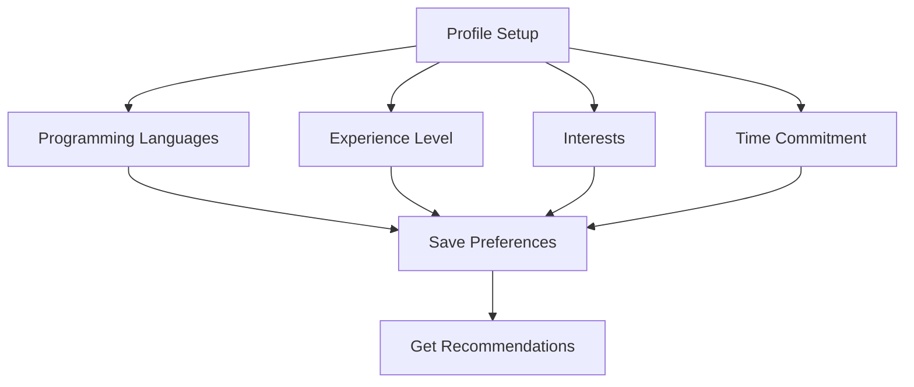
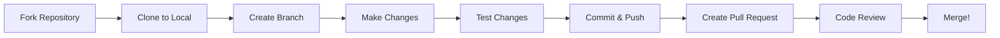

# Getting Started with Contribux

Welcome to Contribux! This guide will help you set up your account and make your first open source contribution in just a few steps.

## What You'll Need

- **GitHub Account**: Required for authentication and contribution tracking
- **Programming Experience**: Any level - we have opportunities for beginners to experts
- **15 Minutes**: To complete the initial setup

## Step 1: Create Your Account

### Sign Up with GitHub

1. **Visit** [https://contribux.ai](https://contribux.ai)
2. **Click** "Sign up with GitHub"
3. **Authorize** Contribux to access your GitHub profile
4. **Complete** the onboarding flow

### What We Access

Contribux only requests access to:

- ✅ Your public GitHub profile information
- ✅ Your public repositories (to understand your experience)
- ✅ Public contribution activity
- ❌ **We never access private repositories or write to your account**

## Step 2: Set Up Your Profile

After signing up, you'll be guided through profile setup:

### Basic Information



#### **Programming Languages**

- Select languages you know: JavaScript, Python, Go, Rust, etc.
- Include languages you want to learn
- Don't worry about being an expert - select what you're comfortable with

#### **Experience Level**

- **Beginner**: New to programming or open source
- **Intermediate**: 1-3 years of experience, some GitHub knowledge
- **Advanced**: 3+ years, comfortable with complex projects

#### **Areas of Interest**

- Frontend (React, Vue, Angular)
- Backend (APIs, databases, servers)
- DevOps (CI/CD, infrastructure, monitoring)
- Mobile (iOS, Android, React Native)
- Data Science (ML, analytics, visualization)
- Security (authentication, cryptography)

#### **Time Commitment**

- How much time you can dedicate per week
- This helps us recommend appropriately-sized tasks

### Example Profile Setup

```json
{
  "languages": ["JavaScript", "TypeScript", "Python"],
  "experience_level": "intermediate",
  "interests": ["frontend", "api-development"],
  "time_commitment": "5-10 hours/week",
  "difficulty_preference": "beginner-to-intermediate",
  "notification_preferences": {
    "email_opportunities": true,
    "email_frequency": "weekly"
  }
}
```

## Step 3: Explore Your Dashboard

Once your profile is set up, you'll see your personalized dashboard:

### Dashboard Sections

#### **🎯 Recommended for You**

- Projects matched to your skills and interests
- AI-analyzed opportunities with difficulty ratings
- Clear descriptions of what's needed

#### **📈 Your Stats**

- Contribution count and success rate
- Languages you've contributed to
- Impact metrics (lines of code, issues resolved)

#### **🔄 Recent Activity**

- Your latest contributions
- Repositories you've starred or watched
- Community interactions

#### **📚 Learning Path**

- Suggested skills to develop
- Tutorial recommendations
- Contribution opportunities that teach new concepts

## Step 4: Find Your First Opportunity

### Using Smart Recommendations

The easiest way to start is with our AI recommendations:

1. **Review** the "Recommended for You" section
2. **Click** on an interesting opportunity
3. **Read** the detailed description and requirements
4. **Check** the estimated time and difficulty
5. **Click** "I'm Interested" to get started

### Understanding Opportunity Cards

Each opportunity shows:

```text
┌─────────────────────────────────────────┐
│ 🟢 Good First Issue                     │
│                                         │
│ Add dark mode toggle to settings        │
│ awesome-web-app/frontend                │
│                                         │
│ 📊 Difficulty: Beginner                 │
│ ⏱️  Estimated: 2-3 hours               │
│ 🏷️  Tags: React, CSS, UI/UX            │
│                                         │
│ The app needs a dark mode option for    │
│ better user experience in low light... │
│                                         │
│ 💡 You'll Learn: CSS variables, React  │
│    state management, theming            │
│                                         │
│ [View on GitHub] [I'm Interested]       │
└─────────────────────────────────────────┘
```

### Filtering Opportunities

Use filters to find exactly what you want:

- **Difficulty**: Beginner, Intermediate, Advanced
- **Time Required**: Quick (1-2 hours) to Extended (1+ weeks)
- **Type**: Bug fixes, New features, Documentation, Testing
- **Languages**: Filter by programming language
- **Topics**: Frontend, backend, mobile, etc.

## Step 5: Make Your First Contribution

### Before You Start

1. **Read the issue thoroughly** on GitHub
2. **Check the repository's CONTRIBUTING.md** file
3. **Look for any specific requirements** or style guides
4. **Comment on the issue** to let maintainers know you're working on it

### Basic Contribution Workflow



### Detailed Steps

#### **1. Fork and Clone**

```bash
# Fork the repository on GitHub, then:
git clone https://github.com/YOUR_USERNAME/REPOSITORY_NAME.git
cd REPOSITORY_NAME
```

#### **2. Create a Branch**

```bash
git checkout -b feature/add-dark-mode-toggle
```

#### **3. Make Your Changes**

- Follow the existing code style
- Add comments where helpful
- Test your changes locally

#### **4. Commit Your Work**

```bash
git add .
git commit -m "feat: add dark mode toggle to settings page

- Added toggle component to settings
- Implemented theme persistence in localStorage
- Updated CSS variables for dark theme
- Added accessibility attributes

Fixes #123"
```

#### **5. Push and Create PR**

```bash
git push origin feature/add-dark-mode-toggle
```

Then create a Pull Request on GitHub.

### Pull Request Best Practices

**Good PR Title and Description:**

```text
feat: add dark mode toggle to settings page

## Summary
Adds a dark mode toggle to the settings page that allows users to switch between light and dark themes.

## Changes
- Added `ThemeToggle` component with accessibility support
- Implemented theme persistence using localStorage
- Updated CSS custom properties for dark theme
- Added smooth transitions between themes

## Testing
- [x] Toggle works in all browsers
- [x] Theme persists after page reload
- [x] Accessible via keyboard navigation
- [x] Respects user's system theme preference

## Screenshots
[Before/After screenshots would go here]

Fixes #123
```

## Step 6: Track Your Progress

### Contribution Tracking

Contribux automatically tracks:

- **Pull Requests**: Submitted, merged, and closed
- **Impact**: Lines of code, files changed
- **Skills**: Languages and frameworks you've worked with
- **Repositories**: Projects you've contributed to

### Setting Goals

Set personal goals to stay motivated:

- "Contribute to 5 projects this month"
- "Learn React by working on frontend issues"
- "Help maintain an open source library"
- "Earn the 'Community Helper' badge"

### Achievement System

Earn badges for milestones:

- 🎯 **First Contribution**: Your first merged PR
- 🔥 **Week Streak**: Contributed 7 days in a row
- 🌟 **Rising Star**: 10 contributions in a month
- 🏆 **Open Source Hero**: 100 merged contributions
- 👨‍🏫 **Mentor**: Helped 5 new contributors

## Common Questions

### "I'm not sure if I'm ready"

**You are!** Every expert was once a beginner. Start with:

- Documentation improvements
- Fixing typos or broken links
- Adding tests for existing functionality
- Implementing simple UI improvements

### "What if I make a mistake?"

**Mistakes are normal!** They're part of learning. Remember:

- Code review catches issues before merging
- Git makes it easy to revert changes
- Maintainers are usually helpful and patient
- You can always ask questions

### "How do I choose the right project?"

Look for projects that:

- ✅ Have clear contributing guidelines
- ✅ Respond to issues and PRs regularly
- ✅ Have a welcoming community
- ✅ Match your skill level and interests
- ✅ Have good "good first issue" labels

### "The issue seems too complex"

If an issue feels overwhelming:

- Break it down into smaller steps
- Ask questions in the issue comments
- Look for simpler issues in the same project
- Consider pairing with an experienced contributor

## Next Steps

Now that you're set up:

1. **[Set Up Your Development Environment](./development-setup.md)**
2. **[Learn About Good First Issues](./good-first-issues.md)**
3. **[Master the Pull Request Process](./first-pull-request.md)**
4. **[Join the Community](./community.md)**

## Getting Help

If you need assistance:

- **Documentation**: Check our [comprehensive guides](./README.md)
- **Community**: Join our [Discord server](https://discord.gg/contribux)
- **Support**: Email [support@contribux.ai](mailto:support@contribux.ai)
- **GitHub**: Open an issue in our [public repository](https://github.com/contribux/contribux)

## Tips for Success

### Start Small

- Choose issues labeled "good first issue"
- Look for documentation improvements
- Fix simple bugs before tackling features

### Be Consistent

- Set aside regular time for contributions
- Even 30 minutes a week makes a difference
- Build momentum with small, regular contributions

### Learn Continuously

- Read other people's code
- Study how experienced contributors work
- Don't be afraid to ask questions

### Give Back

- Help other newcomers once you gain experience
- Improve documentation based on your learning
- Share your contribution journey

Welcome to the open source community! Your first contribution is just the beginning of an exciting journey. 🚀
