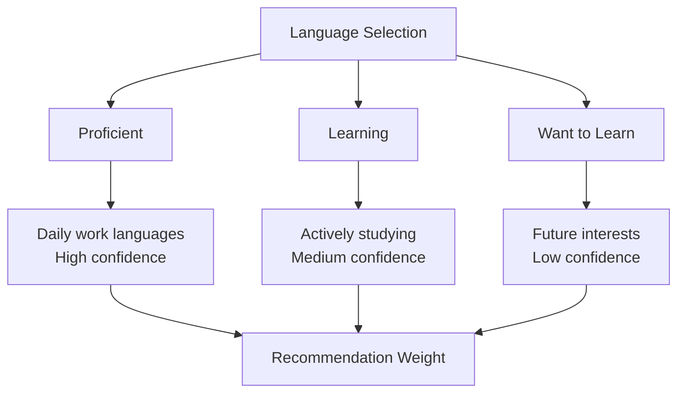

# User Preferences and Customization

Take control of your Contribux experience by customizing preferences, notifications, and matching criteria. This guide shows you how to optimize every aspect of the platform for your needs.

## Overview

Your preferences control:
- 🎯 **Opportunity Matching** - What types of contributions you see
- 🔔 **Notifications** - When and how you're alerted
- 🎨 **Interface** - How the platform looks and behaves
- 📊 **Privacy** - What information you share
- 🤖 **AI Behavior** - How recommendations are generated

Access preferences via **Settings** → **Preferences** or click your profile avatar.

## Opportunity Matching Preferences

### Programming Languages

Control which technologies appear in your recommendations:



#### **Proficiency Levels**

**Expert (8-10/10):**
- Professional experience (2+ years)
- Can mentor others
- Complex architecture decisions
- **Recommendation Weight:** 40%

**Proficient (6-7/10):**
- Comfortable for most projects
- Independent problem solving
- Some mentoring capability
- **Recommendation Weight:** 35%

**Intermediate (4-5/10):**
- Can read and modify existing code
- Requires guidance for complex tasks
- Learning advanced patterns
- **Recommendation Weight:** 20%

**Beginner (1-3/10):**
- Basic syntax knowledge
- Needs significant support
- Good first issues only
- **Recommendation Weight:** 5%

#### **Language Categories**

**Primary Languages** (Select 2-4):
```text
Languages you use regularly:
☑ JavaScript/TypeScript
☑ Python
☐ Java
☐ Go
☐ Rust
☐ C++
```

**Secondary Languages** (Select 2-6):
```text
Languages you know but use less frequently:
☐ PHP
☑ Ruby
☐ C#
☑ Swift
☐ Kotlin
☐ Scala
```

**Learning Goals** (Select 1-3):
```text
Languages you want to master:
☑ Rust
☐ Go
☑ WebAssembly
☐ Elixir
☐ Haskell
☐ Julia
```

### Contribution Types

Specify what kinds of work you enjoy:

#### **Code Contributions**

```text
Preference Settings:
Bug Fixes: ████████░░ (80%) - Enjoy debugging
New Features: ██████░░░░ (60%) - Moderate interest  
Refactoring: ████░░░░░░ (40%) - When necessary
Performance: ██░░░░░░░░ (20%) - Not preferred
Security: ░░░░░░░░░░ (0%) - Avoid for now
```

#### **Non-Code Contributions**

```text
Documentation: ███████░░░ (70%) - Strong writing skills
Testing: ██████░░░░ (60%) - Good with QA
Design: ███░░░░░░░ (30%) - Limited experience
Translation: ░░░░░░░░░░ (0%) - Not available
Community: █████░░░░░ (50%) - Occasional mentoring
```

#### **Project Types**

```text
Open Source Libraries: ████████░░ (80%)
Developer Tools: ███████░░░ (70%)
Web Applications: ██████░░░░ (60%)
Mobile Apps: ████░░░░░░ (40%)
Games: ██░░░░░░░░ (20%)
Data Science: ███░░░░░░░ (30%)
DevOps Tools: █████░░░░░ (50%)
Educational: ████████░░ (80%)
```

### Difficulty and Complexity

Fine-tune the challenge level of recommended opportunities:

#### **Complexity Preferences**

```text
Current Comfort Zone:
Min Difficulty: ██░░░░░░░░ (2/10) - Include some easy wins
Max Difficulty: ███████░░░ (7/10) - Avoid expert-only issues
Sweet Spot: ████████░░ (4-6/10) - Primary target range
```

#### **Learning Curve Tolerance**

```text
Stretch Factor: ████░░░░░░ (40%)
├─ 60% within comfort zone (build confidence)
└─ 40% challenging opportunities (grow skills)

Learning Mode: ☑ Enabled
├─ Include beginner-friendly issues in new technologies
├─ Gradual difficulty progression
└─ Learning hints and resources provided
```

#### **Time Investment**

```text
Session Length Preferences:
Quick Wins (30min-2hrs): ████████░░ (80%)
Short Projects (1-3 days): ██████░░░░ (60%)
Medium Projects (1-2 weeks): ████░░░░░░ (40%)
Long Projects (1+ months): ██░░░░░░░░ (20%)

Weekly Time Commitment:
Available: ████████░░ (5-10 hours)
Preferred: ██████░░░░ (3-6 hours)
```

## Notification Preferences

### Notification Channels

Control how and when you receive alerts:

#### **Email Notifications**

```text
Opportunity Alerts:
☑ Perfect matches (95%+ compatibility)
☑ High-priority opportunities
☐ All recommendations
☐ Daily digest only

Frequency Limits:
Max per day: 3 notifications
Quiet hours: 10 PM - 8 AM (PST)
Weekend delivery: ☑ Enabled

Content Preferences:
☑ Include AI analysis summary
☑ Show implementation hints
☑ Include learning benefits
☐ Technical details only
```

#### **Push Notifications** (Mobile/Desktop)

```text
Real-time Alerts:
☑ Perfect matches only
☐ All high-priority opportunities
☐ Followed repository updates
☐ Contribution status changes

Delivery Settings:
Focus mode respect: ☑ Honor Do Not Disturb
Badge updates: ☑ Show notification count
Sound alerts: ☐ Silent notifications only
```

#### **In-App Notifications**

```text
Dashboard Alerts:
☑ New opportunity recommendations
☑ Contribution status updates
☑ Learning goal progress
☑ Achievement unlocks
☑ Community mentions

Display Duration:
Persistence: 7 days for important items
Auto-dismiss: ☑ Mark as read when viewed
Priority ordering: ☑ Most important first
```

### Notification Timing

#### **Schedule Preferences**

```text
Timezone: Pacific Standard Time (PST)

Preferred Delivery Times:
Morning (6-12 PM): ☐
Afternoon (12-6 PM): ☑ Primary window  
Evening (6-10 PM): ☑ Secondary window
Late night (10 PM-6 AM): ☐ Avoid

Day Preferences:
Weekdays: ☑ Monday through Friday
Weekends: ☑ Saturday and Sunday
Holidays: ☐ Respect major holidays
```

#### **Frequency Controls**

```text
Email Digest Options:
○ Immediate (as they happen)
● Daily digest (9 AM PST)
○ Weekly digest (Monday 9 AM)
○ Manual only (no automatic emails)

Batch Similar Notifications:
☑ Group similar opportunities
☑ Combine repository updates
☑ Bundle learning progress
Batch window: 2 hours
```

### Smart Notification Rules

#### **Adaptive Filtering**

```text
Learning Mode:
☑ Reduce frequency when overwhelmed
☑ Increase when engagement is high
☑ Adjust based on success patterns
☑ Respect feedback (helpful/not helpful)

Success-Based Tuning:
☑ Prioritize similar opportunities to past successes
☑ Avoid patterns that led to rejections
☑ Boost repositories with responsive maintainers
☑ Factor in historical merge times
```

#### **Custom Rules** (Advanced)

```text
Create Custom Notification Rules:

Rule 1: "TypeScript Learning Focus"
Conditions: Language = TypeScript AND Difficulty ≤ 6/10
Action: Send immediately
Priority: High

Rule 2: "Weekend Projects"
Conditions: Time estimate ≤ 4 hours AND Day = Weekend
Action: Include in digest
Priority: Medium

Rule 3: "Avoid Complex React"
Conditions: Technology = React AND Complexity > 7/10
Action: Suppress notification
Priority: Low
```

## Interface Customization

### Theme and Appearance

#### **Color Themes**

```text
Theme Selection:
● Light Theme (default)
○ Dark Theme
○ Auto (follow system preference)
○ High Contrast
○ Colorblind Friendly

Custom Colors:
Primary accent: #7C3AED (Purple)
Success color: #10B981 (Green)  
Warning color: #F59E0B (Amber)
Error color: #EF4444 (Red)
```

#### **Layout Options**

```text
Dashboard Layout:
● Comfortable (default spacing)
○ Compact (more content visible)
○ Spacious (easier reading)

Opportunity Cards:
● Detailed view (full information)
○ Compact view (essential info only)
○ List view (table format)

Sidebar Position:
● Right sidebar
○ Left sidebar
○ Hidden (more screen space)
```

### Display Preferences

#### **Content Density**

```text
Information Display:
☑ Show AI confidence scores
☑ Display implementation hints
☑ Include learning benefits
☑ Show repository health metrics
☐ Display contributor counts
☐ Show historical success rates

Card Content:
☑ Full opportunity descriptions
☑ Technology tags
☑ Time estimates
☑ Difficulty indicators
☐ Maintainer responsiveness
☐ Community activity level
```

#### **Sorting and Grouping**

```text
Default Opportunity Sort:
● Smart ranking (AI-optimized)
○ Best match (compatibility)
○ Highest impact
○ Newest first
○ Shortest time estimate

Grouping Options:
☑ Group by programming language
☐ Group by repository
☐ Group by difficulty level
☐ Group by time estimate
☐ Group by contribution type
```

### Mobile Optimization

#### **Mobile Interface**

```text
Mobile Layout:
● Responsive (adapts to screen)
○ Mobile-specific layout
○ Desktop layout on mobile

Touch Interactions:
☑ Swipe to dismiss opportunities
☑ Long press for quick actions
☑ Pull to refresh
☐ Gesture navigation

Mobile Notifications:
☑ Rich notifications with actions
☑ Grouped notifications
☐ Minimal notifications only
```

## Privacy and Sharing

### Profile Visibility

#### **Public Profile Information**

```text
Visible to Community:
☑ Display name and bio
☑ Programming languages (general)
☑ Contribution statistics (aggregated)
☑ Achievement badges
☐ Specific repositories contributed to
☐ Learning goals and objectives
☐ Time availability
☐ Geographic location
```

#### **Activity Sharing**

```text
Community Feed:
☑ Share successful contributions
☑ Share achievement unlocks
☐ Share opportunity views
☐ Share profile updates
☐ Share learning progress
☐ Share failed attempts

Contribution Attribution:
☑ Link to GitHub profiles in contributions
☑ Allow others to see your contribution patterns
☐ Share contribution timing data
☐ Share repository interaction history
```

### Data Control

#### **Data Collection**

```text
Analytics Tracking:
☑ Basic usage analytics (anonymous)
☑ Feature usage patterns
☑ Performance monitoring
☐ Detailed behavior tracking
☐ Third-party analytics
☐ Marketing analytics

Data Retention:
☑ Keep contribution history indefinitely
☑ Retain learning progress data
☐ Store detailed interaction logs
☐ Maintain deleted item history

Export Options:
☑ Allow data export in JSON format
☑ Provide analytics export
☑ Include contribution links
```

## AI and Matching Preferences

### Algorithm Behavior

#### **Recommendation Strategy**

```text
Exploration vs Exploitation:
Familiar work: ████████░░ (60%)
New challenges: ██████░░░░ (40%)

Learning Priority:
☑ Prioritize current learning goals
☑ Suggest skill progression paths
☑ Include cross-training opportunities
☐ Focus only on current expertise

Risk Tolerance:
Conservative: ████░░░░░░ (40%) - Lower rejection risk
Balanced: ████████░░ (60%) - Moderate challenge
Aggressive: ██░░░░░░░░ (20%) - High growth potential
```

#### **Matching Weights**

```text
Contribution Matching Factors:
Skill alignment: ████████░░ (40%)
Learning goals: ██████░░░░ (25%)
Repository health: ████░░░░░░ (20%)
Time availability: ███░░░░░░░ (10%)
Historical patterns: █░░░░░░░░░ (5%)

Quality Filters:
Min repository stars: 10
Max contributors: 1000
Max issue age: 60 days
Min maintainer response rate: 50%
```

### Feedback Learning

#### **Adaptive Preferences**

```text
Learning from Feedback:
☑ Adjust based on "helpful" ratings
☑ Learn from contribution outcomes
☑ Adapt to changing skill levels
☑ Factor in seasonal patterns
☑ Consider time-of-day preferences

Feedback Weight:
Recent feedback: ████████░░ (80%)
Historical patterns: ████░░░░░░ (20%)

Adaptation Speed:
● Fast learning (immediate adjustments)
○ Gradual learning (weekly adjustments)
○ Conservative (monthly adjustments)
```

## Advanced Customization

### Custom Filters

#### **Saved Filter Sets**

```text
Quick Filter Presets:

"Learning React"
├─ Language: JavaScript, TypeScript
├─ Framework: React
├─ Difficulty: 3-6/10
├─ Type: Feature, Documentation
└─ Time: ≤ 8 hours

"Weekend Projects"  
├─ Time estimate: ≤ 4 hours
├─ Complexity: ≤ 5/10
├─ Type: Bug fix, Documentation
└─ Repository size: < 500 contributors

"Skill Building"
├─ Learning goal alignment: > 80%
├─ Include stretch opportunities
├─ Prioritize educational value
└─ Active mentorship available
```

#### **Dynamic Rules**

```text
Conditional Preferences:

IF current_time.hour >= 18 THEN
    time_preference = "short_tasks"
    difficulty_max = 5
ENDIF

IF day_of_week IN ["saturday", "sunday"] THEN
    time_availability = "high"
    learning_mode = "aggressive"
ENDIF

IF streak_days > 7 THEN
    challenge_level += 1
    confidence_bonus = 0.1
ENDIF
```

### Integration Settings

#### **External Connections**

```text
Connected Services:
☑ GitHub (required)
☐ GitLab (sync contributions)
☐ Discord (community integration)
☐ Slack (team notifications)
☐ Calendar (time blocking)
☐ Project management tools

API Access:
☑ Enable personal API key
☐ Allow third-party integrations
☐ Webhook notifications
Webhook URL: https://your-app.com/contribux-webhook
```

#### **Export and Backup**

```text
Data Export:
Schedule: Weekly automated backup
Format: JSON with metadata
Include: All preferences, history, analytics
Destination: Email or webhook

Preference Sync:
☑ Sync between devices
☑ Backup to cloud
☐ Share with team members
☐ Version control preferences
```

## Preference Profiles

### Quick Setup Profiles

Choose a pre-configured profile based on your role:

#### **Frontend Developer**

```text
Languages: JavaScript, TypeScript, HTML, CSS
Frameworks: React, Vue, Angular
Contribution Types: UI/UX (80%), Documentation (60%)
Complexity: 4-7/10
Time: 2-6 hours per contribution
Learning Focus: Modern frameworks, accessibility
```

#### **Backend Developer**

```text
Languages: Python, Go, JavaScript, Java
Focus: APIs, databases, architecture
Contribution Types: Features (70%), Bug fixes (80%)
Complexity: 5-8/10
Time: 4-12 hours per contribution
Learning Focus: Microservices, performance
```

#### **Full-Stack Developer**

```text
Languages: JavaScript, Python, Go, TypeScript
Scope: Frontend + Backend + DevOps
Contribution Types: Features (80%), Integration (70%)
Complexity: 4-8/10
Time: 3-10 hours per contribution
Learning Focus: End-to-end development
```

#### **Open Source Newcomer**

```text
Languages: Any 1-2 comfortable languages
Focus: Documentation, testing, small features
Contribution Types: Documentation (90%), Bug fixes (70%)
Complexity: 1-4/10
Time: 1-3 hours per contribution
Learning Focus: Git workflow, community practices
```

### Custom Profile Creation

```text
Create Custom Profile:

Profile Name: "AI/ML Contributor"
Description: Focus on machine learning and data science projects

Languages:
├─ Python (Expert)
├─ R (Intermediate)  
├─ Julia (Learning)
└─ SQL (Proficient)

Frameworks:
├─ TensorFlow/PyTorch
├─ Scikit-learn
├─ Pandas/NumPy
└─ Jupyter

Contribution Preferences:
├─ Data processing (80%)
├─ Model implementation (70%)
├─ Documentation (60%)
└─ Testing (40%)

Time Investment:
├─ Research phase: 2-4 hours
├─ Implementation: 4-8 hours
├─ Validation: 1-2 hours
└─ Documentation: 1-2 hours
```

## Managing Preferences

### Regular Maintenance

#### **Monthly Review Checklist**

```text
☐ Update skill levels based on recent learning
☐ Adjust time availability for schedule changes
☐ Review notification frequency and adjust
☐ Clean up outdated learning goals
☐ Update language preferences for new technologies
☐ Review and adjust difficulty preferences
☐ Check privacy settings
☐ Validate connected integrations
```

#### **Quarterly Deep Review**

```text
☐ Analyze contribution patterns and success rates
☐ Reassess learning goals and priorities  
☐ Update experience levels significantly
☐ Review and optimize notification rules
☐ Evaluate and adjust AI matching weights
☐ Consider new contribution types to explore
☐ Update profile visibility preferences
☐ Review and clean preference profiles
```

### Preference Migration

#### **Profile Evolution**

```text
Beginner → Intermediate:
├─ Increase max difficulty from 4 to 6
├─ Add new contribution types (features, refactoring)
├─ Reduce documentation weight from 80% to 60%
├─ Include mentorship opportunities
└─ Expand time commitment tolerance

Intermediate → Advanced:
├─ Increase max difficulty from 6 to 8
├─ Add architecture and design contributions
├─ Include code review opportunities
├─ Prioritize high-impact projects
└─ Enable community leadership features
```

#### **Technology Transitions**

```text
Career Pivot (Backend → Frontend):
1. Add frontend languages gradually
2. Start with documentation in new tech
3. Increase frontend contribution weights
4. Join frontend-focused communities
5. Set learning goals for frontend skills
6. Reduce backend focus over time
```

## Troubleshooting Preferences

### Common Issues

#### **Not Getting Good Recommendations**

**Problem:** Recommendations don't match expectations

**Solutions:**
1. **Review Profile Completeness** (aim for 90%+)
2. **Broaden Language Selection** (include 4-6 languages)  
3. **Adjust Difficulty Range** (span 3-4 levels)
4. **Provide More Feedback** (rate 10+ opportunities)
5. **Update Learning Goals** (be specific)

#### **Too Many/Few Notifications**

**Problem:** Notification volume isn't right

**Solutions:**
1. **Adjust Frequency Limits** (daily max)
2. **Refine Matching Thresholds** (95% vs 80%)
3. **Use Digest Mode** (batch notifications)
4. **Create Custom Rules** (advanced filtering)
5. **Set Quiet Hours** (respect schedule)

#### **Preferences Not Saving**

**Problem:** Changes don't persist

**Solutions:**
1. **Clear Browser Cache** and retry
2. **Check Internet Connection** during saves
3. **Disable Browser Extensions** temporarily
4. **Try Incognito Mode** to test
5. **Contact Support** if persistent

### Getting Help

**Preference Support:**
- 📚 [Feature Guides](./features/README.md)
- 💬 [Discord Community](https://discord.gg/contribux)
- 📧 [Support Email](mailto:support@contribux.ai)
- 🔧 [Troubleshooting Guide](./troubleshooting.md)

---

**Remember:** Great preferences lead to great recommendations. Invest time in setting up your preferences thoughtfully, and update them regularly as you grow and learn.

**Next Steps:**
- [Dashboard Overview](./features/dashboard-overview.md)
- [Smart Notifications](./features/smart-notifications.md)
- [Contribution Tracking](./features/contribution-tracking.md)