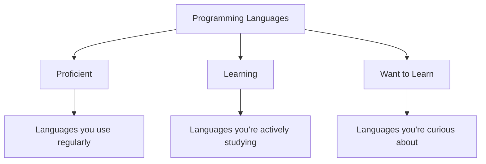

# Setting Up Your Contribux Profile

Your profile is the foundation of Contribux's AI-powered matching system. The more accurately you describe your skills, interests, and goals, the better recommendations you'll receive.

## Profile Overview

Your Contribux profile consists of:

- **Basic Information**: Display name, bio, location
- **Technical Skills**: Programming languages and frameworks
- **Experience Level**: How comfortable you are with different complexity levels
- **Interests**: Types of development work that excite you
- **Availability**: How much time you can dedicate
- **Learning Goals**: Skills you want to develop
- **Preferences**: Notification settings and matching criteria

## Basic Information

### Display Name and Bio

Your display name and bio help the community get to know you:

```text
Display Name: Sarah Chen
Bio: Frontend developer passionate about accessibility and user experience.
     Always looking to learn new frameworks and contribute to inclusive web design.
```

**Tips:**

- Use your real name or preferred professional name
- Write a bio that reflects your interests and personality
- Mention what you're passionate about in development
- Keep it friendly and approachable

### Location and Contact

```text
Location: San Francisco, CA (optional)
Website: https://sarahchen.dev (optional)
Twitter: @sarahcodes (optional)
```

**Privacy Note:** All contact information is optional and you control its visibility.

## Technical Skills

### Programming Languages

Select languages based on your comfort level:



**Example Selection:**

- **Proficient**: JavaScript, HTML, CSS, Python
- **Learning**: TypeScript, React
- **Want to Learn**: Go, Rust

### Frameworks and Tools

Beyond languages, specify frameworks and tools:

**Frontend:**

- React, Vue, Angular
- Next.js, Nuxt.js, Svelte
- CSS frameworks (Tailwind, Bootstrap)

**Backend:**

- Node.js, Django, Flask
- Express, FastAPI, Spring
- Databases (PostgreSQL, MongoDB)

**DevOps & Tools:**

- Git, Docker, Kubernetes
- CI/CD (GitHub Actions, Jenkins)
- Cloud (AWS, Azure, GCP)

### Skill Confidence Levels

For each technology, specify your confidence:

```text
JavaScript: ████████░░ (8/10) - Professional experience
React: ██████░░░░ (6/10) - Comfortable for most projects
TypeScript: ████░░░░░░ (4/10) - Learning, can read/modify
Go: ██░░░░░░░░ (2/10) - Basic syntax, want to learn more
```

## Experience Level

### Overall Development Experience

Choose the level that best describes you:

#### **Beginner (0-1 years)**

- New to programming or fresh graduate
- Comfortable with basic syntax and concepts
- Looking for guided learning opportunities
- Perfect for "good first issue" contributions

#### **Intermediate (1-3 years)**

- Solid foundation in at least one language
- Some professional or substantial personal project experience
- Comfortable reading and modifying existing code
- Ready for moderate complexity challenges

#### **Advanced (3+ years)**

- Strong experience in multiple languages/frameworks
- Comfortable with complex architecture decisions
- Can mentor others and review code effectively
- Ready for challenging technical problems

### Domain-Specific Experience

Rate your experience in different areas:

```text
Web Development: ████████░░ (8/10)
Mobile Development: ██░░░░░░░░ (2/10)
DevOps/Infrastructure: ████░░░░░░ (4/10)
Data Science: ░░░░░░░░░░ (0/10)
Security: ███░░░░░░░ (3/10)
```

## Interests and Goals

### Development Interests

Select areas that genuinely interest you:

#### **Frontend Development**

- User interfaces and user experience
- Interactive web applications
- Performance optimization
- Accessibility and inclusive design

#### **Backend Development**

- APIs and microservices
- Database design and optimization
- Server architecture
- Authentication and security

#### **Full-Stack Development**

- End-to-end application development
- Integration between frontend and backend
- DevOps and deployment

#### **Specialized Areas**

- Mobile development (iOS, Android, React Native)
- Data science and machine learning
- Game development
- Blockchain and Web3
- IoT and embedded systems

### Learning Goals

Be specific about what you want to achieve:

#### **Short-term Goals (1-3 months)**

- "Learn React hooks and modern patterns"
- "Contribute to 5 open source projects"
- "Improve my TypeScript skills"
- "Understand Docker and containerization"

#### **Long-term Goals (6-12 months)**

- "Become proficient in full-stack development"
- "Contribute to a major open source project"
- "Learn cloud architecture patterns"
- "Mentor new developers in the community"

### Contribution Preferences

Specify what types of contributions you enjoy:

#### **Code Contributions**

- ✅ Bug fixes - solving problems and debugging
- ✅ New features - building functionality from scratch
- ⚠️ Refactoring - improving existing code structure
- ⚠️ Performance - optimizing for speed and efficiency

#### **Non-Code Contributions**

- ✅ Documentation - writing guides and tutorials
- ✅ Testing - creating test cases and QA
- ⚠️ Design - UI/UX design and prototyping
- ❌ Translation - localizing applications

## Time Commitment and Availability

### Weekly Time Commitment

Be realistic about your availability:

```text
Time Available per Week:
○ 1-2 hours (perfect for small bug fixes)
○ 3-5 hours (good for documentation and simple features)
● 5-10 hours (suitable for moderate features and learning)
○ 10-15 hours (can tackle complex features)
○ 15+ hours (major contributions and project leadership)
```

### Preferred Schedule

When do you typically contribute?

```text
Preferred Days:
☑ Weekdays (after work)
☑ Weekends
☐ Flexible/no preference

Preferred Times:
☐ Morning (6-12 PM)
☑ Afternoon (12-6 PM)
☑ Evening (6-12 AM)
☐ Late night (12-6 AM)

Time Zone: Pacific Standard Time (PST)
```

### Project Duration Preferences

What size projects do you prefer?

#### **Quick Wins (1-5 hours)**

- Documentation fixes
- Simple bug repairs
- Adding tests
- Code formatting improvements

#### **Short Projects (1-2 weeks)**

- Small feature additions
- UI improvements
- Basic integrations
- Tutorial creation

#### **Medium Projects (2-4 weeks)**

- Significant new features
- Architecture improvements
- Complex bug investigations
- Comprehensive documentation

#### **Long Projects (1+ months)**

- Major feature development
- Large-scale refactoring
- New module creation
- Project leadership roles

## Matching Preferences

### Repository Criteria

Set criteria for projects you want to work on:

#### **Repository Health**

```text
Minimum Stars: 10 (ensures some community interest)
Maximum Contributors: 100 (avoids overwhelming large projects)
Recent Activity: Within last 30 days
Response Time: Maintainers respond within 1 week
```

#### **Project Characteristics**

- ✅ Good first issue labels
- ✅ Clear contributing guidelines
- ✅ Active community and discussions
- ✅ Welcoming to new contributors
- ⚠️ High-profile/popular projects
- ❌ Experimental or alpha-stage projects

### Issue Preferences

What types of issues interest you?

#### **Issue Types**

- ✅ Bug reports with clear reproduction steps
- ✅ Feature requests with detailed specifications
- ✅ Documentation improvements and additions
- ⚠️ Performance optimization tasks
- ⚠️ Architecture and design discussions
- ❌ Security vulnerabilities (too advanced)

#### **Difficulty Levels**

- ✅ Good first issue
- ✅ Beginner-friendly
- ✅ Intermediate complexity
- ⚠️ Advanced/expert level
- ❌ Critical/urgent issues

## Notification Settings

### Email Notifications

Control how often you hear from us:

#### **Opportunity Notifications**

```text
New Matches: ● Daily ○ Weekly ○ Never
Priority Matches: ● Immediately ○ Daily ○ Weekly

Match Criteria:
☑ Perfect skill match (90%+ compatibility)
☑ Good first issues in preferred languages
☑ Projects from your watchlist
☐ All recommended opportunities
```

#### **Progress Notifications**

```text
Contribution Updates: ○ Immediately ● Weekly ○ Monthly
Achievement Unlocked: ● Immediately ○ Weekly ○ Never
Community Activity: ○ Daily ● Weekly ○ Never
```

### Push Notifications (Mobile App)

```text
New Opportunities: ○ All ● High priority only ○ Off
Contribution Status: ● On ○ Off
Community Mentions: ● On ○ Off
```

## Advanced Preferences

### AI Matching Settings

Fine-tune how our AI selects opportunities:

#### **Matching Algorithm**

```text
Exploration vs Exploitation:
[────●───] (60% similar to past work, 40% new areas)

Difficulty Progression:
☑ Gradually increase challenge level
☑ Include stretch opportunities
☐ Stay within comfort zone
```

#### **Learning Priority**

```text
Focus Areas:
1. React and modern frontend patterns
2. API design and backend development
3. Testing and quality assurance
4. Open source community practices
```

### Privacy Controls

Control what information is visible to others:

#### **Public Profile Information**

- ✅ Display name and bio
- ✅ Programming languages (general)
- ✅ Contribution statistics
- ⚠️ Location and contact info
- ❌ Time availability and schedule
- ❌ Specific learning goals

#### **Community Features**

- ✅ Allow others to follow my profile
- ✅ Show my contributions in community feed
- ✅ Enable mentorship matching
- ⚠️ Include me in contributor showcases

## Profile Examples

### Example 1: Frontend Beginner

```yaml
name: "Alex Rivera"
bio: "Computer science student learning web development. Love creating beautiful, accessible user interfaces."
experience_level: "beginner"
languages: ["JavaScript", "HTML", "CSS"]
learning: ["React", "TypeScript"]
interests: ["frontend", "accessibility", "ui-design"]
time_commitment: "5-10 hours/week"
goals:
  - "Make my first open source contribution"
  - "Learn React through real projects"
  - "Improve CSS and design skills"
preferences:
  issue_types: ["good-first-issue", "documentation", "ui-improvement"]
  max_complexity: "beginner"
```

### Example 2: Full-Stack Intermediate

```yaml
name: "Jordan Kim"
bio: "Full-stack developer with a passion for clean code and user-centered design. Always excited to learn new technologies."
experience_level: "intermediate"
languages: ["JavaScript", "Python", "Go"]
frameworks: ["React", "Django", "PostgreSQL"]
learning: ["Kubernetes", "Rust"]
interests: ["full-stack", "api-development", "devops"]
time_commitment: "10-15 hours/week"
goals:
  - "Contribute to cloud-native projects"
  - "Learn container orchestration"
  - "Mentor new developers"
preferences:
  issue_types: ["feature", "bug-fix", "architecture"]
  max_complexity: "intermediate-to-advanced"
```

### Example 3: Experienced Specialist

```yaml
name: "Sam Thompson"
bio: "Security engineer specializing in web application security and cryptography. 10+ years experience."
experience_level: "advanced"
languages: ["Go", "Rust", "C++", "Python"]
specialties: ["security", "cryptography", "performance"]
interests: ["security", "systems-programming", "mentoring"]
time_commitment: "5-10 hours/week"
goals:
  - "Contribute to security-focused projects"
  - "Help maintain cryptographic libraries"
  - "Review security-related PRs"
preferences:
  issue_types: ["security", "code-review", "architecture"]
  mentoring_enabled: true
```

## Updating Your Profile

### When to Update

Regularly review and update your profile:

#### **Monthly Review**

- Check if your skills have improved
- Update learning goals and interests
- Adjust time availability
- Review notification preferences

#### **After Major Learning**

- Add new languages or frameworks you've learned
- Increase confidence levels in existing skills
- Update experience level if appropriate
- Add new interest areas

#### **When Life Changes**

- Job changes affecting available time
- New interests or career direction
- Different schedule or availability
- Changed learning priorities

### Profile Health Score

Contribux provides a profile completeness score:

```text
Profile Health: 85%

✅ Basic information complete
✅ Skills and experience detailed
✅ Learning goals specified
⚠️ Consider adding more interest areas
❌ Missing preferred project criteria
```

## Tips for Better Matches

### Be Specific and Honest

**Good:**

- "I know React basics and can work with existing components, but I'm still learning advanced patterns like custom hooks"

**Too Vague:**

- "I know React"

### Update Regularly

**Keep Current:**

- Skills you've learned in recent projects
- Technologies you're actively using at work
- New areas of interest you've discovered
- Changes in available time or schedule

### Balance Challenge and Comfort

**Ideal Balance:**

- 70% work within your comfort zone (build confidence)
- 30% stretch opportunities (encourage growth)

### Use Learning Mode

When starting with a new technology:

- Set it as "Learning" rather than "Proficient"
- Look for beginner-friendly issues in that technology
- Consider pair programming or mentorship opportunities

## Common Profile Mistakes

### Overestimating Skills

**Problem:** Rating yourself too highly leads to frustrating experiences

**Solution:** Be conservative in skill ratings; it's better to exceed expectations

### Underestimating Time Availability

**Problem:** Setting unrealistic time commitments leads to abandoned contributions

**Solution:** Track your actual contribution time for a few weeks, then adjust

### Too Narrow Focus

**Problem:** Very specific preferences limit opportunities

**Solution:** Start broad, then narrow down based on actual experience

### Ignoring Soft Skills

**Problem:** Focusing only on technical skills

**Solution:** Include interests in mentoring, documentation, community building

## Getting Help

If you need assistance with your profile:

- **Profile Review**: Ask for feedback in our Discord community
- **Skill Assessment**: Use our guided skill assessment tool
- **Matching Issues**: Contact support if recommendations don't seem right
- **Privacy Questions**: Review our privacy policy or contact us

Your profile is your gateway to meaningful open source contributions. Take time to make it accurate and complete!

---

**Next Steps:** [Finding Your First Opportunities](./finding-opportunities.md)
