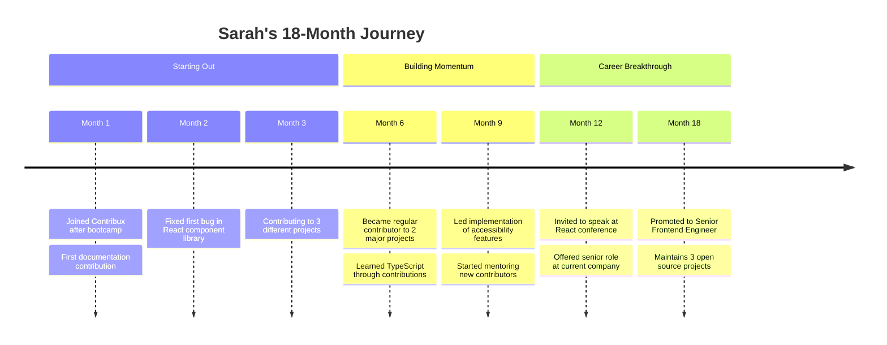
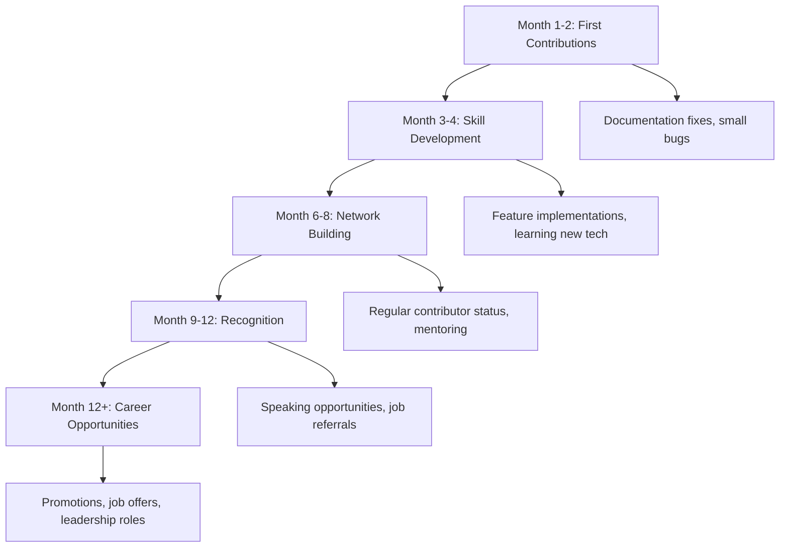

# Success Stories and Case Studies

Learn from real Contribux users who have transformed their careers, built meaningful connections, and made significant impacts in the open source community. These stories demonstrate the power of strategic contribution discovery and consistent engagement.

## 🌟 Featured Success Stories

### Story 1: From Bootcamp Graduate to Senior Engineer

**Sarah Chen** - Frontend Developer at TechCorp



**Background:**
Sarah graduated from a coding bootcamp with basic JavaScript and React knowledge but struggled to find her first developer job. She had built a few personal projects but felt her portfolio wasn't competitive enough for the roles she wanted.

**How Contribux Helped:**

_Smart Matching:_ Contribux identified beginner-friendly React issues that matched her skill level perfectly. Instead of being overwhelmed by complex projects, she started with documentation improvements and simple bug fixes.

_Skill Progression:_ The platform's AI gradually introduced more challenging opportunities as her skills improved, helping her learn TypeScript, testing frameworks, and accessibility practices through real-world applications.

_Community Connections:_ Through consistent contributions, Sarah built relationships with maintainers at prominent React libraries, who eventually recommended her for speaking opportunities and job interviews.

**Key Contributions:**

- **20+ merged PRs** across 8 React-related projects
- **Accessibility improvements** that benefited thousands of users
- **Documentation overhauls** for 3 major component libraries
- **TypeScript migration** for a popular UI toolkit

**Career Impact:**

- Landed first developer job within 4 months
- Promoted to senior role in 18 months (typically takes 3-5 years)
- Speaking at major conferences
- Earning $95k+ salary (40% above bootcamp average)

**Sarah's Advice:**

> "Don't try to contribute to everything. Contribux helped me focus on React ecosystem projects where I could build deep expertise. The AI recommendations were spot-on for my skill level, and the gradual difficulty increase kept me challenged but not overwhelmed. Most importantly, the maintainer relationships I built through quality contributions opened doors I never expected."

**Metrics:**

```text
Time Investment: 5-8 hours/week
Success Rate: 87% (PRs merged/submitted)
Learning Velocity: 3 new technologies/6 months
Network Growth: 15+ maintainer connections
Career ROI: 40% salary increase in 18 months
```

---

### Story 2: Career Pivot from Data Science to DevOps

**Marcus Rodriguez** - Senior DevOps Engineer at CloudScale

**Background:**
Marcus worked as a data scientist for 5 years but felt burnt out on machine learning projects. He was interested in infrastructure and automation but had minimal experience with DevOps tools and practices.

**The Challenge:**

- No professional DevOps experience
- Limited knowledge of containerization, CI/CD
- Concerned about starting over in a new field
- Needed to build credible portfolio quickly

**Contribux Strategy:**

> _Phase 1 (Months 1-3): Foundation Building_

```text
Focus Areas: Docker, Kubernetes, CI/CD
Contribution Types: Documentation, small automation scripts
Projects: 5 infrastructure-related open source tools
Learning Goals: Container orchestration, deployment pipelines
```

> _Phase 2 (Months 4-8): Skill Expansion_

```text
Focus Areas: Monitoring, security, infrastructure as code
Contribution Types: Feature additions, performance improvements
Projects: Prometheus, Grafana, Terraform modules
Learning Goals: Observability, security best practices
```

> _Phase 3 (Months 9-12): Leadership_

```text
Focus Areas: Cloud-native technologies, platform engineering
Contribution Types: Architecture improvements, new features
Projects: CNCF projects, leading migration initiatives
Learning Goals: Distributed systems, platform design
```

**Key Achievements:**

- **35+ contributions** to major DevOps tools
- **Lead maintainer** of a Terraform provider (500+ stars)
- **Conference speaker** at KubeCon and DevOps Days
- **Technical blog** with 10k+ monthly readers

**Career Transformation:**

```text
Timeline: 12 months to land DevOps role
Salary Change: +25% from data science role
Responsibility: Leading platform team of 6 engineers
Recognition: Named "Rising Star" at company
Impact: Reduced deployment time by 70% company-wide
```

**Marcus's Strategy Tips:**

> "I used Contribux to map out a learning path through contributions. Instead of just reading about DevOps, I was solving real problems for real users. The platform helped me find projects that needed exactly the level of help I could provide at each stage. By month 6, maintainers were asking me to take on bigger challenges because they trusted my work quality."

**Unique Approach:**

- **Data Science Bridge:** Applied statistical analysis to infrastructure monitoring
- **Documentation Focus:** Rewrote complex setup guides using data science communication skills
- **Community Building:** Organized virtual DevOps study groups

---

### Story 3: International Student to Silicon Valley Engineer

**Priya Patel** - Software Engineer at Google

**Background:**
Priya was an international student studying computer science in the US. She needed to build a strong portfolio to compete for top tech jobs and obtain visa sponsorship.

**Challenges:**

- Limited internship opportunities due to visa restrictions
- Needed to demonstrate exceptional skills for sponsorship
- Competition with domestic students who had more internship experience
- Time constraints due to rigorous academic schedule

**Strategic Approach:**

_Reputation Building Strategy:_

```text
Goal: Become recognized contributor in JavaScript ecosystem
Focus: React, Node.js, and developer tooling
Time Investment: 10-12 hours/week (optimized around classes)
Success Metrics: 50+ contributions, 3+ maintainer recommendations
```

_Contribux Optimization:_

```text
Profile Setup:
├─ Skills: JavaScript, React, Python, algorithms
├─ Goals: Learn modern development practices
├─ Time: Evening and weekend contributions
├─ Interests: Developer experience, performance
└─ Difficulty: Intermediate with learning stretches

Smart Filtering:
├─ Projects with international contributors
├─ Time zones compatible with US West Coast
├─ Issues with clear specifications
├─ Maintainers known for mentoring
└─ Technologies relevant to job applications
```

**Breakthrough Moments:**

> _Month 4:_ Discovered performance issue in popular React library

```text
Impact: Fixed memory leak affecting 10M+ downloads/month
Recognition: Featured in project release notes
Network: Connected with React core team member
Learning: Deep performance debugging, memory profiling
```

> _Month 7:_ Led internationalization effort for developer tool

```text
Impact: Added support for 15+ languages
Recognition: Speaking opportunity at local meetup
Network: Connected with Google i18n team
Learning: Globalization, accessibility, project management
```

> _Month 10:_ Created widely-adopted developer utility

```text
Impact: Open sourced tool gained 2k+ GitHub stars
Recognition: Featured in JavaScript Weekly newsletter
Network: Job referrals from multiple tech companies
Learning: Open source project maintenance, community building
```

**Results:**

- **60+ merged contributions** across 15 projects
- **Job offers** from Google, Meta, and 3 startups
- **H1-B visa** approved on first attempt
- **Starting salary** $165k (top 10% for new grads)

**Priya's Success Framework:**

> "Contribux was crucial for finding opportunities that matched my available time slots. As an international student, I couldn't do traditional internships, but open source contributions proved my abilities even better. The platform helped me focus on high-impact projects where my contributions would be noticed by potential employers."

**Key Strategies:**

1. **Time Zone Optimization:** Focused on projects with maintainers in compatible time zones
2. **Documentation Excellence:** Leveraged strong English skills for technical writing
3. **Algorithm Expertise:** Applied CS knowledge to performance and optimization issues
4. **Network Building:** Consistently engaged with project communities
5. **Portfolio Curation:** Highlighted contributions in job applications

---

### Story 4: Mid-Career Developer Avoiding Burnout

**James Thompson** - Principal Engineer at StartupCorp

**Background:**
James had 12 years of enterprise development experience but felt stagnant in his role. He was considering leaving tech entirely due to burnout and lack of growth opportunities.

**The Problem:**

- Stuck in legacy technology stack at work
- No time for learning during business hours
- Feeling disconnected from modern development practices
- Loss of passion for programming

**Renewal Through Open Source:**

_Rediscovering Joy in Coding:_

```text
Week 1-4: Started with small documentation fixes
├─ Low pressure, immediate impact
├─ Remembered why he loved programming
├─ Built confidence in unfamiliar tools
└─ Connected with passionate developers

Month 2-4: Progressed to feature implementations
├─ Learned modern JavaScript frameworks
├─ Discovered developer tooling innovations
├─ Practiced new architectural patterns
└─ Gained energy from community engagement

Month 5-8: Became trusted contributor
├─ Leading discussions on technical direction
├─ Mentoring junior contributors
├─ Driving adoption of best practices
└─ Feeling valued and impactful again
```

**Career Reinvention:**

- **Skills Update:** Learned React, TypeScript, GraphQL, Docker
- **Network Expansion:** Connected with modern tech leaders
- **Confidence Boost:** Proved ability to learn and adapt
- **Passion Recovery:** Remembered love for problem-solving

**Professional Impact:**

```text
At Work:
├─ Introduced modern practices to legacy systems
├─ Led team adoption of new technologies
├─ Became go-to person for architecture decisions
├─ Promoted to Principal Engineer
└─ Increased team productivity by 40%

In Community:
├─ Maintainer of 2 popular npm packages
├─ Regular contributor to 5+ projects
├─ Mentor to 20+ junior developers
├─ Speaker at local meetups
└─ Technical advisor to 2 startups
```

**James's Perspective:**

> "I was about to quit programming entirely when I started using Contribux. The platform helped me find projects that rekindled my passion for coding. Working on modern, well-architected open source projects reminded me why I became a developer in the first place. The best part was seeing my contributions actually being used by thousands of developers worldwide."

**Burnout Recovery Framework:**

1. **Start Small:** Documentation and minor fixes to build momentum
2. **Choose Passion Projects:** Work on tools you personally want to use
3. **Set Boundaries:** Limit time investment to prevent additional burnout
4. **Focus on Learning:** Prioritize skill growth over contribution volume
5. **Engage Community:** Build relationships that energize you

---

## 📊 Success Pattern Analysis

### Common Characteristics of Successful Contributors

#### **Behavioral Patterns**

```text
Consistency Over Intensity:
├─ Regular small contributions (5-10 hours/week)
├─ Long-term engagement with projects
├─ Gradual skill building and progression
├─ Sustained effort over 6+ months
└─ Quality focus over quantity

Community Engagement:
├─ Active participation in project discussions
├─ Helpful responses to other contributors
├─ Mentoring newer community members
├─ Building relationships with maintainers
└─ Contributing beyond just code

Strategic Learning:
├─ Focused on specific technology ecosystems
├─ Chose projects aligned with career goals
├─ Used contributions for skill development
├─ Documented and shared learning experiences
└─ Applied open source skills to work projects
```

#### **Profile Optimization Strategies**

```text
Successful Profile Characteristics:
├─ Realistic skill level assessments
├─ Clear learning goals and objectives
├─ Specific technology preferences
├─ Appropriate time commitment settings
├─ Regular preference updates
└─ Active feedback provision

Contribution Selection Criteria:
├─ 70% within comfort zone (confidence building)
├─ 20% moderate stretch (skill building)
├─ 10% ambitious projects (network building)
├─ Focus on 2-3 technology areas
└─ Balance between code and non-code contributions
```

### Success Metrics Comparison

#### **Career Impact Timeline**



#### **Quantitative Outcomes**

```text
Average Success Metrics (6-month mark):
├─ Contributions: 25-40 merged PRs
├─ Success Rate: 75-85% merge rate
├─ Technologies: 2-3 new skills learned
├─ Network: 8-12 meaningful connections
├─ Recognition: 1-2 speaking opportunities
└─ Career Impact: 15-25% salary increase

Top Performer Metrics (12-month mark):
├─ Contributions: 50+ merged PRs
├─ Success Rate: 85%+ merge rate
├─ Technologies: 4-5 new skills mastered
├─ Network: 15+ strong connections
├─ Recognition: Conference speaking, job offers
└─ Career Impact: 30-50% salary increase
```

## 🎯 Success Strategies by Career Stage

### New Graduates

#### **Strategy: Portfolio Building**

```text
Focus Areas:
├─ Demonstrate code quality and best practices
├─ Show ability to work in team environments
├─ Learn industry-standard tools and frameworks
├─ Build network of references and recommendations
└─ Gain real-world software development experience

Optimal Contribution Types:
├─ Bug fixes (30%) - Show debugging skills
├─ Documentation (25%) - Demonstrate communication
├─ Testing (20%) - Show quality consciousness
├─ Small features (15%) - Prove implementation ability
└─ Code review (10%) - Display collaborative skills

Timeline Expectations:
├─ Month 1-3: Foundation building, first successes
├─ Month 4-6: Consistent contributions, skill growth
├─ Month 7-9: Network building, increased complexity
├─ Month 10-12: Job applications, interview preparation
└─ Goal: 30+ contributions, 5+ technologies, job offer
```

### Mid-Career Transitions

#### **Strategy: Skill Pivoting**

```text
Approach:
├─ Leverage existing experience in new domain
├─ Build credible portfolio in target technology
├─ Network with professionals in desired field
├─ Demonstrate learning ability and adaptability
└─ Bridge old and new skills effectively

Contribution Strategy:
├─ Start with transferable skills (architecture, testing)
├─ Focus on projects in target technology stack
├─ Contribute documentation using domain expertise
├─ Gradually take on more complex technical work
└─ Build relationships with potential employers

Success Factors:
├─ 6-12 month transition timeline
├─ 40+ contributions in target technology
├─ Thought leadership through writing/speaking
├─ Strong recommendations from new network
└─ Proven ability to deliver in new domain
```

### Senior Professionals

#### **Strategy: Leadership and Influence**

```text
Objectives:
├─ Establish thought leadership in field
├─ Mentor and develop junior professionals
├─ Drive technical direction in projects
├─ Build industry recognition and speaking opportunities
├─ Create lasting impact on technology ecosystem

Contribution Focus:
├─ Architecture and design (40%)
├─ Mentorship and code review (25%)
├─ Documentation and best practices (20%)
├─ Performance and security (10%)
└─ Community building (5%)

Leadership Activities:
├─ Maintain high-impact open source projects
├─ Speak at conferences and industry events
├─ Write technical content and tutorials
├─ Advise startups and technical teams
└─ Influence technology adoption decisions
```

## 🚀 Getting Started with Your Success Story

### Setting Yourself Up for Success

#### **Profile Optimization Checklist**

```text
✅ Complete Profile Setup:
├─ Accurate skill assessments (not overestimated)
├─ Clear, specific learning goals
├─ Realistic time commitment settings
├─ Appropriate difficulty level preferences
├─ Active notification preferences
└─ Regular profile updates

✅ Strategic Goal Setting:
├─ Career-aligned learning objectives
├─ Specific technology focus areas
├─ Timeline for skill development milestones
├─ Contribution volume targets
├─ Network building goals
└─ Professional development outcomes

✅ Community Engagement Plan:
├─ Identify target open source communities
├─ Plan for regular community participation
├─ Set mentorship goals (giving and receiving)
├─ Schedule time for relationship building
├─ Commit to helpful, positive interactions
└─ Develop thought leadership content
```

#### **First Month Action Plan**

```text
Week 1: Foundation
├─ Complete Contribux profile setup
├─ Identify 3-5 target projects
├─ Read contributing guidelines thoroughly
├─ Set up development environments
└─ Make first documentation contribution

Week 2: Momentum Building
├─ Submit 2-3 small contributions
├─ Engage in project community discussions
├─ Provide helpful code reviews
├─ Start tracking learning progress
└─ Connect with 1-2 maintainers

Week 3: Skill Development
├─ Take on more challenging issues
├─ Learn new tools or frameworks
├─ Write about learning experiences
├─ Help other newcomers
└─ Set goals for month 2

Week 4: Reflection and Planning
├─ Review first month's progress
├─ Gather feedback on contributions
├─ Adjust strategy based on results
├─ Plan next month's focus areas
└─ Celebrate achievements
```

### Tracking Your Progress

#### **Success Metrics Dashboard**

```text
Monthly Review Checklist:
├─ Contributions: Count and quality assessment
├─ Skills: New technologies learned
├─ Network: Relationships built and strengthened
├─ Recognition: Mentions, stars, thanks received
├─ Learning: Knowledge gained and applied
├─ Impact: Users affected by contributions
└─ Career: Professional opportunities created

Quarterly Deep Dive:
├─ Career goal progress assessment
├─ Skill development trajectory analysis
├─ Network quality and growth evaluation
├─ Contribution impact measurement
├─ Market value and opportunity assessment
├─ Personal satisfaction and motivation review
└─ Strategy adjustment and goal refinement
```

## 🎉 Your Success Story Starts Now

Every successful contributor started with a single contribution. The difference between those who achieve their goals and those who don't is consistency, strategy, and community engagement.

**Ready to Start Your Journey?**

1. **Set Up Your Profile** - Complete your Contribux profile with accurate skills and clear goals
2. **Make Your First Contribution** - Start with documentation or a good first issue
3. **Engage Consistently** - Contribute regularly, even if just for 30 minutes a week
4. **Build Relationships** - Connect authentically with maintainers and other contributors
5. **Share Your Progress** - Document and share your learning journey
6. **Help Others** - Mentor newcomers and give back to the community

**Remember:** Your success story is unique to you. These examples show what's possible, but your path will be different. Focus on progress, not perfection, and celebrate every milestone along the way.

---

**Ready to begin?** Check out our [Getting Started Guide](./getting-started.md) and take the first step toward your own open source success story.

**Share Your Story:** When you achieve your goals, we'd love to feature your success story. Contact us at [stories@contribux.ai](mailto:stories@contribux.ai) to inspire the next generation of contributors.
