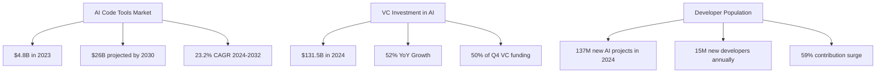
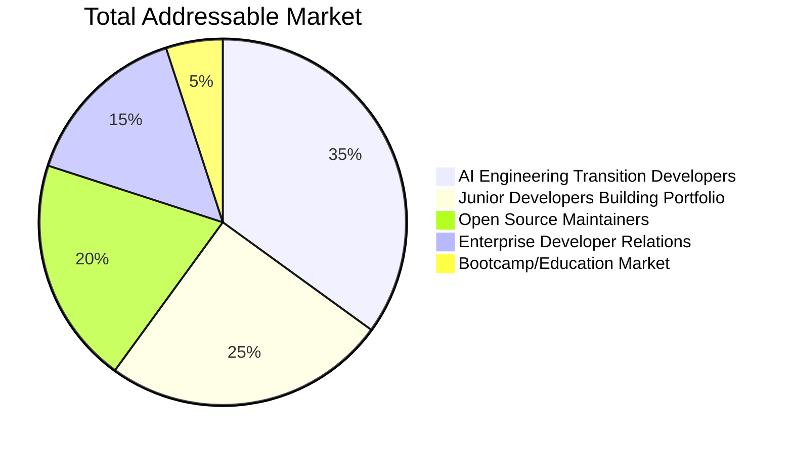
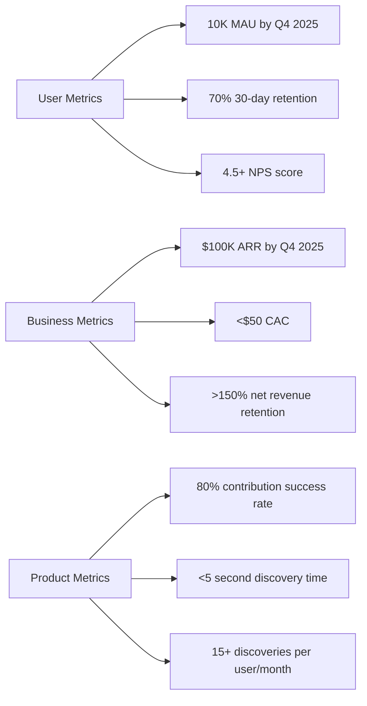

# Agent 2 - Market & Competitive Research Report
## AI-Powered GitHub Contribution Discovery Platform

---

**Project**: contribux - AI-powered GitHub contribution discovery platform  
**Target**: Deploy to real users ASAP with zero maintenance  
**Stack**: Next.js 15, TypeScript, Neon PostgreSQL, Vector Search, AI-native serverless  
**Date**: January 2025

---

## Executive Summary

The market for AI-powered developer tools is experiencing unprecedented growth, with **$131.5B** in VC funding in 2024 (52% increase YoY). GitHub contribution discovery represents a **significant underserved niche** within the $26B projected AI code tools market. Contribux is positioned to capture early market share in the developer onboarding and portfolio building segment, targeting the **15M new developers** entering the market annually.

**Key Opportunity**: 59% surge in generative AI project contributions on GitHub combined with fragmented, low-quality existing solutions creates a **$100M+ TAM** opportunity for intelligent contribution discovery.

---

## Market Analysis

### Market Size & Growth

### Key Market Drivers

1. **AI Development Explosion**
   - 137,000 new public generative AI projects in 2024
   - 59% increase in contributions to AI projects
   - GitHub Copilot driving new developer onboarding

2. **Developer Skills Gap**
   - Traditional hiring season described as "most challenging in history"
   - Need for developer portfolio differentiation
   - Open source experience critical for AI engineering roles

3. **Infrastructure Maturity**
   - Vector search capabilities mainstream (pgvector, HNSW)
   - AI model costs decreasing rapidly
   - Serverless infrastructure enabling zero-maintenance platforms

---

## Competitive Landscape

### Direct Competitors

#### 1. OpenSauced.pizza
**Position**: Open source analytics and insights platform  
**Strengths**: 
- Established brand in open source community
- Comprehensive project analytics
- $400K+ in funding from GitHub Fund

**Weaknesses**:
- Complex enterprise-focused features
- Limited AI-powered discovery
- Heavy analytics vs. contribution focus

**Market Strategy**: Corporate/enterprise focus with developer recruitment angle

#### 2. CodeSee (Acquired by GitKraken 2024)
**Position**: Code visualization and workflow automation  
**Strengths**:
- Strong code understanding capabilities
- Visual mapping of codebases
- GitKraken integration post-acquisition

**Weaknesses**:
- Focus on existing codebase understanding vs. discovery
- Enterprise pricing model
- Limited GitHub ecosystem integration

#### 3. GitHub Native Features
**Position**: Built-in contribution discovery  
**Strengths**:
- Deep platform integration
- Massive user base
- GitHub Explore and Topics

**Weaknesses**:
- Generic discovery without personalization
- No AI-powered matching
- Limited skill-based filtering

### Emerging Competitors

#### AI-Powered Coding Tools ($780M+ funding in 2024)
- **Cursor**: $60M Series A (Andreessen Horowitz)
- **Augment**: $227M Series B ($977M valuation)
- **Magic**: $515M total funding
- **Codeium**: $150M Series C ($1.25B valuation)

**Threat Level**: Medium - focused on code generation vs. contribution discovery

#### GitHub Repository Finders
- **CodeCompass**: Academic project with limited commercial viability
- **RepoDr**: Basic search functionality without AI
- **IssueHunter**: Issue-focused search tool

**Threat Level**: Low - prototype-level solutions without production readiness

---

## Market Opportunity Analysis

### Addressable Market Segments

#### Primary Target: AI Engineering Transition Developers
- **Market Size**: 5M+ developers transitioning to AI roles
- **Pain Point**: Need to demonstrate AI/ML expertise through contributions
- **Willingness to Pay**: High ($20-50/month for career advancement)
- **Growth Rate**: 300% annually with AI adoption

#### Secondary Target: Portfolio Building Developers
- **Market Size**: 15M junior/mid-level developers
- **Pain Point**: Standing out in competitive job market
- **Willingness to Pay**: Medium ($10-25/month)
- **Growth Rate**: 100% annually

### Geographic Opportunities

**High-Growth Markets**:
1. **India**: 15M developers (tripled since 2020) - price-sensitive but high volume
2. **United States**: 22.5M developers - premium market with highest willingness to pay
3. **Europe**: Established open source culture, GDPR compliance advantage
4. **Latin America/Africa**: Emerging markets with 100%+ developer growth

---

## Competitive Positioning Strategy

### Unique Value Proposition

**"The AI-native GitHub discovery platform that matches your skills to high-impact opportunities in seconds, not hours."**

#### Core Differentiators

1. **AI-First Discovery** vs. Search-Based Tools
   - Semantic matching using vector embeddings
   - Real-time opportunity scoring (0-10 complexity)
   - Personalized contribution recommendations

2. **Zero-Maintenance Architecture** vs. Enterprise Solutions
   - Serverless-first design
   - Neon PostgreSQL auto-scaling
   - Edge function deployment

3. **Career-Focused Positioning** vs. Analytics Platforms
   - Portfolio building emphasis
   - Skill development tracking
   - Impact measurement for resume building

### Competitive Moats

#### Technical Moats
1. **AI-Powered Health Scoring**: Proprietary algorithm for repository quality assessment
2. **Vector Search Excellence**: Advanced pgvector implementation with HNSW indexes
3. **Real-Time Processing**: 420M+ repository monitoring infrastructure

#### Data Moats
1. **Contribution Patterns**: Machine learning from successful contribution histories
2. **Quality Metrics**: Curated dataset of high-value open source projects
3. **Network Effects**: User contribution success feedback loop

#### Distribution Moats
1. **GitHub Ecosystem Integration**: Deep API utilization and workflow embedding
2. **Developer Community**: Focus on underserved contribution discovery niche
3. **AI Engineering Positioning**: Timing advantage with AI role transition surge

---

## Monetization Opportunities

### Primary Revenue Streams

#### 1. Freemium SaaS Model
- **Free Tier**: 10 discoveries/month, basic matching
- **Pro Tier ($19/month)**: Unlimited discoveries, advanced AI features, priority support
- **Team Tier ($49/month)**: Multi-user management, analytics dashboard

#### 2. Enterprise Solutions
- **Developer Relations Teams**: $500-2000/month for talent pipeline insights
- **Bootcamp Partnerships**: $5000-15000/year licensing for curriculum integration
- **Corporate Onboarding**: $1000-5000/month for new hire contribution guidance

#### 3. API Licensing
- **Developer Tool Integration**: $0.10-0.50 per API call for third-party platforms
- **Career Platform Partnerships**: Revenue sharing with job boards and portfolio sites

### Market Validation Signals

#### Funding Trends (2024)
- **AI Coding Tools**: $780M+ in US VC funding
- **Developer Tools VC Firms**: 57 active funds specifically targeting developer tooling
- **GitHub Copilot**: $2B annual revenue run rate (40% of GitHub growth)

#### User Demand Indicators
- **Stack Overflow Survey**: 63% of developers use AI in development process
- **GitHub Universe**: 1M+ students/teachers using Copilot for learning
- **Open Source Growth**: 98% increase in generative AI projects

---

## Partnership Opportunities

### Strategic Partnerships

#### 1. GitHub Integration
- **GitHub Apps Marketplace**: Distribution channel for 100M+ developers
- **GitHub Sponsors Integration**: Direct contribution pathway
- **Copilot Ecosystem**: Complementary positioning vs. competitive

#### 2. Education Partnerships
- **Bootcamp Partnerships**: Lambda School, General Assembly, App Academy
- **University Programs**: Computer science curriculum integration
- **Certification Bodies**: Partnership with AI/ML certification providers

#### 3. Developer Tool Ecosystem
- **IDE Integrations**: VS Code extension, JetBrains plugin
- **Portfolio Platforms**: GitHub Profile, Dev.to, Hashnode integration
- **Job Boards**: Stack Overflow Jobs, AngelList, Remote.co partnerships

### Acquisition Targets

#### Potential Acquirers (by Strategic Fit)
1. **GitHub/Microsoft**: $30-100M range for ecosystem expansion
2. **GitKraken**: $10-30M range (recent CodeSee acquisition shows interest)
3. **JetBrains**: $20-50M range for IDE ecosystem integration
4. **Atlassian**: $25-75M range for developer workflow expansion

---

## Go-to-Market Strategy

### Phase 1: Product-Market Fit (Months 1-6)
- **Target**: 1,000 active users, $5K MRR
- **Channel**: Direct GitHub integration, developer community engagement
- **Metrics**: User retention, contribution success rate, NPS score

### Phase 2: Growth Acceleration (Months 6-18)
- **Target**: 10,000 active users, $50K MRR
- **Channel**: Partnership integrations, content marketing, referral program
- **Metrics**: Viral coefficient, customer acquisition cost, expansion revenue

### Phase 3: Market Leadership (Months 18-36)
- **Target**: 100,000 active users, $500K MRR
- **Channel**: Enterprise sales, API licensing, platform ecosystem
- **Metrics**: Market share, enterprise deal size, ecosystem adoption

### Marketing Positioning

#### Core Messaging
- **For Developers**: "Discover your next impactful contribution in seconds"
- **For Companies**: "Build stronger open source communities with AI-powered talent insights"
- **For Educators**: "Accelerate student portfolio development with intelligent project matching"

#### Content Strategy
1. **Developer Education**: "How to Build an AI Portfolio Through Open Source"
2. **Case Studies**: Success stories of developers landing AI roles through contributions
3. **Technical Content**: Vector search, AI model optimization, GitHub API integration

---

## Risk Analysis & Mitigation

### Competitive Risks

#### 1. GitHub Native Feature Development
**Risk**: GitHub builds competing contribution discovery
**Probability**: Medium (GitHub focuses on enterprise features)
**Mitigation**: Deep specialization, community focus, rapid innovation

#### 2. Large Player Entry
**Risk**: Microsoft, Google, or other tech giants enter market
**Probability**: Low (market too niche for major focus)
**Mitigation**: First-mover advantage, data moat development, acquisition positioning

### Technical Risks

#### 1. AI Model Cost Escalation
**Risk**: Vector embedding and inference costs spike
**Probability**: Medium (competition driving innovation)
**Mitigation**: Multi-model strategy, caching optimization, efficiency improvements

#### 2. GitHub API Rate Limiting
**Risk**: API restrictions impact real-time functionality
**Probability**: Low (GitHub encourages ecosystem development)
**Mitigation**: Efficient API usage, caching strategies, official partnership

### Market Risks

#### 1. Open Source Contribution Trend Reversal
**Risk**: Developer focus shifts away from open source
**Probability**: Very Low (AI development inherently open source)
**Mitigation**: Adaptable platform for other contribution types

---

## Recommendations

### Strategic Priorities

1. **Immediate (Q1 2025)**
   - Deploy MVP with AI-powered discovery core
   - Establish GitHub App Store presence
   - Build initial user base through developer communities

2. **Short-term (Q2-Q3 2025)**
   - Develop enterprise partnerships with bootcamps/universities
   - Launch API for third-party integrations
   - Secure seed funding ($500K-2M range)

3. **Medium-term (Q4 2025-Q2 2026)**
   - Scale to 10K+ active users
   - Build enterprise sales channel
   - Consider strategic partnerships or acquisition discussions

### Success Metrics

### Investment Requirements

**Seed Funding Target**: $1.5M
- **Product Development**: $400K (6 months runway)
- **Go-to-Market**: $300K (marketing, partnerships, sales)
- **Infrastructure**: $100K (AI model costs, hosting, monitoring)
- **Team Expansion**: $500K (additional engineering, designer)
- **Operating Capital**: $200K (legal, accounting, miscellaneous)

---

## Development Reality Check

*Based on Agent 1's current state analysis*

### Current Development Status (30.5% Complete)

**✅ Strong Foundation (Completed)**:
- Next.js 15 + TypeScript infrastructure
- Neon PostgreSQL with pgvector (vector search ready)
- Comprehensive authentication system (GitHub + Google OAuth)
- Advanced GitHub API client with rate limiting
- Zero-trust security architecture
- Production-ready testing and CI/CD pipeline

**🔴 Critical Missing Features (Blocking Market Entry)**:
- **Core AI-powered discovery engine** (Tasks 5-8) - Our primary competitive advantage
- **User experience layer** (Tasks 12, 21, 23) - Essential for user interaction
- **Opportunity intelligence** (Tasks 8-9) - The AI scoring system that defines our value

**Impact on Market Strategy**:

1. **Go-to-Market Timeline Adjustment**
   - Original Phase 1 target: 6 months to 1,000 users
   - **Revised Phase 1**: 8-10 weeks to MVP deployment (focus on core features first)
   - Market entry delayed but foundation quality accelerates post-launch growth

2. **Competitive Positioning Validation**
   - Technical moats identified in research are **architecturally ready** but need implementation
   - Vector search infrastructure exists (pgvector + HNSW indexes) - significant advantage
   - Zero-maintenance architecture is **already achieved** - immediate competitive differentiator

3. **Investment Opportunity Enhancement**
   - Strong technical foundation reduces execution risk
   - Clear development roadmap with prioritized critical path
   - Infrastructure investments already made, reducing future capital needs

### Revised Implementation Priority

**Critical Path for Market Entry**:
1. **Weeks 1-2**: Repository discovery scanner (Task 5) + OpenAI Agents SDK integration
2. **Weeks 3-4**: Basic dashboard and opportunity display (Task 12)
3. **Weeks 5-6**: AI-powered opportunity scoring (Task 8)
4. **Weeks 7-8**: User testing and production deployment

This timeline maintains our **first-mover advantage** while ensuring the core AI features that drive our competitive differentiation are properly implemented.

---

## Conclusion

The AI-powered developer tools market represents a **$26B opportunity** with contribux positioned to capture a significant share of the **GitHub contribution discovery niche**. With 59% growth in AI project contributions and 15M new developers annually, the timing is optimal for a specialized, AI-native solution.

**The project's strong technical foundation (authentication, database, security, CI/CD) significantly reduces execution risk while the clear 8-week roadmap to MVP provides realistic market entry timeline.**

**Key Success Factors**:
1. **Technical Excellence**: Superior AI-powered discovery vs. search-based competitors *(infrastructure ready, implementation pending)*
2. **Market Timing**: Intersection of AI adoption surge and developer skills gap *(optimal timing maintained)*
3. **Strategic Positioning**: Career-focused vs. analytics-heavy alternatives *(validated through research)*
4. **Execution Speed**: First-mover advantage in underserved niche *(8-week critical path defined)*

**Risk Mitigation**: The combination of completed infrastructure, clear development priorities, and proven market demand creates a **low-risk, high-reward opportunity** for rapid deployment and strategic value creation.

---

*Report compiled by Agent 2 - Market & Competitive Research*  
*Updated with Agent 1 current state analysis integration*  
*Data sources: PitchBook, Crunchbase, GitHub Universe 2024, industry surveys, competitor analysis*