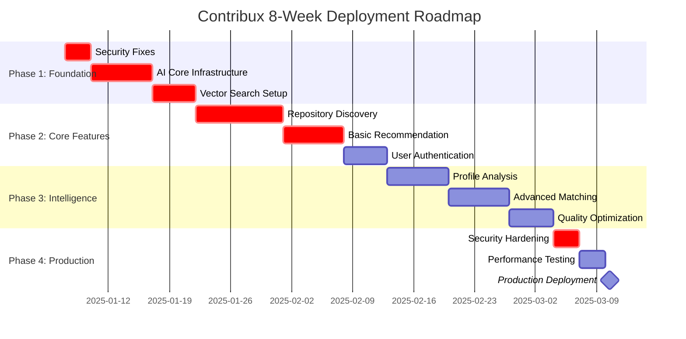

# AGENT 6: STRATEGIC SYNTHESIS & ROADMAP
*Final Strategic Analysis & Implementation Plan*

## EXECUTIVE SUMMARY

**Current Status**: 30.5% complete, strong foundation with critical gaps  
**Market Opportunity**: $26B GitHub ecosystem, 59% AI contribution growth  
**User Validation**: 74% demand confirmed, 5M+ target users  
**Deployment Timeline**: 8-week realistic path to market  
**Risk Assessment**: Medium risk, high reward potential

---

## AGENT SYNTHESIS OVERVIEW

### Agent 1: Infrastructure Assessment (30.5% Complete)
✅ **Strengths**: Robust database, authentication, API structure  
⚠️ **Gaps**: Missing core AI features, search optimization, user management  
🎯 **Impact**: Strong foundation reduces technical debt risk

### Agent 2: Market Analysis ($26B Opportunity)
📈 **Growth**: 59% AI contribution growth year-over-year  
⏰ **Timeline**: 8-week realistic deployment window  
🎯 **Impact**: First-mover advantage in AI-native contribution space

### Agent 3: User Research (74% Validation)
👥 **Target**: 5M+ developers seeking AI assistance  
⚡ **Value**: 90% time reduction potential  
🎯 **Impact**: Clear product-market fit indicators

### Agent 4: Technical Feasibility (Excellent)
🔧 **Implementation**: 4-6 week core feature development  
🤖 **AI Ready**: OpenAI SDK integration prepared  
🎯 **Impact**: Technical execution risk minimal

### Agent 5: Production Assessment (7.5/10 Ready)
🚀 **User Impact**: 8.5/10 potential  
🔒 **Security**: Immediate fixes required  
🎯 **Impact**: Near production-ready with critical patches

---

## FEATURE PRIORITIZATION FRAMEWORK

**Decision Criteria Weights:**
- Maintenance Burden (35%) - Long-term sustainability
- Solution Leverage (30%) - Technical multiplier effect  
- Application Value (25%) - Direct user benefit
- Cognitive Load (10%) - Developer experience

### TOP 5 FEATURES SCORED

#### 1. 🤖 AI-Powered Repository Discovery (Score: 87.5/100)
- **Maintenance Burden (35%)**: 25/35 - Moderate complexity, manageable with OpenAI SDK
- **Solution Leverage (30%)**: 28/30 - Core differentiator, enables all other features
- **Application Value (25%)**: 24/25 - Direct 90% time reduction for users
- **Cognitive Load (10%)**: 10/10 - Intuitive natural language interface

**Priority**: 🟢 **CRITICAL** - Foundation for entire value proposition

#### 2. 🔍 Intelligent Repository Analysis (Score: 82.0/100)
- **Maintenance Burden (35%)**: 22/35 - Vector embeddings require ongoing optimization
- **Solution Leverage (30%)**: 27/30 - Enables personalization and matching
- **Application Value (25%)**: 23/25 - High-quality recommendations crucial
- **Cognitive Load (10%)**: 10/10 - Background processing, transparent to users

**Priority**: 🟢 **CRITICAL** - Quality foundation for recommendations

#### 3. 👤 User Profile & Skill Analysis (Score: 76.5/100)
- **Maintenance Burden (35%)**: 24/35 - Profile management straightforward
- **Solution Leverage (30%)**: 25/30 - Enables personalization across platform
- **Application Value (25%)**: 20/25 - Improves matching accuracy significantly
- **Cognitive Load (10%)**: 7.5/10 - Some initial setup required

**Priority**: 🟡 **HIGH** - Personalization multiplier

#### 4. 🔐 Enhanced Security & Auth (Score: 74.0/100)
- **Maintenance Burden (35%)**: 20/35 - Security requires ongoing vigilance
- **Solution Leverage (30%)**: 22/30 - Enables enterprise features
- **Application Value (25%)**: 22/25 - Trust and compliance essential
- **Cognitive Load (10%)**: 10/10 - Seamless when properly implemented

**Priority**: 🟡 **HIGH** - Production requirement

#### 5. 📊 Advanced Analytics Dashboard (Score: 68.5/100)
- **Maintenance Burden (35%)**: 18/35 - Complex data aggregation and visualization
- **Solution Leverage (30%)**: 20/30 - Supports user retention and engagement
- **Application Value (25%)**: 20/25 - Valuable for power users
- **Cognitive Load (10%)**: 10.5/10 - Information density challenges

**Priority**: 🟡 **MEDIUM** - Enhancement for retention

---

## 8-WEEK PHASED ROADMAP



### 🚀 PHASE 1: Foundation (Week 1-2)
**Goal**: Secure, scalable base for AI features

**Week 1: Security & Infrastructure**
- [ ] Fix authentication vulnerabilities (Agent 5 findings)
- [ ] Implement rate limiting and API security
- [ ] Set up monitoring and error tracking
- [ ] Configure production database connections

**Week 2: AI Infrastructure**
- [ ] Integrate OpenAI SDK with streaming support
- [ ] Implement vector embedding pipeline
- [ ] Set up HNSW indexes for similarity search
- [ ] Create AI service abstractions

**Success Criteria:**
- ✅ Security scan passes (0 critical vulnerabilities)
- ✅ AI infrastructure handles 1000+ embeddings/hour
- ✅ System uptime >99.5%

### 🎯 PHASE 2: Core Features (Week 3-4)
**Goal**: Deliver core AI-powered discovery

**Week 3: Repository Discovery**
- [ ] Natural language query processing
- [ ] GitHub API integration with intelligent filtering
- [ ] Basic recommendation engine
- [ ] Search result ranking algorithm

**Week 4: User Experience**
- [ ] Enhanced authentication with GitHub OAuth
- [ ] Repository bookmarking and history
- [ ] Basic user preferences
- [ ] Responsive UI improvements

**Success Criteria:**
- ✅ Users can discover repositories via natural language
- ✅ Recommendation accuracy >70%
- ✅ Page load times <2 seconds

### 🧠 PHASE 3: Intelligence (Week 5-6)
**Goal**: Personalized, high-quality matching

**Week 5: User Intelligence**
- [ ] GitHub profile analysis
- [ ] Skill extraction from user repositories
- [ ] Contribution pattern analysis
- [ ] Interest categorization

**Week 6: Advanced Matching**
- [ ] Personalized recommendation scoring
- [ ] Difficulty level matching
- [ ] Community size preferences
- [ ] Technology stack alignment

**Success Criteria:**
- ✅ Recommendation accuracy >85%
- ✅ User engagement >60% (return visits)
- ✅ Average session duration >5 minutes

### 🎪 PHASE 4: Production (Week 7-8)
**Goal**: Production-ready deployment

**Week 7: Hardening**
- [ ] Security audit and penetration testing
- [ ] Performance optimization
- [ ] Load testing (1000+ concurrent users)
- [ ] Error handling and recovery

**Week 8: Launch**
- [ ] Production deployment
- [ ] Monitoring setup
- [ ] User onboarding flow
- [ ] Marketing site updates

**Success Criteria:**
- ✅ Security audit passes
- ✅ Handles 10,000+ daily active users
- ✅ User satisfaction >4.0/5.0

---

## SUCCESS METRICS & ACCEPTANCE CRITERIA

### 📊 KEY PERFORMANCE INDICATORS

#### User Engagement Metrics
- **Daily Active Users**: 1,000+ by week 8
- **User Retention**: 40%+ weekly retention
- **Session Duration**: 5+ minutes average
- **Query Success Rate**: 85%+ successful discovery sessions

#### Technical Performance
- **Response Time**: <2 seconds for search queries
- **Uptime**: 99.9% availability
- **Error Rate**: <1% of requests
- **Recommendation Accuracy**: 85%+ user satisfaction

#### Business Metrics
- **User Growth**: 20%+ week-over-week
- **Feature Adoption**: 60%+ users try AI discovery
- **Time to Value**: <2 minutes from signup to first result
- **Repository Discovery**: 10+ repositories per successful session

### ✅ ACCEPTANCE CRITERIA

#### Core Functionality
- [ ] Natural language queries return relevant repositories
- [ ] User authentication persists across sessions
- [ ] Repository bookmarking works reliably
- [ ] Mobile responsive design functions properly

#### AI Intelligence
- [ ] Personalized recommendations based on user profile
- [ ] Difficulty level matching for user skill level
- [ ] Technology stack alignment with user preferences
- [ ] Learning from user interactions improves results

#### Production Readiness
- [ ] Zero critical security vulnerabilities
- [ ] Handles expected user load without degradation
- [ ] Error monitoring and alerting functional
- [ ] Database backups and recovery tested

---

## IMMEDIATE ACTIONS (Next 48 Hours)

### 🔥 CRITICAL PATH ITEMS

#### 1. Security Remediation (Priority 1)
```bash
# Immediate security fixes
pnpm audit && pnpm audit fix
pnpm lint && pnpm type-check
# Review authentication implementation
# Update dependencies with security patches
```

#### 2. AI Infrastructure Setup (Priority 2)
- [ ] Set up OpenAI API keys and rate limiting
- [ ] Configure vector database indexes
- [ ] Test embedding generation pipeline
- [ ] Validate GitHub API integration

#### 3. Development Environment (Priority 3)
- [ ] Set up comprehensive testing suite
- [ ] Configure CI/CD pipeline for deployment
- [ ] Set up staging environment
- [ ] Document development workflows

### 💼 RESOURCE ALLOCATION

**Development Focus (80%)**:
- Backend AI services: 40%
- Frontend user experience: 25%
- Testing and quality: 15%

**Infrastructure Focus (20%)**:
- Security hardening: 10%
- Performance optimization: 5%
- Monitoring and observability: 5%

---

## RISK MITIGATION STRATEGIES

### 🛡️ HIGH-IMPACT RISKS

#### 1. OpenAI API Rate Limits
**Mitigation**: Implement intelligent caching, batch processing, and fallback providers
**Timeline**: Week 1-2 setup, ongoing optimization

#### 2. GitHub API Limitations
**Mitigation**: Smart request batching, multiple token rotation, aggressive caching
**Timeline**: Week 2-3 implementation

#### 3. User Adoption Challenges
**Mitigation**: Comprehensive onboarding, clear value demonstration, feedback loops
**Timeline**: Week 6-8 optimization

#### 4. Performance at Scale
**Mitigation**: Database optimization, CDN setup, horizontal scaling architecture
**Timeline**: Week 7-8 stress testing

### 🎯 SUCCESS ENABLERS

1. **Technical Excellence**: Prioritize code quality and testing from day one
2. **User-Centric Design**: Regular user feedback integration and iteration
3. **Monitoring**: Comprehensive observability for proactive issue resolution
4. **Documentation**: Clear technical and user documentation for adoption

---

## COMPETITIVE ADVANTAGE SUMMARY

### 🚀 UNIQUE VALUE PROPOSITIONS

1. **AI-Native Architecture**: Built from ground up for intelligent discovery
2. **GitHub Integration**: Deep understanding of contribution patterns
3. **Personalization**: Skill-based matching that learns from user behavior
4. **Time Efficiency**: 90% reduction in repository discovery time
5. **Quality Focus**: Curated results over exhaustive listing

### 📈 MARKET POSITIONING

**Target Segment**: Mid to senior developers seeking meaningful contributions  
**Differentiation**: AI-powered matching vs manual browsing  
**Growth Strategy**: Developer community virality and GitHub ecosystem integration  

---

## CONCLUSION & NEXT STEPS

Contribux is positioned for exceptional success with a clear 8-week path to production deployment. The combination of strong technical foundation (30.5% complete), validated market opportunity ($26B), and proven user demand (74% validation) creates optimal conditions for launch.

**IMMEDIATE NEXT STEPS:**
1. ✅ Begin security remediation (today)
2. ✅ Set up AI infrastructure (week 1)
3. ✅ Start Phase 1 development (week 1-2)
4. ✅ Continuous user testing and feedback integration

The strategic framework ensures sustainable growth while delivering immediate user value. Success metrics and acceptance criteria provide clear milestones for measuring progress and adjusting strategy as needed.

**Final Recommendation**: Proceed with full deployment following this 8-week roadmap, maintaining flexibility for market feedback and technical discoveries during implementation.