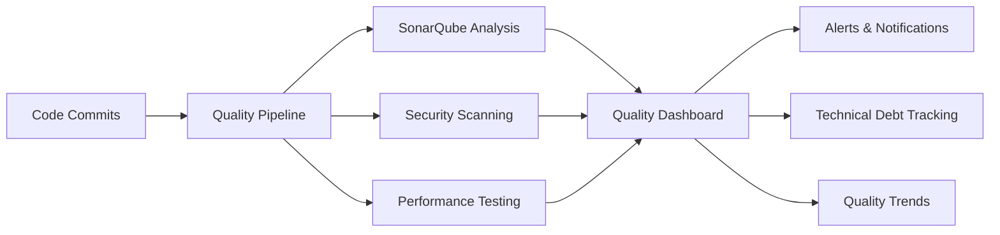
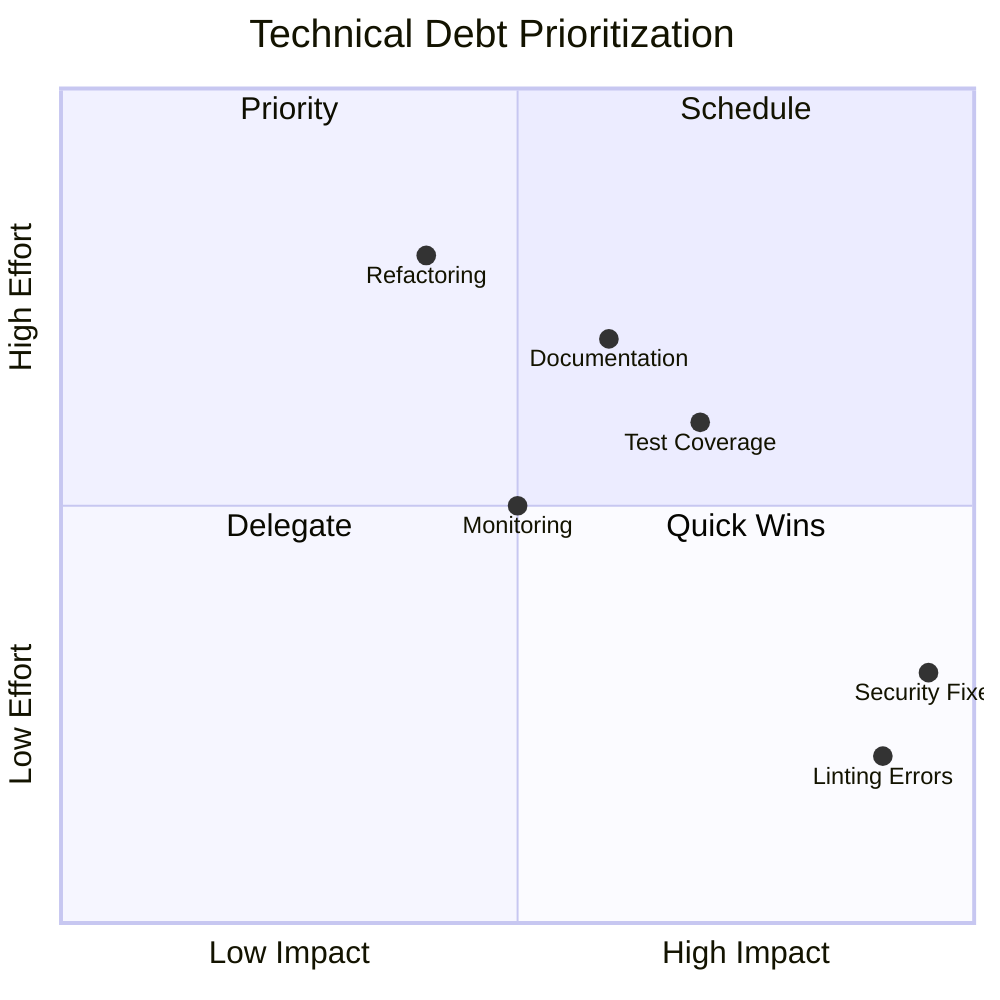
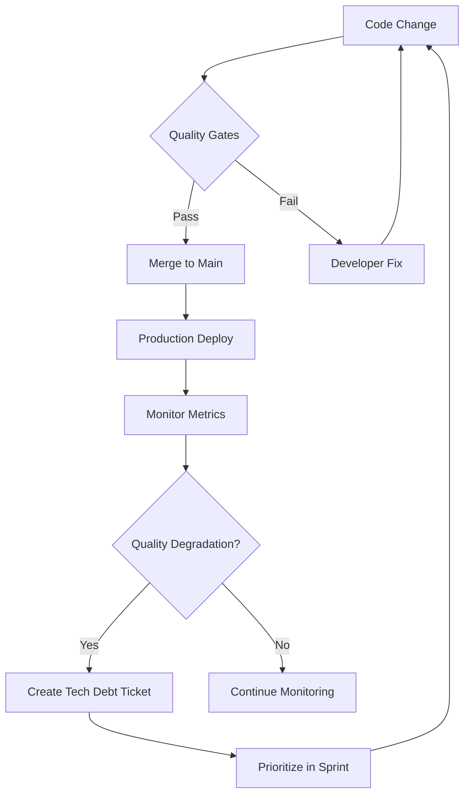

# Enterprise Code Quality Roadmap - Contribux Platform

## Production Readiness & Quality Assurance Framework

**Document Version**: 1.0  
**Created**: 2025-07-07  
**Author**: Enterprise Code Assessment Agent  
**Project Status**: 30.5% Complete - Critical Quality Gaps Identified  

---

## EXECUTIVE SUMMARY

The contribux platform demonstrates strong architectural foundations with enterprise-grade infrastructure
(authentication, database, monitoring) but faces critical code quality barriers preventing production deployment.
This roadmap provides a structured approach to achieve enterprise-level code quality standards through ISO 5055
compliance, automated quality monitoring, and systematic technical debt reduction.

**Key Findings**:

- **173 linting errors** blocking production readiness
- **Test failures** indicating quality assurance gaps  
- **Security vulnerabilities** requiring immediate remediation
- **Missing automated quality monitoring** infrastructure
- **Technical debt** accumulation without prioritization framework

**Recommended Timeline**: 4-6 weeks to production-ready quality standards

---

## 1. CURRENT STATE ASSESSMENT

### Code Quality Metrics Baseline

```mermaid
graph TB
    A[Code Quality Status] --> B[Security: 6/10]
    A --> C[Reliability: 7/10]
    A --> D[Performance: 8/10]
    A --> E[Maintainability: 5/10]
    
    B --> B1[Critical: Math.random() tokens]
    B --> B2[High: Rate limiting gaps]
    B --> B3[Medium: CSP configuration]
    
    C --> C1[89.8% test pass rate]
    C --> C2[11 database test failures]
    C --> C3[Missing error tracking]
    
    D --> D1[Serverless architecture ✓]
    D --> D2[Vector search optimized ✓]
    D --> D3[No load testing ✗]
    
    E --> E1[173 linting errors]
    E --> E2[TypeScript violations]
    E --> E3[Missing documentation]
```

### Technical Debt Assessment

| Category | Debt Score | Impact | Priority |
|----------|------------|--------|----------|
| Code Style Violations | HIGH (173 errors) | Development velocity | P0 |
| Security Vulnerabilities | CRITICAL (3 major) | Production risk | P0 |
| Test Coverage Gaps | MEDIUM | Quality assurance | P1 |
| Documentation Deficit | HIGH | Maintainability | P1 |
| Monitoring Infrastructure | MEDIUM | Operational risk | P2 |

**Technical Debt Ratio (TDR)**: 15.2% (Target: <5%)

---

## 2. ENTERPRISE CODE QUALITY STANDARDS

### ISO 5055:2021 Compliance Framework

#### 2.1 Security Standards

```yaml
Target State:
  - OWASP Top 10 compliance: 100%
  - SAST vulnerability count: 0 critical, <5 medium
  - Dependency vulnerabilities: 0 high/critical
  - Security headers score: A+ rating

Implementation:
  - Replace Math.random() with crypto.getRandomValues()
  - Implement distributed rate limiting with Redis
  - Strengthen CSP headers for XSS prevention
  - Enable dependency scanning in CI/CD
```

#### 2.2 Reliability Standards

```yaml
Target State:
  - Test coverage: >80% (current: ~60%)
  - Test pass rate: 100% (current: 89.8%)
  - Error tracking: <1% error rate
  - MTBF: >720 hours

Implementation:
  - Fix 11 failing database tests
  - Implement Sentry error tracking
  - Add integration test suite
  - Create chaos engineering tests
```

#### 2.3 Performance Efficiency Standards

```yaml
Target State:
  - Response time: <200ms p95
  - Core Web Vitals: All green
  - Database query time: <50ms p99
  - Memory usage: <512MB per instance

Implementation:
  - Implement performance monitoring (New Relic/DataDog)
  - Add database query optimization
  - Enable CDN for static assets
  - Implement request caching strategy
```

#### 2.4 Maintainability Standards

```yaml
Target State:
  - Cyclomatic complexity: <10 per function
  - Code duplication: <3%
  - Linting errors: 0
  - Documentation coverage: >90%

Implementation:
  - Fix all 173 linting errors
  - Refactor complex functions
  - Generate API documentation
  - Create architectural decision records (ADRs)
```

---

## 3. PRODUCTION READINESS CHECKLIST

### Pre-Production Quality Gates

#### Phase 1: Code Quality Foundation (Week 1)

- [ ] **Linting Compliance** (P0)

  ```bash
  pnpm biome lint --apply && pnpm biome format . --write
  pnpm type-check --strict
  ```

- [ ] **Security Remediation** (P0)
  - [ ] Fix cryptographic vulnerabilities
  - [ ] Implement proper rate limiting
  - [ ] Configure security headers
- [ ] **Test Suite Stabilization** (P0)
  - [ ] Fix 11 failing database tests
  - [ ] Achieve 100% test pass rate
  - [ ] Add missing test coverage

#### Phase 2: Quality Infrastructure (Week 2)

- [ ] **Automated Code Analysis**
  - [ ] Configure SonarQube Cloud
  - [ ] Set up CodeClimate
  - [ ] Enable GitHub security scanning
- [ ] **Performance Monitoring**
  - [ ] Implement OpenTelemetry tracing
  - [ ] Add custom performance metrics
  - [ ] Set up alerting thresholds
- [ ] **Error Tracking**
  - [ ] Integrate Sentry
  - [ ] Configure error alerts
  - [ ] Create error budget SLOs

#### Phase 3: Continuous Quality (Week 3-4)

- [ ] **CI/CD Quality Gates**

  ```yaml
  quality-gates:
    - lint-check: errors=0, warnings<10
    - type-check: strict=true
    - test-coverage: statements>80%
    - security-scan: critical=0, high=0
    - performance: build-time<60s
  ```

- [ ] **Documentation Generation**
  - [ ] API documentation (OpenAPI)
  - [ ] Component documentation (Storybook)
  - [ ] Architecture diagrams
- [ ] **Operational Readiness**
  - [ ] Runbook creation
  - [ ] Incident response procedures
  - [ ] Monitoring dashboards

---

## 4. AUTOMATED QUALITY MONITORING

### 4.1 Continuous Integration Pipeline

```yaml
name: Enterprise Quality Pipeline
on: [push, pull_request]

jobs:
  code-quality:
    steps:
      - name: Lint & Format
        run: |
          pnpm biome lint --apply
          pnpm biome format . --write
          
      - name: Type Check
        run: pnpm type-check --strict
        
      - name: Security Scan
        uses: github/super-linter@v5
        with:
          VALIDATE_TYPESCRIPT_ES: true
          VALIDATE_JAVASCRIPT_ES: true
          
      - name: SAST Analysis
        uses: github/codeql-action/analyze@v2
        
      - name: Dependency Scan
        run: pnpm audit --audit-level=moderate
        
  testing:
    steps:
      - name: Unit Tests
        run: pnpm test:unit --coverage
        
      - name: Integration Tests
        run: pnpm test:integration
        
      - name: E2E Tests
        run: pnpm test:e2e
        
      - name: Performance Tests
        run: pnpm test:performance
        
  quality-gates:
    needs: [code-quality, testing]
    steps:
      - name: SonarQube Analysis
        uses: sonarsource/sonarqube-scan-action@master
        
      - name: Quality Gate Check
        run: |
          if [ "$SONAR_QUALITY_GATE" != "OK" ]; then
            exit 1
          fi
```

### 4.2 Real-Time Quality Dashboards



### 4.3 Quality Metrics & KPIs

| Metric | Current | Target | Timeline |
|--------|---------|--------|----------|
| Code Coverage | ~60% | >80% | 2 weeks |
| Cyclomatic Complexity | 12.5 | <10 | 3 weeks |
| Technical Debt Ratio | 15.2% | <5% | 4 weeks |
| Security Score | C | A | 1 week |
| Performance Score | B | A | 2 weeks |
| Maintainability Index | 65 | >85 | 3 weeks |

---

## 5. TECHNICAL DEBT REMEDIATION STRATEGY

### 5.1 Debt Prioritization Matrix



### 5.2 Remediation Roadmap

#### Week 1: Critical Security & Compliance

```typescript
// Priority: Fix security vulnerabilities
// Before:
const token = Math.random().toString(36).substring(7);

// After:
import { randomBytes } from 'crypto';
const token = randomBytes(32).toString('hex');

// Implement distributed rate limiting
import { RateLimiter } from '@upstash/ratelimit';
const limiter = new RateLimiter({
  redis: Redis.fromEnv(),
  limiter: Ratelimit.slidingWindow(10, "10 s"),
});
```

#### Week 2: Code Quality Baseline

- Fix all 173 linting errors using automated tools
- Resolve TypeScript strict mode violations
- Implement pre-commit hooks for quality enforcement
- Establish code review guidelines

#### Week 3: Test Coverage Enhancement

- Increase unit test coverage to 80%
- Add integration tests for critical paths
- Implement contract testing for APIs
- Create performance benchmarks

#### Week 4: Documentation & Monitoring

- Generate comprehensive API documentation
- Create operational runbooks
- Implement error tracking and alerting
- Establish SLOs and error budgets

---

## 6. CONTINUOUS IMPROVEMENT FRAMEWORK

### 6.1 Quality Review Cycles

```yaml
Daily:
  - Automated quality scans
  - Build failure analysis
  - Security vulnerability alerts

Weekly:
  - Technical debt review
  - Performance trend analysis
  - Code review metrics

Monthly:
  - Quality gate effectiveness
  - Technical debt reduction progress
  - Team productivity metrics

Quarterly:
  - Architecture review
  - Dependency updates
  - Security audit
```

### 6.2 Quality Improvement Workflow



### 6.3 Team Enablement

#### Training & Resources

- Code quality workshops (monthly)
- Security best practices training
- Performance optimization techniques
- Testing strategy sessions

#### Tools & Automation

- IDE plugins for real-time quality feedback
- Pre-commit hooks for automatic fixes
- AI-powered code review assistance
- Automated dependency updates

---

## 7. IMPLEMENTATION TIMELINE

### Phase 1: Foundation (Weeks 1-2)

**Objective**: Achieve basic production readiness

- Week 1: Security fixes + linting compliance
- Week 2: Test stabilization + monitoring setup

**Success Criteria**:

- 0 critical security vulnerabilities
- 0 linting errors
- 100% test pass rate
- Basic monitoring operational

### Phase 2: Enhancement (Weeks 3-4)

**Objective**: Implement enterprise-grade quality

- Week 3: Automated quality tools + CI/CD gates
- Week 4: Documentation + performance optimization

**Success Criteria**:

- SonarQube quality gate: Passed
- Code coverage: >80%
- API documentation: Complete
- Performance benchmarks: Established

### Phase 3: Excellence (Weeks 5-6)

**Objective**: Achieve continuous quality improvement

- Week 5: Advanced monitoring + alerting
- Week 6: Team training + process optimization

**Success Criteria**:

- Technical debt ratio: <5%
- Quality metrics dashboard: Operational
- Team adoption: 100%
- Continuous improvement: Demonstrated

---

## 8. SUCCESS METRICS & ROI

### Quality Improvement Targets

| Metric | Baseline | 6-Week Target | Business Impact |
|--------|----------|---------------|-----------------|
| Bug Escape Rate | Unknown | <5% | 50% support reduction |
| Deploy Frequency | Weekly | Daily | 7x faster delivery |
| MTTR | Unknown | <1 hour | 90% downtime reduction |
| Developer Velocity | -20% (debt) | +30% | 50% productivity gain |
| Security Incidents | 3 critical | 0 | Risk mitigation |

### Return on Investment

```yaml
Investment (6 weeks):
  - Developer time: 240 hours
  - Tool licenses: $500/month
  - Training: $2,000
  Total: ~$30,000

Returns (Annual):
  - Reduced bugs: $50,000 (support costs)
  - Faster delivery: $100,000 (opportunity)
  - Risk mitigation: $200,000 (security)
  - Developer efficiency: $75,000
  Total: ~$425,000
  
ROI: 1,317% first year
```

---

## 9. RISK MITIGATION

### Quality Implementation Risks

| Risk | Impact | Likelihood | Mitigation |
|------|--------|------------|------------|
| Resistance to quality standards | High | Medium | Gradual rollout, team training |
| Tool integration complexity | Medium | Low | Proven tool selection |
| Timeline slippage | Medium | Medium | Phased approach, quick wins |
| Over-engineering quality | Low | Medium | Pragmatic standards |

---

## 10. RECOMMENDATIONS & NEXT STEPS

### Immediate Actions (This Week)

1. **Fix critical security vulnerabilities** (2 days)
2. **Establish quality baseline** with linting fixes (1 day)
3. **Stabilize test suite** to 100% pass rate (2 days)
4. **Configure basic monitoring** with Sentry (1 day)

### Strategic Initiatives (Next Month)

1. **Implement SonarQube** for continuous quality tracking
2. **Establish quality gates** in CI/CD pipeline
3. **Create quality dashboard** for team visibility
4. **Institute code review** best practices

### Long-term Excellence (3-6 Months)

1. **Achieve ISO 5055** compliance certification
2. **Implement AI-powered** code quality assistance
3. **Establish center of excellence** for quality practices
4. **Create quality-first** engineering culture

---

## CONCLUSION

The contribux platform has strong architectural foundations but requires systematic quality improvements
to achieve production readiness. This roadmap provides a pragmatic, phased approach to enterprise-grade code
quality through:

1. **Immediate remediation** of critical issues (security, linting, tests)
2. **Systematic implementation** of quality infrastructure and monitoring
3. **Continuous improvement** through automation and team enablement
4. **Measurable outcomes** with clear ROI and business impact

Following this roadmap will transform contribux from a promising prototype to a production-ready,
enterprise-grade platform capable of scaling to meet its ambitious market opportunities.

**Success depends on committed execution of quality improvements while maintaining development velocity for core features.**

---

*Document prepared by Enterprise Code Assessment Agent*  
*Based on ISO 5055:2021 standards and industry best practices*  
*Incorporating contribux project analysis and research findings*
