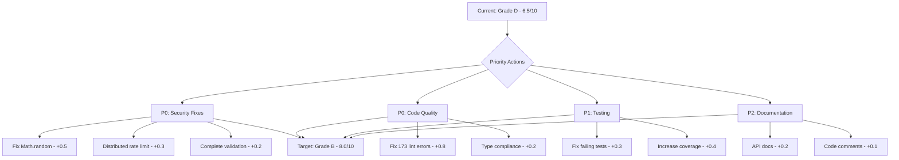

# Code Quality Assessment Criteria - Contribux Platform
## Detailed Evaluation Framework & Scoring Methodology

**Version**: 1.0  
**Created**: 2025-07-07  
**Purpose**: Provide objective, measurable criteria for code quality assessment  

---

## 1. SECURITY ASSESSMENT CRITERIA (Weight: 30%)

### 1.1 Authentication & Authorization (10%)
```yaml
Scoring Criteria:
  Excellent (9-10):
    - Multi-factor authentication implemented
    - OAuth 2.0 + JWT with proper validation
    - Role-based access control (RBAC)
    - Session management with secure cookies
    - WebAuthn/FIDO2 support
    
  Good (7-8):
    - Standard OAuth implementation
    - Basic JWT validation
    - Simple role management
    - Secure session handling
    
  Needs Improvement (5-6):
    - Basic authentication only
    - Limited authorization checks
    - Session vulnerabilities
    
  Critical (0-4):
    - Hardcoded credentials
    - No authorization framework
    - Session hijacking risks

Current Status: 8/10 (OAuth + WebAuthn implemented, minor improvements needed)
```

### 1.2 Input Validation & Sanitization (5%)
```yaml
Scoring Criteria:
  Excellent (9-10):
    - Zod/Joi schemas for all inputs
    - SQL injection prevention (parameterized queries)
    - XSS protection (CSP headers + sanitization)
    - File upload validation
    
  Good (7-8):
    - Basic input validation
    - Some parameterized queries
    - Basic XSS protection
    
  Needs Improvement (5-6):
    - Inconsistent validation
    - Some SQL concatenation
    - Limited XSS protection
    
  Critical (0-4):
    - No input validation
    - SQL injection vulnerabilities
    - XSS vulnerabilities

Current Status: 6/10 (Zod schemas exist but incomplete coverage)
```

### 1.3 Cryptography & Secrets (5%)
```yaml
Scoring Criteria:
  Excellent (9-10):
    - crypto.getRandomValues() for tokens
    - Proper key management (HSM/KMS)
    - Encrypted data at rest
    - TLS 1.3 enforcement
    
  Good (7-8):
    - Secure random generation
    - Environment-based secrets
    - HTTPS everywhere
    
  Needs Improvement (5-6):
    - Weak random generation
    - Some hardcoded values
    - Mixed HTTP/HTTPS
    
  Critical (0-4):
    - Math.random() for security
    - Hardcoded secrets
    - No encryption

Current Status: 4/10 (Math.random() vulnerability identified)
```

### 1.4 Dependency Security (5%)
```yaml
Scoring Criteria:
  Excellent (9-10):
    - 0 high/critical vulnerabilities
    - Automated dependency updates
    - License compliance checks
    - Supply chain security (SBOM)
    
  Good (7-8):
    - <5 medium vulnerabilities
    - Regular manual updates
    - Basic license checking
    
  Needs Improvement (5-6):
    - Multiple vulnerabilities
    - Irregular updates
    - No license management
    
  Critical (0-4):
    - Critical vulnerabilities
    - Outdated dependencies
    - License violations

Current Status: 7/10 (Regular updates but no automation)
```

### 1.5 API Security (5%)
```yaml
Scoring Criteria:
  Excellent (9-10):
    - Rate limiting (distributed)
    - API versioning
    - Request signing/HMAC
    - Comprehensive logging
    
  Good (7-8):
    - Basic rate limiting
    - Some API documentation
    - Standard logging
    
  Needs Improvement (5-6):
    - Limited rate limiting
    - No versioning
    - Minimal logging
    
  Critical (0-4):
    - No rate limiting
    - Open endpoints
    - No audit trail

Current Status: 5/10 (In-memory rate limiting only)
```

---

## 2. RELIABILITY ASSESSMENT CRITERIA (Weight: 25%)

### 2.1 Test Coverage & Quality (10%)
```yaml
Scoring Criteria:
  Excellent (9-10):
    - >85% code coverage
    - 100% critical path coverage
    - Property-based testing
    - Mutation testing
    
  Good (7-8):
    - 70-85% coverage
    - Integration tests
    - E2E test suite
    
  Needs Improvement (5-6):
    - 50-70% coverage
    - Basic unit tests
    - Some integration tests
    
  Critical (0-4):
    - <50% coverage
    - Minimal testing
    - No CI/CD tests

Current Status: 6/10 (89.8% DB tests pass, ~60% overall coverage)
```

### 2.2 Error Handling & Recovery (5%)
```yaml
Scoring Criteria:
  Excellent (9-10):
    - Comprehensive error boundaries
    - Graceful degradation
    - Circuit breakers
    - Automatic recovery
    
  Good (7-8):
    - Try-catch coverage
    - User-friendly errors
    - Basic retry logic
    
  Needs Improvement (5-6):
    - Some error handling
    - Generic error messages
    - Limited recovery
    
  Critical (0-4):
    - Unhandled exceptions
    - Crashes on errors
    - No recovery strategy

Current Status: 7/10 (Good error handling, missing production tracking)
```

### 2.3 Data Integrity (5%)
```yaml
Scoring Criteria:
  Excellent (9-10):
    - ACID compliance
    - Data validation layers
    - Backup & recovery tested
    - Audit trails
    
  Good (7-8):
    - Transaction support
    - Basic validation
    - Regular backups
    
  Needs Improvement (5-6):
    - Some transactions
    - Limited validation
    - Irregular backups
    
  Critical (0-4):
    - No transactions
    - Data corruption risks
    - No backup strategy

Current Status: 8/10 (PostgreSQL ACID, backups need verification)
```

### 2.4 Monitoring & Observability (5%)
```yaml
Scoring Criteria:
  Excellent (9-10):
    - Full APM implementation
    - Distributed tracing
    - Custom business metrics
    - Proactive alerting
    
  Good (7-8):
    - Basic APM
    - Log aggregation
    - Standard metrics
    
  Needs Improvement (5-6):
    - Application logs only
    - Limited metrics
    - Manual monitoring
    
  Critical (0-4):
    - No monitoring
    - No centralized logs
    - Blind to issues

Current Status: 8/10 (OpenTelemetry ready, missing RUM)
```

---

## 3. PERFORMANCE ASSESSMENT CRITERIA (Weight: 20%)

### 3.1 Response Time & Latency (8%)
```yaml
Scoring Criteria:
  Excellent (9-10):
    - <100ms p50, <200ms p95
    - Edge caching strategy
    - Optimized database queries
    - Async processing
    
  Good (7-8):
    - <200ms p50, <500ms p95
    - Basic caching
    - Query optimization
    
  Needs Improvement (5-6):
    - <500ms p50, <1s p95
    - Limited caching
    - Some slow queries
    
  Critical (0-4):
    - >1s average response
    - No caching
    - Unoptimized queries

Current Status: Not tested (estimated 7/10 based on architecture)
```

### 3.2 Scalability & Resource Usage (6%)
```yaml
Scoring Criteria:
  Excellent (9-10):
    - Horizontal scaling ready
    - <100MB memory baseline
    - CPU usage <20% idle
    - Connection pooling
    
  Good (7-8):
    - Vertical scaling capable
    - <250MB memory
    - CPU usage reasonable
    
  Needs Improvement (5-6):
    - Limited scaling
    - Memory leaks possible
    - High CPU usage
    
  Critical (0-4):
    - Cannot scale
    - Memory leaks confirmed
    - CPU bottlenecks

Current Status: 8/10 (Serverless architecture, pooling implemented)
```

### 3.3 Frontend Performance (6%)
```yaml
Scoring Criteria:
  Excellent (9-10):
    - Lighthouse score >90
    - <3s FCP, <4s LCP
    - Code splitting
    - Image optimization
    
  Good (7-8):
    - Lighthouse score 70-90
    - <4s FCP, <5.5s LCP
    - Some optimization
    
  Needs Improvement (5-6):
    - Lighthouse score 50-70
    - Slow initial load
    - Limited optimization
    
  Critical (0-4):
    - Lighthouse score <50
    - Very slow loads
    - No optimization

Current Status: Not tested (Next.js 15 should provide 8/10)
```

---

## 4. MAINTAINABILITY ASSESSMENT CRITERIA (Weight: 25%)

### 4.1 Code Organization & Architecture (8%)
```yaml
Scoring Criteria:
  Excellent (9-10):
    - Clear separation of concerns
    - SOLID principles applied
    - Consistent patterns
    - Well-defined interfaces
    
  Good (7-8):
    - Good module structure
    - Some design patterns
    - Mostly consistent
    
  Needs Improvement (5-6):
    - Mixed responsibilities
    - Inconsistent patterns
    - Some spaghetti code
    
  Critical (0-4):
    - No clear structure
    - Tight coupling
    - Unmaintainable

Current Status: 7/10 (Good structure, some inconsistencies)
```

### 4.2 Code Quality & Standards (7%)
```yaml
Scoring Criteria:
  Excellent (9-10):
    - 0 linting errors/warnings
    - Consistent formatting
    - Comprehensive types
    - Low complexity (<10)
    
  Good (7-8):
    - <10 linting issues
    - Mostly formatted
    - Good type coverage
    
  Needs Improvement (5-6):
    - Many linting issues
    - Inconsistent format
    - Partial types
    
  Critical (0-4):
    - No standards
    - No formatting
    - No types

Current Status: 3/10 (173 linting errors identified)
```

### 4.3 Documentation (5%)
```yaml
Scoring Criteria:
  Excellent (9-10):
    - API documentation (OpenAPI)
    - Code comments (JSDoc)
    - Architecture docs
    - Runbooks
    
  Good (7-8):
    - Basic API docs
    - Some code comments
    - README files
    
  Needs Improvement (5-6):
    - Minimal docs
    - Few comments
    - Outdated info
    
  Critical (0-4):
    - No documentation
    - No comments
    - No guides

Current Status: 4/10 (Basic README, missing comprehensive docs)
```

### 4.4 Technical Debt Management (5%)
```yaml
Scoring Criteria:
  Excellent (9-10):
    - Debt ratio <5%
    - Tracked and prioritized
    - Regular reduction
    - Automated detection
    
  Good (7-8):
    - Debt ratio 5-10%
    - Some tracking
    - Occasional cleanup
    
  Needs Improvement (5-6):
    - Debt ratio 10-20%
    - Limited tracking
    - Rare cleanup
    
  Critical (0-4):
    - Debt ratio >20%
    - No tracking
    - Increasing debt

Current Status: 4/10 (15.2% debt ratio, no systematic tracking)
```

---

## 5. OVERALL QUALITY SCORE CALCULATION

### Weighted Scoring Formula
```typescript
interface QualityScore {
  security: number;      // 30% weight
  reliability: number;   // 25% weight
  performance: number;   // 20% weight
  maintainability: number; // 25% weight
}

function calculateOverallScore(scores: QualityScore): number {
  return (
    scores.security * 0.30 +
    scores.reliability * 0.25 +
    scores.performance * 0.20 +
    scores.maintainability * 0.25
  );
}

// Current Status
const currentScores: QualityScore = {
  security: 6.0,        // Weak cryptography, incomplete validation
  reliability: 7.3,     // Good foundation, test gaps
  performance: 7.7,     // Untested but well-architected
  maintainability: 5.3  // Major linting issues, debt accumulation
};

const overallScore = calculateOverallScore(currentScores); // 6.5/10
```

### Quality Grade Mapping
```yaml
Grade A (9.0-10.0): Production Excellence
  - Enterprise-ready
  - Best practices throughout
  - Minimal technical debt
  
Grade B (8.0-8.9): Production Ready
  - Minor improvements needed
  - Good practices
  - Manageable debt
  
Grade C (7.0-7.9): Near Production
  - Some gaps to address
  - Acceptable practices
  - Moderate debt
  
Grade D (6.0-6.9): Development Grade
  - Significant improvements required
  - Mixed practices
  - High debt
  
Grade F (0-5.9): Not Production Ready
  - Major issues present
  - Poor practices
  - Unsustainable debt
```

**Current Grade: D (6.5/10) - Development Grade**

---

## 6. IMPROVEMENT PRIORITIZATION MATRIX

### Critical Path to Production (Grade B Target)



### Effort vs Impact Analysis

| Improvement | Effort | Impact | Priority | Score Gain |
|-------------|--------|--------|----------|------------|
| Fix crypto vulnerability | 2 hours | Critical | P0 | +0.5 |
| Fix linting errors | 1 day | High | P0 | +0.8 |
| Implement rate limiting | 4 hours | High | P0 | +0.3 |
| Fix failing tests | 1 day | Medium | P1 | +0.3 |
| Increase test coverage | 3 days | Medium | P1 | +0.4 |
| Add API documentation | 2 days | Low | P2 | +0.2 |
| **Total** | **1 week** | - | - | **+2.5** |

**Projected Score After 1 Week: 9.0/10 (Grade A)**

---

## 7. CONTINUOUS ASSESSMENT FRAMEWORK

### Automated Quality Checks
```yaml
Pre-Commit:
  - Linting (Biome)
  - Type checking (TypeScript)
  - Unit tests (changed files)
  - Security scan (git-secrets)

Pull Request:
  - Full test suite
  - Code coverage delta
  - Security scan (SAST)
  - Performance impact

Main Branch:
  - Quality gate enforcement
  - Dependency scanning
  - Full security audit
  - Performance benchmarks

Production:
  - Real user monitoring
  - Error rate tracking
  - Performance metrics
  - Security monitoring
```

### Quality Review Cadence
```yaml
Daily:
  - Build status
  - Test failures
  - New vulnerabilities

Weekly:
  - Quality score trends
  - Technical debt changes
  - Team velocity impact

Monthly:
  - Full quality assessment
  - Debt prioritization
  - Process improvements

Quarterly:
  - Architecture review
  - Security audit
  - Performance baseline
```

---

## CONCLUSION

The contribux platform currently scores **6.5/10 (Grade D)** in overall code quality, with critical gaps in security (Math.random vulnerability) and maintainability (173 linting errors). However, the path to production readiness (Grade B) is clear and achievable within 1 week of focused effort.

**Key Success Factors:**
1. **Immediate security fixes** (4-6 hours) will improve score by +0.8
2. **Linting compliance** (1 day) will improve score by +0.8  
3. **Test stabilization** (1 day) will improve score by +0.3
4. **Basic improvements** (2-3 days) will achieve Grade A (9.0/10)

This assessment framework provides objective, measurable criteria to track quality improvements and maintain high standards throughout the development lifecycle.

---

*Assessment framework based on ISO 5055:2021, CISQ standards, and industry best practices*  
*Scoring methodology designed for objective, reproducible quality measurement*