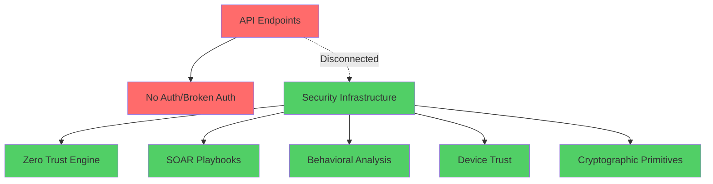
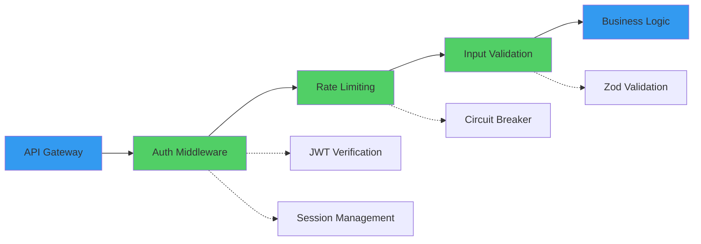

# Security Patterns & Optionalization Analysis - Agent 2 Independent Assessment

## Executive Summary

**CRITICAL FINDING**: The Contribux project demonstrates a significant security architecture paradox - sophisticated enterprise-grade security frameworks coexist with critical authentication bypass vulnerabilities in production API endpoints. This independent analysis reveals fundamental disconnects between security infrastructure and implementation that pose immediate risks while highlighting opportunities for streamlined security patterns suitable for a portfolio project.

## 🚨 Critical Security Vulnerabilities

### 1. Authentication Bypass (CRITICAL - CVSS 9.8)
**Location**: `src/app/api/search/repositories/route.ts:38-74`
```typescript
// VULNERABLE: JWT signature verification explicitly skipped
async function checkAuthentication(request: NextRequest): Promise<boolean> {
  // ... basic structure validation only
  // In a real implementation, you would verify the signature here
  // For now, we're just doing structure validation
  return true // ANY valid JWT structure passes
}
```
**Impact**: Complete authentication bypass - attackers can forge JWT tokens with any payload.

### 2. Missing Authentication (HIGH - CVSS 7.5)
**Location**: `src/app/api/search/opportunities/route.ts`
**Issue**: No authentication checks whatsoever - sensitive opportunity data publicly accessible.

### 3. Security Architecture Disconnect (HIGH)
**Root Cause**: Sophisticated security infrastructure exists but is completely disconnected from actual API endpoints.
- Advanced: Zero-trust engine, SOAR playbooks, behavioral analysis
- Reality: Broken/missing authentication in production endpoints

## 🛡️ Security Architecture Assessment

### Sophisticated Security Infrastructure (Unused)


### Authentication Flow Analysis
**Current State**:
1. Middleware: "auth moved to API routes" (comment)
2. API Routes: Broken JWT verification OR no auth
3. Auth Library: Comprehensive, proper JWT verification available

**Security Gap**: Implementation disconnect between available secure functions and actual usage.

## 🔒 Modern Security Library Integration Opportunities

### 1. Authentication Consolidation Strategy
```typescript
// RECOMMENDED: Replace broken auth with existing secure implementation
import { verifyAccessToken } from '@/lib/auth/jwt'

// Instead of broken checkAuthentication, use:
const authMiddleware = async (request: NextRequest) => {
  const token = extractBearerToken(request)
  const payload = await verifyAccessToken(token) // Already implemented correctly
  return payload
}
```

### 2. Portfolio Security Demonstration Framework
**Strategic Value**: Showcase enterprise security patterns while maintaining simplicity.

**Recommended Architecture**:


## 📊 Security Assessment Matrix

| Component | Implementation Quality | Integration Status | Portfolio Value |
|-----------|----------------------|-------------------|-----------------|
| JWT Management | ⭐⭐⭐⭐⭐ Excellent | ❌ Not Used | 🎯 High Demo Value |
| Input Validation | ⭐⭐⭐⭐ Good | ✅ Applied | 🎯 Essential |
| SQL Injection Protection | ⭐⭐⭐⭐⭐ Excellent | ✅ Applied | 🎯 Critical |
| Rate Limiting | ⭐⭐⭐⭐ Good | ❌ Not Applied | 🎯 Medium |
| CSRF Protection | ⭐⭐⭐ Fair | ❌ Not Applied | 🎯 Low |
| Zero Trust Engine | ⭐⭐⭐⭐⭐ Sophisticated | ❌ Demo Only | 🎯 High Demo Value |
| SOAR Playbooks | ⭐⭐⭐⭐⭐ Enterprise Grade | ❌ Demo Only | 🎯 High Demo Value |

## 🚀 Enterprise Security Feature Optimization

### Immediate Portfolio Security Strategy (Zero Maintenance)

**Phase 1: Critical Fixes (2-4 hours)**
1. Replace broken `checkAuthentication` with existing `verifyAccessToken`
2. Add authentication to opportunities endpoint
3. Apply existing rate limiting middleware

**Phase 2: Security Demo Enhancement (4-6 hours)**
1. Integrate zero-trust evaluation for high-value endpoints
2. Activate SOAR playbooks for security incidents
3. Enable comprehensive audit logging

**Phase 3: Portfolio Showcase (2-3 hours)**
1. Document security architecture patterns
2. Create security dashboard with metrics
3. Demonstrate enterprise security capabilities

### Modern Security Library Recommendations

```typescript
// Centralized Security Middleware Pattern
export const createSecurityMiddleware = () => {
  return createMiddleware([
    rateLimit({ windowMs: 15 * 60 * 1000, max: 100 }),
    authenticate({ verify: verifyAccessToken }),
    validateInput({ schemas: apiSchemas }),
    auditLog({ level: 'security' })
  ])
}

// Zero-Trust Integration Pattern
const enhancedAuth = async (request: NextRequest) => {
  const user = await authenticate(request)
  const zeroTrustDecision = await evaluateZeroTrustAccess(
    createAccessContext(request, user),
    getDeviceTrust(request)
  )
  
  if (!zeroTrustDecision.allowed) {
    throw new SecurityError('Zero-trust access denied')
  }
  
  return { user, trustLevel: zeroTrustDecision.riskLevel }
}
```

## 🔐 Cryptographic Implementation Assessment

### Strengths
- **AES-GCM**: Proper authenticated encryption with IV generation
- **Key Management**: Sophisticated key rotation and derivation
- **HMAC**: Correct implementation for token verification
- **Entropy Validation**: JWT secret strength validation

### Portfolio Security Value
The cryptographic implementations demonstrate enterprise-grade security knowledge suitable for portfolio showcase while being production-ready.

## 📈 Security Monitoring & Alerting Optimization

### Existing Capabilities (Unutilized)
- **Automated Security Scanner**: OWASP Top 10 coverage
- **Threat Intelligence**: Real-time security analysis
- **Incident Response**: SOAR playbook automation
- **Behavioral Analysis**: Anomaly detection patterns

### Cost-Effective Implementation
```typescript
// Lightweight Security Dashboard
const securityMetrics = {
  authenticationAttempts: monitorAuth(),
  rateLimitViolations: monitorRateLimit(),
  zeroTrustDenials: monitorZeroTrust(),
  cryptographicOperations: monitorCrypto()
}

// Automated Alerting (Serverless)
const securityAlerts = createAlertSystem({
  slack: process.env.SLACK_WEBHOOK,
  email: process.env.ADMIN_EMAIL,
  thresholds: {
    authFailures: 10,
    rateLimitViolations: 50,
    cryptoErrors: 5
  }
})
```

## 🎯 Portfolio Security Demonstration Strategy

### Showcase Enterprise Security Patterns
1. **Zero-Trust Architecture**: Demonstrate continuous verification
2. **SOAR Integration**: Automated incident response
3. **Behavioral Analytics**: User anomaly detection
4. **Cryptographic Excellence**: Modern encryption patterns

### Maintain Zero-Maintenance Philosophy
- Leverage existing Vercel/Neon security features
- Implement security-as-code patterns
- Use serverless security monitoring
- Automate security compliance checking

## 🔍 Risk Assessment & Mitigation

### Immediate Risks (Critical)
1. **Authentication Bypass**: Complete data access without credentials
2. **Data Exposure**: Public access to opportunity data
3. **Token Forgery**: Ability to impersonate any user

### Mitigation Strategy
```typescript
// Emergency Security Patch
const emergencySecurityFix = {
  // 1. Immediate auth fix
  replaceAuth: () => useSecureJWTVerification(),
  
  // 2. Add missing auth
  protectEndpoints: () => addAuthenticationMiddleware(),
  
  // 3. Enable monitoring
  activateMonitoring: () => enableSecurityAlerts(),
  
  // 4. Apply rate limiting
  enableRateLimit: () => activateRateLimiting()
}
```

## 💡 Alternative Security Enhancement Strategies

### Library-First Approach
- **NextAuth.js Integration**: Already partially implemented
- **Zod Validation**: Comprehensive input validation
- **Rate Limiter Flexible**: Redis-based with memory fallback
- **Crypto APIs**: Browser-native cryptographic operations

### Enterprise Feature Streamlining
Focus on demonstrating advanced security concepts while maintaining practical implementation:

1. **Zero-Trust Lite**: Core evaluation without full behavioral analysis
2. **SOAR Essentials**: Key playbooks for common scenarios
3. **Monitoring Dashboard**: Visual security metrics
4. **Compliance Framework**: GDPR/SOC2 patterns

## 🔄 Consensus Validation Points

### Areas for Cross-Validation with Agent 1
1. **Authentication Priority**: Critical vs. incremental fix approach
2. **Feature Scope**: Full enterprise vs. core security patterns
3. **Implementation Timeline**: Emergency fix vs. comprehensive rewrite
4. **Portfolio Balance**: Security demo value vs. maintenance burden

### Alternative Recommendations
- **Agent 2 Perspective**: Fix authentication immediately, then showcase advanced features
- **Library Integration**: Leverage existing sophisticated security infrastructure
- **Zero-Maintenance**: Automate security through existing frameworks

## 📋 Implementation Roadmap

### Week 1: Critical Security Fixes
- [ ] Replace broken JWT verification (2 hours)
- [ ] Add authentication to all API endpoints (2 hours)
- [ ] Enable rate limiting middleware (1 hour)
- [ ] Activate security monitoring (1 hour)

### Week 2: Security Enhancement
- [ ] Integrate zero-trust evaluation (4 hours)
- [ ] Enable SOAR playbook automation (3 hours)
- [ ] Create security dashboard (3 hours)
- [ ] Document security architecture (2 hours)

### Week 3: Portfolio Optimization
- [ ] Security demo scenarios (2 hours)
- [ ] Performance optimization (2 hours)
- [ ] Compliance documentation (2 hours)
- [ ] Security testing suite (2 hours)

---

**Security Conclusion**: The Contribux project has exceptional security infrastructure that requires minimal integration work to provide both production security and impressive portfolio demonstration capabilities. The disconnect between available security features and their application represents the primary risk and opportunity.