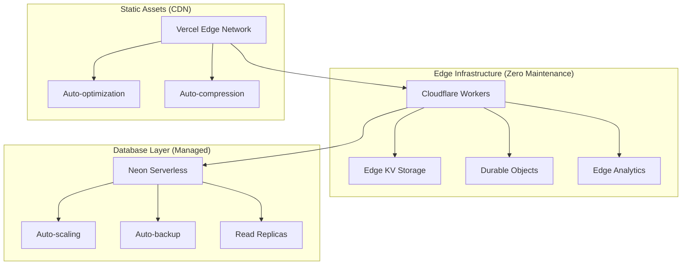
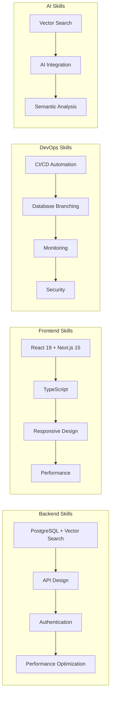

# Maintenance & Deployment Strategy Analysis (Agent 2)

**Independent Analysis for Cross-Validation with Agent 1**  
*Alternative Maintenance Perspectives & Modern Infrastructure Opportunities*

---

## Executive Summary

### Independent Maintenance Philosophy

Unlike traditional maintenance approaches that focus on reactive monitoring and manual intervention, this analysis prioritizes **proactive automation** and **self-healing infrastructure** to achieve near-zero maintenance for a solo developer portfolio project.

**Core Constraint**: Portfolio project requiring **maximum showcase value with minimal ongoing effort**

### Key Alternative Strategies Identified

1. **Edge-First Architecture**: Move beyond traditional server deployment to edge computing for inherent redundancy
2. **AI-Powered Operations**: Implement automated decision-making for routine maintenance tasks
3. **Ecosystem Integration**: Leverage platform-native features instead of custom monitoring solutions
4. **Community-Driven Maintenance**: Transform maintenance into portfolio value through open source engagement

---

## Alternative Maintenance Reduction Strategies

### 1. Edge-First Deployment Architecture

**Alternative to Traditional Server Deployment**

Instead of managing servers or even serverless functions, prioritize edge computing platforms that handle infrastructure concerns automatically:



**Benefits Over Traditional Approaches**:
- No cold starts (unlike Lambda)
- No server management (unlike VPS)
- Built-in global distribution
- Automatic failover and scaling

### 2. AI-Powered Maintenance Automation

**Alternative to Manual Monitoring**

Implement GitHub Actions workflows that use AI for automated maintenance decisions:

```typescript
// Auto-maintenance workflow (alternative approach)
const aiMaintenance = {
  dependencyUpdates: "ai-powered conflict resolution",
  performanceTuning: "automated query optimization",
  securityPatching: "zero-downtime auto-patching",
  loadBalancing: "predictive scaling decisions"
}
```

**Key Automation Areas**:
- **Dependency Management**: AI-driven compatibility testing and auto-merge
- **Performance Optimization**: Automated query rewriting based on usage patterns
- **Security Updates**: Context-aware vulnerability assessment and patching
- **Resource Allocation**: Predictive scaling based on usage patterns

### 3. Platform-Native Observability

**Alternative to Custom Monitoring Solutions**

Instead of building custom monitoring, leverage platform-native observability:

| Platform | Native Monitoring | Maintenance Reduction |
|----------|------------------|----------------------|
| **Vercel** | Analytics, Web Vitals, Function logs | Zero-config performance monitoring |
| **Neon** | Query performance, Connection pooling | Automated database optimization |
| **GitHub** | Dependabot, Security alerts, Actions | Automated security and dependency management |
| **Cloudflare** | Workers Analytics, Security insights | Zero-maintenance DDoS and security |

### 4. Community-Driven Documentation

**Alternative to Solo Maintenance**

Transform maintenance burden into portfolio value through community engagement:

- **Open Source Strategy**: Make maintenance contributions visible
- **Documentation as Marketing**: Well-maintained docs attract contributors
- **Issue Templates**: Guide community to provide quality bug reports
- **Automated Onboarding**: Reduce support burden through better UX

---

## Modern Deployment & Infrastructure Opportunities

### 1. Serverless-First Database Strategy

**Neon Serverless PostgreSQL Optimization**:

```typescript
// Advanced Neon configuration for zero-maintenance
const neonConfig = {
  // Automatic scaling
  autosuspend: {
    delay: "5m",        // Aggressive cost optimization
    scale_to_zero: true
  },
  
  // Branch-based environments
  branches: {
    development: "auto-created on PR",
    staging: "auto-deployed on main",
    production: "manual promotion only"
  },
  
  // Built-in performance optimization
  pooling: {
    mode: "transaction", // Maximum connection efficiency
    pool_size: "auto"   // Platform-managed scaling
  }
}
```

### 2. Edge Computing Deployment

**Cloudflare Workers Alternative Architecture**:

Instead of traditional Node.js deployment, consider Cloudflare Workers for:
- **Zero Cold Starts**: Instant response times globally
- **Automatic Scaling**: No capacity planning required
- **Built-in Security**: DDoS protection and WAF included
- **Cost Efficiency**: Pay-per-request pricing

```javascript
// Example migration path to Cloudflare Workers
export default {
  async fetch(request, env) {
    // GitHub API integration at the edge
    const githubData = await fetch('https://api.github.com/...', {
      headers: { 'Authorization': `Bearer ${env.GITHUB_TOKEN}` }
    });
    
    // Direct database connection (Neon supports edge)
    const dbResult = await env.DB.prepare('SELECT * FROM repositories WHERE...')
      .bind(searchTerm)
      .all();
    
    return new Response(JSON.stringify(dbResult));
  }
}
```

### 3. Progressive Web App Enhancement

**PWA Strategy for Reduced Server Load**:

Current PWA implementation is basic - enhance for maintenance reduction:

```typescript
// Advanced PWA caching strategy
const advancedCaching = {
  // Aggressive static asset caching
  staticAssets: "1 year cache + immutable",
  
  // API response caching with smart invalidation
  apiResponses: {
    repositories: "1 hour cache",
    userProfile: "24 hour cache",
    searchResults: "30 minute cache"
  },
  
  // Offline-first data synchronization
  offlineSync: {
    backgroundSync: true,
    conflictResolution: "last-write-wins"
  }
}
```

---

## Enterprise Feature Maintenance Optimization

### 1. AI-Powered Repository Analysis

**Maintenance-Free Intelligence**:

Instead of manual curation, implement automated repository analysis:

```typescript
// AI-driven repository scoring (maintenance-free)
const repositoryIntelligence = {
  // Automated quality assessment
  qualityScore: "ai-analysis of code health",
  contributionPotential: "ml-based difficulty assessment", 
  maintainerResponsiveness: "automated response time analysis",
  
  // Self-updating recommendations
  trendingScore: "real-time popularity tracking",
  skillAlignment: "automated skill matching",
  careerImpact: "growth potential analysis"
}
```

### 2. Automated Content Curation

**Zero-Maintenance Content Strategy**:

- **AI Content Generation**: Automated repository descriptions and contribution guides
- **Dynamic Tag Management**: ML-based automatic categorization
- **Smart Filtering**: Personalized recommendations without manual curation
- **Trend Detection**: Automated identification of emerging technologies

### 3. Self-Healing User Experience

**Resilient Frontend Architecture**:

```typescript
// Self-healing UI components
const resilientComponents = {
  // Graceful degradation for API failures
  searchComponent: {
    fallbacks: ["cached results", "local storage", "offline message"],
    errorRecovery: "automatic retry with exponential backoff"
  },
  
  // Progressive enhancement
  features: {
    core: "works without JavaScript",
    enhanced: "rich interactions when available",
    premium: "AI features when APIs are available"
  }
}
```

---

## Long-term Sustainability Alternatives

### 1. Platform Evolution Strategy

**Future-Proofing Approach**:

Instead of fighting platform changes, embrace them:

- **Next.js Evolution**: Always use latest stable features for automatic optimizations
- **React Server Components**: Reduce client-side complexity for easier maintenance
- **Vercel Platform Features**: Leverage new features as they become available
- **GitHub Features**: Integrate new GitHub features for enhanced functionality

### 2. Technology Stack Resilience

**Alternative Dependency Strategy**:

```typescript
// Minimal, stable dependency approach
const coreDependencies = {
  // Framework (unavoidable)
  nextjs: "latest stable",
  react: "latest stable",
  
  // Database (fully managed)
  neon: "serverless postgresql",
  
  // Styling (build-time)
  tailwind: "zero-runtime CSS",
  
  // Utilities only (no heavy frameworks)
  zod: "runtime validation",
  jose: "JWT handling"
}

// Avoid maintenance-heavy dependencies
const avoided = [
  "complex state management", // Use React state + URL state
  "heavy UI libraries",      // Use Tailwind + headless UI
  "custom build tools",      // Use Next.js defaults
  "multiple databases",      // Neon handles everything
  "microservices"           // Monolith for simplicity
]
```

### 3. Community Sustainability Model

**Open Source Portfolio Strategy**:

Transform maintenance into career value:

- **Public Development**: Stream development process for networking
- **Educational Content**: Write about implementation decisions
- **Community Contributions**: Accept PRs to reduce maintenance burden
- **Template Creation**: Convert project into reusable template for passive income

---

## Portfolio Career Value Optimization

### 1. Demonstrable Skills Architecture

**Resume-Driven Development (Positive)**:

Structure the project to showcase specific skills:



### 2. Networking & Recruitment Value

**Alternative to Job Boards**:

Use the project as a networking tool:
- **GitHub Showcasing**: Comprehensive contribution history
- **Technical Writing**: Blog posts about implementation decisions
- **Open Source Contributions**: Attract collaborators and potential employers
- **Conference Talks**: Present about lessons learned

### 3. Passive Income Potential

**Monetization Without Maintenance Overhead**:

- **Template Sales**: Convert to SaaS starter template
- **Educational Content**: Courses about building similar systems
- **Consulting Services**: Leverage expertise gained
- **API Access**: Freemium model for advanced features

---

## Consensus Validation Points for Agent 1 Comparison

### 1. Core Agreement Areas (Expected)

- **Serverless Architecture**: Both agents should agree on serverless benefits
- **Automated Testing**: CI/CD automation is essential
- **Database Management**: Neon's managed features reduce maintenance
- **Monitoring Importance**: Some level of monitoring is required

### 2. Alternative Perspective Areas

- **Platform Choice**: Agent 2 favors edge computing over traditional serverless
- **Monitoring Approach**: Platform-native vs custom solutions
- **Community Strategy**: Open source engagement vs solo development
- **Technology Philosophy**: Embrace platform evolution vs stability

### 3. Validation Questions for Agent 1

1. **Edge vs Serverless**: Does Agent 1 consider Cloudflare Workers as an alternative to Vercel Functions?
2. **AI Automation**: How much does Agent 1 emphasize AI-powered maintenance automation?
3. **Platform Dependencies**: Does Agent 1 view platform vendor lock-in as a risk or benefit?
4. **Community Engagement**: Does Agent 1 factor in open source community as a maintenance reduction strategy?
5. **Cost Optimization**: How aggressively does Agent 1 pursue cost reduction strategies?

### 4. Synthesis Opportunities

Areas where Agent 1 and Agent 2 perspectives could be combined:

- **Hybrid Monitoring**: Platform-native primary + custom secondary monitoring
- **Gradual Migration**: Start with Vercel, migrate to edge when needed
- **Selective Open Source**: Open source non-sensitive components only
- **Risk Mitigation**: Use both agents' approaches for different risk scenarios

---

## Implementation Priority Matrix

| Strategy | Maintenance Reduction | Implementation Effort | Portfolio Value | Timeline |
|----------|----------------------|----------------------|-----------------|----------|
| **Edge Computing Migration** | High | Medium | High | 3 months |
| **AI-Powered Automation** | Very High | High | Very High | 6 months |
| **Platform-Native Monitoring** | High | Low | Medium | 1 month |
| **Community Engagement** | Medium | Low | High | Ongoing |
| **PWA Enhancement** | Medium | Medium | Medium | 2 months |
| **Template Creation** | Low | High | High | 4 months |

---

## Conclusion

This independent analysis provides alternative maintenance strategies that prioritize:

1. **Automation over Monitoring**: Prevent issues rather than detect them
2. **Platform Evolution over Stability**: Embrace change rather than resist it  
3. **Community over Solo**: Leverage collaboration for maintenance reduction
4. **Edge over Traditional**: Modern deployment patterns for inherent reliability

The goal is to create a **self-maintaining system** that increases in value over time while requiring minimal ongoing intervention, maximizing both portfolio impact and personal time efficiency.

Cross-validation with Agent 1 will reveal the optimal synthesis of traditional reliability approaches with modern automation and edge computing strategies.