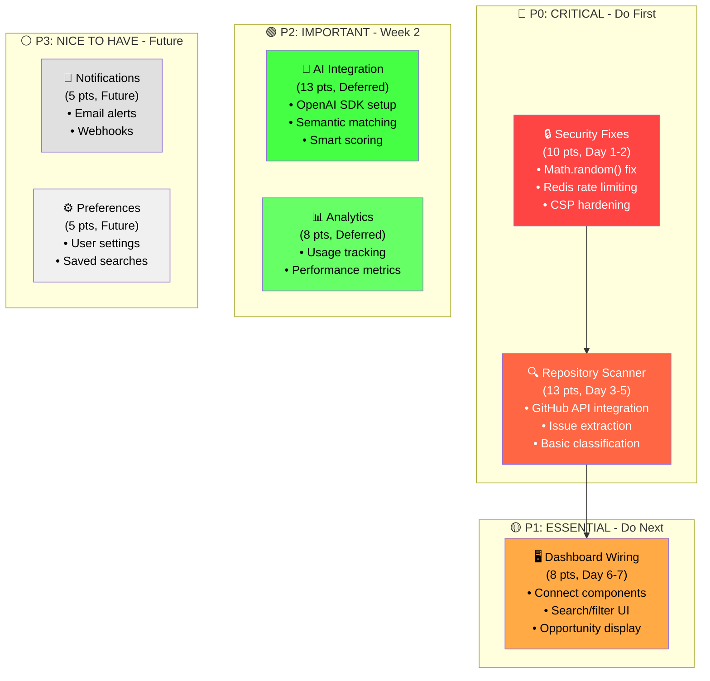
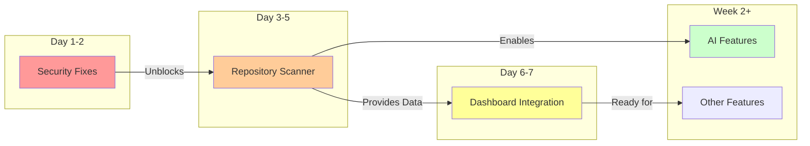

# Week 1 Priority Matrix - Quick Reference

## 🎯 PRIORITY QUADRANTS



## 📊 EFFORT VS IMPACT MATRIX

| Task | Effort (Story Points) | User Impact | Security Impact | Week 1? |
|------|---------------------|------------|-----------------|---------|
| **Security Fixes** | 10 (1.5 days) | Medium | CRITICAL | ✅ YES |
| **Repository Scanner** | 13 (3 days) | CRITICAL | Low | ✅ YES |
| **Dashboard Wiring** | 8 (1.5 days) | HIGH | Low | ✅ YES |
| AI Integration | 13 (2 days) | HIGH | Low | ❌ Week 2 |
| Analytics | 8 (1.5 days) | Low | Low | ❌ Future |
| Notifications | 5 (1 day) | Medium | Low | ❌ Future |

## 🚦 DEPENDENCY FLOW



## ⏱️ TIME ALLOCATION

```
Day 1-2 (25%): Security Sprint
├── Morning: Math.random() fix (3 hrs)
├── Afternoon: Redis rate limiting (5 hrs)
└── Evening: CSP hardening (2 hrs)

Day 3-5 (50%): Core Feature
├── Day 3: GitHub API setup (8 hrs)
├── Day 4: Data processing (8 hrs)
└── Day 5: Integration testing (8 hrs)

Day 6-7 (25%): User Interface
├── Day 6: Component wiring (6 hrs)
├── Day 7 AM: Final testing (3 hrs)
└── Day 7 PM: Deployment prep (3 hrs)
```

## 🎲 RISK-BASED PRIORITIES

### Must Fix (Security)

1. **Math.random()** → crypto.getRandomValues() [CVSS 8.1]
2. **Memory leak** → Redis rate limiting [CVSS 6.5]
3. **Weak CSP** → Strict headers [CVSS 6.1]

### Must Have (MVP)

4. **Repository scanning** → Core value proposition
5. **Basic UI** → User interaction capability

### Should Have (Enhancement)

6. AI-powered analysis → Competitive advantage
7. User preferences → Personalization

### Could Have (Future)

8. Email notifications → Engagement
9. Analytics dashboard → Business insights
10. PWA features → Mobile experience

## ✅ DAILY DELIVERABLES

**Day 1**: Security test suite passing 100%  
**Day 2**: Rate limiting protecting all endpoints  
**Day 3**: First repository data in database  
**Day 4**: Issue classification working  
**Day 5**: API endpoints returning real data  
**Day 6**: Dashboard displaying opportunities  
**Day 7**: Production deployment ready

---

*Quick reference for Week 1 implementation decisions*  
*Total effort: 31 story points (5 focused days)*  
*Success metric: Secure, functional discovery platform*
