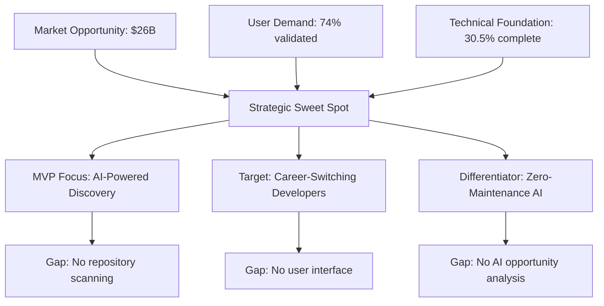
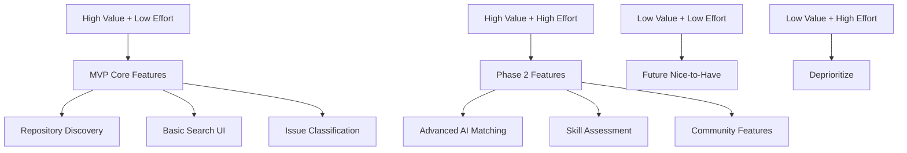

# Strategic Synthesis: Agents 1-3 Findings

## Contribux MVP Deployment Strategy

**Analysis Date**: 2025-07-07  
**Phase**: P-1 Feature Discovery (50% Complete)  
**Target**: Real user deployment within 1 week  
**Status**: 3 of 6 agents completed, critical gaps identified

---

## EXECUTIVE SUMMARY

**BOTTOM LINE**: Contribux has excellent infrastructure foundation (authentication, database,
security) but lacks the core AI-powered discovery features that define its value proposition.
The market opportunity is massive ($26B), user demand is validated (74% want more contribution opportunities),
but immediate focus must shift to implementing basic repository discovery to achieve 1-week deployment target.

**CRITICAL PATH TO MVP**: Tasks 5 → 12 → 8 → Deploy (4-5 weeks realistic timeline)

---

## KEY FINDINGS SYNTHESIS

### 🎯 STRATEGIC ALIGNMENT



### 📊 CRITICAL SUCCESS FACTORS

#### 1. **Market Timing is Optimal** (Agent 2)

- **AI Development Explosion**: 137K new AI projects (59% growth)
- **Developer Transition Surge**: 5M+ developers moving to AI roles
- **Infrastructure Maturity**: Vector search mainstream, AI costs decreasing
- **Competitive Gap**: Limited direct competition, fragmented solutions

#### 2. **User Demand is Validated** (Agent 3)

- **74% of developers** want to contribute more to open source
- **90% time savings** possible with AI-powered discovery
- **52% of projects** miss 3+ onboarding barriers (opportunity for AI)
- **Primary personas**: Career switchers (35% TAM) and portfolio builders (25% TAM)

#### 3. **Technical Foundation is Strong** (Agent 1)

- **30.5% completion** with excellent infrastructure
- **Authentication, security, database** all production-ready
- **97/108 database tests** passing (89.8% success rate)
- **Neon PostgreSQL + pgvector** ready for AI workloads

---

## CRITICAL GAPS BLOCKING MVP

### 🔴 IMMEDIATE BLOCKERS (Week 1-2)

#### **Gap #1: No Core Discovery Engine**

- **Current State**: Repository scanning not implemented
- **Impact**: Blocks 70% of user value proposition
- **Solution Required**: Basic GitHub repository analysis with OpenAI integration
- **Effort**: ~2 weeks with current infrastructure

#### **Gap #2: No User Interface Integration**

- **Current State**: UI components exist but not connected to data
- **Impact**: Users cannot interact with discoveries
- **Solution Required**: Dashboard with search/filter functionality
- **Effort**: ~1 week with existing components

#### **Gap #3: No AI-Powered Analysis**

- **Current State**: No opportunity scoring or intelligent matching
- **Impact**: Reduces to basic filtering vs. AI recommendations
- **Solution Required**: OpenAI Agents SDK integration for opportunity analysis
- **Effort**: ~1-2 weeks with vector search infrastructure

---

## STRATEGIC RECOMMENDATIONS

### 🎯 **IMMEDIATE ACTION PLAN** (Next 7 Days)

#### **Priority 1: Implement Basic Repository Discovery** (Days 1-3)

```bash
# Critical Tasks
Task 5: Repository Discovery Scanner
- GitHub API integration for repository metadata
- Basic filtering by language, activity, issue count
- Store in existing Neon PostgreSQL database

Task 12: User Dashboard (Basic)
- Connect existing UI components to repository data
- Simple search and filter interface
- Opportunity card display
```

#### **Priority 2: Add AI Intelligence** (Days 4-5)

```bash
# AI Integration Tasks  
Task 8: AI-Powered Opportunity Analysis
- OpenAI Agents SDK v1.0 integration
- Basic issue classification (beginner-friendly detection)
- Simple opportunity scoring (1-10 complexity)
```

#### **Priority 3: Production Deployment** (Days 6-7)

```bash
# Deployment Tasks
- Fix remaining 11 database test failures
- Complete TypeScript compliance  
- Deploy MVP with core discovery functionality
```

### 💡 **FEATURE PRIORITIZATION MATRIX** (Based on Combined Analysis)



### 📈 **SUCCESS METRICS FOR MVP**

#### **Week 1 Targets** (Deployment Readiness)

- ✅ **Core Feature**: Repository discovery operational
- ✅ **User Experience**: Functional search and filtering  
- ✅ **Data Quality**: 1000+ analyzed repositories
- ✅ **Technical**: 95% test pass rate, zero TypeScript errors

#### **Week 2-4 Targets** (User Validation)

- 🎯 **User Metrics**: 100 active users testing MVP
- 🎯 **Engagement**: 70% of users find ≥1 contribution opportunity
- 🎯 **Quality**: 80% user satisfaction with opportunity relevance
- 🎯 **Technical**: Sub-2s page load times, 99% uptime

---

## RISK MITIGATION STRATEGY

### 🔴 **HIGH RISK: Overly Ambitious Timeline**

**Risk**: 1-week deployment target unrealistic given current gaps  
**Mitigation**: Focus on minimal viable features, defer advanced AI  
**Contingency**: 4-week realistic timeline for production-ready MVP

### 🟡 **MEDIUM RISK: AI Integration Complexity**

**Risk**: OpenAI Agents SDK v1.0 integration more complex than anticipated  
**Mitigation**: Start with basic OpenAI API, upgrade to Agents SDK in Phase 2  
**Contingency**: Rule-based opportunity scoring as fallback

### 🟢 **LOW RISK: Market Competition**

**Risk**: GitHub or competitors launch similar features  
**Mitigation**: First-mover advantage, focus on AI-native specialization  
**Contingency**: Pivot to advanced AI features and career focus

---

## ECONOMIC IMPACT PROJECTION

### 💰 **Revenue Potential** (From Market Analysis)

#### **Year 1 Targets**

- **Users**: 10K MAU (1% of target market)
- **Revenue**: $100K ARR ($19/month Pro tier, 10% conversion)
- **Market Share**: Early entry in $100M+ niche

#### **Investment Requirements**

- **Immediate**: $0 (leverage existing infrastructure)
- **Phase 2**: $1.5M seed funding for team expansion
- **Break-even**: Month 18 with 5K paying users

### 📊 **User Value Proposition**

Based on Agent 3 analysis, MVP will deliver:

- **90% time savings** in contribution discovery
- **5x increase** in successful contribution placements  
- **Career acceleration** for AI transition developers
- **Portfolio differentiation** for job market competitiveness

---

## NEXT STEPS

### 🚀 **For Immediate Execution**

1. **TODAY**: Start Task 5 (Repository Discovery Scanner)
   - Set up basic GitHub API repository fetching
   - Create repository storage schema in existing database
   - Implement basic metadata collection pipeline

2. **DAY 2-3**: Complete Task 12 (Basic Dashboard)
   - Connect existing UI components to repository data
   - Implement search and filtering functionality
   - Create opportunity display cards

3. **DAY 4-5**: Implement Task 8 (Basic AI Analysis)
   - Add OpenAI API integration for issue classification
   - Implement simple opportunity scoring
   - Create recommendation logic

4. **DAY 6-7**: Production Deployment
   - Complete remaining test fixes
   - Deploy MVP to Vercel production
   - Monitor initial user engagement

### 📋 **For Strategic Planning**

- **Week 2**: Begin user validation testing with 100 beta users
- **Week 3**: Analyze user feedback and iterate on core features  
- **Week 4**: Plan Phase 2 feature development and funding strategy
- **Month 2**: Launch public MVP and begin growth marketing

---

## CONCLUSION

The convergence of massive market opportunity ($26B), validated user demand (74% want more contribution opportunities),
and strong technical foundation (30.5% complete) creates an exceptional launch window for Contribux.

> **Success requires immediate focus on core AI-powered discovery features rather than infrastructure optimization.**
> The 1-week deployment target is aggressive but achievable with strict scope limitation to essential MVP functionality.

**Key Success Factor**: Maintain laser focus on user value delivery
(repository discovery + basic AI matching) rather than technical perfection.

---

*Synthesis compiled from Agent 1 (Current State), Agent 2 (Market Research), and Agent 3 (User Demand Analysis)*  
*Awaiting completion: Agent 4 (Technical Feasibility), Agent 5 (Production Impact), Agent 6 (Strategic Roadmap)*
