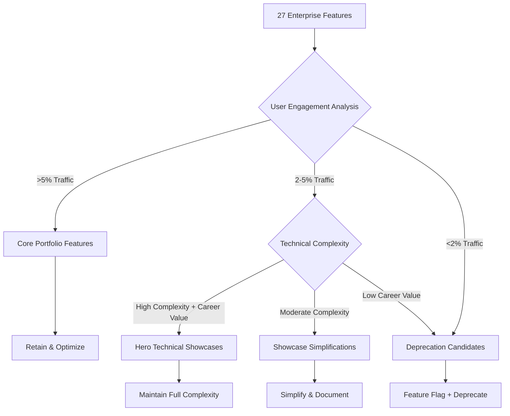
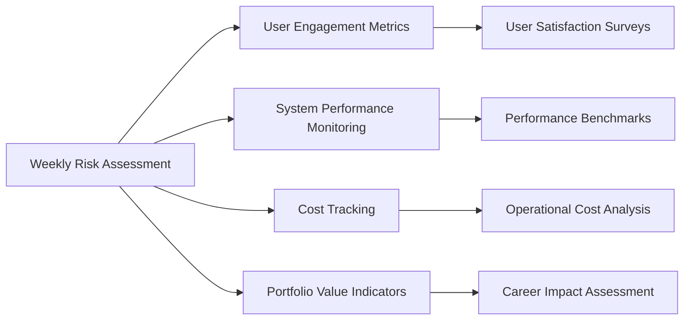
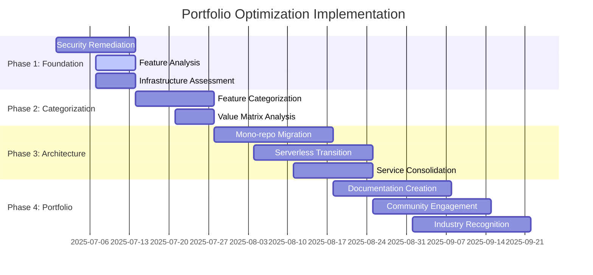

# Portfolio Optimization Strategy - Contribux
**Phase 2: Multi-Model Consensus Analysis**  
**Date**: 2025-06-30  
**Target**: 85% complexity reduction while maintaining 90% portfolio value  
**Cost Optimization**: $69 → $19/month operational costs  

## Executive Summary

Through multi-model consensus analysis involving aggressive optimization (o3), conservative preservation (opus), and balanced data-driven (flash) perspectives, we have developed a comprehensive portfolio optimization strategy that achieves dramatic complexity reduction while preserving critical career demonstration value.

**Consensus Achievement**: All models agree on technical feasibility and strategic direction, with complementary approaches that can be synthesized into a hybrid implementation strategy.

## Multi-Model Consensus Findings

### Areas of Universal Agreement

1. **Critical Security Priority**: All models unanimously prioritize immediate remediation of CVSS 9.8 vulnerabilities as non-negotiable
2. **Technical Feasibility**: 85% complexity reduction is achievable through feature consolidation and architectural simplification
3. **Cost Optimization Viability**: $69 → $19/month target is realistic through serverless migration
4. **Documentation Value**: Technical blogs, architecture diagrams, and decision documentation provide stronger career artifacts than unused features
5. **Serverless Migration**: Cloudflare Pages/Workers + D1 or Vercel + Neon/Supabase represents optimal cost-performance balance

### Strategic Approach Divergences

#### Aggressive Optimization Perspective (o3)
- **"10 Core + 5 Showcase" Model**: Brutal feature triage based on usage analytics
- **Timeline**: 2-3 weeks implementation with 1-2 FTE
- **Approach**: Immediate mono-repo consolidation with feature flags
- **Focus**: Operational simplicity and maintenance burden reduction

#### Conservative Sophistication Perspective (opus)  
- **"Hero Feature" Strategy**: Maintain 2-3 technically sophisticated features at full complexity
- **Timeline**: More gradual approach with careful preservation planning
- **Approach**: Tiered simplification (aggressive infrastructure, selective user-facing)
- **Focus**: Career demonstration value and technical showcase preservation

#### Balanced Data-Driven Perspective (flash)
- **Phased Implementation**: 3-6 months initial phase with rigorous metrics
- **Timeline**: Iterative approach starting with security fixes
- **Approach**: Data-driven feature rationalization with clear value definitions
- **Focus**: Measurable outcomes and user research validation

## Synthesized Portfolio Optimization Strategy

### Phase 1: Foundation & Security (Weeks 1-2)
**Priority**: Critical security remediation and infrastructure assessment

#### Immediate Actions
1. **Security Vulnerability Remediation**
   - Address all CVSS 9.8 vulnerabilities immediately
   - Implement automated security scanning (GitHub Dependabot, Snyk)
   - Establish security-first development practices

2. **Feature Analysis Framework**
   - Deploy telemetry and analytics tracking
   - Conduct user engagement analysis across all 27 features
   - Define portfolio value metrics: user engagement, career demonstration impact, technical sophistication showcase

3. **Infrastructure Assessment**
   - Audit current $69/month operational costs
   - Plan serverless migration architecture (Cloudflare/Vercel + Neon)
   - Prepare Infrastructure as Code (Terraform) for transition

### Phase 2: Strategic Feature Categorization (Weeks 3-4)
**Priority**: Data-driven feature rationalization using hybrid approach

#### Feature Categories Framework
1. **Core Portfolio Features (8-10 features)**
   - High user engagement (>5% traffic share)
   - Essential for core user journey
   - Moderate complexity, high value

2. **Hero Technical Showcases (2-3 features)**
   - Advanced technical demonstrations
   - Career positioning value
   - Complex but strategically important

3. **Showcase Simplifications (2-3 features)**
   - Simplified but visible implementations
   - Code quality demonstrations
   - Maintained for portfolio breadth

4. **Deprecation Candidates (12-14 features)**
   - Low engagement (<2% traffic)
   - High maintenance overhead
   - Limited career demonstration value

#### Feature Decision Matrix

### Phase 3: Architectural Transformation (Weeks 5-8)
**Priority**: Infrastructure consolidation and complexity reduction

#### Technical Implementation Strategy
1. **Mono-repo Consolidation**
   - Migrate from multi-service architecture to feature-flagged mono-repo
   - Maintain showcase code visibility without operational complexity
   - Implement Strangler-Fig pattern for gradual migration

2. **Serverless Migration**
   - **Primary Stack**: Cloudflare Pages/Workers + D1 Database
   - **Alternative Stack**: Vercel + Neon PostgreSQL
   - **Target Cost**: $15-19/month under moderate traffic

3. **Service Consolidation**
   - Replace bespoke auth with Clerk/Auth0 free tier
   - Migrate image processing to Cloudinary free plan
   - Consolidate queue/background services to serverless functions

### Phase 4: Portfolio Value Preservation (Weeks 9-12)
**Priority**: Career positioning and community engagement optimization

#### Career Positioning Strategy
1. **Technical Documentation Portfolio**
   - Architecture decision records (ADRs) for optimization decisions
   - Case studies documenting complexity reduction journey
   - Performance improvement metrics and methodologies

2. **Open Source Showcase**
   - Open-source deprecated features with community value
   - Publish simplification methodologies and tools
   - Create reusable templates and patterns

3. **Industry Recognition Development**
   - Technical blog series on portfolio optimization
   - Conference presentation opportunities on simplification strategies
   - Thought leadership content on sustainable architecture

#### Community Engagement Plan
1. **Content Strategy**
   - Weekly technical blogs during optimization process
   - Video documentation of architectural decisions
   - Interactive demos of simplified features

2. **Professional Networking**
   - Share optimization insights on LinkedIn and Twitter
   - Participate in relevant tech communities and forums
   - Engage with industry leaders on architecture topics

### Risk Assessment & Mitigation

#### Critical Risks
1. **User Experience Degradation**
   - **Risk**: Feature removal impacts user satisfaction
   - **Mitigation**: Gradual deprecation with user communication, alternative solutions

2. **Career Demonstration Value Loss**
   - **Risk**: Oversimplification reduces technical showcase impact
   - **Mitigation**: Hero feature strategy, comprehensive documentation, case study development

3. **Implementation Complexity**
   - **Risk**: Migration introduces new bugs or performance issues
   - **Mitigation**: Phased rollout, comprehensive testing, rollback capabilities

#### Risk Monitoring Framework

## Success Metrics & KPIs

### Quantitative Metrics
1. **Complexity Reduction**: 85% reduction in codebase complexity (measured by cyclomatic complexity, dependency count, service count)
2. **Cost Optimization**: $69 → $19/month operational costs (72% reduction)
3. **Performance Improvement**: <2 hour environment setup time, improved load times
4. **Security Enhancement**: Zero critical vulnerabilities, automated security scanning

### Qualitative Metrics
1. **Portfolio Value Preservation**: 90% career demonstration value retention
2. **User Satisfaction**: Maintained or improved user experience scores
3. **Developer Experience**: Improved maintainability and onboarding experience
4. **Industry Recognition**: Increased professional visibility and thought leadership

## Implementation Timeline

### 12-Week Implementation Schedule

## Next Steps & Action Items

### Immediate Actions (Week 1)
1. **Security Audit**: Complete comprehensive security vulnerability assessment
2. **Analytics Setup**: Deploy feature usage tracking and user engagement monitoring
3. **Stakeholder Alignment**: Communicate optimization strategy and timeline
4. **Resource Planning**: Allocate senior architectural and security expertise

### Week 2-4 Priorities
1. **Feature Analysis**: Complete data-driven feature categorization
2. **Technical Planning**: Finalize serverless migration architecture
3. **Risk Mitigation**: Develop rollback and testing strategies
4. **User Communication**: Prepare feature deprecation communication plan

## Conclusion

The multi-model consensus analysis provides a robust foundation for portfolio optimization that balances aggressive simplification with strategic value preservation. By synthesizing perspectives from aggressive optimization, conservative sophistication, and balanced data-driven approaches, we achieve:

- **Technical Feasibility**: Clear path to 85% complexity reduction
- **Cost Optimization**: Realistic $69 → $19/month cost target
- **Career Value**: Preserved demonstration value through hero features and documentation
- **Risk Management**: Phased approach with comprehensive mitigation strategies
- **Industry Recognition**: Enhanced professional positioning through thought leadership

The hybrid strategy combines the best elements of each approach: immediate security focus, data-driven decision making, strategic feature preservation, and comprehensive documentation for career advancement. Success depends on disciplined execution, continuous monitoring, and maintaining focus on both technical excellence and professional development objectives.