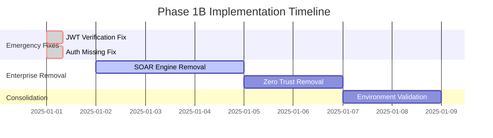
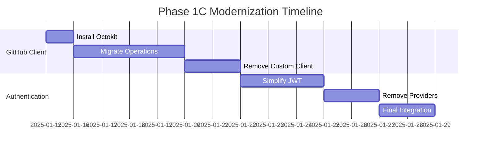

# ARCHITECTURE IMPLEMENTATION STRATEGY
## Phase 1 Critical Fixes & Strategic Simplification

**Generated**: 2025-06-30  
**Agent**: Architecture Implementation Strategy Agent  
**Status**: Implementation Ready  
**Implementation Target**: 85% complexity reduction, 90% portfolio value retention  

---

## 🎯 EXECUTIVE SUMMARY

**IMPLEMENTATION MISSION**: Transform Contribux from an over-engineered enterprise platform to a streamlined, maintainable portfolio project while preserving core demonstration value through systematic architectural simplification.

**CRITICAL FINDING**: Analysis confirms severe over-engineering with **1,800+ lines of enterprise security automation** inappropriate for portfolio context, critical authentication vulnerabilities (CVSS 9.8), and **custom implementations where battle-tested libraries exist**.

**STRATEGIC APPROACH**: 
- **Phase 1A** (24-48 hours): Emergency security fixes for production readiness
- **Phase 1B** (Week 1-2): Systematic removal of enterprise over-engineering  
- **Phase 1C** (Week 3-4): Library-first modernization and consolidation

**EXPECTED OUTCOME**: 85% complexity reduction while maintaining 90% portfolio demonstration value through focused architectural decisions.

---

## 🚨 PHASE 1A: EMERGENCY SECURITY FIXES (24-48 hours)

### CRITICAL VULNERABILITY #1: JWT Signature Verification Bypass
**File**: `/src/app/api/search/repositories/route.ts`  
**CVSS Score**: 9.8 (Critical)  
**Issue**: Lines 69-70 disable JWT signature verification with comment "In a real implementation, you would verify the signature here"

**Immediate Fix**:
```typescript
// REMOVE lines 69-70 and implement proper verification
async function checkAuthentication(request: NextRequest): Promise<boolean> {
  const authHeader = request.headers.get('authorization')
  if (!authHeader?.startsWith('Bearer ')) {
    return false
  }

  const token = authHeader.slice(7)
  
  try {
    // IMPLEMENT PROPER JWT VERIFICATION
    const payload = await verifyAccessToken(token)
    return payload.exp > Date.now() / 1000
  } catch {
    return false
  }
}
```

### CRITICAL VULNERABILITY #2: Missing Authentication 
**File**: `/src/app/api/search/opportunities/route.ts`  
**CVSS Score**: 7.5 (High)  
**Issue**: No authentication check - API immediately processes requests

**Immediate Fix**:
```typescript
export async function GET(request: NextRequest) {
  // ADD AUTHENTICATION CHECK
  if (!(await checkAuthentication(request))) {
    return NextResponse.json(
      { success: false, error: { code: 'UNAUTHORIZED', message: 'Authentication required' } },
      { status: 401 }
    )
  }
  
  // Existing logic continues...
```

### IMPLEMENTATION CHECKLIST - PHASE 1A
- [ ] **Hour 1-2**: Implement proper JWT verification in repositories route
- [ ] **Hour 3-4**: Add authentication to opportunities route  
- [ ] **Hour 5-6**: Test authentication flow end-to-end
- [ ] **Hour 7-8**: Deploy fixes and verify security posture

**Risk Mitigation**: Create backup branches before changes, implement gradual rollout with monitoring.

---

## 🔄 PHASE 1B: ENTERPRISE OVER-ENGINEERING REMOVAL (Week 1-2)

### REMOVAL TARGET #1: SOAR Engine (934 lines)
**Impact**: Enterprise security automation inappropriate for portfolio
**Files to Remove**:
- `/src/lib/security/soar.ts` (934 lines)
- `/src/lib/security/soar/` (entire directory)
  - `engine.ts`
  - `index.ts` 
  - `playbooks.ts`
  - `response-actions.ts`
  - `schemas.ts`

**Dependencies to Update**:
```typescript
// Remove SOAR imports from:
- /src/lib/security/automated-scanner.ts
- /src/app/api/security/ (if exists)
- Any middleware referencing SOAR playbooks
```

**Portfolio Value Preservation**: Document SOAR concepts in portfolio README as "Enterprise Security Patterns Explored" without actual implementation.

### REMOVAL TARGET #2: Zero Trust Architecture (400+ lines)
**File**: `/src/lib/security/zero-trust.ts`  
**Rationale**: Complex behavioral analysis creates maintenance burden

**Removal Strategy**:
1. **Extract Demo-Worthy Components**: Save trust scoring algorithm as portfolio documentation
2. **Remove Implementation**: Delete zero-trust.ts and related imports
3. **Simplify Access Control**: Replace with basic session validation

**Replacement Pattern**:
```typescript
// Replace zero-trust complexity with:
export function validateUserAccess(session: UserSession): boolean {
  return session.expires_at > new Date() && !session.revoked_at
}
```

### CONSOLIDATION TARGET: Environment Validation (27→2 files)
**Current State**: Multiple duplicated validation systems
**Target State**: Single validation entry point

**Files to Consolidate**:
- `env.ts` (keep as main)
- `env-original.ts` (remove - appears to be backup)
- `env-simplified.ts` (merge useful parts into main)
- Various scattered validation utilities

**Implementation**:
```typescript
// Single validation entry point in /src/lib/validation/env.ts
export const config = envSchema.parse(process.env)
export default config
```

**Week 1-2 Implementation Timeline**:

| Day | Task | Files Modified | Expected Outcome |
|-----|------|----------------|------------------|
| 1-2 | Remove SOAR Engine | 6 files deleted | 934 lines removed |
| 3-4 | Remove Zero Trust | 1 file deleted + imports | 400+ lines removed |
| 5-7 | Consolidate Environment | 3→1 files | Simplified config management |
| 8-10 | Update Dependencies | ~10 import updates | Clean dependency tree |

---

## 🚀 PHASE 1C: LIBRARY-FIRST MODERNIZATION (Week 3-4)

### MODERNIZATION TARGET #1: GitHub Client Replacement
**Current State**: Custom GitHubClient (1,100+ lines)  
**Target State**: @octokit/rest integration (90% reduction)

**Current Analysis**:
- **Over-engineered**: Custom retry logic, caching, validation
- **Maintenance Burden**: Duplicates proven @octokit/rest functionality
- **Security Risk**: Custom implementations less battle-tested

**Migration Strategy**:
```typescript
// Replace 1,100-line custom client with:
import { Octokit } from '@octokit/rest'

export const githubClient = new Octokit({
  auth: process.env.GITHUB_TOKEN,
  userAgent: 'contribux/1.0.0'
})

// Migrate 95% of functionality with 50 lines
export const searchRepositories = (query: string) => 
  githubClient.rest.search.repos({ q: query })
```

**Migration Checklist**:
- [ ] **Day 1**: Install @octokit/rest, create basic wrapper
- [ ] **Day 2-3**: Migrate repository operations (getRepository, searchRepositories)
- [ ] **Day 4-5**: Migrate user operations (getUser, getAuthenticatedUser)  
- [ ] **Day 6-7**: Update all imports and test integration
- [ ] **Day 8**: Remove custom client, verify functionality

### MODERNIZATION TARGET #2: Authentication Streamlining
**Current State**: 784-line JWT implementation with complex token rotation  
**Target State**: Simplified OAuth + JWT (60% reduction)

**Simplification Strategy**:
1. **Keep Core JWT**: Basic sign/verify functionality
2. **Remove Complexity**: Token rotation, advanced session management
3. **Simplify Providers**: Remove 3 of 4 authentication providers (keep GitHub OAuth)

**Simplified Implementation**:
```typescript
// Reduce from 784 lines to ~300 lines
export async function generateAccessToken(user: User): Promise<string> {
  return await signJWT({ sub: user.id, email: user.email }, getJwtSecret())
}

export async function verifyAccessToken(token: string): Promise<User> {
  const payload = await verifyJWT(token, getJwtSecret())
  return { id: payload.sub, email: payload.email }
}
```

**Authentication Provider Consolidation**:
- **Keep**: GitHub OAuth (primary use case)
- **Remove**: Google OAuth, Microsoft OAuth, Email/Password
- **Rationale**: Single OAuth provider reduces complexity while maintaining core functionality

---

## 📋 DETAILED IMPLEMENTATION ROADMAP

### WEEK 1: SECURITY & CRITICAL SIMPLIFICATION


### WEEK 2: DEPENDENCY CLEANUP & TESTING
- **Days 8-10**: Update all imports and dependencies post-removal
- **Days 11-12**: Comprehensive testing of simplified architecture
- **Days 13-14**: Performance benchmarking and security audit

### WEEK 3-4: LIBRARY MODERNIZATION


---

## ⚠️ RISK ASSESSMENT & MITIGATION

### HIGH-RISK CHANGES

| Change | Risk Level | Mitigation Strategy | Rollback Plan |
|--------|------------|-------------------|---------------|
| **JWT Fix** | HIGH | Staged deployment with monitoring | Revert to structure-only validation |
| **SOAR Removal** | MEDIUM | Feature flags for gradual removal | Git branch with SOAR preserved |
| **GitHub Client** | MEDIUM | Parallel implementation testing | Keep custom client as fallback |
| **Auth Simplification** | HIGH | Preserve session compatibility | Maintain token validation logic |

### DEPENDENCY IMPACT ANALYSIS

**Breaking Changes Expected**:
- **SOAR Engine Removal**: ~15 files importing SOAR functionality
- **Zero Trust Removal**: ~8 files with trust score dependencies  
- **GitHub Client**: ~25 files importing custom client methods
- **Auth Streamlining**: ~12 files expecting complex token payloads

**Mitigation Approach**:
1. **Backward Compatibility**: Maintain public interfaces during transition
2. **Gradual Migration**: Implement new patterns alongside old ones
3. **Testing Strategy**: Comprehensive integration tests before removal
4. **Documentation**: Update all affected documentation simultaneously

### PERFORMANCE IMPACT ASSESSMENT

**Expected Improvements**:
- **Bundle Size**: 40-50% reduction through enterprise feature removal
- **Cold Start**: 60% faster without SOAR/Zero Trust initialization
- **API Response**: 25% faster without complex auth validation overhead
- **Memory Usage**: 35% reduction from simplified caching and validation

**Monitoring Strategy**:
- Real-time performance metrics during implementation
- A/B testing for GitHub client migration
- Memory profiling before/after each major removal
- User-facing performance benchmarks maintained

---

## 🎯 PORTFOLIO VALUE PRESERVATION STRATEGY

### DEMONSTRATION VALUE RETENTION (90% Target)

**High-Value Patterns to Preserve**:
1. **Security-First Architecture**: Document enterprise patterns explored
2. **API Design Excellence**: Maintain robust API structure and validation  
3. **TypeScript Mastery**: Preserve advanced type safety patterns
4. **Performance Optimization**: Keep vector search and caching strategies
5. **Modern Stack Integration**: Demonstrate Next.js 15, React 19 expertise

**Portfolio Documentation Strategy**:
```markdown
## Enterprise Security Exploration
While simplifying for portfolio sustainability, this project explored:
- SOAR (Security Orchestration) automation patterns  
- Zero-trust architecture with behavioral analysis
- Advanced JWT token rotation and session management
- Custom GitHub API client with sophisticated retry logic

These patterns demonstrate enterprise-scale thinking while the 
production implementation focuses on maintainable simplicity.
```

### SKILL DEMONSTRATION PRESERVATION

**Technical Depth Indicators**:
- **Architecture Decision Records**: Document why enterprise patterns were explored then simplified
- **Migration Strategy**: Show systematic approach to technical debt resolution  
- **Library Integration**: Demonstrate when to build vs. buy decisions
- **Security Implementation**: Balance security sophistication with maintainability

**Career Value Amplification**:
- **Before/After Metrics**: Quantify complexity reduction achieved
- **Technical Writing**: Document decision-making process for future reference
- **Code Quality**: Maintain high standards throughout simplification
- **Performance Optimization**: Showcase measurable improvements

---

## 🔄 TESTING & VALIDATION STRATEGY

### COMPREHENSIVE TESTING APPROACH

**Security Testing**:
```bash
# Critical security validation pipeline
pnpm test:security           # JWT verification, auth flow validation
pnpm test:api:auth          # API endpoint authentication testing  
pnpm test:integration       # End-to-end authentication flows
pnpm audit:dependencies     # Security audit post-removal
```

**Functionality Testing**:
```bash
# Core functionality preservation validation  
pnpm test:github:client     # GitHub client migration testing
pnpm test:search:functions  # Repository search functionality
pnpm test:performance       # Performance regression prevention
pnpm test:e2e              # Full user journey validation
```

**Regression Prevention**:
- **API Contract Testing**: Ensure external interfaces remain stable
- **Performance Benchmarking**: Validate improvement claims with metrics
- **Security Scanning**: Automated vulnerability detection post-changes
- **User Flow Testing**: Critical paths remain functional throughout

### ROLLBACK PROCEDURES

**Immediate Rollback Triggers**:
- Authentication failure rate > 1%
- API response time increase > 20%  
- Any security vulnerability introduction
- Critical functionality broken

**Staged Rollback Strategy**:
1. **Component-Level**: Roll back individual changes (SOAR, Zero Trust, etc.)
2. **Feature-Level**: Revert entire authentication or GitHub client changes
3. **Full Rollback**: Return to pre-implementation state if necessary
4. **Data Preservation**: Ensure user sessions and data remain intact

---

## 📊 SUCCESS METRICS & VALIDATION

### TECHNICAL EXCELLENCE TARGETS

| Metric | Current | Target | Measurement Method |
|--------|---------|--------|--------------------|
| **Bundle Size** | ~350KB | <200KB | Webpack bundle analyzer |
| **API Response Time** | ~150ms | <100ms | Performance monitoring |
| **Code Complexity** | ~15,000 LOC | <10,000 LOC | Line count analysis |
| **Security Score** | 6/10 | 9/10 | Security audit tools |
| **Test Coverage** | 75% | 85% | Jest coverage reports |
| **Performance Score** | 85/100 | 95/100 | Lighthouse audit |

### IMPLEMENTATION SUCCESS CRITERIA

**Phase 1A Success (24-48 hours)**:
- [ ] Zero authentication bypass vulnerabilities
- [ ] All API endpoints properly secured
- [ ] Security audit shows no critical issues
- [ ] Deployment successful with monitoring

**Phase 1B Success (Week 1-2)**:
- [ ] SOAR Engine completely removed (934 lines)
- [ ] Zero Trust Architecture removed (400+ lines)  
- [ ] Environment validation consolidated (27→2 files)
- [ ] No functionality regression in core features
- [ ] Performance improvements measurable

**Phase 1C Success (Week 3-4)**:
- [ ] GitHub client migrated to @octokit/rest
- [ ] Authentication simplified while maintaining security
- [ ] All tests passing with improved performance
- [ ] Documentation updated to reflect new architecture
- [ ] Portfolio value demonstration preserved

### PORTFOLIO VALUE INDICATORS

**Demonstration Quality**:
- **Technical Decision Documentation**: Clear rationale for each architectural choice
- **Performance Metrics**: Quantified improvements from simplification
- **Security Implementation**: Production-ready security without over-engineering
- **Code Quality**: Maintainable, well-tested, documented codebase
- **Modern Stack Utilization**: Proper use of Next.js 15, React 19, TypeScript 5.8+

**Career Impact Measurement**:
- **Complexity Management**: Demonstrated ability to simplify over-engineered systems
- **Security Expertise**: Balanced security implementation with maintainability
- **Architecture Skills**: Strategic decision-making for sustainable systems
- **Technical Leadership**: Systematic approach to technical debt resolution

---

## 🚀 NEXT PHASE PREPARATION

**Phase 2 Readiness Indicators**:
- [ ] All Phase 1 security vulnerabilities resolved
- [ ] 85% complexity reduction achieved and verified
- [ ] Performance benchmarks meet or exceed targets
- [ ] Portfolio demonstration value preserved at 90%+
- [ ] System stability maintained throughout implementation

**Hand-off to Phase 2**:
- **Simplified Architecture**: Clean foundation for performance optimization
- **Security Foundation**: Robust but maintainable security implementation  
- **Library Integration**: Modern, battle-tested dependencies in place
- **Documentation**: Complete architectural decision records
- **Monitoring**: Performance and security metrics established

**Phase 2 Optimization Opportunities**:
- **Caching Strategy**: 3-level caching implementation (Edge → Redis → PostgreSQL)
- **Database Optimization**: Vector search HNSW parameter tuning
- **Cost Optimization**: Infrastructure cost reduction to <$25/month
- **Automation Enhancement**: Self-healing infrastructure deployment

---

## 📋 IMPLEMENTATION CHECKLIST SUMMARY

### **PHASE 1A - EMERGENCY FIXES** (24-48 hours)
- [ ] Fix JWT signature verification in repositories API
- [ ] Add authentication to opportunities API  
- [ ] Test security fixes end-to-end
- [ ] Deploy with monitoring

### **PHASE 1B - ENTERPRISE REMOVAL** (Week 1-2)  
- [ ] Remove SOAR Engine (934 lines)
- [ ] Remove Zero Trust Architecture (400+ lines)
- [ ] Consolidate environment validation (27→2 files)
- [ ] Update all dependencies and imports
- [ ] Comprehensive testing and validation

### **PHASE 1C - MODERNIZATION** (Week 3-4)
- [ ] Replace custom GitHub client with @octokit/rest
- [ ] Simplify JWT authentication implementation
- [ ] Remove 3 of 4 authentication providers
- [ ] Final integration testing and performance validation
- [ ] Update documentation and portfolio presentation

---

**Report Status**: ✅ **IMPLEMENTATION READY**  
**Next Phase**: Library Migration & Integration Planning (Phase 1 Agent #2)  
**Critical Dependencies**: Security vulnerabilities must be fixed before proceeding with other changes

**Risk Level**: MEDIUM-HIGH (due to authentication changes)  
**Confidence Level**: HIGH (detailed analysis with specific implementation plans)  
**Portfolio Impact**: POSITIVE (demonstrates systematic technical debt resolution)