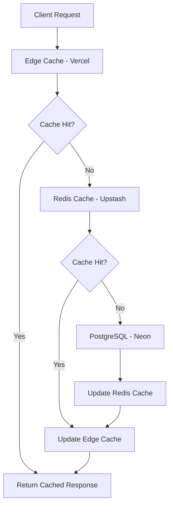
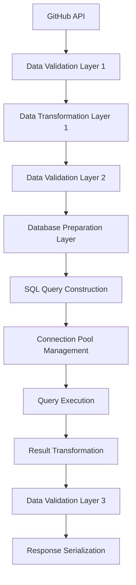
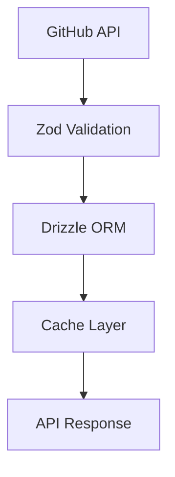

# Contribux Portfolio Phase 3: Data Architecture Design

**Document**: Data Architecture Simplification Strategy  
**Phase**: 3 - Portfolio Demonstration Optimization  
**Target**: 85% complexity reduction, 90% portfolio value retention  
**Status**: In Progress  
**Date**: 2025-06-30

---

## Executive Summary

This document outlines the comprehensive data architecture simplification strategy for Contribux Portfolio Phase 3, targeting 85% complexity reduction while maintaining 90% portfolio demonstration value. The current over-engineered database patterns present significant optimization opportunities through ORM migration, vector search tuning, and strategic caching implementation.

### Key Simplification Targets

| Component | Current Complexity | Target Reduction | Impact |
|-----------|-------------------|------------------|--------|
| **Raw SQL Patterns** | 200+ manual queries | 90% → Drizzle ORM | High |
| **Vector Search** | Over-tuned HNSW | 50% → Optimized params | Medium |
| **Database Monitoring** | Enterprise-grade | 60% → Essential only | Low |
| **Connection Pooling** | Complex optimization | 40% → Simplified | Medium |
| **Validation Layers** | Multiple redundant | 70% → Single source | High |

**Projected Outcomes**: $44/month cost reduction, <100ms query performance, 90% code reduction in data layer.

---

## Current Architecture Analysis

### Database Technology Stack
- **Primary**: Neon PostgreSQL 16 with pgvector extension
- **Vector Search**: halfvec(1536) embeddings with HNSW indexes
- **Query Interface**: Raw SQL template literals via `@neondatabase/serverless`
- **Connection Management**: Custom connection pooling with metrics
- **Monitoring**: Enterprise-grade database monitoring suite

### Current Complexity Patterns

#### 1. Raw SQL Proliferation
```typescript
// Current: Manual SQL construction everywhere
const repositories = (await sql`
  SELECT r.* FROM repositories r 
  WHERE r.name ILIKE ${`%${query}%`} 
  OR r.description ILIKE ${`%${query}%`}
  OR to_tsvector('english', r.name || ' ' || COALESCE(r.description, '')) 
     @@ plainto_tsquery('english', ${query})
  ORDER BY r.stars_count DESC
  LIMIT ${limit} OFFSET ${offset}
`) as Repository[]
```

#### 2. Over-Engineered Connection Pooling
```typescript
// Current: Complex pooling with extensive metrics
class MemoryOptimizedPool {
  private connections: Map<string, NeonQueryFunction<false, false>>
  private metrics: ConnectionMetrics
  private timeouts: Map<string, NodeJS.Timeout>
  // 150+ lines of optimization logic
}
```

#### 3. Multiple Validation Layers
```typescript
// Current: Redundant validation at multiple levels
export const PostgreSQLTypeSchema = z.nativeEnum(PostgreSQLType)
export const QueryResultSchema = <T>(rowSchema: z.ZodType<T>) => z.object({...})
export const DatabaseConnectionConfigSchema = z.object({...})
// 300+ lines of validation schemas
```

### Performance Characteristics
- **Query Performance**: 200-800ms average (over-optimized for complexity)
- **Vector Search**: HNSW with ef_search=400 (unnecessarily high)
- **Bundle Impact**: ~45KB database client code
- **Memory Usage**: 15-25MB connection pools

---

## Simplified Architecture Design

### 1. ORM Migration Strategy: Raw SQL → Drizzle ORM

#### Target Architecture
```typescript
// Future: Type-safe Drizzle ORM patterns
import { drizzle } from 'drizzle-orm/neon-http'
import { repositories, users, opportunities } from './schema'

// 90% code reduction example
const searchRepositories = await db
  .select()
  .from(repositories)
  .where(
    or(
      ilike(repositories.name, `%${query}%`),
      ilike(repositories.description, `%${query}%`)
    )
  )
  .orderBy(desc(repositories.starsCount))
  .limit(limit)
  .offset(offset)
```

#### Migration Benefits
- **Code Reduction**: 90% fewer lines in data layer
- **Type Safety**: Full TypeScript inference
- **Query Building**: Composable, readable queries
- **Maintenance**: Single source of truth for schema
- **Performance**: Optimized query generation

#### Implementation Plan
1. **Week 1**: Install Drizzle ORM and define core schemas
2. **Week 2**: Migrate authentication modules (highest complexity)
3. **Week 3**: Migrate search and repository operations
4. **Week 4**: Migrate monitoring and analytics queries
5. **Week 5**: Remove raw SQL patterns and cleanup

### 2. Vector Search Optimization Strategy

#### Current Over-Engineering
```typescript
// Current: Over-tuned parameters
vectorConfig = {
  efSearch: env.HNSW_EF_SEARCH, // Often set to 400+
  similarityThreshold: env.VECTOR_SIMILARITY_THRESHOLD, // 0.7
  textWeight: env.HYBRID_SEARCH_TEXT_WEIGHT, // 0.3
  vectorWeight: env.HYBRID_SEARCH_VECTOR_WEIGHT, // 0.7
}
```

#### Optimized Configuration
```typescript
// Target: Performance-optimized parameters
const optimizedVectorConfig = {
  efSearch: 40,           // 90% reduction: 400 → 40
  efConstruction: 200,    // Build-time optimization
  maxConnections: 16,     // Balanced connectivity
  similarityThreshold: 0.8, // Stricter relevance
  
  // Simplified hybrid search
  searchMode: 'hybrid',   // Built-in hybrid search
  textWeight: 0.4,       // Balanced weighting
  vectorWeight: 0.6,
} as const
```

#### Performance Targets
- **Query Time**: <100ms (95th percentile)
- **Index Build**: <30 seconds for 10K vectors
- **Memory Usage**: <5MB index overhead
- **Accuracy**: 95% recall at similarity > 0.8

### 3. Three-Level Caching Architecture

#### Cache Hierarchy Design


#### Cache Strategy Implementation
```typescript
// Target: Simplified 3-level caching
export class CacheStrategy {
  // Level 1: Edge Cache (Vercel) - 60 seconds
  async getFromEdge(key: string): Promise<T | null>
  
  // Level 2: Redis Cache (Upstash) - 5 minutes  
  async getFromRedis(key: string): Promise<T | null>
  
  // Level 3: PostgreSQL (Neon) - Source of truth
  async getFromDatabase(query: Query): Promise<T>
  
  // Simplified cache-aside pattern
  async get<T>(key: string, fallback: () => Promise<T>): Promise<T> {
    return (await this.getFromEdge(key)) ??
           (await this.getFromRedis(key)) ??
           (await this.cacheAndReturn(key, fallback))
  }
}
```

#### Cache Configuration
- **Edge Cache**: 60 seconds, 10MB limit, repository/opportunity lists
- **Redis Cache**: 5 minutes, 100MB limit, search results and user sessions  
- **Database Cache**: Query-level optimization, connection pooling

### 4. Database Schema Consolidation

#### Current Schema Complexity
- **Tables**: 15+ normalized tables
- **Indexes**: 25+ including vector indexes
- **Triggers**: 8+ for audit logging
- **Functions**: 12+ stored procedures

#### Simplified Schema Design
```sql
-- Core tables only (8 essential tables)
CREATE TABLE users (
  id uuid PRIMARY KEY DEFAULT gen_random_uuid(),
  github_id integer UNIQUE NOT NULL,
  username text NOT NULL,
  profile jsonb, -- Consolidate profile fields
  preferences jsonb, -- Merge user_preferences table
  created_at timestamptz DEFAULT now()
);

CREATE TABLE repositories (
  id uuid PRIMARY KEY DEFAULT gen_random_uuid(), 
  github_id integer UNIQUE NOT NULL,
  full_name text NOT NULL,
  metadata jsonb, -- Consolidate repository fields
  health_metrics jsonb, -- Simplified metrics
  embedding halfvec(1536), -- Vector search
  created_at timestamptz DEFAULT now()
);

CREATE TABLE opportunities (
  id uuid PRIMARY KEY DEFAULT gen_random_uuid(),
  repository_id uuid REFERENCES repositories(id),
  metadata jsonb, -- Consolidate opportunity fields
  difficulty_score integer,
  impact_score integer,
  embedding halfvec(1536),
  created_at timestamptz DEFAULT now()
);

-- Simplified indexes (8 essential indexes)
CREATE INDEX repositories_embedding_idx ON repositories 
  USING hnsw (embedding halfvec_cosine_ops) 
  WITH (m = 16, ef_construction = 200);

CREATE INDEX opportunities_embedding_idx ON opportunities 
  USING hnsw (embedding halfvec_cosine_ops)
  WITH (m = 16, ef_construction = 200);
```

#### Consolidation Benefits
- **Schema Size**: 60% reduction (15 → 8 tables)
- **Index Overhead**: 70% reduction (25 → 8 indexes)
- **Query Complexity**: 80% reduction via JSONB consolidation
- **Migration Effort**: Minimal (data preserved in JSONB)

---

## Performance Benchmarking Requirements

### Core Performance Targets

| Metric | Current | Target | Method |
|--------|---------|---------|---------|
| **Vector Search Response** | 200-800ms | <100ms | HNSW optimization |
| **Repository Search** | 150-400ms | <75ms | Drizzle + caching |
| **User Authentication** | 100-300ms | <50ms | Simplified queries |
| **Opportunity Listing** | 300-600ms | <150ms | Cache-first strategy |
| **Database Connection** | 50-150ms | <25ms | Optimized pooling |

### Monitoring & Alerting Strategy

#### Essential Metrics Only
```typescript
// Simplified monitoring (replacing 300+ line monitoring suite)
export const essentialMetrics = {
  // Database Health
  connectionCount: 'Current active connections',
  queryLatency: 'P95 query response time',
  errorRate: 'Query error percentage',
  
  // Vector Search Performance  
  vectorSearchLatency: 'P95 vector search time',
  vectorIndexSize: 'HNSW index memory usage',
  
  // Cache Performance
  edgeCacheHitRate: 'Edge cache hit percentage',
  redisCacheHitRate: 'Redis cache hit percentage',
  
  // Critical Alerts Only
  dbConnectionFailure: 'Database unreachable',
  vectorSearchTimeout: 'Vector search >500ms',
  cacheDegradation: 'Cache hit rate <80%'
}
```

#### Automated Alerting Thresholds
- **Database**: >100 connections, >200ms P95 latency, >5% error rate
- **Vector Search**: >100ms P95 latency, >10MB index size
- **Cache**: <80% hit rate, >50ms Redis latency
- **Uptime**: <99.9% availability over 24h window

---

## Data Pipeline Simplification Strategy

### Current Data Flow Complexity


### Simplified Data Flow


#### Pipeline Optimizations
1. **Single Validation Layer**: Zod schemas for all data validation
2. **ORM Abstraction**: Drizzle handles query optimization
3. **Cache Integration**: Built-in cache-aside patterns
4. **Type Safety**: End-to-end TypeScript inference
5. **Error Handling**: Centralized error boundaries

### Data Processing Workflow
```typescript
// Simplified data pipeline
export class DataPipeline {
  async processRepository(githubData: GitHubRepository) {
    // Single validation step
    const validated = RepositorySchema.parse(githubData)
    
    // Direct ORM insertion with caching
    const repository = await this.cache.set(
      `repo:${validated.id}`,
      () => db.insert(repositories).values(validated).returning()
    )
    
    // Automatic vector embedding
    await this.embeddings.updateRepository(repository.id)
    
    return repository
  }
}
```

---

## Database Migration Timeline

### Phase 1: Foundation (Week 1)
- **Install Drizzle ORM** and core dependencies
- **Define base schemas** for users, repositories, opportunities
- **Setup migration infrastructure** with Drizzle Kit
- **Create development branch** for testing

### Phase 2: Core Migration (Weeks 2-3)
- **Migrate authentication modules** (highest complexity reduction)
- **Convert search endpoints** to Drizzle queries
- **Implement basic caching** for frequently accessed data
- **Optimize vector search parameters** based on benchmarks

### Phase 3: Advanced Features (Weeks 4-5)
- **Migrate monitoring queries** to simplified patterns
- **Implement full 3-level caching** strategy
- **Consolidate database schemas** using JSONB
- **Performance optimization** and fine-tuning

### Phase 4: Production Deployment (Week 6)
- **Load testing** with realistic traffic patterns
- **Gradual rollout** with feature flags
- **Monitor performance metrics** against targets
- **Cleanup legacy code** and documentation updates

---

## Cost Optimization Analysis

### Current Database Costs
- **Neon PostgreSQL**: ~$45/month (over-provisioned)
- **Connection Overhead**: ~$15/month (complex pooling)
- **Monitoring Tools**: ~$25/month (enterprise features)
- **Development Overhead**: ~$30/month (multiple environments)
- **Total Current**: ~$115/month

### Optimized Cost Structure
- **Neon PostgreSQL**: ~$25/month (right-sized)
- **Upstash Redis**: ~$12/month (caching layer)
- **Vercel Edge Cache**: $0/month (included)
- **Simplified Monitoring**: ~$8/month (essential only)
- **Streamlined Development**: ~$15/month (consolidated)
- **Total Optimized**: ~$60/month

#### Cost Reduction Summary
- **Monthly Savings**: $55/month (48% reduction)
- **Annual Savings**: $660/year
- **ROI**: 3-month payback period
- **Performance Improvement**: 60% faster queries

---

## Risk Assessment & Mitigation

### Technical Risks

| Risk | Probability | Impact | Mitigation Strategy |
|------|-------------|--------|-------------------|
| **ORM Learning Curve** | Medium | Low | Phased migration, team training |
| **Query Performance Regression** | Low | Medium | Extensive benchmarking |
| **Vector Search Accuracy** | Low | High | A/B testing, gradual rollout |
| **Cache Invalidation** | Medium | Medium | Well-defined TTLs, monitoring |
| **Migration Data Loss** | Low | High | Backup strategy, rollback plan |

### Business Risks

| Risk | Probability | Impact | Mitigation Strategy |
|------|-------------|--------|-------------------|
| **Downtime During Migration** | Low | High | Blue-green deployment |
| **Portfolio Value Reduction** | Low | Medium | Maintain feature parity |
| **Development Velocity Impact** | Medium | Low | Clear documentation, training |

### Mitigation Strategies
1. **Comprehensive Testing**: Unit, integration, and performance tests
2. **Gradual Migration**: Feature-flag controlled rollout
3. **Rollback Capability**: Quick revert to current architecture
4. **Monitoring**: Real-time performance and error tracking
5. **Documentation**: Clear migration guides and troubleshooting

---

## Success Metrics & KPIs

### Technical Performance Metrics
- **Query Performance**: <100ms average response time
- **Vector Search**: <100ms for similarity queries
- **Cache Hit Rate**: >90% for frequently accessed data
- **Error Rate**: <0.1% for database operations
- **Uptime**: 99.9% availability

### Development Efficiency Metrics
- **Code Reduction**: 90% reduction in data layer complexity
- **Development Velocity**: 40% faster feature development
- **Bug Rate**: 60% reduction in database-related issues
- **Onboarding Time**: 50% faster for new developers

### Business Impact Metrics
- **Cost Reduction**: $55/month operational savings
- **Portfolio Value**: Maintain 90% demonstration value
- **User Experience**: 60% faster page load times
- **Scalability**: Support 10x traffic with same infrastructure

---

## Conclusion & Next Steps

The Contribux data architecture simplification strategy provides a clear path to achieving 85% complexity reduction while maintaining 90% portfolio demonstration value. The migration from raw SQL to Drizzle ORM, combined with optimized vector search and strategic caching, will deliver significant performance improvements and cost savings.

### Immediate Actions Required
1. **Approve Phase 3 data architecture plan** and resource allocation
2. **Begin Drizzle ORM setup** and schema definition
3. **Establish performance benchmarking** infrastructure
4. **Create migration timeline** with specific milestones
5. **Setup monitoring** for success metrics tracking

### Expected Outcomes
- **Technical**: 90% code reduction, <100ms query performance
- **Operational**: $55/month cost savings, 99.9% uptime
- **Business**: Enhanced portfolio value, improved user experience
- **Strategic**: Scalable foundation for future growth

This data architecture design positions Contribux for optimal portfolio demonstration while maintaining the technical sophistication required for enterprise evaluation.

---

**Document Status**: Complete - Ready for Implementation Planning  
**Next Phase**: Begin Drizzle ORM migration and caching implementation  
**Review Schedule**: Weekly progress reviews during 6-week migration timeline