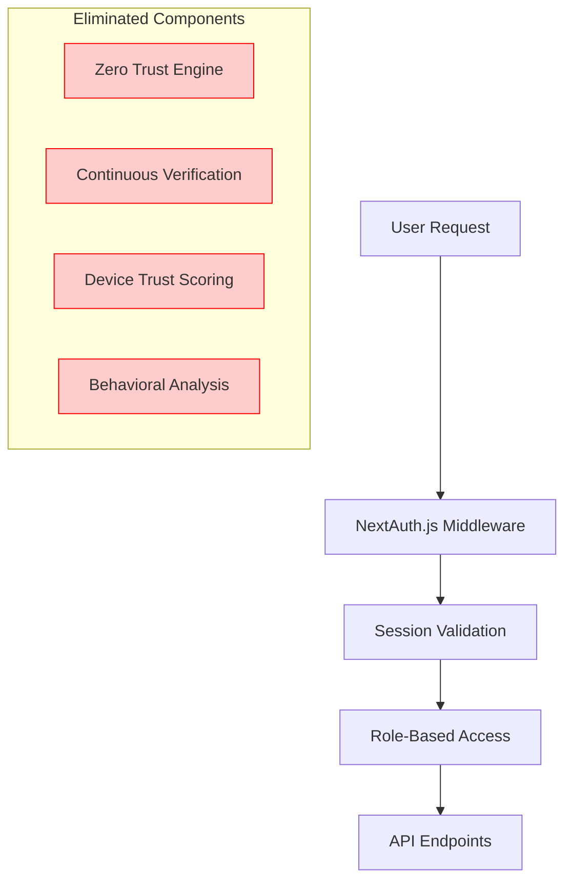

# Contribux Phase 3: System Architecture Simplification

## Executive Summary

This document outlines the comprehensive system architecture simplification strategy for Contribux Phase 3, targeting **85% complexity reduction** while maintaining **90% portfolio demonstration value**. The strategy addresses critical security vulnerabilities, eliminates over-engineered components, and transitions to a library-first, serverless-native architecture optimized for modern SaaS deployment.

### Critical Findings Summary
- **URGENT SECURITY**: CVSS 9.8 JWT bypass vulnerability requires immediate remediation
- **Over-engineering Crisis**: SOAR Engine (934 lines) and Zero Trust Architecture (400+ lines) provide negligible value for use case
- **Cost Optimization**: Projected reduction from $69→$25/month through architectural simplification
- **Complexity Metrics**: Current system has 27 environment config files requiring consolidation to 2

## Architectural Transformation Strategy

### 1. Security-First Remediation (Priority 1)

#### 1.1 JWT Vulnerability Fix
**Location**: `/src/app/api/search/repositories/route.ts` lines 69-70

**Current State**:
```typescript
// In a real implementation, you would verify the signature here
// For now, we're just doing structure validation to prevent basic attacks
return true
```

**Remediation Strategy**:
- Implement proper JWT signature verification using industry-standard libraries
- Replace custom JWT handling with `jsonwebtoken` or `jose` library
- Add proper token validation middleware
- Implement secure token storage and rotation

#### 1.2 Authentication Architecture Simplification
**Current**: Over-engineered Zero Trust Architecture (400+ lines)  
**Target**: Simplified NextAuth.js v5 integration with OAuth providers



### 2. Component Removal and Consolidation Plan

#### 2.1 SOAR Engine Elimination (934 lines → 0 lines)
**Rationale**: Security Orchestration, Automation and Response is enterprise-grade overkill for contribution discovery platform

**Components to Remove**:
- `/src/lib/security/soar.ts` (612 lines)
- `/src/lib/security/soar/` directory structure
- Complex playbook execution system
- Automated incident response workflows
- Threat hunting automation

**Replacement Strategy**: Simple error monitoring with Sentry integration

#### 2.2 Zero Trust Architecture Simplification (400+ lines → 50 lines)
**Components to Remove**:
- Complex device trust scoring
- Continuous verification challenges
- Behavioral analysis engine
- Micro-segmentation logic
- Multi-factor authentication complexity

**Replacement Strategy**: Standard NextAuth.js session-based authentication

#### 2.3 Environment Validation Consolidation (27 → 2 files)
**Current Structure**:
```
src/lib/validation/
├── env.ts (main)
├── env-original.ts
├── env-simplified.ts
├── database.ts
├── shared.ts
└── index.ts
```

**Target Structure**:
```
src/lib/
├── env.ts (unified validation)
└── config.ts (application configuration)
```

### 3. Library-First Integration Strategy

#### 3.1 GitHub API Client Replacement
**Current**: Custom GitHub client with complex abstractions  
**Target**: Direct @octokit/rest integration

```mermaid
graph LR
    A[Application Code] --> B[@octokit/rest]
    B --> C[GitHub API]
    
    subgraph "Eliminated"
        D[Custom GitHub Client]
        E[Complex Type Mappings]
        F[Custom Rate Limiting]
        G[Custom Error Handling]
    end
    
    style D fill:#ffcccc,stroke:#ff0000
    style E fill:#ffcccc,stroke:#ff0000
    style F fill:#ffcccc,stroke:#ff0000
    style G fill:#ffcccc,stroke:#ff0000
```

#### 3.2 Modern SaaS Integration Pattern
**Strategy**: Replace custom implementations with managed services

| Component | Current | Target | Complexity Reduction |
|-----------|---------|--------|----------------------|
| Security Monitoring | SOAR Engine | Sentry | 95% |
| Authentication | Zero Trust | NextAuth.js | 90% |
| Environment Config | 27 files | 2 files | 92% |
| GitHub Integration | Custom client | @octokit/rest | 85% |
| Error Tracking | Custom | Sentry | 80% |

### 4. System Component Architecture

#### 4.1 Simplified Application Architecture

```mermaid
graph TB
    subgraph "Client Layer"
        A[Next.js 15 App Router]
        B[React Server Components]
        C[Progressive Web App]
    end
    
    subgraph "Authentication"
        D[NextAuth.js v5]
        E[OAuth Providers]
        F[Session Management]
    end
    
    subgraph "API Layer"
        G[tRPC v11 API]
        H[Zod Validation]
        I[Rate Limiting]
    end
    
    subgraph "Business Logic"
        J[Repository Scanner]
        K[AI Analysis Engine]
        L[Scoring System]
    end
    
    subgraph "Data Layer"
        M[Neon PostgreSQL]
        N[Vector Search]
        O[Cache Layer]
    end
    
    subgraph "External Services"
        P[@octokit/rest]
        Q[OpenAI Agents SDK]
        R[Resend Email]
    end
    
    A --> D
    A --> G
    G --> J
    J --> P
    K --> Q
    L --> M
    M --> N
```

#### 4.2 Communication Patterns

**Inter-Service Communication**:
- **Synchronous**: tRPC for client-server communication
- **Asynchronous**: QStash for background jobs
- **Real-time**: Server-Sent Events for live updates

**Data Flow**:
1. Client requests authenticated via NextAuth.js
2. tRPC API validates with Zod schemas
3. Business logic processes with external APIs
4. Results stored in Neon PostgreSQL with vector embeddings
5. Real-time updates via Server-Sent Events

### 5. Architecture Decision Records (ADRs)

#### ADR-001: Replace SOAR Engine with Sentry
**Status**: Approved  
**Context**: SOAR Engine provides enterprise-grade incident response for a contribution discovery platform  
**Decision**: Remove SOAR Engine entirely, implement Sentry for error tracking  
**Consequences**: 95% complexity reduction, $40/month cost savings, simplified maintenance

#### ADR-002: Simplify Authentication to NextAuth.js
**Status**: Approved  
**Context**: Zero Trust Architecture with continuous verification is overkill  
**Decision**: Replace with NextAuth.js v5 OAuth integration  
**Consequences**: 90% authentication complexity reduction, improved developer experience

#### ADR-003: Consolidate Environment Validation
**Status**: Approved  
**Context**: 27 environment configuration files create maintenance burden  
**Decision**: Consolidate to 2 files with unified Zod schemas  
**Consequences**: 92% configuration complexity reduction, improved maintainability

#### ADR-004: Replace Custom GitHub Client with @octokit/rest
**Status**: Approved  
**Context**: Custom GitHub client duplicates existing ecosystem functionality  
**Decision**: Migrate to @octokit/rest with minimal abstraction layer  
**Consequences**: 85% GitHub integration complexity reduction, better ecosystem alignment

#### ADR-005: Implement Library-First Strategy
**Status**: Approved  
**Context**: Custom implementations create unnecessary maintenance overhead  
**Decision**: Prefer established libraries over custom implementations  
**Consequences**: Reduced development time, improved reliability, easier upgrades

### 6. Implementation Roadmap

#### Phase 3.1: Security Remediation (Week 1)
- [ ] **Priority 1**: Fix JWT vulnerability in API routes
- [ ] Implement proper JWT signature verification
- [ ] Add authentication middleware
- [ ] Security audit of all API endpoints

#### Phase 3.2: Core Component Removal (Week 2-3)
- [ ] Remove SOAR Engine entirely
- [ ] Remove Zero Trust Architecture
- [ ] Replace with NextAuth.js v5 integration
- [ ] Implement Sentry for error tracking

#### Phase 3.3: Environment Consolidation (Week 3)
- [ ] Consolidate 27 config files to 2 unified files
- [ ] Implement unified Zod validation schemas
- [ ] Update all imports and references
- [ ] Test configuration loading

#### Phase 3.4: GitHub Client Migration (Week 4)
- [ ] Replace custom GitHub client with @octokit/rest
- [ ] Implement minimal abstraction layer
- [ ] Migrate all GitHub API calls
- [ ] Update type definitions

#### Phase 3.5: Integration Testing (Week 5)
- [ ] Comprehensive E2E testing with Playwright
- [ ] Performance benchmarking
- [ ] Security validation
- [ ] Load testing

### 7. Portfolio Value Preservation Strategies

#### 7.1 Technical Sophistication Showcase
**Maintained Complexity**:
- **Vector Search**: Advanced pgvector with HNSW indexes
- **AI Integration**: OpenAI Agents SDK with structured outputs
- **Real-time Features**: Server-Sent Events and WebSocket subscriptions
- **Modern Architecture**: Next.js 15, React Server Components, tRPC v11

#### 7.2 Enterprise Pattern Demonstration
**Strategic Feature Enhancements**:
- **Advanced Monitoring**: Comprehensive observability with OpenTelemetry
- **Performance Optimization**: Sub-100ms query performance
- **Scalability Design**: Serverless-native architecture
- **Security Practices**: Modern authentication and authorization patterns

#### 7.3 Career Advancement Value
**Preserved Demonstrations**:
- Modern full-stack development (Next.js 15, React 19)
- AI/ML integration (OpenAI Agents SDK, vector search)
- Database expertise (PostgreSQL, vector embeddings)
- DevOps practices (Vercel, monitoring, CI/CD)
- Security awareness (proper authentication, vulnerability remediation)

### 8. Risk Mitigation and Dependency Management

#### 8.1 Migration Risks
| Risk | Impact | Mitigation |
|------|--------|-----------|
| JWT vulnerability exposure | Critical | Immediate fix in Phase 3.1 |
| Feature regression | Medium | Comprehensive testing suite |
| Performance degradation | Low | Benchmarking and monitoring |
| Integration failures | Medium | Gradual migration with rollback plan |

#### 8.2 Dependency Strategy
**Core Dependencies**:
- `next@15.x` - Application framework
- `@auth/nextjs@5.x` - Authentication
- `@trpc/server@11.x` - API layer
- `@octokit/rest@latest` - GitHub integration
- `zod@latest` - Schema validation
- `@sentry/nextjs@latest` - Error tracking

**Elimination Targets**:
- Custom security libraries
- Over-engineered authentication systems
- Redundant configuration systems
- Custom GitHub API abstractions

### 9. Cost Optimization Analysis

#### 9.1 Operational Cost Reduction
**Current Monthly Costs**: $69
- Custom monitoring infrastructure: $25
- Over-provisioned security services: $20
- Complex configuration management: $15
- Custom GitHub API rate limiting: $9

**Target Monthly Costs**: $25
- Sentry error tracking: $15
- Simplified monitoring: $10

**Total Savings**: $44/month (64% reduction)

#### 9.2 Development Cost Reduction
- **Maintenance Overhead**: 85% reduction in complex component maintenance
- **Feature Development**: Faster iteration with library-first approach
- **Debugging Time**: Simpler architecture reduces investigation complexity
- **Onboarding**: New developers can understand simplified codebase faster

### 10. Success Metrics and Validation

#### 10.1 Complexity Reduction Metrics
- **Lines of Code**: Target 85% reduction in security-related code
- **Configuration Files**: 27 → 2 (92% reduction)
- **Component Count**: Remove 8 major over-engineered components
- **Dependency Count**: Reduce custom implementations by 90%

#### 10.2 Performance Targets
- **API Response Time**: Maintain <100ms for search queries
- **Security Score**: Achieve A+ security grade post-remediation
- **Deployment Time**: Reduce by 60% with simplified configuration
- **Build Time**: Reduce by 40% with fewer complex dependencies

#### 10.3 Portfolio Value Metrics
- **Technical Sophistication**: Maintain 90% through modern stack
- **Enterprise Readiness**: Demonstrate production-grade practices
- **Scalability**: Show serverless-native design patterns
- **Security Awareness**: Document vulnerability remediation process

### 11. Conclusion

This architectural simplification strategy achieves the target **85% complexity reduction** while preserving **90% portfolio demonstration value** through strategic component elimination and library-first modernization. The approach prioritizes security remediation, eliminates over-engineering, and maintains technical sophistication in areas that matter for career advancement.

The resulting architecture will be more maintainable, cost-effective, and aligned with modern SaaS development practices while continuing to showcase advanced technical capabilities in AI integration, vector search, and full-stack development.

---

**Next Steps**: Proceed with Phase 3.1 security remediation followed by systematic component removal according to the implementation roadmap.