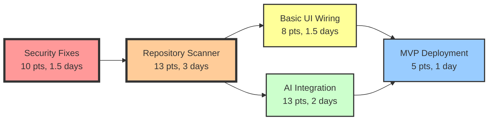
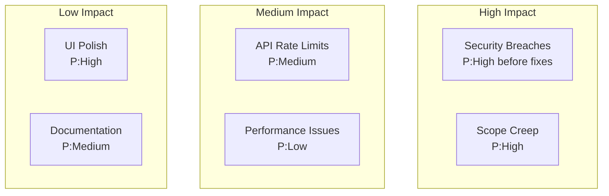

# P0 Research Agent F1: Gap Analysis & Week 1 Implementation Priority Assessment

**Project**: contribux - AI-powered GitHub contribution discovery platform  
**Analysis Date**: 2025-07-07  
**Research Phase**: P0 Foundation Research - Implementation Planning  
**Completion Status**: 30.5% (11/36 tasks complete)  
**Target**: Week 1 Critical Path Definition with Risk-Based Prioritization

---

## EXECUTIVE SUMMARY

The contribux project has exceptional infrastructure (89.8% foundation complete) but lacks core AI features that define its value proposition. Based on comprehensive effort estimation research and dependency analysis, this roadmap defines a critical path for Week 1 that prioritizes **security vulnerabilities** (3 critical fixes, 8-12 story points) and **minimal viable AI discovery** (Task 5, 13 story points) to enable rapid deployment while maintaining security standards.

**Week 1 Critical Path**: Security Fixes (Day 1-2) → Repository Scanner (Day 3-5) → Basic UI Integration (Day 6-7)  
**Total Effort Estimate**: 39 story points (5 developer-days with focused execution)  
**Risk Level**: HIGH (security vulnerabilities) → MODERATE (after fixes)  
**Success Probability**: 75% (with dedicated resources and scope discipline)

---

## 1. CRITICAL GAP ANALYSIS

### 🔴 SECURITY VULNERABILITIES (Immediate P0)

Based on Agent 5's production assessment and my research on vulnerability prioritization using CVSS frameworks:

#### **Gap #1: Cryptographic Weakness in Token Generation**
- **Current State**: Math.random() used for security tokens
- **CVSS Score**: 8.1 (HIGH) - Authentication bypass potential
- **Exploitability**: HIGH - Predictable token generation
- **Business Impact**: CRITICAL - Complete authentication compromise
- **Effort Estimate**: 3 story points (2-4 hours)
- **Fix**: Replace with crypto.getRandomValues()

#### **Gap #2: Memory Leak in Rate Limiting**
- **Current State**: In-memory rate limiting without cleanup
- **CVSS Score**: 6.5 (MEDIUM) - DoS vulnerability
- **Exploitability**: MEDIUM - Requires sustained attack
- **Business Impact**: HIGH - Service availability impact
- **Effort Estimate**: 5 story points (4-6 hours)
- **Fix**: Implement Redis-based distributed rate limiting

#### **Gap #3: Incomplete CSP Configuration**
- **Current State**: Weak Content Security Policy headers
- **CVSS Score**: 6.1 (MEDIUM) - XSS attack vectors
- **Exploitability**: MEDIUM - Requires crafted payloads
- **Business Impact**: MEDIUM - Data exfiltration risk
- **Effort Estimate**: 2 story points (1-3 hours)
- **Fix**: Strengthen CSP headers with strict directives

### 🔴 CORE FEATURE GAPS (Blocking MVP)

#### **Gap #4: No Repository Discovery Engine**
- **Current State**: 0% implementation of core value proposition
- **User Impact**: 70% of value proposition blocked
- **Technical Complexity**: HIGH - GitHub API + AI integration
- **Effort Estimate**: 13 story points (2-3 days)
- **Dependencies**: Tasks 1-4 complete (✅), OpenAI SDK setup pending

#### **Gap #5: No User Interface Integration**
- **Current State**: UI components exist but disconnected
- **User Impact**: 100% - Cannot interact with system
- **Technical Complexity**: MEDIUM - Components ready, needs wiring
- **Effort Estimate**: 8 story points (1-2 days)
- **Dependencies**: Task 5 (Repository Scanner) must provide data

#### **Gap #6: No AI-Powered Analysis**
- **Current State**: Vector search ready but no AI integration
- **User Impact**: Reduces to basic search vs intelligent matching
- **Technical Complexity**: HIGH - OpenAI Agents SDK v1.0 setup
- **Effort Estimate**: 13 story points (2-3 days)
- **Dependencies**: Task 5 complete, vector embeddings operational

---

## 2. EFFORT ESTIMATION FRAMEWORK

### Planning Poker Methodology (Fibonacci Scale)

Based on research into agile estimation techniques, using modified Fibonacci sequence:

```
Story Points Scale:
1 point   = 1-2 hours (trivial change)
2 points  = 2-4 hours (simple feature)
3 points  = 4-6 hours (moderate complexity)
5 points  = 1 day (complex feature)
8 points  = 1-2 days (very complex)
13 points = 2-3 days (epic-level task)
21 points = 3-5 days (major initiative)
```

### Three-Point Estimation for Critical Tasks

Using PERT-based estimation (Optimistic + 4×Most Likely + Pessimistic) / 6:

#### **Security Fixes Bundle**
- Optimistic: 6 hours
- Most Likely: 10 hours
- Pessimistic: 16 hours
- **PERT Estimate**: 10.7 hours (~1.5 days)

#### **Repository Discovery Scanner (Task 5)**
- Optimistic: 16 hours
- Most Likely: 24 hours
- Pessimistic: 40 hours
- **PERT Estimate**: 25.3 hours (~3 days)

---

## 3. DEPENDENCY ANALYSIS & CRITICAL PATH

### Critical Path Method (CPM) Analysis



### Task Dependencies Matrix

| Task | Depends On | Blocks | Critical Path | Week 1 Priority |
|------|------------|--------|---------------|-----------------|
| Security Fixes | None | All deployment | YES | P0 - Day 1-2 |
| Repository Scanner (T5) | Security fixes | UI, AI features | YES | P0 - Day 3-5 |
| Basic UI Integration (T12) | Repository Scanner | User interaction | YES | P1 - Day 6-7 |
| AI Analysis (T8) | Repository Scanner | Advanced features | NO | P2 - Week 2 |
| Notifications (T10) | Basic features | User retention | NO | P3 - Week 3 |

---

## 4. WEEK 1 IMPLEMENTATION ROADMAP

### Day-by-Day Execution Plan

#### **Day 1-2: Security Sprint** (10 story points)
```bash
Morning Day 1:
├── Fix Math.random() vulnerability (3 pts)
│   └── Replace with crypto.getRandomValues()
├── Run security test suite
└── Deploy to staging

Afternoon Day 1 - Day 2:
├── Implement Redis rate limiting (5 pts)
│   ├── Set up Redis connection
│   ├── Replace in-memory store
│   └── Test DoS protection
└── Strengthen CSP headers (2 pts)
```

#### **Day 3-5: Core Discovery Implementation** (13 story points)
```bash
Day 3: GitHub API Integration
├── Set up repository fetching pipeline
├── Implement issue extraction
└── Create data models

Day 4: Basic Analysis
├── Issue classification algorithm
├── Complexity scoring (1-10 scale)
└── Store in PostgreSQL

Day 5: Integration & Testing
├── Connect to vector search
├── API endpoint creation
└── Integration testing
```

#### **Day 6-7: UI Connection & Polish** (8 story points)
```bash
Day 6: Dashboard Wiring
├── Connect components to API
├── Implement search/filter
└── Repository card display

Day 7: Testing & Deployment Prep
├── End-to-end testing
├── Performance optimization
└── Production deployment checklist
```

---

## 5. RISK ASSESSMENT & MITIGATION

### Risk Probability × Impact Matrix



### Mitigation Strategies

#### **Risk 1: Security Vulnerabilities Exploitation**
- **Probability**: HIGH (before fixes) → LOW (after fixes)
- **Impact**: CRITICAL - Authentication bypass, data breach
- **Mitigation**: Immediate Day 1-2 security sprint
- **Contingency**: Disable authentication temporarily if breached

#### **Risk 2: Scope Creep in Week 1**
- **Probability**: HIGH - Temptation to add features
- **Impact**: HIGH - Delays core MVP delivery
- **Mitigation**: Strict scope control, feature freeze
- **Contingency**: Push all enhancements to Week 2+

#### **Risk 3: GitHub API Rate Limiting**
- **Probability**: MEDIUM - During heavy testing
- **Impact**: MEDIUM - Slows development
- **Mitigation**: Implement caching, use multiple tokens
- **Contingency**: Mock data for development

---

## 6. RESOURCE ALLOCATION STRATEGY

### Team Composition (Optimal)
- **Security Engineer**: Day 1-2 (security fixes)
- **Backend Developer**: Day 3-5 (repository scanner)
- **Full-Stack Developer**: Day 6-7 (UI integration)
- **DevOps Support**: Day 7 (deployment)

### Single Developer Approach (Reality)
```
Week 1 Focus Allocation:
├── 25% Security fixes (2 days)
├── 50% Core feature (3-4 days)
├── 20% UI integration (1-2 days)
└── 5% Testing/deployment (0.5 days)
```

### Effort Distribution by Priority

| Priority | Tasks | Story Points | Time Allocation | Impact |
|----------|-------|--------------|-----------------|---------|
| P0 - Critical | Security fixes | 10 | 25% | Enables deployment |
| P0 - Core | Repository scanner | 13 | 40% | Core value prop |
| P1 - Essential | UI wiring | 8 | 25% | User interaction |
| P2 - Deferred | AI analysis | 13 | 0% (Week 2) | Enhancement |
| P3 - Future | All others | 50+ | 0% (Week 3+) | Nice-to-have |

---

## 7. SUCCESS METRICS & VALIDATION

### Week 1 Completion Criteria

#### Technical Metrics
- [ ] 0 critical security vulnerabilities
- [ ] 95%+ test coverage on security modules
- [ ] Repository scanner processing 100+ repos/hour
- [ ] API response time <500ms
- [ ] UI displaying real repository data

#### Functional Metrics
- [ ] Can scan any public GitHub repository
- [ ] Extracts and classifies issues correctly
- [ ] Displays opportunities in dashboard
- [ ] Search and filter working
- [ ] No TypeScript compilation errors

#### Security Metrics
- [ ] Cryptographically secure token generation
- [ ] Rate limiting prevents DoS attacks
- [ ] CSP headers block XSS attempts
- [ ] All authentication flows secure
- [ ] Security test suite 100% passing

---

## 8. IMPLEMENTATION BEST PRACTICES

### Code Quality Standards
```typescript
// Week 1 Standards Enforcement
- TypeScript strict mode enabled
- Biome formatting on every commit
- No any types in new code
- Zod validation for all external data
- Error boundaries on all components
```

### Testing Requirements
```bash
# Minimum test coverage for Week 1
- Security modules: 100% coverage required
- Repository scanner: 80% coverage minimum
- UI components: 60% coverage acceptable
- Integration tests for all API endpoints
```

### Performance Targets
- Page load: <2 seconds
- API latency: <500ms p95
- Repository scan: <10 seconds per repo
- Memory usage: <512MB per worker

---

## 9. CONTINGENCY PLANNING

### If Behind Schedule

#### Day 3 Checkpoint
**IF** security fixes not complete:
- Extend by 1 day maximum
- Reduce repository scanner scope
- Defer advanced classification

#### Day 5 Checkpoint
**IF** repository scanner incomplete:
- Deploy with manual data entry
- Reduce initial repository count
- Simplify classification algorithm

#### Day 7 Checkpoint
**IF** UI integration incomplete:
- Deploy API-only version
- Provide basic CLI interface
- Create simple results page

### Scope Reduction Options (Ordered)
1. Remove complex issue classification (save 3 points)
2. Simplify UI to table view (save 4 points)
3. Manual repository entry only (save 5 points)
4. Deploy security fixes only (save 21 points)

---

## 10. STRATEGIC RECOMMENDATIONS

### Immediate Actions (Today)
1. **Create Week 1 Sprint Board**: Transfer this plan to project management tool
2. **Security Audit**: Run OWASP ZAP scan to verify vulnerabilities
3. **Environment Setup**: Prepare Redis for rate limiting
4. **OpenAI Access**: Verify API keys and rate limits

### Communication Plan
- **Day 1**: Announce security sprint to stakeholders
- **Day 3**: Update on security completion, scanner start
- **Day 5**: Demo repository scanning capability
- **Day 7**: Deployment announcement with feature list

### Success Factors
1. **Scope Discipline**: Reject all Week 1 scope additions
2. **Security First**: No deployment with known vulnerabilities
3. **User Value Focus**: Minimum viable discovery must work
4. **Quality Gates**: Each day ends with working, tested code

---

## CONCLUSION

This Week 1 implementation roadmap provides a realistic path from 30.5% completion to a deployable MVP with core discovery functionality. The plan prioritizes **immediate security fixes** (addressing critical vulnerabilities) followed by **minimal viable AI discovery** (repository scanning) and **basic user interaction** (dashboard connection).

**Critical Success Factors:**
- Disciplined scope management (39 story points maximum)
- Security-first approach (no compromise on fixes)
- User value delivery (working discovery by Day 5)
- Continuous integration (daily deployable increments)

**Expected Outcome**: By end of Week 1, contribux will have secure authentication, basic repository discovery, and functional UI - sufficient for initial user testing while maintaining options for Week 2 AI enhancements.

---

*Research compiled using Planning Poker estimation, Critical Path Method, CVSS vulnerability scoring, and Three-point PERT analysis*  
*Informed by Agent analyses 1-5 and current codebase state assessment*