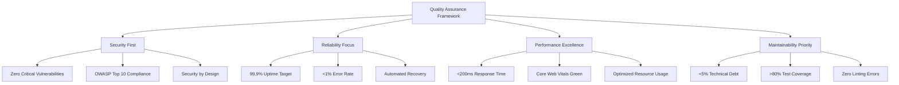
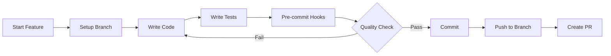
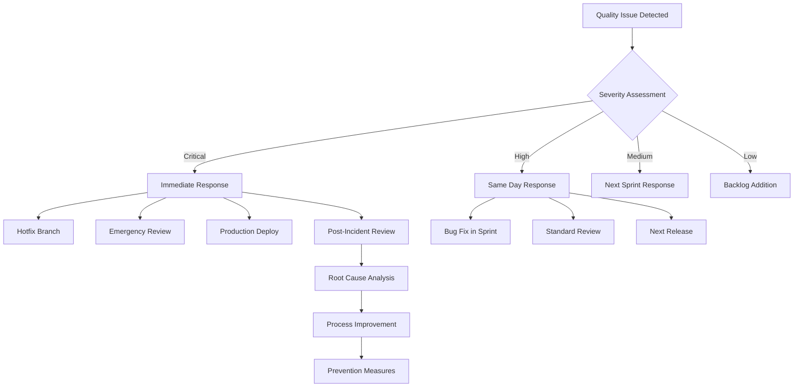

# Quality Assurance Framework - Contribux Platform
## Enterprise-Grade Development Workflows & Quality Processes

**Framework Version**: 1.0  
**Effective Date**: 2025-07-07  
**Scope**: End-to-end quality assurance for contribux platform  
**Compliance**: ISO 5055:2021, OWASP Guidelines, Industry Best Practices  

---

## 1. QUALITY ASSURANCE GOVERNANCE

### 1.1 Quality Objectives & Principles



### 1.2 Quality Standards Hierarchy

| Level | Standard | Enforcement | Consequences |
|-------|----------|-------------|--------------|
| **MUST** | Security requirements, critical bugs | Automated blocking | Cannot deploy |
| **SHOULD** | Performance targets, test coverage | Manual review | Review required |
| **MAY** | Code style, documentation | Automated guidance | Warning only |

### 1.3 Roles & Responsibilities

```yaml
Quality Champion (Lead Developer):
  - Define quality standards
  - Review quality metrics
  - Approve quality exceptions
  - Lead quality improvement initiatives

Developers:
  - Follow coding standards
  - Write comprehensive tests
  - Perform peer reviews
  - Fix quality issues promptly

DevOps/Platform:
  - Maintain CI/CD pipelines
  - Configure quality tools
  - Monitor production quality
  - Ensure infrastructure reliability

QA/Testing:
  - Design test strategies
  - Execute exploratory testing
  - Validate quality metrics
  - Report quality insights
```

---

## 2. DEVELOPMENT WORKFLOW INTEGRATION

### 2.1 Pre-Development Phase

#### Feature Planning Quality Checklist
```yaml
Requirements Review:
  - [ ] Security requirements identified
  - [ ] Performance criteria defined
  - [ ] Testing strategy outlined
  - [ ] Technical debt impact assessed

Architecture Review:
  - [ ] Design patterns validated
  - [ ] Security architecture approved
  - [ ] Performance implications reviewed
  - [ ] Maintainability considerations

Resource Planning:
  - [ ] Quality tools available
  - [ ] Testing environments ready
  - [ ] Review capacity allocated
  - [ ] Quality metrics baseline
```

### 2.2 Development Phase

#### Developer Workflow


#### Pre-Commit Quality Gates
```bash
#!/bin/bash
# .pre-commit-hook.sh

echo "🔍 Running pre-commit quality checks..."

# 1. Code formatting
echo "📝 Formatting code..."
pnpm biome format . --write
pnpm biome lint --apply

# 2. Type checking
echo "🔧 Type checking..."
pnpm type-check --strict

# 3. Unit tests (affected files)
echo "🧪 Running unit tests..."
pnpm test:unit --changed

# 4. Security scan
echo "🔒 Security scanning..."
git secrets --pre_commit_hook -- "$@"

# 5. Dependency audit
echo "📦 Dependency audit..."
pnpm audit --audit-level=moderate

echo "✅ Pre-commit checks complete!"
```

### 2.3 Peer Review Process

#### Code Review Quality Standards
```yaml
Security Review:
  - [ ] No hardcoded secrets or tokens
  - [ ] Input validation implemented
  - [ ] Authentication/authorization correct
  - [ ] SQL injection prevention
  - [ ] XSS protection measures

Performance Review:
  - [ ] Database queries optimized
  - [ ] N+1 query patterns avoided
  - [ ] Caching strategy appropriate
  - [ ] Memory usage reasonable
  - [ ] Async operations properly handled

Maintainability Review:
  - [ ] Code follows project conventions
  - [ ] Functions have single responsibility
  - [ ] Appropriate abstraction levels
  - [ ] Error handling comprehensive
  - [ ] Code is self-documenting

Testing Review:
  - [ ] Unit tests cover new/changed code
  - [ ] Edge cases considered
  - [ ] Integration tests for API changes
  - [ ] Mocks used appropriately
  - [ ] Test data realistic
```

#### Review Approval Matrix
```yaml
Changes Requiring Single Approval:
  - Bug fixes (non-security)
  - Documentation updates
  - Test improvements
  - Minor refactoring

Changes Requiring Multiple Approvals:
  - Security-related changes
  - Database migrations
  - API contract changes
  - Performance optimizations
  - Architecture modifications

Changes Requiring Architecture Review:
  - New external dependencies
  - Major refactoring
  - Infrastructure changes
  - Third-party integrations
```

---

## 3. CONTINUOUS INTEGRATION QUALITY PIPELINE

### 3.1 CI/CD Quality Gates

```yaml
# .github/workflows/quality-pipeline.yml
name: Quality Assurance Pipeline

on: [push, pull_request]

jobs:
  quality-gate-1:
    name: Code Quality & Security
    runs-on: ubuntu-latest
    steps:
      - name: Checkout
        uses: actions/checkout@v4
        
      - name: Setup Node.js
        uses: actions/setup-node@v4
        with:
          node-version: '18'
          cache: 'pnpm'
          
      - name: Install dependencies
        run: pnpm install
        
      - name: Lint & Format Check
        run: |
          pnpm biome check .
          if [ $? -ne 0 ]; then
            echo "❌ Linting failed - fix with: pnpm biome lint --apply"
            exit 1
          fi
          
      - name: Type Check
        run: |
          pnpm type-check --strict
          if [ $? -ne 0 ]; then
            echo "❌ Type checking failed"
            exit 1
          fi
          
      - name: Security Scan (SAST)
        uses: github/codeql-action/analyze@v3
        with:
          languages: typescript
          
      - name: Dependency Vulnerability Scan
        run: |
          pnpm audit --audit-level=moderate
          if [ $? -ne 0 ]; then
            echo "❌ Vulnerability detected in dependencies"
            exit 1
          fi

  quality-gate-2:
    name: Testing & Coverage
    needs: quality-gate-1
    runs-on: ubuntu-latest
    services:
      postgres:
        image: postgres:16
        env:
          POSTGRES_PASSWORD: postgres
        options: >-
          --health-cmd pg_isready
          --health-interval 10s
          --health-timeout 5s
          --health-retries 5
    steps:
      - name: Unit Tests
        run: |
          pnpm test:unit --coverage
          COVERAGE=$(cat coverage/summary.json | jq '.total.statements.pct')
          if (( $(echo "$COVERAGE < 80" | bc -l) )); then
            echo "❌ Test coverage below 80%: $COVERAGE%"
            exit 1
          fi
          
      - name: Integration Tests
        run: pnpm test:integration
        
      - name: Database Tests
        run: pnpm test:db
        
      - name: Upload Coverage
        uses: codecov/codecov-action@v3

  quality-gate-3:
    name: Performance & E2E
    needs: quality-gate-2
    runs-on: ubuntu-latest
    steps:
      - name: Build Application
        run: pnpm build
        
      - name: Performance Tests
        run: |
          pnpm test:performance
          # Check build size limits
          SIZE=$(du -sb .next | cut -f1)
          if [ $SIZE -gt 104857600 ]; then  # 100MB limit
            echo "❌ Build size too large: $(($SIZE/1024/1024))MB"
            exit 1
          fi
          
      - name: E2E Tests
        run: pnpm test:e2e
        
      - name: Lighthouse CI
        uses: treosh/lighthouse-ci-action@v10
        with:
          configPath: '.lighthouseci.json'
          budgetPath: './budget.json'
          
  quality-gate-4:
    name: Security & Compliance
    needs: quality-gate-3
    runs-on: ubuntu-latest
    steps:
      - name: Container Security Scan
        uses: aquasecurity/trivy-action@master
        with:
          scan-type: 'fs'
          scan-ref: '.'
          
      - name: SonarQube Analysis
        uses: sonarqube-scan-action@master
        env:
          SONAR_TOKEN: ${{ secrets.SONAR_TOKEN }}
          SONAR_HOST_URL: ${{ secrets.SONAR_HOST_URL }}
          
      - name: Quality Gate Check
        run: |
          QUALITY_GATE=$(curl -s "$SONAR_HOST_URL/api/qualitygates/project_status?projectKey=$SONAR_PROJECT_KEY" \
            -H "Authorization: Bearer $SONAR_TOKEN" | jq -r '.projectStatus.status')
          if [ "$QUALITY_GATE" != "OK" ]; then
            echo "❌ SonarQube Quality Gate failed: $QUALITY_GATE"
            exit 1
          fi
```

### 3.2 Quality Metrics Collection

```typescript
// quality-metrics.ts
interface QualityMetrics {
  buildId: string;
  timestamp: string;
  
  // Code Quality
  lintErrors: number;
  lintWarnings: number;
  typeErrors: number;
  
  // Testing
  testCoverage: number;
  testPassRate: number;
  testDuration: number;
  
  // Performance
  buildSize: number;
  buildDuration: number;
  lighthouseScore: number;
  
  // Security
  vulnerabilities: VulnerabilityCount;
  securityScore: number;
  
  // Technical Debt
  codeSmells: number;
  technicalDebtMinutes: number;
  duplication: number;
  
  // Business Metrics
  deploymentFrequency: number;
  leadTime: number;
  meanTimeToRestore: number;
  changeFailureRate: number;
}

interface VulnerabilityCount {
  critical: number;
  high: number;
  medium: number;
  low: number;
}

// Collect metrics during CI/CD
async function collectQualityMetrics(): Promise<QualityMetrics> {
  return {
    buildId: process.env.GITHUB_RUN_ID || 'local',
    timestamp: new Date().toISOString(),
    
    // Parsed from tool outputs
    lintErrors: await getLintingErrors(),
    testCoverage: await getTestCoverage(),
    buildSize: await getBuildSize(),
    vulnerabilities: await getVulnerabilities(),
    
    // Calculated metrics
    securityScore: calculateSecurityScore(),
    technicalDebtMinutes: calculateTechnicalDebt(),
    
    // DORA metrics
    deploymentFrequency: await getDeploymentFrequency(),
    leadTime: await getLeadTime(),
    meanTimeToRestore: await getMTTR(),
    changeFailureRate: await getChangeFailureRate(),
  };
}
```

---

## 4. PRODUCTION QUALITY MONITORING

### 4.1 Real User Monitoring (RUM)

```typescript
// rum-monitoring.ts
import { trace, metrics } from '@opentelemetry/api';

class ProductionQualityMonitor {
  private tracer = trace.getTracer('contribux-quality');
  private meter = metrics.getMeter('contribux-quality');
  
  // Performance Monitoring
  private responseTimeHistogram = this.meter.createHistogram('http_request_duration_ms');
  private errorRateCounter = this.meter.createCounter('http_errors_total');
  private activeUsersGauge = this.meter.createUpDownCounter('active_users');
  
  // Quality Metrics
  private qualityScoreGauge = this.meter.createUpDownCounter('quality_score');
  private bugReportsCounter = this.meter.createCounter('bug_reports_total');
  private userSatisfactionGauge = this.meter.createUpDownCounter('user_satisfaction');
  
  async trackRequest(req: Request, res: Response, next: NextFunction) {
    const span = this.tracer.startSpan('http_request');
    const startTime = Date.now();
    
    res.on('finish', () => {
      const duration = Date.now() - startTime;
      
      // Track performance
      this.responseTimeHistogram.record(duration, {
        method: req.method,
        route: req.route?.path,
        status_code: res.statusCode.toString(),
      });
      
      // Track errors
      if (res.statusCode >= 400) {
        this.errorRateCounter.add(1, {
          method: req.method,
          status_code: res.statusCode.toString(),
        });
      }
      
      span.end();
    });
    
    next();
  }
  
  async trackQualityMetrics(metrics: QualityMetrics) {
    this.qualityScoreGauge.add(metrics.securityScore);
    
    // Alert on quality degradation
    if (metrics.testCoverage < 80) {
      await this.sendAlert('Test coverage dropped below 80%', {
        coverage: metrics.testCoverage,
        buildId: metrics.buildId,
      });
    }
    
    if (metrics.vulnerabilities.critical > 0) {
      await this.sendAlert('Critical vulnerabilities detected', {
        count: metrics.vulnerabilities.critical,
        buildId: metrics.buildId,
      });
    }
  }
  
  private async sendAlert(message: string, metadata: Record<string, any>) {
    // Integrate with alerting system (Slack, PagerDuty, etc.)
    console.error(`🚨 Quality Alert: ${message}`, metadata);
  }
}
```

### 4.2 Error Tracking & Analytics

```typescript
// error-tracking.ts
import * as Sentry from '@sentry/nextjs';

export function setupErrorTracking() {
  Sentry.init({
    dsn: process.env.SENTRY_DSN,
    environment: process.env.NODE_ENV,
    
    // Quality-focused configuration
    beforeSend(event, hint) {
      // Enhance error context with quality metrics
      event.tags = {
        ...event.tags,
        qualityGate: 'production',
        buildId: process.env.BUILD_ID,
      };
      
      // Filter out expected errors
      if (event.exception?.values?.[0]?.type === 'ExpectedValidationError') {
        return null;
      }
      
      return event;
    },
    
    // Performance monitoring
    tracesSampleRate: 0.1,
    
    // Quality alerts
    integrations: [
      new Sentry.BrowserTracing({
        routingInstrumentation: Sentry.nextRouterInstrumentation,
      }),
    ],
  });
}

// Custom error boundary for quality tracking
export class QualityErrorBoundary extends React.Component {
  componentDidCatch(error: Error, errorInfo: React.ErrorInfo) {
    Sentry.withScope((scope) => {
      scope.setTag('component', 'error_boundary');
      scope.setContext('errorInfo', errorInfo);
      Sentry.captureException(error);
    });
  }
  
  render() {
    return this.props.children;
  }
}
```

### 4.3 Quality Dashboard

```typescript
// quality-dashboard.tsx
interface QualityDashboardProps {
  metrics: QualityMetrics[];
  alerts: QualityAlert[];
}

export function QualityDashboard({ metrics, alerts }: QualityDashboardProps) {
  const latestMetrics = metrics[0];
  const qualityTrend = calculateQualityTrend(metrics.slice(0, 30));
  
  return (
    <div className="quality-dashboard">
      <QualityScoreCard score={latestMetrics.securityScore} trend={qualityTrend} />
      
      <MetricsGrid>
        <MetricCard
          title="Test Coverage"
          value={`${latestMetrics.testCoverage}%`}
          target="80%"
          status={latestMetrics.testCoverage >= 80 ? 'good' : 'warning'}
        />
        
        <MetricCard
          title="Linting Errors"
          value={latestMetrics.lintErrors}
          target="0"
          status={latestMetrics.lintErrors === 0 ? 'good' : 'error'}
        />
        
        <MetricCard
          title="Vulnerabilities"
          value={latestMetrics.vulnerabilities.critical}
          target="0"
          status={latestMetrics.vulnerabilities.critical === 0 ? 'good' : 'critical'}
        />
        
        <MetricCard
          title="Technical Debt"
          value={`${latestMetrics.technicalDebtMinutes}min`}
          target="<60min"
          status={latestMetrics.technicalDebtMinutes < 60 ? 'good' : 'warning'}
        />
      </MetricsGrid>
      
      <QualityTrendsChart metrics={metrics} />
      <ActiveAlertsPanel alerts={alerts} />
    </div>
  );
}
```

---

## 5. QUALITY IMPROVEMENT PROCESSES

### 5.1 Technical Debt Management

```yaml
Debt Identification:
  Automated Detection:
    - SonarQube code smells
    - Complexity analysis
    - Duplication detection
    - Security hotspots
    
  Manual Detection:
    - Code review feedback
    - Performance bottlenecks
    - Maintenance pain points
    - Developer complaints

Debt Prioritization:
  High Priority:
    - Security vulnerabilities
    - Performance impacts
    - Blocking development
    - Risk to production
    
  Medium Priority:
    - Code maintainability
    - Test coverage gaps
    - Documentation debt
    - Tool upgrades
    
  Low Priority:
    - Code style issues
    - Minor refactoring
    - Nice-to-have features
    - Legacy cleanup

Debt Resolution:
  Sprint Planning:
    - Reserve 20% capacity for debt
    - Include debt tickets in sprints
    - Balance features vs. debt
    - Track debt reduction progress
    
  Dedicated Debt Sprints:
    - Quarterly debt reduction
    - Focus on high-impact debt
    - Team-wide participation
    - Measure improvements
```

### 5.2 Quality Incident Response



### 5.3 Continuous Learning & Improvement

```yaml
Learning Mechanisms:
  Post-Incident Reviews:
    - What went wrong?
    - Why did it happen?
    - How can we prevent it?
    - What processes need updating?
    
  Quality Retrospectives:
    - What quality practices work?
    - What tools need improvement?
    - What training is needed?
    - How can we streamline processes?
    
  Industry Best Practices:
    - Conference attendance
    - Technical blogs
    - Open source contributions
    - Peer learning sessions

Improvement Implementation:
  Process Updates:
    - Update quality standards
    - Improve tooling
    - Enhance automation
    - Streamline workflows
    
  Training Programs:
    - Security best practices
    - Testing strategies
    - Code review techniques
    - Tool usage training
    
  Tool Evolution:
    - Evaluate new tools
    - Upgrade existing tools
    - Integrate better solutions
    - Automate manual processes
```

---

## 6. QUALITY METRICS & REPORTING

### 6.1 Quality KPIs

```typescript
interface QualityKPIs {
  // Lead Indicators (Predictive)
  codeReviewParticipation: number;    // % of PRs with reviews
  testCoverageGrowth: number;         // Weekly coverage change
  staticAnalysisIssues: number;       // New issues per week
  securityTrainingHours: number;      // Team training time
  
  // Lag Indicators (Outcome)
  productionIncidents: number;        // Monthly incident count
  bugEscapeRate: number;             // % bugs found in prod
  meanTimeToResolution: number;       // Hours to fix issues
  customerSatisfactionScore: number;  // User satisfaction rating
  
  // DORA Metrics
  deploymentFrequency: number;        // Deploys per week
  leadTimeForChanges: number;         // Hours from commit to deploy
  meanTimeToRestore: number;          // Hours to restore service
  changeFailureRate: number;          // % of deploys causing issues
}
```

### 6.2 Quality Reporting

```yaml
Daily Reports:
  - Build status
  - Test results
  - Security alerts
  - Performance metrics
  
Weekly Reports:
  - Quality score trends
  - Technical debt changes
  - Team velocity impact
  - Process adherence
  
Monthly Reports:
  - Quality improvement progress
  - Incident analysis
  - Training effectiveness
  - Tool ROI analysis
  
Quarterly Reports:
  - Quality maturity assessment
  - Process effectiveness review
  - Resource allocation analysis
  - Strategic quality planning
```

---

## 7. IMPLEMENTATION ROADMAP

### Phase 1: Foundation (Weeks 1-2)
```yaml
Week 1:
  - [ ] Fix critical security issues
  - [ ] Implement pre-commit hooks
  - [ ] Configure basic CI/CD gates
  - [ ] Set up error tracking
  
Week 2:
  - [ ] Establish quality metrics baseline
  - [ ] Configure SonarQube
  - [ ] Implement code review process
  - [ ] Create quality dashboard
```

### Phase 2: Enhancement (Weeks 3-4)
```yaml
Week 3:
  - [ ] Advanced CI/CD pipeline
  - [ ] Performance monitoring
  - [ ] Security scanning automation
  - [ ] Test coverage improvement
  
Week 4:
  - [ ] Quality training program
  - [ ] Process documentation
  - [ ] Incident response procedures
  - [ ] Continuous improvement setup
```

### Phase 3: Excellence (Weeks 5-6)
```yaml
Week 5:
  - [ ] Advanced quality analytics
  - [ ] Predictive quality metrics
  - [ ] Automated debt management
  - [ ] Quality maturity assessment
  
Week 6:
  - [ ] Process optimization
  - [ ] Team certification
  - [ ] Quality culture reinforcement
  - [ ] Long-term quality strategy
```

---

## CONCLUSION

This Quality Assurance Framework provides a comprehensive approach to maintaining enterprise-grade code quality throughout the development lifecycle. By implementing these processes, tools, and practices, the contribux platform will achieve:

1. **Automated Quality Gates** preventing issues from reaching production
2. **Continuous Monitoring** for early detection and rapid response
3. **Systematic Improvement** through metrics-driven optimization
4. **Quality Culture** embedded in team practices and workflows

The framework balances automation with human judgment, ensuring both efficiency and thoroughness in quality assurance. Success depends on consistent implementation, continuous refinement, and team commitment to quality excellence.

---

*Framework developed based on ISO 5055:2021, DORA research, and industry best practices*  
*Designed for pragmatic implementation with measurable quality outcomes*